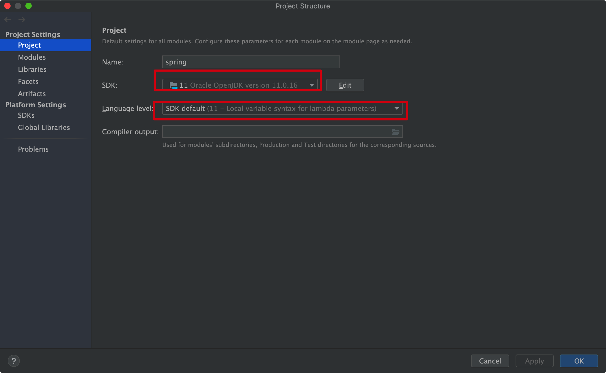

## 本地编译配置
1. 删掉代码检查规范
2. 添加仓库
3. 注释掉插件
4. 配置环境变量，我配置的是 `JAVA_HOME=/Library/Java/JavaVirtualMachines/jdk-11.0.16.jdk/Contents/Home`
5. 编译代码：`./gradlew build`

## 编写测试类测试
- 需要在idea中配置 gradle 的编译信息


- 配置项目的编译器信息



- 使用 idea 的 gradle 插件构建失败，可以使用命令行进行构建 `./gradlew build`


## Spring 整合 Mybatis

Mybatis 官网：https://mybatis.org/mybatis-3/getting-started.html


## Spring 扫描源码 
### 源码分析

关键的几个方法：
- org.springframework.context.annotation.ConfigurationClassPostProcessor 
  - org.springframework.context.annotation.ConfigurationClassPostProcessor.postProcessBeanDefinitionRegistry 
    - org.springframework.context.annotation.ConfigurationClassParser.doProcessConfigurationClass 
      - org.springframework.context.annotation.ClassPathBeanDefinitionScanner.doScan

核心步骤：
1. @ComponentScan 注解
2. 构造扫描器 ClassPathBeanDefinitionScanner
3. 根据 @ComponentScan 注解的属性配置扫描器
4. 扫描: 两种扫描方式
   - 扫描指定的类：工具目录配置了 `resources/META-INF/spring.components` 内容，就只会扫描里面定义的类。这是Spring扫描的优化机制
   - 扫描指定包下的所有类：获得扫描路径下所有的class文件（Resource对象）
5. 利用 ASM 技术读取class文件信息
6. 进行filter+条件注解的判断
7. 进行独立类、接口、抽样类 @Lookup的判断
8. 判断生成的BeanDefinition是否重复
9. 添加到Spring容器中


### [ASM 技术](https://asm.ow2.io/)
>  简单来说，ASM是一个操作Java字节码的类库。
> #### 第一个问题，ASM的操作对象是什么呢？
> ASM所操作的对象是字节码（ByteCode）数据
> #### 第二个问题，ASM是如何处理字节码（ByteCode）数据的？
> - ASM处理字节码（ByteCode）的方式是“拆分－修改－合并”
> - SM处理字节码（ByteCode）数据的思路是这样的：第一步，将.class文件拆分成多个部分；第二步，对某一个部分的信息进行修改；第三步，将多个部分重新组织成一个新的.class文件。
> - 说白了就是文件解析，并不会把这个 .class 文件加载到 JVM 中，就是文件的解析工具

为什么要使用 ASM ?
- 扫描到所有的 class 资源后，要判断该 class 是否作为一个 bean对象（比如标注了@Component 注解），
如果我们通过反射来判断，那么在 Spring 启动阶段就会加载很多的bean，这势必会浪费系统资源和耗时（因为可能很多的工具类，是不需要Spring进行管理的）。


### Lookup 注解
这个注解标注在方法上，如果一个bean对象中的方法标注了 Lookup注解，那么会生成代理对象放入 bean容器中，
当标注了 Lookup 注解的方法时，会直接返回 Lookup 需要查找的bean，并不会执行方法，
所以说 Lookup 的value值要指定，否则没有意义。

使用说明：如果Lookup注解的value没有指定，那么会根据方法的返回值类型查找bean，如果指定了value 那就根据name查找bean

使用场景：A 依赖多例bean B，可以使用Lookup 注解在A中定义一个方法，该方法每次都会从容器中获取一个bean，因为B 是多例的，所以每次都是返回新的对象
```java
@Component
public class LookupService {
    @Autowired
    private Demo demo;

    @Lookup("demo")
    public Demo getDemo() {
        return null;
    }

    public void test1() {
        System.out.println(demo); // 单例的，不符合 Demo 这个bean的作用域
    }

    public void test2() {
        System.out.println(getDemo()); // 多例的
    }

}

@Component
@Scope("prototype")
class Demo {

}
```