# 源码环境搭建

## 本地编译配置

1. 删掉代码检查规范
2. 添加仓库
3. 注释掉插件
4. 配置环境变量，我配置的是 `JAVA_HOME=/Library/Java/JavaVirtualMachines/jdk-11.0.16.jdk/Contents/Home`
5. 编译代码：`./gradlew build`

## IDEA配置

- 需要在idea中配置 gradle 的编译信息


- 配置项目的编译器信息


- 使用 idea 的 gradle 插件构建失败，可以使用命令行进行构建 `./gradlew build`

## 使用 lombok

build.gradle 
```groovy
dependencies {
    // lombok
    annotationProcessor 'org.projectlombok:lombok:1.18.2'
    compileOnly 'org.projectlombok:lombok:1.18.2'
    testAnnotationProcessor 'org.projectlombok:lombok:1.18.2'
    testCompileOnly 'org.projectlombok:lombok:1.18.2'
}

```

删除警告就报错的编译配置参数：
全局搜索这个参数`-Werror` 注释掉就行了


## junit5 的使用

依赖：
```groovy
dependencies {
    // 测试依赖
    testImplementation 'org.junit.jupiter:junit-jupiter-api:5.8.1'
    testRuntimeOnly 'org.junit.jupiter:junit-jupiter-engine:5.8.1'
}
```

IDEA配置：

# 源码分析
## [ASM 技术](https://asm.ow2.io/)

> 简单来说，ASM是一个操作Java字节码的类库。
>
> #### 第一个问题，ASM的操作对象是什么呢？
>
> ASM所操作的对象是字节码（ByteCode）数据
>
> #### 第二个问题，ASM是如何处理字节码（ByteCode）数据的？
>
> - ASM处理字节码（ByteCode）的方式是“拆分－修改－合并”
> - SM处理字节码（ByteCode）数据的思路是这样的：第一步，将.class文件拆分成多个部分；第二步，对某一个部分的信息进行修改；第三步，将多个部分重新组织成一个新的.class文件。
> - 说白了就是文件解析，并不会把这个 .class 文件加载到 JVM 中，就是文件的解析工具

为什么要使用 ASM ?

- 扫描到所有的 class 资源后，要判断该 class 是否作为一个 bean对象（比如标注了@Component 注解），
  如果我们通过反射来判断，那么在 Spring 启动阶段就会加载很多的bean，这势必会浪费系统资源和耗时（因为可能很多的工具类，是不需要Spring进行管理的）。
## Spring容器创建的核心流程

### 整体生命周期
```java
/**
 *  `new AnnotationConfigApplicationContext(AppConfig.class)` 会发生什么？？？
 *
 * 1. 执行AnnotationConfigApplicationContext构造器 {@link AnnotationConfigApplicationContext#AnnotationConfigApplicationContext()}
 *      实例化属性reader {@link AnnotatedBeanDefinitionReader#AnnotatedBeanDefinitionReader(BeanDefinitionRegistry)}
 *      reader 属性的构造器里面会注册BeanFactoryPostProcessor {@link AnnotationConfigUtils#registerAnnotationConfigProcessors(BeanDefinitionRegistry)}
 *          默认会注册这五个鬼东西：
 *
 *              1. ConfigurationClassPostProcessor 类型：BeanFactoryPostProcessor
 *                  - 在BeanFactory初始化阶段，会使用该处理器 扫描配置类注册BeanDefinition到IOC容器中
 *
 *              2. CommonAnnotationBeanPostProcessor    类型：BeanPostProcessor
 *
 *              3. AutowiredAnnotationBeanPostProcessor 类型：BeanPostProcessor
 *
 *              4. EventListenerMethodProcessor 类型：BeanFactoryPostProcessor、SmartInitializingSingleton
 *                  - 作为 BeanFactoryPostProcessor 的功能。会存储IOC容器中所有的 EventListenerFactory 类型的bean，作为处理器的属性
 *                  - 作为 SmartInitializingSingleton 的功能。：用来处理 @EventListener 注解的，会在提前实例化单例bean的流程中 回调该实例的方法
 *                      BeanFactory 的{@link DefaultListableBeanFactory#preInstantiateSingletons()}：
 *                          - 创建所有单例bean。
 *                          - 回调 {@link SmartInitializingSingleton#afterSingletonsInstantiated()}
 *
 *              5. DefaultEventListenerFactory 类型：EventListenerFactory
 *                  就是 EventListenerMethodProcessor 解析 @EventListener 的时候会用这个工厂来创建 ApplicationListener
 *
 *  2. 解析入参,添加到BeanDefinitionMap中 {@link AnnotationConfigApplicationContext#register(Class[])}
 *
 *  3. 刷新IOC容器 {@link AbstractApplicationContext#refresh()}
 *
 *      准备刷新 {@link AbstractApplicationContext#prepareRefresh()}
 *          - 初始化属性
 *          - 为IOC容器设置两个属性：applicationListeners、earlyApplicationEvents
 *
 *      获取并刷新BeanFactory {@link AbstractApplicationContext#obtainFreshBeanFactory()}
 *          - 是 AnnotationConfigApplicationContext 类型的IOC容器，直接返回IOC容器的BeanFactory
 *          - 是 ClassPathXmlApplicationContext 类型的IOC容器，会创建新的BeanFactory，并解析xml 注册BeanDefinition 到BeanFactory中
 *
 *      准备BeanFactory {@link AbstractApplicationContext#prepareBeanFactory(ConfigurableListableBeanFactory)}
 *          - 给BeanFactory 的属性设置值：beanClassLoader、beanExpressionResolver、propertyEditorRegistrars、
 *              ignoredDependencyInterfaces、resolvableDependencies、tempClassLoader
 *          - 往BeanFactory注册 BeanPostProcessor
 *              比如 {@link ApplicationContextAwareProcessor},该处理器是处理bean实现了XxAware接口的 {@link ApplicationContextAwareProcessor#postProcessBeforeInitialization(Object, String)}
 *          - 往BeanFactory注册 单例bean，比如 environment
 *
 *      留给子类的模板方法，入参就是准备好的BeanFactory。 {@link AbstractApplicationContext#postProcessBeanFactory(ConfigurableListableBeanFactory)}
 *
 *      执行BeanFactoryPostProcessor,完成BeanFactory的创建 {@link AbstractApplicationContext#invokeBeanFactoryPostProcessors(ConfigurableListableBeanFactory)}
 *          先执行 {@link BeanDefinitionRegistryPostProcessor#postProcessBeanDefinitionRegistry(BeanDefinitionRegistry)}
 *          这里会使用while循环保证 如果在postProcessBeanDefinitionRegistry 里面注册了BeanDefinitionRegistryPostProcessor也能执行。
 *          然后再执行 {@link BeanFactoryPostProcessor#postProcessBeanFactory(ConfigurableListableBeanFactory)}
 *
 *          注：解析配置类并注册BeanDefinition就是在这个环节实现的，通过 {@link ConfigurationClassPostProcessor#postProcessBeanDefinitionRegistry(BeanDefinitionRegistry)}
 *
 *      注册 BeanPostProcessor。 {@link AbstractApplicationContext#registerBeanPostProcessors(ConfigurableListableBeanFactory)}
 *          其实就是 获取 BeanFactory 的 BeanDefinitionMap 属性中，从属性中获取 BeanPostProcessor 类型的bean，getBean() 创建，
 *          然后添加到 BeanFactory 的beanPostProcessors属性中
 *
 *          注：
 *              - BeanPostProcessor的注册是有序的。优先级：PriorityOrdered 大于 Ordered 大于 nonOrdered 大于 internalPostProcessors(MergedBeanDefinitionPostProcessor类型)
 *              - 最后在添加一个 `beanFactory.addBeanPostProcessor(new ApplicationListenerDetector(applicationContext));`
 *                  该后置处理器的作用：
 *                      - 合并BeanDefinition阶段：处理的bean 是 ApplicationListener 类型的，在Map属性记录 bean。key:beanName,value:是否是单例
 *                      - bean初始化后阶段：处理的bean 是 ApplicationListener 类型的，属性Map中的value是true(也就是单例的)，那就将当前bean添加到IOC容器的 applicationEventMulticaster 属性中
 *                          `this.applicationContext.addApplicationListener((ApplicationListener<?>) bean);`
 *                      - bean销毁阶段：从IOC容器的 ApplicationEventMulticaster 属性移除当前 bean
 *
 *      初始化MessageSource,就是往BeanFactory注册国际化资源解析器。 {@link AbstractApplicationContext#initMessageSource()}
 *
 *      初始化 ApplicationEventMulticaster，就是往BeanFactory注册事件广播器 {@link AbstractApplicationContext#initApplicationEventMulticaster()}
 *
 *      开始刷新，留给子类实现的。{@link AbstractApplicationContext#onRefresh()}
 *          SpringBoot web应用，就是在这里启动的web容器，或者是初始化web容器
 *          注：可以在这里往 {@link AbstractApplicationContext#earlyApplicationEvents} 属性设置值，这样子就可以在下面注册监听器环节发布早期事件，然后对应的
 *              事件监听器就能收到 BeanFactory已经准备好了，可以在事件监听器里面做操作
 *
 *      注册监听器 {@link AbstractApplicationContext#registerListeners()}
 *          - 实例化 BeanFactory 中类型为 ApplicationListener 的bean，然后添加到 BeanFactory 的属性 ApplicationEventMulticaster 中(这个就是在上面穿件的)
 *          - IOC容器的 earlyApplicationEvents 属性不为空，通过 ApplicationEventMulticaster 将时间发布到 ApplicationListener
 *
 *      完成BeanFactory的初始化 {@link AbstractApplicationContext#finishBeanFactoryInitialization(ConfigurableListableBeanFactory)}
 *          - 设置 BeanFactory 的一些属性：conversionService、embeddedValueResolvers
 *          - 提前创建 LoadTimeWeaverAware 类型的bean
 *          - 提前实例化单例bean {@link DefaultListableBeanFactory#preInstantiateSingletons()}
 *
 *      完成刷新 {@link AbstractApplicationContext#finishRefresh()}
 *          - 清缓存 {@link DefaultResourceLoader#clearResourceCaches()}
 *          - 初始化LifecycleProcessor，BeanFactory中没有这个bean就注册个默认值，会作为IOC容器的lifecycleProcessor属性 {@link AbstractApplicationContext#initLifecycleProcessor()}
 *          - refresh完成了 传播给 LifecycleProcessor {@link getLifecycleProcessor().onRefresh()}
 *          - 发布 ContextRefreshedEvent 事件  {@link AbstractApplicationContext#publishEvent(ApplicationEvent)}
 * */
```
### AnnotationConfigApplicationContext 的实例化

创建IOC容器
```java
new AnnotationConfigApplicationContext(AppConfig.class);
```
会执行无参构造器
```java
public AnnotationConfigApplicationContext() {
  StartupStep createAnnotatedBeanDefReader = this.getApplicationStartup().start("spring.context.annotated-bean-reader.create");
  /**
   * 读取器，读取class成BeanDefinition然后注册到BeanFactory中，读取的时候会解析 @Lazy、@Primary、DependsOn、@Role、Description 等信息设置到BeanDefinition中
   *
   * 比如 将入参配置类注册到 BeanFactory 中会用到
   *  {@link AnnotationConfigApplicationContext#register(Class[])}
   *      {@link AnnotatedBeanDefinitionReader#doRegisterBean(Class, String, Class[], Supplier, BeanDefinitionCustomizer[])}
   *
   * 实例化时会执行 `AnnotationConfigUtils.registerAnnotationConfigProcessors(this.registry);`
   *  {@link AnnotationConfigUtils#registerAnnotationConfigProcessors(BeanDefinitionRegistry, Object)}
   *      1. 给BeanFactory设置依赖比较器 `beanFactory.setDependencyComparator(AnnotationAwareOrderComparator.INSTANCE);`
   *          - 依赖类型是集合时，会使用这个排序
   *          - 依赖类型不是集合时，会使用这个拿到@Priority排序值，排序值小的就是要注入的
   *
   *      2. 给BeanFactory设置自动注入候选者解析器 `beanFactory.setAutowireCandidateResolver(new ContextAnnotationAutowireCandidateResolver());`
   *          - @Lazy的处理、@Qualifier的处理
   *
   *      3. 注册bean到beanDefinitionMap中：
   *          - ConfigurationClassPostProcessor：用来解析配置类，注册BeanDefinition
   *          - AutowiredAnnotationBeanPostProcessor：处理@Autowired、@Value依赖注入
   *          - CommonAnnotationBeanPostProcessor：处理@Resource依赖注入，@PreDestroy、@PostConstruct方法回调
   *          - PersistenceAnnotationBeanPostProcessor：处理@PersistenceContext、@PersistenceUnit依赖注入的
   *          - EventListenerMethodProcessor：处理方法有@EventListener的bean，使用 EventListenerFactory 将方法构造成 ApplicationListener 注册到事件广播器
   *          - DefaultEventListenerFactory：用来将@EventListener标注的方法解析成ApplicationListener的
   * */
  this.reader = new AnnotatedBeanDefinitionReader(this);
  createAnnotatedBeanDefReader.end();
  /**
   * 扫描器，用来扫描class文件的。
   *
   * 在实例化过程中会解析`META-INF/spring.components`文件，然后在 {@link ClassPathScanningCandidateComponentProvider#findCandidateComponents(String)} 会根据索引文件是否有内容
   * 从而决定是索引扫描还是包扫描
   *
   * `CandidateComponentsIndexLoader.loadIndex(this.resourcePatternResolver.getClassLoader());`
   * */
  this.scanner = new ClassPathBeanDefinitionScanner(this);
}
```

### prepareBeanFactory
```java
/**
 * 准备BeanFactory {@link AbstractApplicationContext#prepareBeanFactory(ConfigurableListableBeanFactory)}
 *
 * 给BeanFactory设置属性值：
 *  - 为我们的bean工厂设置 ResourceEditorRegistrar(登记员)，这个是用来加工 PropertyEditorRegistry，也就是 SimpleTypeConverter，而 SimpleTypeConverter 是进行依赖注入时，对要注入的值进行converter的
 *      `beanFactory.addPropertyEditorRegistrar(new ResourceEditorRegistrar(this, getEnvironment()));`
 *  - 设置忽略依赖接口。在填充bean的时候，会遍历{@link BeanWrapper#getPropertyDescriptors()}，判断不是忽略依赖接口的方法，才会添加到 PropertyValues ，最后会将 PropertyValues 的内容注入到bean中。
 *      因为这些接口是通过 ApplicationContextAwareProcessor 后置处理器注入的
 *      `beanFactory.ignoreDependencyInterface`
 *  - 注册可解决的依赖。在依赖注入时会从 BeanDefinitionMap 和 {@link DefaultListableBeanFactory#resolvableDependencies} 属性中找到类型匹配的bean
 *      `beanFactory.registerResolvableDependency`
 *  - 注册单例bean，注意这不是注册到BeanDefinitionMap的，而是直接设置到单例池中(也就是不会执行bean创建的生命周期)。
 *      通过这种方式注册的bean，在BeanDefinitionMap是不记录的，是存在这个属性中 {@link DefaultListableBeanFactory#manualSingletonNames}
 *      在依赖注入的解析环节，会从 BeanDefinitionMap和manualSingletonNames 中查询BeanFactory中匹配依赖类型的bean {@link DefaultListableBeanFactory#doGetBeanNamesForType(ResolvableType, boolean, boolean)}
 *      `beanFactory.registerSingleton`
 *
 * 给BeanFactory添加BeanPostProcessor：
 *  - ApplicationContextAwareProcessor: 会在bean的`postProcessBeforeInitialization`阶段回调XxAware接口的方法
 *  - ApplicationListenerDetector: 会在bean的`postProcessAfterInitialization`阶段，将ApplicationListener类型的bean，添加到事件广播器中
 *  - LoadTimeWeaverAwareProcessor: 还不知道是干啥的，好像说是加载期织入的
 * */
```
## BeanFactoryPostProcessor


特点：只会在 IOC 生命周期中 执行一次。就是一个bean工厂执行一次

```java
/**
 * 有两个接口可用：
 *
 * - {@link BeanDefinitionRegistryPostProcessor#postProcessBeanDefinitionRegistry(BeanDefinitionRegistry)}
 *     - 可用来修改和注册 BeanDefinition（JavaConfig 就是通过 ConfigurationClassPostProcessor 来解析配置类注册beanDefinition的）
 *     - 可以在这里面套娃注册 BeanDefinitionRegistryPostProcessor，也可以注册 BeanFactoryPostProcessor。因为底层是使用 while 循环来处理
 *     
 * - {@link BeanFactoryPostProcessor#postProcessBeanFactory(ConfigurableListableBeanFactory)}
 *     - 此时的参数就是beanFactory，可以注册BeanDefinition、创建Bean
 *     - 可以在这里创建bean 来实现提前创建的目的，但是会破坏bean的生命周期，因为此时容器中还没有创建出BeanPostProcessor
 *     - 在这里注册 BeanDefinitionRegistryPostProcessor、BeanFactoryPostProcessor 是没有用的，不会作为BeanFactory 来执行回调方法
 * */
```
## BeanPostProcessor

### 各种BeanPostProcessor子类的特点

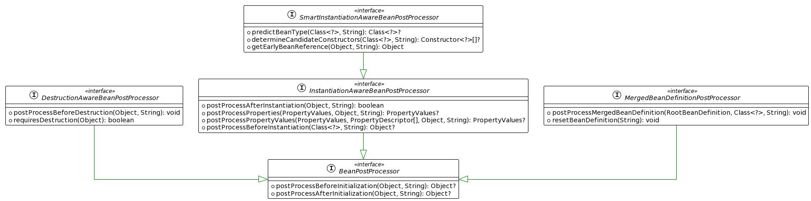

特点：每个bean的生命周期中都会执行一次。实例化前、构造器初始化、实例化后、属性填充前、初始化前、初始化后
```java
/**
 * 核心的接口类型：
 *  1. SmartInstantiationAwareBeanPostProcessor
 *  2. MergedBeanDefinitionPostProcessor
 *  3. InstantiationAwareBeanPostProcessor
 *  4. BeanPostProcessor
 *  5. DestructionAwareBeanPostProcessor
 *
 * 四处地方可以将对象加工厂代理对象：
 *  1. SmartInstantiationAwareBeanPostProcessor#getEarlyBeanReference
 *      - 在这里代理不会出现循环依赖问题
 *  2. InstantiationAwareBeanPostProcessor#postProcessBeforeInstantiation
 *      - 在这里代理不会出现循环依赖问题
 *  3. BeanPostProcessor#postProcessBeforeInitialization
 *  4. BeanPostProcessor#postProcessAfterInitialization
 *
 *  每个 BeanPostProcessor 回调方法的作用：
 *     提前AOP
 *          {@link org.springframework.beans.factory.config.SmartInstantiationAwareBeanPostProcessor#getEarlyBeanReference(java.lang.Object, java.lang.String)}
 *
 *     实例化前。如果该方法返回值不为null，在执行初始化后 {@link InstantiationAwareBeanPostProcessor#postProcessAfterInstantiation(Object, String)}，然后直接返回该对象。不在执行bean生命周期的构造器初始化、属性填充、初始化操作）
 *          {@link org.springframework.beans.factory.config.InstantiationAwareBeanPostProcessor#postProcessBeforeInstantiation(java.lang.Class, java.lang.String)}
 *
 *     构造器初始化。如果返回值不为null，就会使用返回的构造器进行实例化
 *          {@link org.springframework.beans.factory.config.SmartInstantiationAwareBeanPostProcessor#determineCandidateConstructors(java.lang.Class, java.lang.String)}
 *
 *     合并beanDefinition。这里可以拿到BeanDefinition
 *          {@link org.springframework.beans.factory.support.MergedBeanDefinitionPostProcessor#postProcessMergedBeanDefinition(org.springframework.beans.factory.support.RootBeanDefinition, java.lang.Class, java.lang.String)}
 *          注：紧接着会将提前aop的回调函数存到 三级缓存中，被代理对象就是上面刚刚实例化创建出来的对象
 *
 *     实例化后。可以拿到构造器初始化后的对象
 *          {@link org.springframework.beans.factory.config.InstantiationAwareBeanPostProcessor#postProcessAfterInstantiation(java.lang.Object, java.lang.String)}
 *
 *     属性注入前。可以拿到解析注解或者xml中设置的属性值
 *          {@link org.springframework.beans.factory.config.InstantiationAwareBeanPostProcessor#postProcessProperties(org.springframework.beans.PropertyValues, java.lang.Object, java.lang.String)}
 *
 *     属性注入前。可以拿到解析注解或者xml中设置的属性值（过时方法）
 *          {@link org.springframework.beans.factory.config.InstantiationAwareBeanPostProcessor#postProcessPropertyValues(org.springframework.beans.PropertyValues, java.beans.PropertyDescriptor[], java.lang.Object, java.lang.String)}
 *
 *     初始化前。此时的bean已经完成了属性注入、Wrapper注入，还未执行初始化方法(org.springframework.beans.factory.InitializingBean#afterPropertiesSet())
 *          {@link org.springframework.beans.factory.config.BeanPostProcessor#postProcessBeforeInitialization(java.lang.Object, java.lang.String)}
 *
 *     初始化后。这是bean生命周期的最后一个环节了
 *          {@link org.springframework.beans.factory.config.BeanPostProcessor#postProcessAfterInitialization(java.lang.Object, java.lang.String)}
 *
 *     销毁bean的回调
 *          {@link org.springframework.beans.factory.config.DestructionAwareBeanPostProcessor#requiresDestruction(java.lang.Object)}
 * */
```

### bean生命周期中执行BeanPostProcessor的时机

```java
/** 
 * 万恶的源头 {@link AbstractAutowireCapableBeanFactory#doCreateBean(String, RootBeanDefinition, Object[])}
 * 
 * 1. 实例化前 {@link InstantiationAwareBeanPostProcessor#postProcessBeforeInstantiation(Class, String)}
 * 2. 推断构造器 {@link SmartInstantiationAwareBeanPostProcessor#determineCandidateConstructors(Class, String)}
 *      下一步会进行bean的实例化 {@link AbstractAutowireCapableBeanFactory#instantiateBean(String, RootBeanDefinition)}
 *      
 * 3. 合并BeanDefinition信息 {@link MergedBeanDefinitionPostProcessor#postProcessMergedBeanDefinition(RootBeanDefinition, Class, String)}
 * 4. 添加提前aop回调到三级缓存{@link SmartInstantiationAwareBeanPostProcessor#getEarlyBeanReference(Object, String)}
 *      通过lambda创建匿名内部类，将提前aop的回调方式存到三级缓存中。第一个参数就是上面刚刚实例化出来的bean对象  
 *      `addSingletonFactory(beanName, () -> getEarlyBeanReference(beanName, mbd, bean));`
 *      
 * 5. 实例化后 {@link InstantiationAwareBeanPostProcessor#postProcessAfterInstantiation(Object, String)}
 *      这里返回值是boolean，如果返回false  那么将不会执行下面的属性注入流程
 *      
 * 6. 解析要注入的属性值 {@link InstantiationAwareBeanPostProcessor#postProcessProperties(PropertyValues, Object, String)}
 * 7. 解析要注入的属性值(过时方法){@link InstantiationAwareBeanPostProcessor#postProcessPropertyValues(PropertyValues, PropertyDescriptor[], Object, String)}
 *      然后就是将解析的属性值，注入到bean对象中 {@link AbstractAutowireCapableBeanFactory#applyPropertyValues(String, BeanDefinition, BeanWrapper, PropertyValues)}
 *      
 * 8. 初始化前 {@link BeanPostProcessor#postProcessBeforeInitialization(Object, String)}
 *      此时已经完成了bean的实例化、属性注入、XxAware接口的回调
 *      
 * 9. 初始化后 {@link BeanPostProcessor#postProcessAfterInitialization(Object, String)}
 *      此时完成 初始化方法的回调。afterPropertiesSet
 *      
 * 10. 销毁bean的时候回调 {@link DestructionAwareBeanPostProcessor#requiresDestruction(Object)}
 * */
```
### ApplicationListenerDetector
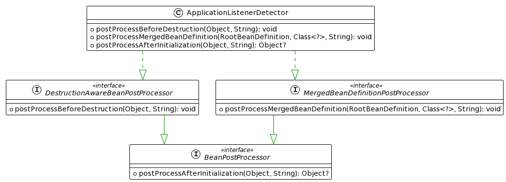
```java
/**
 * ApplicationListenerDetector
 * 
 * BeanPostProcessor执行过程：实例化前后置->推断构造器后置->实例化bean->合并BeanDefinition后置(hit)->实例化后后置->属性注入后置->初始化前后置(hit)->初始化后后置->销毁前后置(hit)
 * 
 * 合并BeanDefinition {@link ApplicationListenerDetector#postProcessMergedBeanDefinition(RootBeanDefinition, Class, String)}
 *      记录 ApplicationListener 类型的bean 在 {@link ApplicationListenerDetector#singletonNames} 属性中
 *
 * 初始化后 {@link ApplicationListenerDetector#postProcessAfterInitialization(Object, String)}
 *      遍历属性`singletonNames` 是单例bean就注册到事件广播器中 `this.applicationContext.addApplicationListener((ApplicationListener<?>) bean);`
 *
 * 销毁阶段 {@link ApplicationListenerDetector#postProcessBeforeDestruction(Object, String)}
 *      销毁的bean是 ApplicationListener 类型，就从事件广播器中移除
 * */
```
## bean 创建的生命周期

### 整体流程

```java
/**
 * org.springframework.beans.factory.support.AbstractBeanFactory#getBean(java.lang.String, java.lang.Class, java.lang.Object...)
 * org.springframework.beans.factory.support.AbstractBeanFactory#doGetBean(java.lang.String, java.lang.Class, java.lang.Object[], boolean)
 *   循环依赖核心代码：如果bean正在创建 -> 二级缓存获取 -> 三级缓存 对正在创建的bean 进行提前AOP 然后返回
 *      org.springframework.beans.factory.support.DefaultSingletonBeanRegistry#getSingleton(java.lang.String)
 * org.springframework.beans.factory.support.AbstractAutowireCapableBeanFactory#createBean(java.lang.String, org.springframework.beans.factory.support.RootBeanDefinition, java.lang.Object[])
 * org.springframework.beans.factory.support.AbstractAutowireCapableBeanFactory#doCreateBean(java.lang.String, org.springframework.beans.factory.support.RootBeanDefinition, java.lang.Object[])
 *  org.springframework.beans.factory.support.AbstractAutowireCapableBeanFactory#createBeanInstance(java.lang.String, org.springframework.beans.factory.support.RootBeanDefinition, java.lang.Object[])
 *  org.springframework.beans.factory.support.AbstractAutowireCapableBeanFactory#populateBean(java.lang.String, org.springframework.beans.factory.support.RootBeanDefinition, org.springframework.beans.BeanWrapper)
 *  org.springframework.beans.factory.support.AbstractAutowireCapableBeanFactory#initializeBean(java.lang.String, java.lang.Object, org.springframework.beans.factory.support.RootBeanDefinition)
 * */
```

### 细说个个环节

1. 所有的bean 都是通过 `getBean()` 来创建的

```java
/**
 *
 * {@link AbstractApplicationContext#refresh()}
 * {@link AbstractApplicationContext#finishBeanFactoryInitialization(ConfigurableListableBeanFactory)}
 * {@link DefaultListableBeanFactory#preInstantiateSingletons()}
 *  1. 先完成单例bean的实例化, 遍历 beanDefinitionNames
 *      - 不是抽象的 && 是单例的 && 不是懒加载的
 *      - 是不是 FactoryBean :
 *          - 是：
 *              - 创建 FactoryBean 实例
 *              - 判断 是否立即初始化 FactoryBean#getObject 返回的bean
 *          - 不是：
 *              @see org.springframework.beans.factory.support.AbstractBeanFactory#getBean(java.lang.String)
 *          注：创建bean 都是执行 getBean
 *  
 *  
 *  2. 单例bean实例化后，遍历 beanDefinitionNames
 *      - 是 SmartInitializingSingleton 类型的bean，回调 {@link SmartInitializingSingleton#afterSingletonsInstantiated() }
 *
 * */
```

2. `getBean()` 流程

```java
/**
 * @see AbstractBeanFactory#doGetBean(String, Class, Object[], boolean)
 * 根据beanName 从单例池获取bean
 *  是否存在
 *      存在：
 *          - beanName 是 &开头的 直接返回
 *          - 不是 &开头，获取的 bean 不是 FactoryBean 的实例 直接返回
 *          - 不是 &开头，获取的 bean 是 FactoryBean 的实例，那就是要返回 FactoryBean#getObject 返回的bean
 *              1. 从 factoryBeanObjectCache 中获取
 *              2. 缓存中不存在，执行 `FactoryBean#getObject` 存储缓存，然后返回
 *      不存在：
 *          - 当前beanFactory 中不存在 该beanName 的 definition，判断父 beanFactory 是否存在，存在就执行  org.springframework.beans.factory.BeanFactory#getBean(java.lang.String)
 *          - 获取该bean 所有的 dependsOn 的值，遍历执行 org.springframework.beans.factory.support.AbstractBeanFactory#getBean(java.lang.String)
 *          - 是单例bean
 *              @see org.springframework.beans.factory.support.DefaultSingletonBeanRegistry#getSingleton(java.lang.String, org.springframework.beans.factory.ObjectFactory)
 *          - 是多例bean
 *              @see org.springframework.beans.factory.support.AbstractBeanFactory#createBean(java.lang.String, org.springframework.beans.factory.support.RootBeanDefinition, java.lang.Object[])
 *          - 其他bean（web应用的：request域、session域、application域）
 *              @see org.springframework.beans.factory.config.Scope#get(java.lang.String, org.springframework.beans.factory.ObjectFactory)
 * */
```

3. `DefaultSingletonBeanRegistry#getSingleton` 流程

```java
/**
 * DefaultSingletonBeanRegistry#getSingleton
 * 1. 从单例缓存池中获取不到 bean `this.singletonObjects.get(beanName);`
 *  - 单例池获取 -> 二级缓存获取 -> 三级缓存获取，执行缓存里的ObjectFactory 进行提前AOP
 *  - 提前AOP，【第一次】执行beanPostProcessor
 * @see org.springframework.beans.factory.config.SmartInstantiationAwareBeanPostProcessor#getEarlyBeanReference(java.lang.Object, java.lang.String)
 * 2. 标记当前bean 正在创建（用来解决循环依赖）`this.singletonsCurrentlyInCreation.add(beanName)`
 * 3. 创建bean 
 *  @see AbstractAutowireCapableBeanFactory#createBean(String, RootBeanDefinition, Object[])
 * 4. 删除标记 `this.singletonsCurrentlyInCreation.remove(beanName)`
 * 5. 将bean 放入单例池
 *  @see DefaultSingletonBeanRegistry#addSingleton(String, Object)
 *  1. 加入到单例缓存池中
 *  2. 从三级缓存中移除
 *  3. 从二级缓存中移除
 * */
```

4. `AbstractAutowireCapableBeanFactory#createBean` 可以通过后置处理器，快速返回，不要执行bean创建的生命周期

```java
/**
 * @see AbstractAutowireCapableBeanFactory#createBean(String, RootBeanDefinition, Object[])
 * 1. 【第二次】执行beanPostProcessor 可以实现 不执行后面 bean的构造器、属性注入、初始化流程（简而言之可以拦截bean的创建过程）
 *  - 返回值是否为null:
 *      为null：继续走 bean 的生命周期流程
 *      不为null：执行beanPostProcessor，执行bean的初始化后动作（AOP和注解事务是在 `postProcessAfterInitialization` 实现的）
 *          @see org.springframework.beans.factory.config.BeanPostProcessor#postProcessAfterInitialization(java.lang.Object, java.lang.String)
 * @see org.springframework.beans.factory.config.InstantiationAwareBeanPostProcessor#postProcessBeforeInstantiation(java.lang.Class, java.lang.String)
 * 2. 真正开始创建bean了，返回创建结果(这里才是bean的核心生命周期流程) 
 * @see org.springframework.beans.factory.support.AbstractAutowireCapableBeanFactory#doCreateBean(java.lang.String, org.springframework.beans.factory.support.RootBeanDefinition, java.lang.Object[])
 * */
```

5. `AbstractAutowireCapableBeanFactory#doCreateBean` bean创建的生命周期

```java
/**
 * 1. 构造器初始化
 *  @see AbstractAutowireCapableBeanFactory#createBeanInstance(String, RootBeanDefinition, Object[])
 *  【第三次】执行beanPostProcessor，返回构造器
 *      @see SmartInstantiationAwareBeanPostProcessor#determineCandidateConstructors(Class, String)
 * 2. 【第四次】执行beanPostProcessor, 对 @Autowired @Value的注解的预解析
 *  @see MergedBeanDefinitionPostProcessor#postProcessMergedBeanDefinition(RootBeanDefinition, Class, String)
 *  3. 满足（是单例bean && 允许循环引用 && 当前bean在真正创建bean集合中）往三级缓存中，记录 当前实例化的bean 的 提前AOP 操作
 * @see DefaultSingletonBeanRegistry#addSingletonFactory(String, ObjectFactory)
 *      - 参数 ObjectFactory
 *          @see AbstractAutowireCapableBeanFactory#getEarlyBeanReference(String, RootBeanDefinition, Object)
 *          - `getEarlyBeanReference` 里面其实是提前AOP的操作，说白了就是执行beanPostProcessor
 *              @see SmartInstantiationAwareBeanPostProcessor#getEarlyBeanReference(Object, String)
 *  4. 属性注入
 * @see AbstractAutowireCapableBeanFactory#populateBean(String, RootBeanDefinition, BeanWrapper)
 *      1. 【第五次】执行beanPostProcessor, 停止属性注入
 *          @see InstantiationAwareBeanPostProcessor#postProcessAfterInstantiation(Object, String)
 *      2. 对属性的值进行解析(会使用 TypeConverter )，存到 `PropertyValues`（注意这里还没有把值设置到bean对象中，只是存到 `PropertyValues`）
 *          @see AutowireCapableBeanFactory#resolveDependency(DependencyDescriptor, String, Set, TypeConverter)
 *      3. 【第六次】执行beanPostProcessor, 也是解析配置的属性值 记录在 `PropertyValues`
 *          @see InstantiationAwareBeanPostProcessor#postProcessProperties(PropertyValues, Object, String)
 *      4. 【第七次】执行beanPostProcessor，也是解析配置的属性值 记录在 `PropertyValues`
 *          @see InstantiationAwareBeanPostProcessor#postProcessPropertyValues(PropertyValues, PropertyDescriptor[], Object, String)
 *      5. 如果上面解析的 PropertyValues 不为null，就把 `PropertyValues` 注入到 bean实例中，完成属性注入
 *          @see AbstractAutowireCapableBeanFactory#applyPropertyValues(String, BeanDefinition, BeanWrapper, PropertyValues)
 *  5. 初始化操作
 * @see AbstractAutowireCapableBeanFactory#initializeBean(String, Object, RootBeanDefinition)
 *      1. 完成对 XxxAware 接口的方法回调
 *          @see AbstractAutowireCapableBeanFactory#invokeAwareMethods(String, Object)
 *      2. 【第八次】执行beanPostProcessor, 比如 执行 @PostConstruct 标注的方法
 *          @see BeanPostProcessor#postProcessBeforeInitialization(Object, String)
 *      3. 执行初始化方法, 执行 org.springframework.beans.factory.InitializingBean#afterPropertiesSet()
 *          @see AbstractAutowireCapableBeanFactory#invokeInitMethods(String, Object, RootBeanDefinition)
 *      4. 【第九次】执行beanPostProcessor, @EnableAspectJAutoProxy 、@EnableTransactionManagement 都是在这里完成代理对象的创建的
 *          @see BeanPostProcessor#postProcessAfterInitialization(Object, String)
 *  6. 销毁bean
 *      【第十次】执行beanPostProcessor
 *          @see org.springframework.beans.factory.config.DestructionAwareBeanPostProcessor.requiresDestruction
 * */
```
### 如何实现bean创建的优先级

```java
/**
 * 如何实现bean创建的优先级：
 * 1. 实现 BeanFactoryPostProcessor（缺点：破坏了bean的生命周期）
 * 2. 重写 cn.haitaoss.javaconfig.ordercreatebean.MySmartInstantiationAwareBeanPostProcessor#postProcessBeforeInstantiation(java.lang.Class, java.lang.String)
 *  这个是 BeanPostProcessor 中最先执行的回调方法，其他的BeanPostProcessor 也可以
 * 3. 重写 onRefresh 方法，通过发布并消费早期事件
 *      cn.haitaoss.javaconfig.applicationlistener.MyAnnotationConfigApplicationContext#onRefresh()
 * 4. 使用 @DependsOn("b")
 */
```

通过重写 `onRefresh` 发布早期事件，实现bean的提前创建 示例

```java
public class MyAnnotationConfigApplicationContext extends AnnotationConfigApplicationContext {
    public MyAnnotationConfigApplicationContext(Class<?>... componentClasses) {
        super(componentClasses);
    }

    @Override
    protected void onRefresh() throws BeansException {
        publishEvent(new MyApplicationEvent("beanDefinition 全部加载完了，可以自定义bean加载顺序了") {
            @Override
            public Object getSource() {
                return super.getSource();
            }
        });
    }

    public static void main(String[] args) {
        new MyAnnotationConfigApplicationContext(AppConfig.class);
    }
}

```

```java
@Component
public class MyApplicationListener implements ApplicationListener<MyApplicationEvent>, ApplicationContextAware {
    private ApplicationContext applicationContext;

    public MyApplicationListener() {
        System.out.println("MyApplicationListener....");
    }

    @Override
    public void onApplicationEvent(MyApplicationEvent event) {
        System.out.println("event is : " + event);
        System.out.println("编译 提前加载bean的逻辑");

        applicationContext.getBean("testPreCreate3");
    }

    @Override
    public void setApplicationContext(ApplicationContext applicationContext) throws BeansException {
        this.applicationContext = applicationContext;
    }
}

```
### 单例bean循环依赖导致的错误

```java
/**
 * spring 为了解决单例bean循环依赖问题，是才用 提请 AOP 的方式 来解决的，
 * 提前AOP是执行
 *      @see org.springframework.beans.factory.config.SmartInstantiationAwareBeanPostProcessor#getEarlyBeanReference(java.lang.Object, java.lang.String)
 * 然后在bean的生命周期的最后阶段会执行 org.springframework.beans.factory.config.BeanPostProcessor#postProcessAfterInitialization(java.lang.Object, java.lang.String)
 * 也可能会返回代理对象。所以就可能出现 postProcessAfterInitialization 创建的代理对象和一开始提前AOP注入给其他bean的不一样
 * 所以只能报错了。
 *
 * 解决方式：
 * 1. 将 postProcessAfterInitialization 的代理逻辑放到 SmartInstantiationAwareBeanPostProcessor#getEarlyBeanReference 实现
 * 2. 使用 @Lazy 注解，不要在初始化的时间就从容器中获取bean，而是直接返回一个代理对象
 * 3. 使用 @Lookup 注解，延迟bean的创建，避免出现循环依赖问题
 */
```

## `ProxyFactory#getProxy`

### 示例代码

```java
@Test
public void 测试ProxyFactory() {
  ProxyFactory proxyFactory = new ProxyFactory();
  /** 
  * 会装饰成 setTargetSource(new SingletonTargetSource(target));
  * 因为代理对象执行的时候是执行 `targetSource.getTart()` 拿到被代理对象的，所以要将 Demo 包装成 TargetSource 类型
  **/
  proxyFactory.setTarget(new Demo());
  // 是否优化，这个也是决定是否使用cglib代理的条件之一
  proxyFactory.setOptimize(true);
  // 接口类型，这个也是决定是否使用cglib代理的条件之一，代理接口的时候才需要设置这个
  proxyFactory.setInterfaces();
  // 约束是否使用cglib代理。但是这个没吊用，会有其他参数一起判断的，而且有优化机制 会优先选择cglib代理
  proxyFactory.setProxyTargetClass(true);
  /**
   * addAdvice 会被装饰成 Advisor
   * 这里不能乱写，因为后面解析的时候 要判断是否实现xx接口的
   * 解析逻辑 {@link DefaultAdvisorAdapterRegistry#getInterceptors(Advisor)}
   * */
  proxyFactory.addAdvice(new MethodBeforeAdvice() {
    @Override
    public void before(Method method, Object[] args, Object target) throws Throwable {
      method.invoke(target, args);
    }
  });
  // 设置 Advisor，有点麻烦 还不如直接通过 addAdvice 设置，自动解析成advisor方便
  proxyFactory.addAdvisor(new DefaultPointcutAdvisor(new MethodBeforeAdvice() {
    @Override
    public void before(Method method, Object[] args, Object target) throws Throwable {
      method.invoke(target, args);
    }
  }));
  proxyFactory.getProxy();
}
```

### 代理逻辑实现原理

> ### CGLIB代理
>
> ```java
> Enhancer enhancer = new Enhancer();
> enhancer.setCallbacks([DynamicAdvisedInterceptor,...]);
> ```
>
> 使用`new DynamicAdvisedInterceptor(this.advised);` 这个callback来实现对被代理对象的增强。this 就是 ObjenesisCglibAopProxy，而其{@link CglibAopProxy#advised}属性 其实就是 ProxyFactory 从而可以拿到Advisors，从而使用Advisor 对方法进行增强
>
> ### JDK代理
>
> ```java
> Proxy.newProxyInstance(classLoader, this.proxiedInterfaces, this);
> ```
>
> 可以知道 第三个参数(InvocationHandler) 是 this，也就是 JdkDynamicAopProxy，而其{@link JdkDynamicAopProxy#advised}属性 其实就是 ProxyFactory从而可以拿到Advisors
>
> ### DynamicAdvisedInterceptor、JdkDynamicAopProxy
>
> 这两个拦截器的执行逻辑如下：
>
> 1. 得到与当前执行的method匹配的interceptor集合 `AdvisedSupport#getInterceptorsAndDynamicInterceptionAdvice`
>
> 2. 创建实例
>
>    1. `new CglibMethodInvocation(interceptor集合)`
>
>       注：其实是ReflectiveMethodInvocation的子类
>
>    2. `new ReflectiveMethodInvocation(interceptor集合)`
>
> 3. 执行 `ReflectiveMethodInvocation#proceed()`

### 细说`ProxyFactory#getProxy`

```java
/**
 * 创建代理对象
 *  {@link ProxyFactory#getProxy(ClassLoader)}
 *  {@link ProxyCreatorSupport#createAopProxy()}
 *
 *
 * 创建 AopProxy {@link DefaultAopProxyFactory#createAopProxy(AdvisedSupport)}
 *      - 简单来说，被代理对象 不是接口 且 不是Proxy的子类 且 {@link AdvisedSupport#getProxiedInterfaces()}至多只有一个SpringProxy类型的接口 就创建 `new ObjenesisCglibAopProxy(config);`
 *      - 否则创建 `new JdkDynamicAopProxy(config);`
 *      注：config 参数其实就是 ProxyFactory对象
 *
 * 使用 AopProxy 创建代理对象 {@link AopProxy#getProxy(ClassLoader)}
 *      {@link ObjenesisCglibAopProxy#getProxy(ClassLoader)}
 *      {@link JdkDynamicAopProxy#getProxy(ClassLoader)}
 *
 * ObjenesisCglibAopProxy 增强逻辑实现原理 {@link ObjenesisCglibAopProxy#getProxy(ClassLoader)}
 *      Enhancer enhancer = new Enhancer();
 *      enhancer.setCallbacks({@link CglibAopProxy#getCallbacks(Class)}); // 执行方法会回调callback
 *          注：会设置  `new DynamicAdvisedInterceptor(this.advised);` callback，this 就是 ObjenesisCglibAopProxy，而其{@link CglibAopProxy#advised}属性 其实就是 ProxyFactory 从而可以拿到Advisors
 *      enhancer.setCallbackFilter(ProxyCallbackFilter); 
 *          返回要执行的 callback 的索引。在Cglib生成代理对象的字节码时会调CallbackFilter，来设置好每个方法的Callback是啥
 *          设置这个属性，生成cglib生成的代理对象字节码，一看就知道了。`System.setProperty(DebuggingClassWriter.DEBUG_LOCATION_PROPERTY, "C:\\Users\\RDS\\Desktop\\1");` 
 *
 *      执行代理对象的方式时会执行 {@link CglibAopProxy.ProxyCallbackFilter#accept(Method)}
 *          就是 除了 finalize、equals、hashcode 等，都会执行 DynamicAdvisedInterceptor 这个callback
 *      也就是执行 {@link CglibAopProxy.DynamicAdvisedInterceptor#intercept(Object, Method, Object[], MethodProxy)}
 *          1. exposeProxy 属性是 true，往 ThreadLocal中记录当前代理对象  `oldProxy=AopContext.setCurrentProxy(proxy)`
 *          2. 获取被代理对象 {@link TargetSource#getTarget()}。这里也是很细节，
 *              比如：
 *                  - TargetSource实例是这个类型的 {@link AbstractBeanFactoryBasedTargetSource}，所以每次获取target都是从IOC容器中拿，也就是说 如果bean是多例的，每次执行都会创建出新的对象。(@Lazy就是这么实现的)
 *                  - 而 Spring Aop，使用的是SingletonTargetSource，特点是将容器的对象缓存了，执行 `getTarget` 才能拿到被代理对象
 *
 *          3. 根据method得到对应的拦截器链 {@link AdvisedSupport#getInterceptorsAndDynamicInterceptionAdvice(Method, Class)}
 *              拦截器链是空：反射执行
 *              拦截器链不是空：将拦截器链装饰成 CglibMethodInvocation ，然后执行{@link CglibAopProxy.CglibMethodInvocation#proceed()}，其实就是执行其父类 {@link ReflectiveMethodInvocation#proceed()}
 *              注：拦截器链就是 method 匹配到的 advisor 解析的结果，可以看这里 {@link DefaultAdvisorChainFactory#getInterceptorsAndDynamicInterceptionAdvice(Advised, Method, Class)}
 *          4. exposeProxy 属性是 true，恢复之前的值  `AopContext.setCurrentProxy(oldProxy);`
 *
 * JdkDynamicAopProxy 增强逻辑的实现 {@link JdkDynamicAopProxy#getProxy(ClassLoader)}
 *      `Proxy.newProxyInstance(classLoader, this.proxiedInterfaces, this);` 可以知道 第三个参数(InvocationHandler) 是 this，也就是 JdkDynamicAopProxy，而其{@link JdkDynamicAopProxy#advised}属性 其实就是 ProxyFactory从而可以拿到Advisors
 *      所以执行代理对象的方式时会执行 {@link JdkDynamicAopProxy#invoke(Object, Method, Object[])}
 *          1. 是 equals(子类没有重写的情况下)、hashCode(子类没有重写的情况下)、DecoratingProxy.class 的方法、Advised.class 的方法
 *              直接反射执行
 *          2. exposeProxy 属性是 true，往 ThreadLocal中记录当前代理对象  `oldProxy=AopContext.setCurrentProxy(proxy)`
 *          3. 根据method得到对应的拦截器链 {@link AdvisedSupport#getInterceptorsAndDynamicInterceptionAdvice(Method, Class)}
 *              拦截器链是空：反射执行
 *              拦截器链不是空：将拦截器链装饰成 ReflectiveMethodInvocation ，然后执行{@link ReflectiveMethodInvocation#proceed()}
 *              注：拦截器链就是 method 匹配到的 advisor 解析的结果，可以看这里 {@link DefaultAdvisorChainFactory#getInterceptorsAndDynamicInterceptionAdvice(Advised, Method, Class)}
 *          4. exposeProxy 属性是 true，恢复之前的值  `AopContext.setCurrentProxy(oldProxy);`
 * */
```

### 细说`AdvisedSupport#getInterceptorsAndDynamicInterceptionAdvice`

```java
/**
 * {@link AdvisedSupport#getInterceptorsAndDynamicInterceptionAdvice(Method, Class)}
 * {@link DefaultAdvisorChainFactory#getInterceptorsAndDynamicInterceptionAdvice(Advised, Method, Class)}
 *      1. 创建AdvisorAdapterRegistry实例 `AdvisorAdapterRegistry registry = GlobalAdvisorAdapterRegistry.getInstance();`
 *      2. 遍历 {@link Advised#getAdvisors()}属性，其实就是 `new ProxyFactory()` 设置的 advice和advisor参数
 *      3. advisor 是 PointcutAdvisor 类型
 *          - 执行 类匹配+AspectJ匹配
 *          - 匹配正确，使用 AdvisorAdapterRegistry 解析 advisor {@link AdvisorAdapterRegistry#getInterceptors(Advisor)} 成 MethodInterceptor
 *              - 需要在执行时匹配 {@link MethodMatcher#isRuntime()}
 *                  将解析的MethodInterceptor和Pointcut的MethodMatcher 装饰成 `new InterceptorAndDynamicMethodMatcher(interceptor, mm)`
 *                  将装饰结果 一个个添加`interceptorList.add`
 *              - 不需要执行时匹配
 *                  直接 `interceptorList.addAll`
 *      4. advisor 是 IntroductionAdvisor 类型
 *          - 执行 类匹配
 *          - 匹配正确，使用 AdvisorAdapterRegistry 解析 advisor {@link AdvisorAdapterRegistry#getInterceptors(Advisor)} 成 MethodInterceptor
 *              直接 `interceptorList.addAll`
 *      5. 使用 AdvisorAdapterRegistry 解析 advisor {@link AdvisorAdapterRegistry#getInterceptors(Advisor)} 成 MethodInterceptor
 *         直接 `interceptorList.addAll`
 *
 * advisor 解析成 MethodInterceptor 的逻辑 {@link DefaultAdvisorAdapterRegistry#getInterceptors(Advisor)}
 *      1. 声明局部变量 `List<MethodInterceptor> interceptors = new ArrayList<>(3);`
 *      2. 拿到具体Advice `Advice advice = advisor.getAdvice();`
 *      3. advice 是 MethodInterceptor 类型
 *          `interceptors.add(advice)`
 *      4. 遍历AdvisorAdapter {@link DefaultAdvisorAdapterRegistry#adapters}
 *         是适配器支持的Advice {@link AdvisorAdapter#supportsAdvice(Advice)}
 *         使用适配器生成 MethodInterceptor {@link AdvisorAdapter#getInterceptor(Advisor)}
 *         `interceptors.add(MethodInterceptor)`
 *      5. interceptors.isEmpty()
 *          抛出异常，说明这个Advice是非法的
 *      6. 返回 interceptors
 *
 *  注：属性{@link DefaultAdvisorAdapterRegistry#adapters}，会在构造器 {@link DefaultAdvisorAdapterRegistry#DefaultAdvisorAdapterRegistry()} 默认设置3个
 *      1. new MethodBeforeAdviceAdapter()
 *      2. new AfterReturningAdviceAdapter()
 *      3. new ThrowsAdviceAdapter()
 *
 *      如果需要扩展AdviceAdapter，可以往IOC容器中注入这个PostProcessor {@link AdvisorAdapterRegistrationManager}
 *      该PostProcessor的功能：发现创建的bean是AdvisorAdapter类型，就往单例bean {@link GlobalAdvisorAdapterRegistry#instance}
 *          设置AdvisorAdapter {@link AdvisorAdapterRegistry#registerAdvisorAdapter(AdvisorAdapter)}，从而实现扩展adapters
 * */
```

### 细说`ReflectiveMethodInvocation#proceed()`

```java
/**
 * {@link ReflectiveMethodInvocation#proceed()}
 *      注：属性{@link ReflectiveMethodInvocation#interceptorsAndDynamicMethodMatchers}(拦截器集合) 是通过这个方法得到的{@link DefaultAdvisorChainFactory#getInterceptorsAndDynamicInterceptionAdvice(Advised, Method, Class)}
 *
 *  1. currentInterceptorIndex(当前拦截器索引) 已经是最后一个了
 *      反射执行被代理对象的方法 {@link ReflectiveMethodInvocation#invokeJoinpoint()}
 *
 *  2. `Object interceptorOrInterceptionAdvice = interceptorsAndDynamicMethodMatchers.get(++currentInterceptorIndex)` 当前拦截器索引自增再取出拦截器集合元素
 *
 *  3. if-else分支处理：
 *
 *  是 interceptorOrInterceptionAdvice instanceof InterceptorAndDynamicMethodMatcher
 *      执行 interceptorOrInterceptionAdvice.methodMatcher#matches
 *          true：执行拦截器的拦截逻辑 `dm.interceptor.invoke(this);`
 *          false：执行 {@link ReflectiveMethodInvocation#proceed()}，也就是跳过当前拦截器，递归执行
 *
 *  否则 `((MethodInterceptor) interceptorOrInterceptionAdvice).invoke(this);`
 *
 *  注：也就是说只支持 InterceptorAndDynamicMethodMatcher、MethodInterceptor 这两种类型的interceptor。 而 InterceptorAndDynamicMethodMatcher 的特点是
 *      执行时会判断当前方法是否匹配，匹配才执行其拦截方法
 * */
```

## 配置类解析原理

> 配置类是通过`ConfigurationClassPostProcessor`解析、注册到BeanDefinitionMap中的，
>
> 而`ConfigurationClassPostProcessor`是在实例化`AnnotationConfigApplicationContext`的时候设置到BeanFactory中的
>
> 因为`ConfigurationClassPostProcessor`实现了`BeanDefinitionRegistryPostProcessor`接口，所以万恶之源应该从`postProcessBeanDefinitionRegistry`方法开始看

```java
/**
 * 1. BeanDefinitionRegistryPostProcessor 回调
 * {@link org.springframework.context.annotation.ConfigurationClassPostProcessor#postProcessBeanDefinitionRegistry(BeanDefinitionRegistry)}
 *
 * 2. 处理方法
 * {@link org.springframework.context.annotation.ConfigurationClassPostProcessor#processConfigBeanDefinitions(BeanDefinitionRegistry)}
 *
 * 3. 校验 ApplicationContext 入参传入的Class 是否是配置类
 *       什么才是配置类？{@link org.springframework.context.annotation.ConfigurationClassUtils#checkConfigurationClassCandidate(BeanDefinition, MetadataReaderFactory)}
 *       有 @Configuration(proxyBeanMethods=true) full配置类
 *       有 @Configuration(proxyBeanMethods=false) lite配置类
 *       无 @Configuration 但是有  (@Component || @ComponentScan || @Import || @ImportResource || @Bean ) lite配置类
 *       都不满足就不是配置类
 *
 *       将配置类添加到集合中 --> configCandidates
 *
 * 4. 对 configCandidates 进行升序排序。可通过 @Order 实现排序
 *
 * 5. 创建解析器
 * {@link org.springframework.context.annotation.ConfigurationClassParser#ConfigurationClassParser(org.springframework.core.type.classreading.MetadataReaderFactory, org.springframework.beans.factory.parsing.ProblemReporter, org.springframework.core.env.Environment, org.springframework.core.io.ResourceLoader, org.springframework.beans.factory.support.BeanNameGenerator, org.springframework.beans.factory.support.BeanDefinitionRegistry)}
 *
 * 6. 使用解析器解析 configCandidates。{@link org.springframework.context.annotation.ConfigurationClassParser#parse(java.util.Set)}
 *      注：解析是有序的。先解析完非 @Import(DeferredImportSelector.class) 的配置类，在解析 @Import(DeferredImportSelector.class)
 *
 *      1. 先解析的内容 @Component、@ComponentScans、@ComponentScan、@Bean、@ImportResource、@Import(非实现DeferredImportSelector.class)
 *          {@link org.springframework.context.annotation.ConfigurationClassParser#processConfigurationClass(org.springframework.context.annotation.ConfigurationClass, java.util.function.Predicate)}
 *          为了处理配置类的父类是配置类的情况，采用 do...while 递归解析 保证所有的内容都能解析完
 *              {@link org.springframework.context.annotation.ConfigurationClassParser#doProcessConfigurationClass(org.springframework.context.annotation.ConfigurationClass, org.springframework.context.annotation.ConfigurationClassParser.SourceClass, java.util.function.Predicate)}
 *                  1. 有@Component 注解，解析成员内部类信息 {@link org.springframework.context.annotation.ConfigurationClassParser#processMemberClasses(org.springframework.context.annotation.ConfigurationClass, org.springframework.context.annotation.ConfigurationClassParser.SourceClass, java.util.function.Predicate)}
 *                  2. 解析 @PropertySource
 *                  3. 对 @ComponentScans、@ComponentScan 解析。
 *                      实例化 Scanner，默认会添加对@Component 解析的 includeFilter {@link ClassPathBeanDefinitionScanner#ClassPathBeanDefinitionScanner(BeanDefinitionRegistry, boolean, Environment, ResourceLoader)}
 *                      {@link org.springframework.context.annotation.ComponentScanAnnotationParser#parse(org.springframework.core.annotation.AnnotationAttributes, java.lang.String)}
 *                      {@link org.springframework.context.annotation.ClassPathBeanDefinitionScanner#doScan(java.lang.String...)}
 *                      3.1 excludeFilter + includeFilter + @Conditional 的校验 {@link org.springframework.context.annotation.ClassPathScanningCandidateComponentProvider#isCandidateComponent(org.springframework.core.type.classreading.MetadataReader)}
 *                          注：
 *                      3.2 设置BeanDefinition信息：beanName、@Autowired、@Lazy、@Primary、@DependsOn、@Role、@Description
 *                      3.3 校验是否可以注册到BeanDefinitionMap中 {@link org.springframework.context.annotation.ClassPathBeanDefinitionScanner#checkCandidate(java.lang.String, org.springframework.beans.factory.config.BeanDefinition)}
 *                      3.4 注册 BeanDefinition 到 IOC 容器中{@link ClassPathBeanDefinitionScanner#registerBeanDefinition(BeanDefinitionHolder, BeanDefinitionRegistry)}
 *                      
 *      2. 后解析的内容 @Import(DeferredImportSelector.class)
 *          {@link org.springframework.context.annotation.ConfigurationClassParser.DeferredImportSelectorHandler#process()}
 *              最终还是调用该方法解析配置类 {@link org.springframework.context.annotation.ConfigurationClassParser#processConfigurationClass(org.springframework.context.annotation.ConfigurationClass, java.util.function.Predicate)}
 *
 *      解析完的结果就是 Map<ConfigurationClass, ConfigurationClass> configurationClasses
 *
 * 7. 遍历 configurationClasses，将解析完的配置内容 定义成 BeanDefinition 注册到 BeanDefinitionMap中
 *      {@link org.springframework.context.annotation.ConfigurationClassBeanDefinitionReader#loadBeanDefinitions(java.util.Set)}
 *      {@link org.springframework.context.annotation.ConfigurationClassBeanDefinitionReader#loadBeanDefinitionsForConfigurationClass(org.springframework.context.annotation.ConfigurationClass, org.springframework.context.annotation.ConfigurationClassBeanDefinitionReader.TrackedConditionEvaluator)}
 *          1. 注册 @Import(非BeanDefinitionRegistry.class) 导入的类 {@link ConfigurationClassBeanDefinitionReader#registerBeanDefinitionForImportedConfigurationClass(ConfigurationClass)}
 *          2. 注册 @Bean {@link ConfigurationClassBeanDefinitionReader#loadBeanDefinitionsForBeanMethod(BeanMethod)}
 *          3. 注册 @ImportResource {@link ConfigurationClassBeanDefinitionReader#loadBeanDefinitionsFromImportedResources(Map)}
 *          4. 注册 @Import(BeanDefinitionRegistry.class) {@link ConfigurationClassBeanDefinitionReader#loadBeanDefinitionsFromRegistrars(Map)}
 * */
```

## ClassPathBeanDefinitionScanner

`ClassPathBeanDefinitionScanner` 是用来扫描包路径下的文件，判断是否符合bean的约定，满足就注册到BeanDefinitionMap中

两种扫描机制：

- 索引扫描：文件`META-INF/spring.components`内写上索引，只扫描索引里面的bean

  ```shell
  # key 是要注册的bean
  # value 是includefilter所能解析的注解,可以写多个默认按照`,`分割
  # 会在实例化 ClassPathBeanDefinitionScanner 的时候，解析 META-INF/spring.components 内容解析到 CandidateComponentsIndex 属性中 
  cn.haitaoss.service.UserService=org.springframework.stereotype.Component
  ```

- 包扫描：扫描包下面所有`.class`文件

注：包扫描，默认是扫描包下所有的`.class`文件，你可以搞花活，重写匹配文件的规则

### 原理分析

> 简单描述：
>
> 1. @ComponentScan 注解
> 2. 构造扫描器 ClassPathBeanDefinitionScanner
> 3. 根据 @ComponentScan 注解的属性配置扫描器
> 4. 扫描: 两种扫描方式
>    - 扫描指定的类：工具目录配置了 `resources/META-INF/spring.components` 内容，就只会扫描里面定义的类。这是Spring扫描的优化机制
>    - 扫描指定包下的所有类：获得扫描路径下所有的class文件（Resource对象）
> 5. 利用 ASM 技术读取class文件信息
> 6. ExcludeFile + IncludeFilter + @Conditional 的判断
> 7. 进行独立类、接口、抽象类 @Lookup的判断  `isCandidateComponent`
> 8. 判断生成的BeanDefinition是否重复
> 9. 添加到BeanDefinitionMap容器中

```java
/**
 * 构造器 {@link ClassPathBeanDefinitionScanner#ClassPathBeanDefinitionScanner(BeanDefinitionRegistry)}
 *      构造器会设置这些属性：
 *      1. this.registry = registry; 因为需要将解析的结果注册到IOC容器中，所以必须要得给个IOC容器
 *      2. 如果参数 useDefaultFilters == true，那么就设置添加默认的(识别@Component注解的) includeFilter {@link ClassPathScanningCandidateComponentProvider#registerDefaultFilters()}
 *          useDefaultFilters 默认就是true
 *      3. setEnvironment(environment); 就是用来读取系统属性和环境变量的
 *      4. setResourceLoader(resourceLoader); 这个很关键，扫描优化机制  {@link ClassPathScanningCandidateComponentProvider#setResourceLoader(ResourceLoader)}
 *          会设置这个属性 componentsIndex，该属性的实例化是执行 {@link CandidateComponentsIndexLoader#loadIndex(ClassLoader)}
 *              然后执行 {@link CandidateComponentsIndexLoader#doLoadIndex(ClassLoader)}
 *              就是会读取ClassLoader里面所有的 META-INF/spring.components 文件 {@link CandidateComponentsIndexLoader#COMPONENTS_RESOURCE_LOCATION}
 *              解析的结果存到 CandidateComponentsIndex 的 LinkedMultiValueMap<String, Entry> 属性中。数据格式： key:注解的全类名 Entry<bean全类名,包名>
 *
 *                 举例：META-INF/spring.components
 *                 cn.haitaoss.service.UserService=org.springframework.stereotype.Component
 *                 解析的结果就是 < org.springframework.stereotype.Component , Entry(cn.haitaoss.service.UserService,cn.haitaoss.service) >
 *
 *
 * 执行扫描 {@link ClassPathBeanDefinitionScanner#doScan(String...)}
 *      1. 入参就是包名，遍历包路径，查找候选的组件 {@link ClassPathScanningCandidateComponentProvider#findCandidateComponents(String)}
 *          有两种查找机制(会将查找结果返回)：
 *              第一种：属性componentsIndex不为空(也就是存在META-INF/spring.components) 且 所有includeFilter都满足{@link ClassPathScanningCandidateComponentProvider#indexSupportsIncludeFilter(TypeFilter)}
 *                     走索引优化策略 {@link ClassPathScanningCandidateComponentProvider#addCandidateComponentsFromIndex(CandidateComponentsIndex, String)}
 *
 *              第二种：扫描包下所有的资源 {@link ClassPathScanningCandidateComponentProvider#scanCandidateComponents(String)}
 *
 *      2. 返回结果，检查容器中是否存在这个 BeanDefinition，{@link ClassPathBeanDefinitionScanner#checkCandidate(String, BeanDefinition)}
 *
 *      3. 返回结果 注册到 BeanDefinitionMap 中 {@link ClassPathBeanDefinitionScanner#registerBeanDefinition(BeanDefinitionHolder, BeanDefinitionRegistry)}
 *
 *
 * 第一种查找机制流程：{@link ClassPathScanningCandidateComponentProvider#addCandidateComponentsFromIndex(CandidateComponentsIndex, String)}
 *      - 遍历includeFilters属性，拿到要扫描的注解值(默认就是@Compoent)，这个就是key {@link ClassPathScanningCandidateComponentProvider#extractStereotype(TypeFilter)}
 *      - key 取 CandidateComponentsIndex#index，拿到的就是 META-INF/spring.components 按照value分组后的key的集合信息
 *             然后判断 META-INF/spring.components 文件内容定义的bean的包名是否满足 扫描的包路径 {@link CandidateComponentsIndex#getCandidateTypes(String, String)}
 *      - 进行 ExcludeFiles + IncludeFilters + @Conditional 判断 {@link ClassPathScanningCandidateComponentProvider#isCandidateComponent(MetadataReader)}
 *      - 进行独立类、接口、抽象类 @Lookup的判断 {@link ClassPathScanningCandidateComponentProvider#isCandidateComponent(AnnotatedBeanDefinition)}
 *      - 满足条件添加到集合 candidates 中
 *
 * 第二种查找机制：{@link ClassPathScanningCandidateComponentProvider#scanCandidateComponents(String)}
 *      - 拿到包下所有的 class 文件 {@link ClassPathScanningCandidateComponentProvider#DEFAULT_RESOURCE_PATTERN}
 *      - 进行 ExcludeFiles + IncludeFilters + @Conditional 判断 {@link ClassPathScanningCandidateComponentProvider#isCandidateComponent(MetadataReader)}
 *      - 进行独立类、接口、抽象类 @Lookup的判断 {@link ClassPathScanningCandidateComponentProvider#isCandidateComponent(AnnotatedBeanDefinition)}
 *      - 满足条件添加到集合 candidates 中
 * */
```

### 索引扫描判断流程

```java
/**
 * 索引扫描判断流程：
 *
 * 1. 扫描组件 {@link ClassPathScanningCandidateComponentProvider#findCandidateComponents(String)}
 *
 * 2. 判断扫描器的 includeFilters 是否都支持索引扫描 {@link org.springframework.context.annotation.ClassPathScanningCandidateComponentProvider#indexSupportsIncludeFilters()}
 *
 * 3. 判断是否支持索引扫描的逻辑{@link ClassPathScanningCandidateComponentProvider#indexSupportsIncludeFilter(TypeFilter)}
 *      是这种类型 filter instanceof AnnotationTypeFilter
 *          filter.getAnnotationType() 有@Indexed注解 或者 是javax. 包下的类
 *
 *      是这种类型 filter instanceof AssignableTypeFilter
 *          filter.getTargetType() 有@Indexed注解
 */
```

### AnnotationTypeFilter 匹配逻辑

```java
/**
 * {@link AbstractTypeHierarchyTraversingFilter#match(MetadataReader, MetadataReaderFactory)}
 * 
 * 1. 匹配bean是否有注解 {@link AbstractTypeHierarchyTraversingFilter#matchSelf(MetadataReader)}
 *      返回true，就return
 *
 * 2. 属性：considerInherited 为 true(通过构造器设置的)
 *      bean的父类 {@link AbstractTypeHierarchyTraversingFilter#matchSuperClass(String)}
 *          返回true，就return
 *      递归调 {@link AbstractTypeHierarchyTraversingFilter#match(MetadataReader, MetadataReaderFactory)}
 *
 * 3. 属性：considerInterfaces 为 true(通过构造器设置的)
 *      bean的接口 {@link AbstractTypeHierarchyTraversingFilter#matchInterface(String)}
 *          返回true，就return
 *      递归调 {@link AbstractTypeHierarchyTraversingFilter#match(MetadataReader, MetadataReaderFactory)}
 * */
```

### @ComponentScan

```java
@ComponentScan(
        basePackages = "cn", // 扫描包路径
        useDefaultFilters = true, // 是否注册默认的 includeFilter，默认会注解扫描@Component注解的includeFilter
        nameGenerator = BeanNameGenerator.class, // beanName 生成器
    		excludeFilters = {} // 扫描bean 排除filter。其中一个命中就不能作为bean
        includeFilters = {@ComponentScan.Filter(type = FilterType.CUSTOM, classes = MyAnnotationTypeFilter.class)} // 扫描bean 包含filter。其中一个命中就能作为bean
)
public class A{}
```

### 索引扫描示例

`META-INF/spring.components` 文件

```properties
cn.haitaoss.javaconfig.ClassPathBeanDefinitionScanner.AService=cn.haitaoss.javaconfig.ClassPathBeanDefinitionScanner.MyAnnotationTypeFilter$MyAnnotation

cn.haitaoss.javaconfig.ClassPathBeanDefinitionScanner.AService=cn.haitaoss.javaconfig.ClassPathBeanDefinitionScanner.MyAnnotationTypeFilter$Haitao
```

代码：

```java
@Component
/*@ComponentScan( 
        basePackages = "cn",
        useDefaultFilters = true,
        nameGenerator = BeanNameGenerator.class,
        includeFilters = {@ComponentScan.Filter(type = FilterType.CUSTOM, classes = MyAnnotationTypeFilter.class)}, // 这个可以重写 AbstractTypeHierarchyTraversingFilter#match 定制匹配规则
        excludeFilters = {}
)*/
@ComponentScan(includeFilters = {@ComponentScan.Filter(type = FilterType.ANNOTATION, classes = MyAnnotationTypeFilter.Haitao.class)}) // 这个用起来方便，有这个注解 就可以
public class Test {}

@MyAnnotationTypeFilter.Haitao
class AService {}

/**
 * 索引扫描判断流程：
 *
 * 1. 扫描组件 {@link org.springframework.context.annotation.ClassPathScanningCandidateComponentProvider#findCandidateComponents(String)}
 *
 * 2. 判断扫描器的 includeFilters 是否都支持索引扫描 {@link org.springframework.context.annotation.ClassPathScanningCandidateComponentProvider#indexSupportsIncludeFilters()}
 *
 * 3. 判断是否支持索引扫描的逻辑{@link org.springframework.context.annotation.ClassPathScanningCandidateComponentProvider#indexSupportsIncludeFilter(TypeFilter)}
 *      是这种类型 filter instanceof AnnotationTypeFilter
 *          filter.getAnnotationType() 有@Indexed注解 或者 是javax. 包下的类
 *
 *      是这种类型 filter instanceof AssignableTypeFilter
 *          filter.getTargetType() 有@Indexed注解
 */

/**
 * 对应的配置文件：META-INF/spring.components
 * - cn.haitaoss.javaconfig.ClassPathBeanDefinitionScanner.AService=cn.haitaoss.javaconfig.ClassPathBeanDefinitionScanner.MyAnnotationTypeFilter$MyAnnotation
 * - cn.haitaoss.javaconfig.ClassPathBeanDefinitionScanner.AService=cn.haitaoss.javaconfig.ClassPathBeanDefinitionScanner.MyAnnotationTypeFilter$Haitao
 * */
class MyAnnotationTypeFilter extends AnnotationTypeFilter {
    @Indexed // 这个是必须的，否则无法使用 索引扫描
    class MyAnnotation implements Annotation {
        @Override
        public Class<? extends Annotation> annotationType() {
            return MyAnnotation.class;
        }
    }

    @Target(ElementType.TYPE)
    @Indexed
    @Retention(RetentionPolicy.RUNTIME)
    @interface Haitao {}

    public MyAnnotationTypeFilter() {
        // super(MyAnnotation.class);
        super(Haitao.class);
    }

    @Override
    public boolean match(MetadataReader metadataReader, MetadataReaderFactory metadataReaderFactory) throws IOException {
        // 匹配方法
        return true;
    }
}

```

## 依赖注入原理
> ### Spring依赖注入注解
>
> @Resource、@Autowired、@Value 标注字段、方法，则表示需要依赖注入(就是反射给字段设置值、反射执行方法)
>
> 在依赖注入的前提上：
>
> - 使用@Lazy则表示注入的是代理对象，执行代理对象时才会真正进行依赖的解析
> - 使用@Qualifier("beanName")，匹配了多个注入的值时，遍历每个候选者，找到限定beanName一致的候选者
> - 使用@Primary，匹配了多个注入的值时，有@Primary的候选者作为最终的注入值
> - 使用@Priority，匹配了多个注入的值时，然后没有@Primary的候选者，才会根据@Priority的排序值，找到至最小的作为最终的注入值
>
> 注：匹配了多个注入的值时，没有@Qualifier、@Primary、@Primary限定，那就根据字段的名字、或者方法的参数名作为限定名匹配候选者
>
> ### 怎么实现的？
>
> 都是通过BeanPostProcessor实现的。
>
> - `CommonAnnotationBeanPostProcessor` 处理 `@Resource`
> - `AutowiredAnnotationBeanPostProcessor`处理`@Autowired 、@Value`
>
> ### 需要知道的东西
>
> - 在实例化`AnnotationConfigApplicationContext`时
>   - 注册`CommonAnnotationBeanPostProcessor、AutowiredAnnotationBeanPostProcessor`到BeanFactory中的
>   - 给BeanFactory设置自动注入候选者解析器`ContextAnnotationAutowireCandidateResolver`。对注入的依赖进行排序，获取依赖类的@Priority的值。
>   
> - 在`prepareBeanFactory`时
>   - 给BeanFactory添加`ResourceEditorRegistrar`。登记员用来加工`PropertyEditorRegistry`
>   - 给BeanFactory添加忽略的依赖接口`ignoredDependencyInterfaces`。是这些接口的方法不应该进行自动注入
>   - 给BeanFactory添加可解析的依赖 `resolvableDependencies`。也叫伪装bean不在BeanDefinitionMap中但支持注入这些类型
>   - 给BeanFactory添加 `manualSingletonNames`。自制的bean，即不使用BeanFactory初始化bean，直接注册到单例池，不在BeanDefinitionMap，但是在单例池中，支持注入这些类型
>
> - 在`finishBeanFactoryInitialization`时：
>   - 给BeanFactory设置`ConversionService`。在依赖注入时，默认会使用`SimpleTypeConverter`要对注入值进行类型转换会使用这个东西，这个其实是`PropertyEditorRegistry`的子类，然后 `ConversionService` 就是其属性，真正进行类型转换是使用`ConversionService`
>   
>   ```java
>   // SimpleTypeConverter 其实就是 PropertyEditorRegistry的子类
>   SimpleTypeConverter typeConverter = new SimpleTypeConverter();
>   // 设置 conversionService
>   typeConverter.setConversionService(getConversionService()); 
>   // ResourceEditorRegistrar 对 typeConverter 进行加工，其实就是给 typeConverter 注册PropertyEditor
>   registrar.registerCustomEditors(typeConverter);
>   ```
### 示例代码

```java
@Component
public class Test {

    /**
     * 当方法返回值不是null时，参数列表的 @Qualifier("a2") 和 方法上的@Qualifier("a") 必须一致，否则是匹配不到bean的
     * {@link QualifierAnnotationAutowireCandidateResolver#isAutowireCandidate(BeanDefinitionHolder, DependencyDescriptor)}
     * */
    @Autowired(required = false)
    @Lazy
    //    @Qualifier("a")
    public void x(@Qualifier("a2") A a, @Lazy A axx) {
        System.out.println(a);
        System.out.println(axx);
    }

    /**
     * 方法返回值不是null，只会进行参数@Qualifier 的配
     * */
    @Autowired
    @Qualifier("a")
    public Object x2(@Qualifier("a2") A a) {
        System.out.println(a);
        return null;
    }

    @Resource
    @Lazy
    public void x3(@Lazy A a) {
        System.out.println(a);
    }

    @Autowired
    @Qualifier("a")
    public List<A> aList;
    @Resource
    public List<A> aList2;

    @Value("#{a2}")
    public A a2;

    @Bean
    public A a() {
        return new Son1();
    }

    @Bean
    //    @Primary
    public A a2() {
        return new Son2();
    }


    public class A {
    }

    @Priority(-1)
    public class Son1 extends A {
    }

    public class Son2 extends A {
    }

    public static void main(String[] args) throws Exception {
        AnnotationConfigApplicationContext context = new AnnotationConfigApplicationContext(Test.class);
        System.out.println(context.getBean(Test.class).aList);
        System.out.println(context.getBean(Test.class).aList2);
        System.out.println(context.getBean(Test.class).a2);
    }


}
```
### AutowiredAnnotationBeanPostProcessor

> - 处理有 `@Autowired | @Value`  的字段、方法，进行依赖注入
>
> - `@Autowired` 推断构造器
> - `@Lookup` 标注的方法，记录到BeanDefinition中，在后面实例化bean的时候会创建代理对象

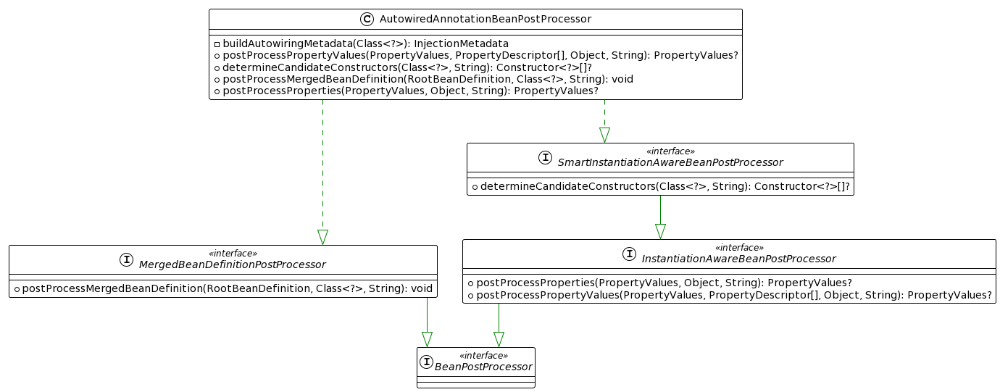
```java
/**
 * AutowiredAnnotationBeanPostProcessor
 *
 * BeanPostProcessor执行过程：实例化前后置->推断构造器后置(hit)-->实例化bean->合并BeanDefinition后置(hit)->实例化后后置->属性注入后置(hit)->初始化前后置>初始化后后置->销毁前后置
 *
 * 推断构造器阶段 {@link AutowiredAnnotationBeanPostProcessor#determineCandidateConstructors(Class, String)}
 *      - 作用一：解析类中(会递归解析父类)标注了@Lookup的方法，装饰成`new LookupOverride(method, lookup.value())`对象设置成BeanDefinition的属性。
 *          在实例化bean的时候，会获取该属性判断是否需要生成Cglib代理对象
 *
 *      - 推断构造器。
 *          变量：`candidateConstructors = new Constructor<?>[0];`
 *          存在@Autowired标注的构造器
 *              @Autowired(required=true) 只能标注一个。candidateConstructors = [这一个]
 *              @Autowired(required=false) 可以标注多个。candidateConstructors = [多个+无参构造器(如果存在)]
 *          不存在
 *              只有一个构造器且是有参的。candidateConstructors = [这一个]
 *
 *          `return candidateConstructors.length>0 ? candidateConstructors : null`
 *          返回null，就是没有候选的构造器集合，后面的实例化自然会调用无参构造器实例化
 *
 * 合并BeanDefinition阶段 {@link AutowiredAnnotationBeanPostProcessor#postProcessMergedBeanDefinition(RootBeanDefinition, Class, String)}
 *      1. 拿到bean的InjectionMetadata对象
 *          {@link AutowiredAnnotationBeanPostProcessor#findAutowiringMetadata(String, Class, PropertyValues)}
 *          - beanName 或者 beanClazz.getName 作为key，从缓存中{@link AutowiredAnnotationBeanPostProcessor#injectionMetadataCache}取出InjectionMetadata
 *          - InjectionMetadata 是空 或者需要刷新，就解析beanCass构建 InjectionMetadata 对象 {@link AutowiredAnnotationBeanPostProcessor#buildAutowiringMetadata(Class)}
 *              - do...while 递归解析clazz及其所有父类，拿到其中标注了 @Autowired、@Value 的方法和字段构造成InjectedElement，然后记录在局部变量elements中
 *                  `new AutowiredFieldElement(field, required)`
 *                  `new AutowiredMethodElement(method, required, pd)`
 *              - 创建对象 `InjectionMetadata.forElements(elements, clazz);`
 *              - InjectionMetadata 对象的属性{@link InjectionMetadata#injectedElements}就是记录了标注了 @Autowired、@Value 注解的Method和Field
 *          - 存入缓存 {@link AutowiredAnnotationBeanPostProcessor#injectionMetadataCache}
 *          - 返回 InjectionMetadata
 *      2. 检查 InjectionMetadata 对象
 *          {@link InjectionMetadata#checkConfigMembers}
 *          - 将 {@link InjectionMetadata#injectedElements} 记录到BeanDefinition中 {@link RootBeanDefinition#registerExternallyManagedConfigMember(Member)}
 *          - 将 {@link InjectionMetadata#injectedElements} 设置到 {@link InjectionMetadata#checkedElements} 表示已经检查过了
 *
 * 属性注入 {@link AutowiredAnnotationBeanPostProcessor#postProcessProperties(PropertyValues, Object, String)}
 *      1. 拿到bean解析而成的InjectionMetadata {@link AutowiredAnnotationBeanPostProcessor#findAutowiringMetadata(String, Class, PropertyValues)}
 *      2. 执行 {@link InjectionMetadata#inject(Object, String, PropertyValues)}
 **/
```
### CommonAnnotationBeanPostProcessor

> 处理有@PostConstruct、@PreDestroy 方法，然后回调
>
> 处理@Resource 字段、方法，进行依赖注入

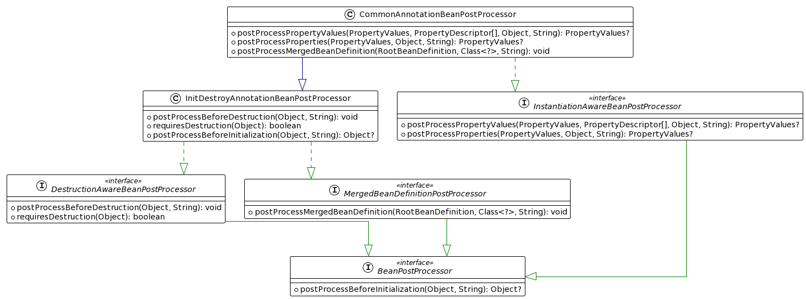

```java
/**
 * CommonAnnotationBeanPostProcessor 有啥用？？
 * 
 * BeanPostProcessor执行过程：实例化前后置->推断构造器后置->实例化bean->合并BeanDefinition后置(hit)->实例化后后置->属性注入后置(hit)->初始化前后置(hit)->初始化后后置->销毁前后置(hit)
 *
 * 合并BeanDefinition阶段 {@link CommonAnnotationBeanPostProcessor#postProcessMergedBeanDefinition(RootBeanDefinition, Class, String)}
 *      1. 回调父类方法 {@link InitDestroyAnnotationBeanPostProcessor#postProcessMergedBeanDefinition(RootBeanDefinition, Class, String)}
 *          - 解析class生成 LifecycleMetadata {@link InitDestroyAnnotationBeanPostProcessor#buildLifecycleMetadata(Class)}
 *          - do...while 循环，递归父类，找到有 @PostConstruct、@PreDestroy 的方法 记录成 LifecycleElement，其中@PostConstruct记录在initMethods,@PreDestroy记录在destroyMethods
 *          - 创建对象`new LifecycleMetadata(clazz, initMethods, destroyMethods)`
 *
 *      2. 记录有 @Resource 字段、方法的类，解析成 `new InjectionMetadata(clazz, elements))`，其中elements的类型`ResourceElement`
 *          - 解析class生成 InjectionMetadata {@link CommonAnnotationBeanPostProcessor#buildResourceMetadata(Class)}
 *          - do...while 递归父类,找到有 @Resource 的字段、方法 装饰成 ResourceElement，记录在局部变量 elements
 *          - 创建对象`InjectionMetadata.forElements(elements, clazz)`
 *          
 *      注：这里主要是缓存起来，一个类对应一个 LifecycleMetadata、InjectionMetadata 对象，对象的属性是记录 回调的字段、方法
 *
 * 属性注入阶段 {@link CommonAnnotationBeanPostProcessor#postProcessProperties(PropertyValues, Object, String)}
 *      1. 拿到bean解析而成的InjectionMetadata {@link CommonAnnotationBeanPostProcessor#findResourceMetadata(String, Class, PropertyValues)}
 *      2. 执行 {@link InjectionMetadata#inject(Object, String, PropertyValues)}
 *
 * CommonAnnotationBeanPostProcessor 继承 InitDestroyAnnotationBeanPostProcessor，所以看父类的实现逻辑
 * 初始化前阶段 {@link InitDestroyAnnotationBeanPostProcessor#postProcessBeforeInitialization(Object, String)}
 *      1. 从缓存中拿到类对应的 LifecycleMetadata，拿不到就解析类生成 LifecycleMetadata。{@link InitDestroyAnnotationBeanPostProcessor#findLifecycleMetadata(Class)}
 *      2. 回调init方法`metadata.invokeInitMethods(bean, beanName);`
 *          其实就是遍历 {@link InitDestroyAnnotationBeanPostProcessor.LifecycleMetadata#initMethods} 属性，反射执行method。一个initMethod就是@PostConstruct标注的方法
 *
 * 销毁前阶段 {@link InitDestroyAnnotationBeanPostProcessor#postProcessBeforeDestruction(Object, String)}
 *      1. 从缓存中拿到类对应的 LifecycleMetadata，拿不到就解析类生成 LifecycleMetadata。{@link InitDestroyAnnotationBeanPostProcessor#findLifecycleMetadata(Class)}
 *      2. 回调Destroy方法`metadata.invokeDestroyMethods(bean, beanName);`
 *          其实就是遍历 {@link InitDestroyAnnotationBeanPostProcessor.LifecycleMetadata#destroyMethods} 属性，反射执行method。一个destroyMethod就是@PreDestroy标注的方法
 * */
```
### 细说`InjectionMetadata#inject`
```java
/**
 * 执行注入 {@link InjectionMetadata#inject(Object, String, PropertyValues)}
 *
 * 遍历其属性，执行每个属性的注入方法
 * for (InjectedElement element : elementsToIterate){
 *      element.inject(target, beanName, pvs);
 * }
 * 
 * InjectedElement举例下面这三种：
 *  - @Autowired、@Value 的字段 ---> AutowiredFieldElement
 *  - @Autowired、@Value 的方法字段 ---> AutowiredMethodElement
 *  - @Resource标注的方法、字段 ---> ResourceElement，`inject` 执行的是父类 {@link InjectionMetadata.InjectedElement#inject(Object, String, PropertyValues)}
 * */
```
### 细说`InjectedElement#inject`

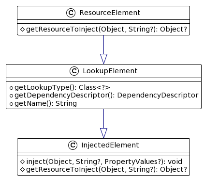
```java
/**
 * 依赖注入：@Resource标注的字段、方法是执行父类方法 {@link InjectionMetadata.InjectedElement#inject(Object, String, PropertyValues)}
 *
 * 是字段，直接反射设置值
 *      `field.set(target, getResourceToInject(target, requestingBeanName));`
 *
 * 是方法，先判断是否应该跳过，不跳过就反射执行方法
 *      - 检查是否跳过 {@link InjectionMetadata.InjectedElement#checkPropertySkipping(PropertyValues)}
 *          就是判断 PropertyValues 中有没有这个方法的信息，存在就跳过
 *      - 反射执行方法 `method.invoke(target, getResourceToInject(target, requestingBeanName));`
 *
 * 获取注入的值，会在这里判断是否创建代理对象 {@link CommonAnnotationBeanPostProcessor.ResourceElement#getResourceToInject(Object, String)}
 *      - element没有@Lazy注解，直接获取注入值 {@link CommonAnnotationBeanPostProcessor#getResource(CommonAnnotationBeanPostProcessor.LookupElement, String)}
 *      - element有@Lazy注解，构建代理对象作为注入值 {@link CommonAnnotationBeanPostProcessor#buildLazyResourceProxy(CommonAnnotationBeanPostProcessor.LookupElement, String)}
 *          1. 定义内部类TargetSource
 *              TargetSource ts = new TargetSource() {
 *                  @Override
 *                  public Object getTarget() {
 *                      // 执行代理对象的方法时，会调`getTarget`得到被代理对象，所以是在执行代理对象的方法时才会执行依赖的解析
 *                      // 这就是@Lazy的原理哦，延时创建
 *                      return getResource(element, requestingBeanName);
 *                  }
 *              };
 *
 *          2. return 创建的代理对象
 *              ProxyFactory pf = new ProxyFactory();
 *              pf.setTargetSource(ts);
 *              return pf.getProxy(classLoader);
 * getResource
 *  {@link CommonAnnotationBeanPostProcessor#getResource(CommonAnnotationBeanPostProcessor.LookupElement, String)}
 *  {@link CommonAnnotationBeanPostProcessor#autowireResource(BeanFactory, CommonAnnotationBeanPostProcessor.LookupElement, String)}
 *      - BeanFactory中没有依赖的名字`!factory.containsBean(name)`
 *          构造 {@link CommonAnnotationBeanPostProcessor.LookupElement#getDependencyDescriptor()} 
 *              字段使用这个`new LookupDependencyDescriptor((Field) this.member, this.lookupType);`
 *              方法使用这个`new LookupDependencyDescriptor((Method) this.member, this.lookupType);`
 *          通过 DependencyDescriptor 从BeanFactory得到依赖值 {@link DefaultListableBeanFactory#resolveDependency(DependencyDescriptor, String, Set, TypeConverter)}
 *      - BeanFactory中有依赖的名字
 *          通过name从BeanFactory得到依赖值 {@link AbstractBeanFactory#getBean(String, Class)}
 *      - 记录依赖关系 {@link ConfigurableBeanFactory#registerDependentBean(String, String)} 
 * 			Tips:所以说@Resource 是byName再byType
 * */
```

### 细说`AutowiredFieldElement#inject`

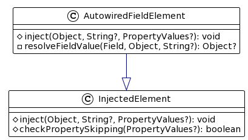

```java
/**
 * 依赖注入：@Autowired、@Value 标注的字段会执行这个 {@link AutowiredAnnotationBeanPostProcessor.AutowiredFieldElement#inject(Object, String, PropertyValues)}
 *  - 解析字段值 `value = resolveFieldValue(field, bean, beanName);`
 *  - 反射给字段设置值 `field.set(bean, value);`
 *
 * 解析字段值 {@link AutowiredAnnotationBeanPostProcessor.AutowiredFieldElement#resolveFieldValue(Field, Object, String)}
 *      - 构造`new DependencyDescriptor(field, this.required);`
 *      - 通过 DependencyDescriptor 从BeanFactory得到依赖值 {@link DefaultListableBeanFactory#resolveDependency(DependencyDescriptor, String, Set, TypeConverter)}
 *      - 记录依赖关系 {@link ConfigurableBeanFactory#registerDependentBean(String, String)}
 *      - 缓存起来 `this.cachedFieldValue = cachedFieldValue;`
 * */
```
### 细说`AutowiredMethodElement#inject`

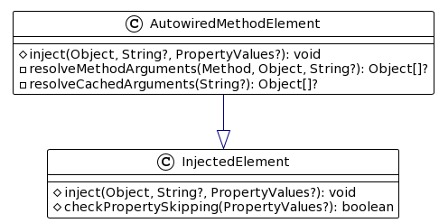

```java
/**
 * 依赖注入：@Autowired、@Value 标注的方法会执行这个{@link AutowiredAnnotationBeanPostProcessor.AutowiredMethodElement#inject(Object, String, PropertyValues)}
 *      - 解析方法参数列表的值 `arguments = resolveMethodArguments(method, bean, beanName);`
 *      - 反射执行方法 `method.invoke(bean, arguments);`
 *
 * 解析参数列表的值 {@link AutowiredAnnotationBeanPostProcessor.AutowiredMethodElement#resolveMethodArguments(Method, Object, String)}
 *      - 遍历方法参数列表，挨个解析 `for (int i = 0; i < arguments.length; i++) {}`
 *      - 构造，也就是一个参数是一个DependencyDescriptor
 *          MethodParameter methodParam = new MethodParameter(method, i);
 *          DependencyDescriptor currDesc = new DependencyDescriptor(methodParam, this.required);
 *      - 通过 DependencyDescriptor 从BeanFactory得到依赖值 {@link DefaultListableBeanFactory#resolveDependency(DependencyDescriptor, String, Set, TypeConverter)}
 *      - 记录依赖关系 {@link ConfigurableBeanFactory#registerDependentBean(String, String)}
 *      - 缓存起来 `this.cachedMethodArguments = cachedMethodArguments;`
 * */
```
### 细说`DefaultListableBeanFactory#resolveDependency`
```java
/**
 * 解析依赖 {@link DefaultListableBeanFactory#resolveDependency(DependencyDescriptor, String, Set, TypeConverter)}
 *  1. 有@Lazy就创建代理对象快速返回 `Object result = getAutowireCandidateResolver().getLazyResolutionProxyIfNecessary(descriptor, requestingBeanName);`
 *      - 使用BeanFactory的AutowireCandidateResolver 解析 {@link ContextAnnotationAutowireCandidateResolver#getLazyResolutionProxyIfNecessary(DependencyDescriptor, String)}
 *          - 是否有@Lazy注解 {@link ContextAnnotationAutowireCandidateResolver#isLazy(DependencyDescriptor)}
 *              字段 DependencyDescriptor：字段是否有@Lazy注解
 *              方法的参数 DependencyDescriptor：参数是否有@Lazy注解，没有在接着看其Method是否有@Lazy注解
 *          - 有就创建代理对象 {@link ContextAnnotationAutowireCandidateResolver#buildLazyResolutionProxy(DependencyDescriptor, String)}
 *                  TargetSource ts = new TargetSource() {
 *                       public Object getTarget() {
 *                           // 执行代理对象的方法时，会调`getTarget`得到被代理对象，所以是在执行代理对象的方法时才会执行依赖的解析
 *                           // 这就是@Lazy的原理哦，延时解析依赖
 *                           return dlbf.doResolveDependency(descriptor, beanName, autowiredBeanNames, null);
 *                       }
 *                   };
 *                   ProxyFactory pf = new ProxyFactory();
 *                   pf.setTargetSource(ts);
 *                   return pf.getProxy();
 *
 *      - 解析的值不是null，就return
 *
 *  2. 开始解析依赖 {@link DefaultListableBeanFactory#doResolveDependency(DependencyDescriptor, String, Set, TypeConverter)}
 * */
```
### 细说`DefaultListableBeanFactory#doResolveDependency`
```java
/**
* 开始解析依赖 {@link DefaultListableBeanFactory#doResolveDependency(DependencyDescriptor, String, Set, TypeConverter)}
*
*  标记一下，正在进行依赖解析 `InjectionPoint previousInjectionPoint = ConstructorResolver.setCurrentInjectionPoint(descriptor);`
*
*  处理有@Value的情况，没有@Value就会往下判断了
*      - 拿到@Value注解的值。查找顺序: 字段、方法参数没有@Value() -> 如果是方法参数依赖，就看看方法上有没有@Value
*          `Object value = getAutowireCandidateResolver().getSuggestedValue(descriptor);`
*          {@link QualifierAnnotationAutowireCandidateResolver#getSuggestedValue(DependencyDescriptor)}
*
*      - value是String类型
*          - 解析占位符 {@link AbstractBeanFactory#resolveEmbeddedValue(String)}
*              `String strVal = resolveEmbeddedValue((String) value);`
*          - 进行SpEL的解析,这里就会从容器中获取bean
*              `value = evaluateBeanDefinitionString(strVal, bd);`
*              {@link AbstractBeanFactory#evaluateBeanDefinitionString(String, BeanDefinition)}
*
*      - 拿到 TypeConverter `TypeConverter converter = (typeConverter != null ? typeConverter : getTypeConverter());`
*              SimpleTypeConverter typeConverter = new SimpleTypeConverter();
*              typeConverter.setConversionService(getConversionService()); // 从容器中获取一个name 是 conversionService 的bean
*              registerCustomEditors(typeConverter); // 使用BeanFactory的ResourceEditorRegistrar对typeConverter进行加工，默认是有这个`ResourceEditorRegistrar`
*              return typeConverter;
*      - 使用 TypeConverter，直接return 完成依赖的解析 `return converter.convertIfNecessary(value, type, descriptor.getTypeDescriptor());`
*
*  依赖类型是多个的情况 `Object multipleBeans = resolveMultipleBeans(descriptor, beanName, autowiredBeanNames, typeConverter);` {@link DefaultListableBeanFactory#resolveMultipleBeans(DependencyDescriptor, String, Set, TypeConverter)}
*      - 就是依赖的类型是 数组、Collection、Map的时候才会处理
*      - 查找AutowireCandidates {@link DefaultListableBeanFactory#findAutowireCandidates(String, Class, DependencyDescriptor)}
*      - 使用converter转换 `Object result = converter.convertIfNecessary(matchingBeans.values(), type);`
*      - 使用依赖排序器，对结果进行排序 {@link DefaultListableBeanFactory#adaptDependencyComparator(Map)}
*      - multipleBeans!=null 直接`return multipleBeans;`
*
*  查找AutowireCandidates `Map<String, Object> matchingBeans = findAutowireCandidates(beanName, type, descriptor);` {@link DefaultListableBeanFactory#findAutowireCandidates(String, Class, DependencyDescriptor)}
*      - 没有匹配的bean,这个依赖还是必须的，那就直接抛出异常 `matchingBeans.isEmpty() && isRequired(descriptor) `
*
*  存在多个候选bean，需要确定唯一一个。因为到这一步的依赖肯定是单个对象的，所以要从多个候选者中确定唯一的一个 `matchingBeans.size() > 1`
*      - {@link DefaultListableBeanFactory#determineAutowireCandidate(Map, DependencyDescriptor)}
*
*  拿到唯一的bean `instanceCandidate = matchingBeans.get(autowiredBeanName);`
*
*  是否需要实例化,
*      if (instanceCandidate instanceof Class)
*          instanceCandidate = descriptor.resolveCandidate(autowiredBeanName, type, this); // 这个就是 `getBean()`
*
*  返回依赖的值 `return instanceCandidate;`
*
*  移除标记 `ConstructorResolver.setCurrentInjectionPoint(previousInjectionPoint);`
*
*  Tips：先判断是不是@Value的自动注入，解析结果不为null直接return；再看看依赖类型是不是多个(数组、集合、Map) 解析到值就return；最后就是依赖类型是单个对象的情况咯，
*  单个对象的依赖就需要从多个候选者中确定唯一一个，确定不了就报错咯
* */
```
### 细说`DefaultListableBeanFactory#findAutowireCandidates`
```java
/**
 * {@link DefaultListableBeanFactory#findAutowireCandidates(String, Class, DependencyDescriptor)}
 *
 *  - 局部变量，记录候选bean,key是beanName，value是bean对象或者是beanClass `Map<String, Object> result = CollectionUtils.newLinkedHashMap();`
 *
 *  - 通过类型从BeanFactory找到匹配的candidateNames {@link BeanFactoryUtils#beanNamesForTypeIncludingAncestors(ListableBeanFactory, Class, boolean, boolean)}
 *      {@link DefaultListableBeanFactory#getBeanNamesForType(Class, boolean, boolean)}
 *      {@link DefaultListableBeanFactory#doGetBeanNamesForType(ResolvableType, boolean, boolean)}
 *          - 先从 BeanDefinitionMap 中找，根据依赖的类型进行匹配
 *          - 再从 manualSingletonNames 中找，根据依赖的类型进行匹配。这种是 {@link DefaultListableBeanFactory#registerSingleton(String, Object)} 这样子注册的，直接就放到单例池不会在BeanDefinitionMap中有记录
 *
 *  - 再从 resolvableDependencies 找到类型匹配的候选者。因为依赖是已经实例化好了，所以直接记录到result中。
 *      `result.put(beanName, autowiringValue);`
 *      Tips：resolvableDependencies 也叫bean伪装，因为这些依赖值是直接new出来的，不是通过`getBean()` 创建出来的。相当于扩展了BeanFactory可以注入的依赖类型。
 *
 *  - 遍历 candidateNames，是自动注入候选者就 `getBean()` 创建出bean对象，然后存到result中
 *      是自动注入候选者 {@link QualifierAnnotationAutowireCandidateResolver#isAutowireCandidate(BeanDefinitionHolder, DependencyDescriptor)}
 *          1. 先检查 这个就是检查BeanDefinition的属性值 {@link AbstractBeanDefinition#isAutowireCandidate()}
 *          2. 匹配了，再检查字段依赖@Qualifier校验,和方法依赖其参数@Qualifier校验
 *          3. 匹配了，是方法依赖且方法返回值不是Void，再才进行方法@Qualifier的匹配
 *          Tips：就是看看 @Qualifier("name") 与 candidateName 一致，就是true
 *
 *      是，就记录到result中 {@link DefaultListableBeanFactory#addCandidateEntry(Map, String, DependencyDescriptor, Class)}
 *          分为三种情况：
 *          1. 依赖类型是 数组、集合、Map等 `descriptor instanceof MultiElementDescriptor`
 *              依赖类型是多个，所以需要把类型的bean都通过BeanFactory创建出来
 *              - 通过BeanFactory得到bean实例 {@link DependencyDescriptor#resolveCandidate(String, Class, BeanFactory)}
 *              - 记录 `result.put(candidateName, beanInstance);`
 *
 *          2. candidateName 已经在单例池创建好了，所以可以直接拿
 *              - 通过BeanFactory得到bean实例 {@link DependencyDescriptor#resolveCandidate(String, Class, BeanFactory)}
 *              - 记录 `result.put(candidateName, beanInstance);`
 *
 *          3. 依赖类型不是多个，且单例池没有，那么只记录其class,目的是防止不依赖的bean也被创建了
 *              - 从BeanFactory中 通过beanName拿到其类型， {@link AbstractBeanFactory#getType(String)}
 *              - 记录 `result.put(candidateName, getType(candidateName));`
 *              Tips：确定好唯一一个beanName的时候才会在实例化的。
 *
 *          Tips: `DependencyDescriptor#resolveCandidate` 其实就是 `beanFactory.getBean(beanName)`
 *
 *  - 返回 result
 * */
```
### 细说`DefaultListableBeanFactory#determineAutowireCandidate`
```java
/**
 * 确定自动注入候选者 {@link DefaultListableBeanFactory#determineAutowireCandidate(Map, DependencyDescriptor)}
 *
 * 先通过@Primary查找 {@link DefaultListableBeanFactory#determinePrimaryCandidate(Map, Class)}
 *   如果 candidateName 有@Primary就返回。这里是会有判断的存在多个候选者有@Primary就抛出异常，所以说一个依赖类型只能有一个@Primary注解标注
 *  `return candidateName;`
 *
 * 没有找到@Primary，在通过beanClass的@Priority(1) {@link DefaultListableBeanFactory#determineHighestPriorityCandidate(Map, Class)}
 *   返回排序值小的结果。这个是为了处理依赖类型是父类，然后容器中有多个子类实现的时候，可以通过@Priority(1) 来决定那个子类优先级搞。
 *  `return candidateName;`
 *      Tips：如果容器存在同一类型的bean有多个，就会报错，因为@Primary()的值都一样，无法确定，只能报错咯
 *
 * 兜底方法，bean实例是resolvableDependencies里面的 或者 beanName是(字段名 或者 方法参数名)，也能确定出唯一的候选者
 *  `return candidateName;`
 *
 * 都没得，就``return null``
 * 
 * Tips: 如果依赖类型不是多个的会通过 @Primary -> @Priority -> bean实例是resolvableDependencies里面的 -> beanName是(字段名 或者 方法参数名) 确定出唯一的候选者
 * */
```

### 细说`AbstractBeanFactory#evaluateBeanDefinitionString`
[看SpEL](#SpEL)

说白了就是解析SpEL表达式。对于`#{beanA}` 就是从BeanFactory中获取bean对象

```java
/**
 * 比如 @Value("#{beanA}")
 *
 * {@link AbstractBeanFactory#evaluateBeanDefinitionString(String, BeanDefinition)}
 *
 * 使用 `StandardBeanExpressionResolver` 进行计算 {@link StandardBeanExpressionResolver#evaluate(String, BeanExpressionContext)}
 *      `return this.beanExpressionResolver.evaluate(value, new BeanExpressionContext(this, scope));`
 *
 *      // value 就是 "#{beanA}" ,而beanExpressionParserContext 就是替换掉 #{}。也就是变成了 beanA ，也就是要访问 beanA这个属性
 *      Expression expr = new SpelExpressionParser().parseExpression(value, this.beanExpressionParserContext);
 *      StandardEvaluationContext sec = new StandardEvaluationContext(evalContext);
 *      // 设置属性访问器，就是用来解析 beanA 属性时，会调用这个访问器来获取值
 *      sec.addPropertyAccessor(new BeanExpressionContextAccessor());
 *      // 返回SpEL解析的结果
 *      expr.getValue(sec);
 *
 * 通过属性访问器，读取 beanA 属性值 {@link BeanExpressionContextAccessor#read(EvaluationContext, Object, String)}
 *      `(BeanExpressionContext) target).getObject(name)` {@link BeanExpressionContext#getObject(String)}
 *      而 BeanExpressionContext 包装了BeanFactory和Scope。所以`getObject`
 *
 *      if (this.beanFactory.containsBean(key)) {
 * 			return this.beanFactory.getBean(key);
 *      }
 * 		else if (this.scope != null) {
 * 			return this.scope.resolveContextualObject(key);
 *      }
 * 		else {
 * 			return null;
 *      }
 * */
```
### 细说`TypeConverterSupport#convertIfNecessary` 

> 对依赖进行转换是执行`TypeConverterSupport#convertIfNecessary`。
>
> `TypeConverterSupport` 其实是聚合了 `PropertyEditor` 和 `ConversionService`,这两个才是真正干活的东西。
>
> `ConversionService`真正干活是使用`GenericConverter`,`ConversionService`只是聚合了多个`GenericConverter`而已。
>
> `PropertyEditorRegistrar` 是用来加工 `PropertyEditorRegistry`的，就是用来给其设置`PropertyEditor`的。
>
> 扩展`PropertyEditorRegistrar` 是通过 `CustomEditorConfigurer`
>
> `PropertyEditorSupport` 是JDK提供的，`ConversionService`是Spring提供的。
>
> [参看代码](#类型转换)

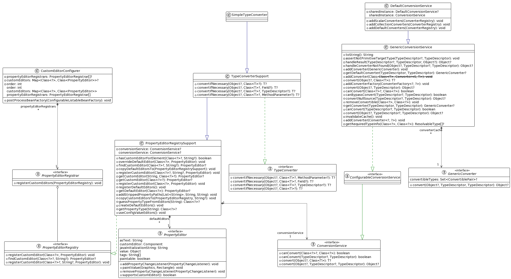

```java
/**
 * 依赖注入时，会拿到TypeConverter {@link AbstractBeanFactory#getTypeConverter()} ，进行转换
 *      SimpleTypeConverter typeConverter = new SimpleTypeConverter();
 *      // 从容器中获取一个name是 conversionService 的bean
 *      typeConverter.setConversionService(getConversionService());
 *      // 使用BeanFactory的ResourceEditorRegistrar对typeConverter进行加工
 *      // 主要是设置这个属性 {@link PropertyEditorRegistrySupport#overriddenDefaultEditors}
 *      registerCustomEditors(typeConverter);
 *
 * 执行转换 {@link TypeConverterSupport#convertIfNecessary(Object, Class, MethodParameter)}
 *
 * 拿到自定义的PropertyEditor `PropertyEditor editor = this.propertyEditorRegistry.findCustomEditor(requiredType, propertyName);`
 *      先使用 propertyName + requiredType 从这个属性找 {@link PropertyEditorRegistrySupport#customEditorsForPath}
 *      找不到在使用 requiredType 从这个属性找 {@link PropertyEditorRegistrySupport#customEditors}
 *      Tips: 可以通过往容器中注入 CustomEditorConfigurer 来扩展这两个属性值
 *
 * 没有自定义的 PropertyEditor 但是有 ConversionService
 *      通过值类型 和 要赋值的对象 类型，判断是否可以转换。 {@link ConversionService#canConvert(TypeDescriptor, TypeDescriptor)}
 *          其实就是遍历 ConversionService 的属性 {@link GenericConversionService.Converters} 找到合适的 GenericConverter
 *              {@link GenericConversionService.Converters#find(TypeDescriptor, TypeDescriptor)}
 *                  {@link GenericConversionService.Converters#getRegisteredConverter(TypeDescriptor, TypeDescriptor, GenericConverter.ConvertiblePair)}
 *
 *      可以，就使用converter转换 {@link ConversionService#convert(Object, TypeDescriptor, TypeDescriptor)}
 *
 *      return 装换的结果
 *
 * 执行转换 {@link TypeConverterDelegate#doConvertValue(Object, Object, Class, PropertyEditor)}
 *      没有自定义的PropertyEditor 那就找默认的，先从这里面找 {@link PropertyEditorRegistrySupport#overriddenDefaultEditors}
 *      找不到在重这里面找 {@link PropertyEditorRegistrySupport#defaultEditors}
 *
 * return 装换的结果
 *
 * Tips: 具体的转换功能是有 PropertyEditor 和 ConversionService 实现的，而 ConversionService 的具体转换功能是由 GenericConverter 实现的。
 * */
```

## 类型转换

[原理看这里](#细说`TypeConverterSupport#convertIfNecessary` )

> `PropertyEditor` 是JDK提供的，`ConversionService`是Spring提供的。而`TypeConverter`是聚合了这两个东西
>
> 注入 `CustomEditorConfigurer` 可以扩展`TypeConverter`中的`PropertyEditor`

### `PropertyEditorTest`

```java
@Component
public class PropertyEditorTest {


    @Bean
    public A a() {
        return new A();
    }

    @Data
    public static class A {
        private String name;

        @Autowired
        public void x(@Value("hello world!!!") A a) {
            System.out.println(a);
        }
    }

    @Bean
    public CustomEditorConfigurer myCustomEditorConfigurer() {
        CustomEditorConfigurer customEditorConfigurer = new CustomEditorConfigurer();

        Map<Class<?>, Class<? extends PropertyEditor>> customEditors = new HashMap<>();
        customEditors.put(A.class, MyPropertyEditor.class);
        customEditorConfigurer.setCustomEditors(customEditors);

        customEditorConfigurer.setPropertyEditorRegistrars(new PropertyEditorRegistrar[]{new PropertyEditorRegistrar() {
            @Override
            public void registerCustomEditors(PropertyEditorRegistry registry) {
                registry.registerCustomEditor(A.class, new MyPropertyEditor());
                registry.registerCustomEditor(A.class, null, new MyPropertyEditor());
                if (registry instanceof SimpleTypeConverter) {
                    SimpleTypeConverter.class.cast(registry).overrideDefaultEditor(A.class, new MyPropertyEditor());
                }
            }
        }});

        return customEditorConfigurer;
    }

    public static class MyPropertyEditor extends PropertyEditorSupport {
        @Override
        public void setValue(Object value) {
            if (value instanceof String) {
                A a = new A();
                a.setName((String) value);
            }
            super.setValue(value);
        }

        @Override
        public void setAsText(String text) throws IllegalArgumentException {
            A a = new A();
            a.setName(text);
            this.setValue(a);
        }

        public static void main(String[] args) {
            /**
             * 使用就是 setValue(Object) setAsText(String) 设置转换值
             * getValue() 就是拿到转换的结果
             * */
            MyPropertyEditor myPropertyEditor = new MyPropertyEditor();
            //        myPropertyEditor.setAsText("hah");
            myPropertyEditor.setValue("hah");
            System.out.println(myPropertyEditor.getValue());
        }
    }

    public static void main(String[] args) throws Exception {
        new AnnotationConfigApplicationContext(PropertyEditorTest.class);
    }

}
```

### `ConversionServiceTest`

```java
@Component
public class ConversionServiceTest {


    @Bean
    public A a() {
        return new A();
    }

    @Data
    public static class A {
        private String name;

        @Value("2022-08-11")
        @DateTimeFormat(pattern = "yyyy-MM-dd")
        private Date date = new Date();

        @Value("101.11")
        @NumberFormat(pattern = "#")
        private Integer money;

        @Value("code,play")
        private String[] jobs;

        @Autowired
        public void x(@Value("hello world!!!") A a) {
            System.out.println(a);
        }
    }

    @Bean// 名字必须是 conversionService 因为在依赖注入的时候是通过这个名字拿的
    public static ConversionService conversionService() {
        // DefaultFormattingConversionService 功能强大： 类型转换 + 格式化
        DefaultFormattingConversionService defaultFormattingConversionService = new DefaultFormattingConversionService();
        defaultFormattingConversionService.addConverter((Converter<String, A>) source -> {
            A a = new A();
            a.setName(source);
            return a;
        });

        return defaultFormattingConversionService;
    }

    public static void main(String[] args) throws Exception {
        new AnnotationConfigApplicationContext(ConversionServiceTest.class);
    }

}
```

### `TypeConverterTest`

```java
public class TypeConverterTest {
    @Data
    public static class A {
        private String name;
    }

    public static void main(String[] args) {
        SimpleTypeConverter simpleTypeConverter = new SimpleTypeConverter();

        simpleTypeConverter.registerCustomEditor(A.class, new PropertyEditorSupport() {
            @Override
            public void setAsText(String text) throws IllegalArgumentException {
                A a = new A();
                a.setName(text);
                super.setValue(a);
            }
        });
        /*DefaultConversionService conversionService = new DefaultConversionService();
        conversionService.addConverter(new Converter<String, A>() {
            @Override
            public A convert(String source) {
                A a = new A();
                a.setName(source);
                return a;
            }
        });
        simpleTypeConverter.setConversionService(conversionService);*/
        System.out.println(simpleTypeConverter.convertIfNecessary("123", A.class));
    }
}
```

## SpEL

> [Spring官方文档](https://docs.spring.io/spring-framework/docs/3.0.x/reference/expressions.html)

```java
public class Demo {
    private String name;


    @Test
    public void test_spel() {
        Demo demo = new Demo();

        ExpressionParser parser = new SpelExpressionParser();

        StandardEvaluationContext context = new StandardEvaluationContext(demo);
        context.setVariable("newName", "Mike Tesla");

        Function<String, Object> consumer = exp -> parser.parseExpression(exp).getValue(context);
        // 字符串
        System.out.println(consumer.apply("'a'"));
        // 运算
        System.out.println(consumer.apply("1+1"));
        /**
         * name 表示 context中的属性名
         * #newName 表示获取变量
         *
         * 意思就是给name赋值
         * */
        System.out.println(consumer.apply("name = #newName"));
        /**
         * name变量的值，这样子写就是访问属性
         * */
        System.out.println(consumer.apply("name"));
        /**
         * 设置BeanResolver,就是 @ 开头的会通过这个解析值
         * */
        context.setBeanResolver(new BeanResolver() {
            @Override
            public Object resolve(EvaluationContext context, String beanName) throws AccessException {
                return "通过BeanResolver解析的值-->" + beanName;
            }
        });
        // 会使用BeanResolver 解析
        System.out.println(consumer.apply("@a"));
        // 模板解析上下文，就是可以去掉模板字符
        System.out.println(parser.parseExpression("#{@x}", new TemplateParserContext()).getValue(context));

        // PropertyAccessor 用来解析属性是怎么取值的
        context.addPropertyAccessor(new PropertyAccessor() {
            @Override
            public Class<?>[] getSpecificTargetClasses() {
                //                return new Class[0];
                /**
                 * 返回 null，表示都满足
                 * 不会null，就会匹配 EvaluationContext 类型，匹配了才会使用这个 PropertyAccessor
                 * {@link PropertyOrFieldReference#readProperty(TypedValue, EvaluationContext, String)}
                 *  {@link PropertyOrFieldReference#getPropertyAccessorsToTry(Object, List)}
                 * */
                return null;
            }

            @Override
            public boolean canRead(EvaluationContext context, Object target, String name) throws AccessException {
                System.out.println("canRead...." + name);
                return true;
            }

            @Override
            public TypedValue read(EvaluationContext context, Object target, String name) throws AccessException {
                System.out.println("read...." + name);
                return null;
            }

            @Override
            public boolean canWrite(EvaluationContext context, Object target, String name) throws AccessException {
                return false;
            }

            @Override
            public void write(EvaluationContext context, Object target, String name, Object newValue) throws AccessException {

            }
        });
        System.out.println(consumer.apply("testPropertyAccessor"));
    }
}
```


## @EnableAspectJAutoProxy

> pointcut表达式 https://zhuanlan.zhihu.com/p/63001123
>
> CGLIB介绍与原理 https://blog.csdn.net/zghwaicsdn/article/details/50957474
>
> 只是看懂 Spring Aop 的实现原理，至于具体的AspectJ表达式如何匹配的没有看

### 类图

```java
/**
 * 是基础类型 {@link AnnotationAwareAspectJAutoProxyCreator#isInfrastructureClass(Class)}
 * 应该跳过 {@link AspectJAwareAdvisorAutoProxyCreator#shouldSkip(Class, String)}
 *
 * 得到 specificInterceptors(这个bean匹配的advice和advisor集合)
 * {@link AbstractAdvisorAutoProxyCreator#getAdvicesAndAdvisorsForBean(Class, String, TargetSource)}
 * {@link AbstractAdvisorAutoProxyCreator#findEligibleAdvisors(Class, String)}
 *      查找候选的advisor集合 {@link AnnotationAwareAspectJAutoProxyCreator#findCandidateAdvisors()}
 *          执行父类的方法，查到Advisor {@link AbstractAdvisorAutoProxyCreator#findCandidateAdvisors()}
 *          构建Advisors {@link BeanFactoryAspectJAdvisorsBuilder#buildAspectJAdvisors()}
 *              使用工厂解析@Aspect创建Advisor{@link AspectJAdvisorFactory#getAdvisors(MetadataAwareAspectInstanceFactory)}
 *
 *      查询当前类可以应用的 advisor(这里是筛选可以应用的) {@link AbstractAdvisorAutoProxyCreator#findAdvisorsThatCanApply(List, Class, String)}
 *
 *      扩展 Advisor {@link AspectJAwareAdvisorAutoProxyCreator#extendAdvisors(List)}
 *
 *      对Advisor进行升序排序 {@link AspectJAwareAdvisorAutoProxyCreator#sortAdvisors(List)}
 *
 * 创建代理对象 {@link AbstractAutoProxyCreator#createProxy(Class, String, Object[], TargetSource)}
 *      构建Advisor，主要是看看是否需要装饰 {@link AbstractAutoProxyCreator#buildAdvisors(String, Object[])}
 *          `proxyFactory.addAdvisors(advisors);`
 *      使用ProxyFactory创建代理对象
 * */
```
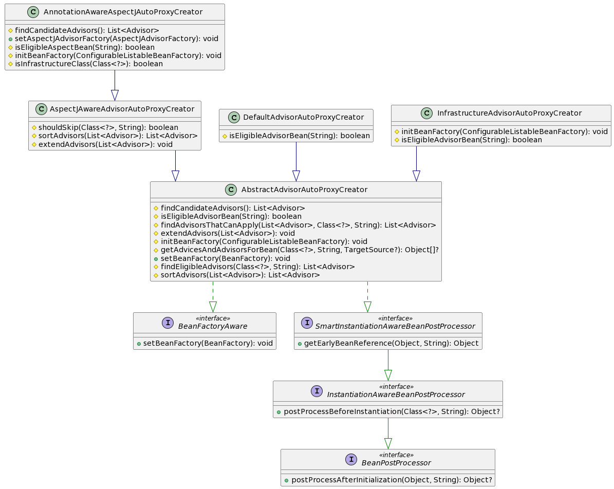

> @Aroun、@Before、@After、@AfterThrowing、@AfterReturning 解析成的 Advice
>
> @Before 需要使用 MethodBeforeAdviceAdapter 解析成 MethodBeforeAdviceInterceptor
>
> @AfterReturning 需要使用 AfterReturningAdviceAdapter 解析成 AfterReturningAdviceInterceptor

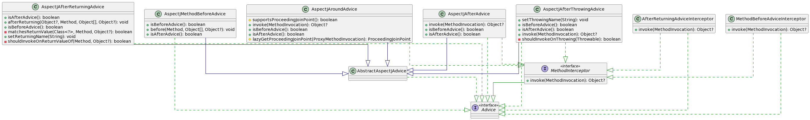

> ### Advisor是啥
>
> `@Around、@Before、@After、@AfterReturning、@AfterThrowing` 会被解析成 `PointcutAdvisor`
>
> `DeclareParents` 会被解析成 `IntroductionAdvisor`
>
> ### PointcutAdvisor 和 IntroductionAdvisor 的区别
>
> 在进行切入点匹配时：
>
> - PointcutAdvisor：使用其Poincut属性，进行ClassFilter+MethodMatcher
> - IntroductionAdvisor：进行ClassFilter
>
> 在创建代理对象时：
>
> - PointcutAdvisor：会获取其Advice属性，转换成MethodInterceptor对象，组成InterceptorChain，在执行代理对象的方法时，会执行与方法匹配的Interceptors
> - IntroductionAdvisor：
>   1. 会拿到其 interfaces 设置为代理对象的接口，然后创建代理对象，所以创建出来的代理对象可以强转成对应的接口，从而实现 不修改被代理的情况下新增方法。
>   2. 和PointcutAdvisor一样。会获取其Advice属性，转换成MethodInterceptor对象，组成InterceptorChain，在执行代理对象的方法时，会执行与方法匹配的Interceptors

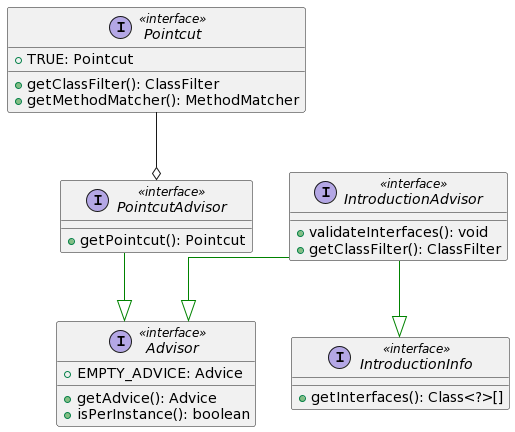

### 1. 使用`@EnableAspectJAutoProxy`会发生什么?

会往容器中添加 `AnnotationAwareAspectJAutoProxyCreator` 类的BeanDefinition，然后在IOC容器创建的时候会进行实例化。

```java
/**
 *
 * 1. 使用注解 {@code @EnableAspectJAutoProxy(exposeProxy = true, proxyTargetClass = true)} {@link EnableAspectJAutoProxy}
 *      该注解会导入 {@code @Import(AspectJAutoProxyRegistrar.class)} {@link AspectJAutoProxyRegistrar}
 *
 * 2. 所以会在解析配置类阶段，回调 {@link AspectJAutoProxyRegistrar#registerBeanDefinitions(AnnotationMetadata, BeanDefinitionRegistry)} 来注册bean
 *
 * 3. 会执行 {@link AopConfigUtils#registerAspectJAnnotationAutoProxyCreatorIfNecessary(BeanDefinitionRegistry)} 注册bean
 *      就是注册这个 {@link AnnotationAwareAspectJAutoProxyCreator}
 *
 * 4. 将注解的属性值，设置到BeanDefinition中，当bean进行属性填充的设置会设置到bean的属性属性中。
 *      proxyTargetClass，决定是否使用cglib代理 -> {@link AopConfigUtils#forceAutoProxyCreatorToUseClassProxying(BeanDefinitionRegistry)}
 *      exposeProxy，在执行 MethodInterceptor时是否将代理对象存到ThreadLocal中 -> {@link AopConfigUtils#forceAutoProxyCreatorToExposeProxy(BeanDefinitionRegistry)}
 * */
```
### 2. `AnnotationAwareAspectJAutoProxyCreator` 的实例化

```java
/**
 *
 * AnnotationAwareAspectJAutoProxyCreator 实现了 SmartInstantiationAwareBeanPostProcessor、BeanFactoryAware
 *
 * 1. 刷新IOC容器 {@link AbstractApplicationContext#refresh()}
 * 2. 注册 BeanPostProcessor {@link AbstractApplicationContext#registerBeanPostProcessors(ConfigurableListableBeanFactory)}
 *     所以 这里会 创建 AnnotationAwareAspectJAutoProxyCreator
 *
 * 3. 创建 AnnotationAwareAspectJAutoProxyCreator {@link BeanFactory#getBean(String, Class)}
 *
 * 4. 在实例化后,初始化前会回调 {@link BeanFactoryAware#setBeanFactory(BeanFactory)}
 *
 * 5. 也就是会回调 {@link AbstractAdvisorAutoProxyCreator#setBeanFactory(BeanFactory)}
 *      就是对属性赋值进行初始化，方法体会执行 {@link AnnotationAwareAspectJAutoProxyCreator#initBeanFactory(ConfigurableListableBeanFactory)}
 *          {@link AbstractAdvisorAutoProxyCreator#initBeanFactory(ConfigurableListableBeanFactory)}
 *              // 这是用来检索 BeanFactory 中所有 Advisor 类型的bean
 *              this.advisorRetrievalHelper = new BeanFactoryAdvisorRetrievalHelperAdapter(beanFactory);
 *
 *          // 这是用来将 @Aspect 标注的bean，将标注了[@Pointcut,@Around,@Before,@After,@AfterReturning,@AfterThrowing]的方法 解析成 Advisor
 *          this.aspectJAdvisorFactory = new ReflectiveAspectJAdvisorFactory(beanFactory);
 *
 *          // 依赖 aspectJAdvisorFactory。遍历BeanFactory所有的bean，然后使用 aspectJAdvisorFactory 来生成 Advisor，将结果缓存
 *          this.aspectJAdvisorsBuilder = new BeanFactoryAspectJAdvisorsBuilderAdapter(beanFactory, this.aspectJAdvisorFactory);
 * */
```
### 3. `AnnotationAwareAspectJAutoProxyCreator` 后置处理器回调

#### 实例化前阶段
```java
/**
 * AnnotationAwareAspectJAutoProxyCreator 没有重写方法，所以执行父类的{@link AbstractAutoProxyCreator#postProcessBeforeInstantiation(Class, String)}
 *
 * 1. beanName是空 或者 targetSourcedBeans(已AOP代理对象集合)属性没有记录过该beanName
 *      - advisedBeans(增强bean集合) 中记录了，就 return null
 *      - 是基础bean {@link AnnotationAwareAspectJAutoProxyCreator#isInfrastructureClass(Class)} 或者 应该跳过 {@link AspectJAwareAdvisorAutoProxyCreator#shouldSkip(Class, String)}
 *          记录一下 `this.advisedBeans.put(cacheKey, Boolean.FALSE);`
 *          return null
 *
 *  2. 生成 TargetSource {@link AbstractAutoProxyCreator#getCustomTargetSource(Class, String)}
 *      需要设置 TargetSourceCreator 属性 {@link AbstractAutoProxyCreator#setCustomTargetSourceCreators(TargetSourceCreator...)} 才会有用，
 *      但是看源码没有用到，所以这个方法一直返回null
 *
 *  3. TargetSource 不为null
 *      - 记录targetSourcedBeans(被代理对象集合) `this.targetSourcedBeans.add(beanName);`
 *      - 得到这个bean匹配的advice和advisor集合 {@link AbstractAdvisorAutoProxyCreator#getAdvicesAndAdvisorsForBean(Class, String, TargetSource)}
 *      - 创建代理对象 {@link AbstractAutoProxyCreator#createProxy(Class, String, Object[], TargetSource)}
 *      - 记录AOP代理对象  `this.proxyTypes.put(cacheKey, proxy.getClass());`
 *      - 返回生成的代理对象
 * */
```
#### 提前AOP阶段
```java
/**
 *
 *  AnnotationAwareAspectJAutoProxyCreator 没有重写方法，所以执行父类的 {@link AbstractAutoProxyCreator#getEarlyBeanReference(Object, String)}
 *
 *  1. 记录提前代理引用集合 `this.earlyProxyReferences.put(cacheKey, bean);`
 *  2. 需要就创建代理对象 {@link AbstractAutoProxyCreator#wrapIfNecessary(Object, String, Object)}
 * */
```
#### 初始化后阶段
```java
/**
 * AnnotationAwareAspectJAutoProxyCreator 没有重写方法，所以执行父类的 {@link AbstractAutoProxyCreator#postProcessAfterInitialization(Object, String)}
 *
 * 1. earlyProxyReferences(提前代理引用集合) 中没有这个 bean
 * 2. 需要就创建代理对象 {@link AbstractAutoProxyCreator#wrapIfNecessary(Object, String, Object)}
 * */
```
#### 细说`AbstractAutoProxyCreator#wrapIfNecessary`
```java
/**
 * 1. targetSourcedBeans(已AOP代理对象集合) 中记录了当前bean
 *      说明已经在实例化前阶段就创建好了代理对象，这里啥都不干直接返回入参bean
 * 2. Advisor相关的bean 或者 是不符合AOP增强的bean `Boolean.FALSE.equals(this.advisedBeans.get(cacheKey))`
 *      直接返回入参bean
 *      
 * 3. 是基础类型{@link AnnotationAwareAspectJAutoProxyCreator#isInfrastructureClass(Class)} 或者 应该跳过{@link AspectJAwareAdvisorAutoProxyCreator#shouldSkip(Class, String)}
 *      - 记录 `this.advisedBeans.put(cacheKey, Boolean.FALSE);`
 *      - 直接返回bean
 *      
 * 4. 得到 specificInterceptors(这个bean匹配的advice和advisor集合) {@link AbstractAdvisorAutoProxyCreator#getAdvicesAndAdvisorsForBean(Class, String, TargetSource)}
 *
 * 5. specificInterceptors 是空，也就是说没有匹配的advisor，那就不需要创建代理对象
 *      - 记录 `this.advisedBeans.put(cacheKey, Boolean.FALSE);`
 *      - 直接返回bean
 * 6. specificInterceptors 不是空
 *      - 记录 advisedBeans(处理过的bean集合) `this.advisedBeans.put(cacheKey, Boolean.TRUE);`
 *      - 创建代理对象 {@link AbstractAutoProxyCreator#createProxy(Class, String, Object[], TargetSource)}
 *          `Object proxy = createProxy(bean.getClass(), beanName, specificInterceptors, new SingletonTargetSource(bean));`
 *      - 记录AOP代理对象  `this.proxyTypes.put(cacheKey, proxy.getClass());`
 *      
 *  写本本上：TargetSource 是 SingletonTargetSource
 * */
```
### 细说`isInfrastructureClass`
```java
/**
 * 是基础类型{@link AnnotationAwareAspectJAutoProxyCreator#isInfrastructureClass(Class)}
 *
 * 调用父类的方法进行判断 {@link AbstractAutoProxyCreator#isInfrastructureClass(Class)}
 *      是这些类型 Advice、Pointcut、Advisor、AopInfrastructureBean 就 return true
 *
 * 是否是Aspect {@link AspectJAdvisorFactory#isAspect(Class)}
 *     有@Aspect 注解 且不是 AspectJ language 的语法 就 return true
 * */
```
### 细说`shouldSkip`
```java
/**
 * 应该跳过{@link AspectJAwareAdvisorAutoProxyCreator#shouldSkip(Class, String)}
 *
 * 1. 查找候选的Advisors {@link AnnotationAwareAspectJAutoProxyCreator#findCandidateAdvisors()}
 *      - 执行父类的方法，查到Advisor {@link AbstractAdvisorAutoProxyCreator#findCandidateAdvisors()}
 *          执行这个方法，找到BeanFactory中Advisor类型的bean {@link BeanFactoryAdvisorRetrievalHelper#findAdvisorBeans()}
 *
 *      - 构建Advisors {@link BeanFactoryAspectJAdvisorsBuilder#buildAspectJAdvisors()}
 *          找到BeanFactory中标注了@Aspect注解的bean，然后解析(@Around、@Before、@After、@AfterReturning、@AfterThrowing)注解的方法生成Advisor {@link AspectJAdvisorFactory#getAdvisors(MetadataAwareAspectInstanceFactory)}
 *      
 *      - 返回List<Advisor>
 *
 * 2. 当前beanName是advisor中的一个。
 *      遍历Advisors，advisor.getAspectName.equals(beanName) return true
 *
 * 3. 执行父类的方法 {@link AbstractAutoProxyCreator#shouldSkip(Class, String)}
 *      beanName 是类全名开头 且 结尾是.ORIGINAL return true
 * */
```
### 细说 `getAdvicesAndAdvisorsForBean`
```java
/**
 *
 * 查找符合条件的Advisor集合
 *  {@link AbstractAdvisorAutoProxyCreator#getAdvicesAndAdvisorsForBean(Class, String, TargetSource)}
 *  {@link AbstractAdvisorAutoProxyCreator#findEligibleAdvisors(Class, String)}
 *
 * 查找候选的advisor集合 {@link AnnotationAwareAspectJAutoProxyCreator#findCandidateAdvisors()}
 *      - 执行父类的方法，查到Advisor {@link AbstractAdvisorAutoProxyCreator#findCandidateAdvisors()}
 *          执行这个方法，找到BeanFactory中Advisor类型的bean {@link BeanFactoryAdvisorRetrievalHelper#findAdvisorBeans()}
 *      - 构建Advisors {@link BeanFactoryAspectJAdvisorsBuilder#buildAspectJAdvisors()}
 *          找到BeanFactory中标注了@Aspect注解的bean，然后解析(@Around、@Before、@After、@AfterReturning、@AfterThrowing)注解的方法生成Advisor {@link AspectJAdvisorFactory#getAdvisors(MetadataAwareAspectInstanceFactory)}
 *
 * 查询当前类可以应用的 advisor(这里是筛选可以应用的) {@link AbstractAdvisorAutoProxyCreator#findAdvisorsThatCanApply(List, Class, String)}
 *      匹配规则：类匹配 + 切入点表达式匹配
 *      {@link AopUtils#findAdvisorsThatCanApply(List, Class)}
 *          {@link AopUtils#canApply(Advisor, Class, boolean)}
 *              - 符合 advisor instanceof IntroductionAdvisor，只需要类匹配
 *                  `((IntroductionAdvisor) advisor).getClassFilter().matches(targetClass)` return true
 *
 *              - 符合 advisor instanceof PointcutAdvisor，{@link AopUtils#canApply(Pointcut, Class, boolean)}
 *                  `((PointcutAdvisor) advisor).getPointcut()`
 *                   类匹配 + bean所有的父类和接口的方法，只要 Pointcut的AspectJ表达式匹配其中一个方法  return true
 *              - 其余情况，return true
 *
 * 扩展 Advisor {@link AspectJAwareAdvisorAutoProxyCreator#extendAdvisors(List)}
 *     符合条件 {@link AspectJProxyUtils#isAspectJAdvice(Advisor)}
 *     就扩展一个 `ExposeInvocationInterceptor.ADVISOR`
 *
 * 对Advisor进行升序排序 {@link AspectJAwareAdvisorAutoProxyCreator#sortAdvisors(List)}
 *      默认的排序规则 {@link AnnotationAwareOrderComparator.sort(advisors);} ，可以通过 Ordered接口、@Order、@Priority 设置排序值
 *
 * 返回排序后的Advisor集合 eligibleAdvisors
 * */
```
### 细说`AbstractAutoProxyCreator#createProxy`

> 就是构建Advisor然后使用ProxyFactory创建代理对象

```java
/**
 *
 * 创建代理对象 {@link AbstractAutoProxyCreator#createProxy(Class, String, Object[], TargetSource)}
 *
 * 使用 ProxyFactory 来创建代理对象
 *
 * 构建Advisor，主要是看看是否需要装饰 {@link AbstractAutoProxyCreator#buildAdvisors(String, Object[])}
 *      - 解析属性，装饰成Advisor commonInterceptors {@link AbstractAutoProxyCreator#resolveInterceptorNames()}
 *          注：
 *              - 但是没啥用，我看这个属性是空的。子类需要调用 {@link AbstractAutoProxyCreator#setInterceptorNames(String...)} 才能设置属性值
 *              - commonInterceptors 就是 BeanFactory.getBean("interceptorName") ，就是随便的一个bean，所有后面需要 wrap成Advisor
 *
 *      - 合并集合 allInterceptors = specificInterceptors + commonInterceptors
 *
 *      - 装饰成Advisor {@link DefaultAdvisorAdapterRegistry#wrap(Object)}
 *          1. 是 adviceObject instanceof Advisor 直接返回
 *          2. 不是 adviceObject instanceof Advice 直接抛异常
 *          3. 是 advice instanceof MethodInterceptor，装饰成`new DefaultPointcutAdvisor(advice);`返回
 *          4. 遍历 adapters 找到适配的，就装饰成`new DefaultPointcutAdvisor(advice);`返回
 *              注：{@link DefaultAdvisorAdapterRegistry#DefaultAdvisorAdapterRegistry()} 默认注册这三个适配器：MethodBeforeAdviceAdapter、AfterReturningAdviceAdapter、ThrowsAdviceAdapter
 *
 * 设置ProxyFactory参数：
 *      ProxyFactory proxyFactory = new ProxyFactory();
 *      // addAdvisor 也是关键点。添加的 advisor 是 IntroductionAdvisor 类型，就拿到Advisor的接口信息{@link DeclareParentsAdvisor#getInterfaces()}设置到proxyFactory中
 * 	    proxyFactory.addAdvisors(advisors);
 *      proxyFactory.setTargetSource(targetSource); // AnnotationAwareAspectJAutoProxyCreator 使用的是 SingletonTargetSource
 *      proxyFactory.addAdvisors(advisors);
 *
 * 创建代理对象 proxyFactory.getProxy(classLoader);
 * */
```
### 细说`AnnotationAwareAspectJAutoProxyCreator#findCandidateAdvisors`

> 就是解析容器中标注了`@Aspect`的bean
>
>  * @Aspect 类的方法上的`@Pointcut、@Around、@Before、@After、@AfterReturning、@AfterThrowing` 会解析成 {@link InstantiationModelAwarePointcutAdvisorImpl}
>  * @Aspect 类的字段上的`@DeclareParents()` 会被解析成 {@link DeclareParentsAdvisor}
>
> 我们应该关注Advisor的Advice属性是什么类型的，因为代理对象的拦截器是使用Advice来解析成MethodInterceptor的
>
> - DeclareParentsAdvisor 的Advice 是这个DelegatePerTargetObjectIntroductionInterceptor
> - InstantiationModelAwarePointcutAdvisorImpl 的Advice 是通过工厂创建的
>   - 所以我们应当关注这个`InstantiationModelAwarePointcutAdvisorImpl#getAdvice()`

```java
/**
 * 查找候选的Advisor，第一次会触发对@Aspect标注的类进行解析，然后将其中的增强method解析成Advisor 实例
 *
 * {@link AnnotationAwareAspectJAutoProxyCreator#findCandidateAdvisors()}
 * {@link BeanFactoryAspectJAdvisorsBuilder#buildAspectJAdvisors()}
 * {@link ReflectiveAspectJAdvisorFactory#getAdvisors(MetadataAwareAspectInstanceFactory)}
 *
 * 校验类，就是判断类有@Aspect注解 {@link AbstractAspectJAdvisorFactory#validate(Class)}
 *
 * 声明局部变量
 *      `List<Advisor> advisors = new ArrayList<>();` 用来记录切面类解析生成的Advisor
 *      `MetadataAwareAspectInstanceFactory lazySingletonAspectInstanceFactory = new LazySingletonAspectInstanceFactoryDecorator(aspectInstanceFactory);` 用来记录当前切面类的元数据的
 *
 * 获取 methods {@link ReflectiveAspectJAdvisorFactory#getAdvisorMethods(Class)}
 *      1. 找到类中除了@Pointcut注解的方法 {@link ReflectiveAspectJAdvisorFactory#adviceMethodFilter}
 *      2. 对方法进行排序 {@link ReflectiveAspectJAdvisorFactory#adviceMethodComparator}
 *          升序排序：先按照 method 上面的注解排序(Around、Before、After、AfterReturning、AfterThrowing)，如果相同在按照 methodName 排序。
 *          注：没有这些注解的方法，的排序是最大的，所以会在最后面
 *
 *
 * 遍历 methods 生成Advisor {@link ReflectiveAspectJAdvisorFactory#getAdvisor(Method, MetadataAwareAspectInstanceFactory, int, String)}
 *      - 通过方法的注解值生成 AspectJExpressionPointcut 对象 {@link ReflectiveAspectJAdvisorFactory#getPointcut(Method, Class)}
 *          {@link AbstractAspectJAdvisorFactory#findAspectJAnnotationOnMethod(Method)}
 *          比如,就是拿到 `execution(* test(..))`
 *              @Before("execution(* test(..))")
 *              public void enhanceBefore() {}
 *
 *      - 创建Advisor实例 {@link InstantiationModelAwarePointcutAdvisorImpl#InstantiationModelAwarePointcutAdvisorImpl(AspectJExpressionPointcut, Method, AspectJAdvisorFactory, MetadataAwareAspectInstanceFactory, int, String)}
 *          InstantiationModelAwarePointcutAdvisorImpl 记录了 Pointcut、AspectJAdvisorFactory。因为Advisor的使用是{@link Advisor#getAdvice()} 拿到其Advice属性,将Advice解析成MethodInterceptor的。
 *          而 {@link InstantiationModelAwarePointcutAdvisorImpl#getAdvice()} 就是通过AspectJAdvisorFactory创建Advice。
 *          这个工厂就是这个 ReflectiveAspectJAdvisorFactory
 *
 *      - Advisor不是null，添加到局部变量 `advisors.add(advisor);`
 *
 * 遍历所有的Field 执行 {@link ReflectiveAspectJAdvisorFactory#getDeclareParentsAdvisor(Field)}
 *      就是字段上有这个 @DeclareParents(value="",defaultImpl=A.class)  会解析成 {@link DeclareParentsAdvisor}
 *      DeclareParentsAdvisor 的Advice 是这个类型{@link DelegatePerTargetObjectIntroductionInterceptor}
 *
 * 总结：
 *  - @Aspect 类的方法上的@Pointcut、@Around、@Before、@After、@AfterReturning、@AfterThrowing 会解析成 {@link InstantiationModelAwarePointcutAdvisorImpl}
 *  - @Aspect 类的字段上的@DeclareParents() 会被解析成 {@link DeclareParentsAdvisor}
 * */
```
### 细说`InstantiationModelAwarePointcutAdvisorImpl#getAdvice()`
> 就是解析 @Around、@Before、@After、@AfterThrowing、@AfterReturning 成 Advice
```java
/**
 *
 * 获取Advice {@link InstantiationModelAwarePointcutAdvisorImpl#getAdvice()}
 *
 * 属性 {@link InstantiationModelAwarePointcutAdvisorImpl#instantiatedAdvice} 不是空
 *      return instantiatedAdvice
 *
 * 实例化Advice {@link InstantiationModelAwarePointcutAdvisorImpl#instantiateAdvice(AspectJExpressionPointcut)}
 *      通过工厂创建Advice{@link ReflectiveAspectJAdvisorFactory#getAdvice(Method, AspectJExpressionPointcut, MetadataAwareAspectInstanceFactory, int, String)}
 *          1. 拿到方法的注解(@Pointcut、@Around、@Before、@After、@AfterReturning、@AfterThrowing)信息
 *              {@link AbstractAspectJAdvisorFactory#findAspectJAnnotationOnMethod(Method)}
 *              {@link AbstractAspectJAdvisorFactory#findAnnotation(Method, Class)}
 *              得到的就是 AspectJAnnotation 对象
 *
 *          2. 使用 AspectJAnnotation 进行 switch-case 匹配
 *              case AtPointcut:
 *                 return null; 说白了就是不处理 @Pointcut
 *              case AtAround:
 *                 springAdvice = new AspectJAroundAdvice(...);
 *              case AtBefore:
 *                 // 使用的时候会通过适配器装成MethodInterceptor {@link MethodBeforeAdviceAdapter}
 *                 springAdvice = new AspectJMethodBeforeAdvice(...);
 *              case AtAfter:
 *                 springAdvice = new AspectJAfterAdvice(...);
 *              case AtAfterReturning:
 *                 // 使用的时候会通过适配器装成MethodInterceptor {@link AfterReturningAdviceAdapter}
 *                 springAdvice = new AspectJAfterReturningAdvice(...);
 *
 *          3. argNames 获取注解的参数名 {@link AbstractAspectJAdvisorFactory.AspectJAnnotationParameterNameDiscoverer#getParameterNames(Method)}
 *              @Before(value = "execution(* test(..))", argNames = "A,B")
 *              public void enhanceBefore(ProceedingJoinPoint proceedingJoinPoint, String A, String B) {}
 *              就是拿到 argNames 这个属性
 *          4. 设置参数name {@link AbstractAspectJAdvice#setArgumentNamesFromStringArray(String...)}
 *              如果第三步解析的参数 argNames 不为null，会校验参数名字是否合法，然后补全参数。
 *               argNames = "A,B"是两个参数，而enhanceBefore 的参数列表是三个，只有当参数列表的第一个参数类型是 ProceedingJoinPoint、JoinPoint、JoinPoint.StaticPart 才会设置默认的参数名`THIS_JOIN_POINT`
 *
 *          4. 参数绑定 {@link AbstractAspectJAdvice#calculateArgumentBindings()}
 *              会校验写的增强方法的参数列表是否合法。
 *              @Around 支持 ProceedingJoinPoint、JoinPoint、JoinPoint.StaticPart 类型
 *              @Before、@After、@AfterThrowing、@AfterReturning 支持 JoinPoint、JoinPoint.StaticPart 类型
 *              注：必须是参数列表的第一个参数
 *
 *          5. 返回 springAdvice
 *
 *      return (advice != null ? advice : EMPTY_ADVICE);
 *
 * 属性赋值 `this.instantiatedAdvice = advice`
 *
 * return instantiatedAdvice
 * */
```
### 使用容器中的Advice

```java
@EnableAspectJAutoProxy
@Component
public class AopTest5 {

    @Component
    @SuppressWarnings("serial")
    class BeforeAbstractAdvisorAutoProxyCreator implements InstantiationAwareBeanPostProcessor, PriorityOrdered {
        @Override
        public boolean postProcessAfterInstantiation(Object bean, String beanName) throws BeansException {
            if (AopConfigUtils.AUTO_PROXY_CREATOR_BEAN_NAME.equals(beanName)) {
                /**
                 * 设置默认的Advice。
                 * 因为默认扫描的Advisor 只会扫描 Advisor类型和@Aspect的bean解析成Advisor，所以容器中Advice类型的bean是不会解析的，
                 * 需要设置这个属性 才能解析定义的Advice类型的bean
                 * {@link AbstractAutoProxyCreator#resolveInterceptorNames()}
                 * */
                AbstractAdvisorAutoProxyCreator.class.cast(bean).setInterceptorNames("myAdvice");
            }
            return InstantiationAwareBeanPostProcessor.super.postProcessAfterInstantiation(bean, beanName);
        }

        @Override
        public int getOrder() {
            return 0;
        }
    }

    @Component
    @SuppressWarnings("serial")
    class MyAdvice implements MethodInterceptor {
        @Nullable
        @Override
        public Object invoke(@Nonnull MethodInvocation invocation) throws Throwable {
            return invocation.proceed();
        }
    }
}
```

### 注册`AdvisorAdapter`

```java
// AdvisorAdapterRegistrationManager 是用来将 AdvisorAdapter 注册到 {@link AbstractAutoProxyCreator#advisorAdapterRegistry}
@Import(AdvisorAdapterRegistrationManager.class)
// 要保证myAdvisorAdapter优先于切面类之前创建，否则没用
@DependsOn("myAdvisorAdapter")
@EnableAspectJAutoProxy
@Component
public class AopTest6 {
    @Component
    @SuppressWarnings("serial")
    class MyAdvice2 implements Advice {
    }

    @Component
    @SuppressWarnings("serial")
    class MyAdvisorAdapter implements AdvisorAdapter {

        @Override
        public boolean supportsAdvice(Advice advice) {
            return advice instanceof MyAdvice2;
        }

        @Override
        public MethodInterceptor getInterceptor(Advisor advisor) {
            return MethodInvocation::proceed;
        }

    }
}
```

## @EnableAsync

## @EnableScheduling

## @EnableCaching

## @EnableTransactionManagement

## @Lookup 

### 有啥用？

- 这个注解标注在方法上。
- 如果一个bean对象中的方法标注了 Lookup注解，那么会生成代理对象放入 bean容器中(在是实例化阶段通过后置处理器实现的)。
- 执行代理对象的方法，如果方法是标注了 Lookup 注解的方法时，会直接返回 Lookup 需要查找的bean，并不会执行方法体

使用说明：如果Lookup注解的value没有指定，那么会根据方法的返回值类型查找bean，如果指定了value 那就根据name查找bean

使用场景：A 依赖多例bean B，可以使用Lookup 注解在A中定义一个方法，该方法每次都会从容器中获取一个bean，因为B 是多例的，所以每次都是返回新的对象

### 代码

@Lookup 使用场景：

```java
@Component
public class LookupService {
    @Autowired
    private Demo demo;

    @Lookup("demo")
    public Demo getDemo() {
        System.out.println("哈哈哈，我是废物");
        return null;
    }

    public void test1() {
        System.out.println(demo); // 单例的，不符合 Demo 这个bean的作用域
    }

    public void test2() {
        System.out.println(getDemo()); // 多例的
    }

}

@Component
@Scope("prototype")
class Demo {

}
```

@Lookup 失效的情况

```java
@ComponentScan
public class Test {
    public static void main(String[] args) throws Exception {
        AnnotationConfigApplicationContext context = new AnnotationConfigApplicationContext(Test.class);
        Class<B> bClass = B.class;
        System.out.println(Arrays.toString(context.getBeanDefinitionNames()));
        System.out.println(bClass.cast(context.getBean("bb")).a());
        System.out.println(bClass.cast(context.getBean("SupplierTest")).a());
        System.out.println(bClass.cast(context.getBean("test.B")).a());
    }

    @Bean
    public B bb() {
        // 这样子也会是 @Lookup 失效
        return new B();
    }


    @Component
    public static class B {
        @Lookup
        public A a() {
            System.out.println("@Lookup 失效了");
            return null;
        }

        @Component
        public static class A {

        }
    }
}


@Component
class MyBeanDefinitionRegistryPostProcessor implements BeanDefinitionRegistryPostProcessor {

    @Override
    public void postProcessBeanFactory(ConfigurableListableBeanFactory beanFactory) throws BeansException {

    }

    @Override
    public void postProcessBeanDefinitionRegistry(BeanDefinitionRegistry registry) throws BeansException {
        // 测试 @Lookup 失效的情况
        AbstractBeanDefinition beanDefinition = BeanDefinitionBuilder.genericBeanDefinition(Test.class)
                .getBeanDefinition();
        beanDefinition.setInstanceSupplier(() -> {
            System.out.println("setInstanceSupplier--->");
            return new Test.B();
        });
        registry.registerBeanDefinition("SupplierTest", beanDefinition);
    }
}
```

### 原理

```java
/**
 * @Lookup 注解原理
 *
 * 1. 创建bean
 *      {@link AbstractAutowireCapableBeanFactory#createBean(String, RootBeanDefinition, Object[])}
 *      {@link AbstractAutowireCapableBeanFactory#doCreateBean(String, RootBeanDefinition, Object[])}
 *      {@link AbstractAutowireCapableBeanFactory#createBeanInstance(String, RootBeanDefinition, Object[])}
 *
 * 2. 如果是 BeanDefinition设置了instanceSupplier属性，
 *      {@link AbstractAutowireCapableBeanFactory#obtainFromSupplier(Supplier, String)}
 *      那就直接调用函数是接口返回实例对象。所以会导致@Lookup和replaced-method失效
 *      
 * 3. BeanFactoryName不为空，说白了就是@Bean注册的
 *      {@link AbstractAutowireCapableBeanFactory#instantiateUsingFactoryMethod(String, RootBeanDefinition, Object[])}
 *      - 就是先创建工厂bean `getBean(factoryBeanName)`
 *      - 在通过实例化策略 实例化当前bean {@link InstantiationStrategy#instantiate(RootBeanDefinition, String, BeanFactory, Object, Method, Object...)} 这个策略很简单，直接反射调用 @Bean标注的方法而已。
 *      所以会导致@Lookup和replaced-method失效
 * 
 * 4. 通过 AutowiredAnnotationBeanPostProcessor 处理 @Lookup 注解 给 bd 设置属性
 *      {@link AutowiredAnnotationBeanPostProcessor#determineCandidateConstructors(Class, String)}
 *
 * 5. 实例化bean
 *      {@link AbstractAutowireCapableBeanFactory#instantiateBean(String, RootBeanDefinition)}
 *      {@link SimpleInstantiationStrategy#instantiate(RootBeanDefinition, String, BeanFactory)}
 *          1. bd.methodOverrides.isEmpty();：反射创建对象`BeanUtils.instantiateClass(constructorToUse);`
 *          2. 否则 cglib 创建代理对象 {@link CglibSubclassingInstantiationStrategy#instantiateWithMethodInjection(RootBeanDefinition, String, BeanFactory)}
 *                      Enhancer enhancer = new Enhancer();
 *                      setCallbackFilter(new MethodOverrideCallbackFilter(beanDefinition)); // 返回要执行的callback索引
 *                      setCallbacks(new Callback[] {NoOp.INSTANCE, // callback 数组，就是执行代理对象的方法时，根据filter返回的索引执行对应的callback
 * 	        				new LookupOverrideMethodInterceptor(this.beanDefinition, this.owner),
 * 	        				new ReplaceOverrideMethodInterceptor(this.beanDefinition, this.owner)});
 *
 *          Tips：标注了@Lookup 注解的bean，在实例化的时候会返回cglib生成的代理对象，所以执行方法的时候就会被代理对象拦截，具体的拦截动作看 LookupOverrideMethodInterceptor
 *
 * 5. 增强逻辑是啥 {@link CglibSubclassingInstantiationStrategy.LookupOverrideMethodInterceptor#intercept(Object, Method, Object[], MethodProxy)}
 *      增强逻辑：@Lookup('') 有值，就通过参数值获取bean，没有就通过方法返回值类型获取bean `return getBean()`
 *
 * */
```

## @DependsOn

`@DependsOn` 表示依赖关系，在获取当前bean的时候会先获取`@DependsOn`的值。比如：在getBean(A) 的时候，会获取`@DependsOn` 的值，遍历注解的值 getBean(b)

```java
@Component
@DependsOn("b")
class A {

}

@Component
class B {

}
```

`@DependsOn` 原理

```java
/**
 * {@link AbstractBeanFactory#getBean(String, Class, Object...)}
 *
 * {@link AbstractBeanFactory#doGetBean(String, Class, Object[], boolean)}
 *
 *      单例池中存在bean，就返回不创建了 {@link DefaultSingletonBeanRegistry#getSingleton(String)}
 *
 *      当前BeanFactory中没有该bean的定义，且存在父BeanFactory 就调用父类的 {@link AbstractBeanFactory#doGetBean(String, Class, Object[], boolean)}
 *
 *      遍历当前bean的 @DependsOn 的值 执行 {@link AbstractBeanFactory#getBean(String)}
 *
 *      创建bean {@link AbstractBeanFactory#createBean(String, RootBeanDefinition, Object[])}
 * */
```

## @Lazy

```java
@Component
@Data
public class Test {
    @Autowired
    @Lazy
    private X x;

    @Autowired
    private X x2;
}

@Component
@Lazy
class X {

}
```

```java
/**
 * 创建bean
 * {@link AbstractAutowireCapableBeanFactory#createBean(String, RootBeanDefinition, Object[])}
 * {@link AbstractAutowireCapableBeanFactory#doCreateBean(String, RootBeanDefinition, Object[])}
 *
 * 填充bean
 * {@link AbstractAutowireCapableBeanFactory#populateBean(String, RootBeanDefinition, BeanWrapper)}
 *
 * 后置处理器 解析属性值
 * {@link AutowiredAnnotationBeanPostProcessor#postProcessProperties(PropertyValues, Object, String)}
 *      {@link InjectionMetadata#inject(Object, String, PropertyValues)}
 *      {@link AutowiredAnnotationBeanPostProcessor.AutowiredFieldElement#inject(Object, String, PropertyValues)}
 *      {@link AutowiredAnnotationBeanPostProcessor.AutowiredFieldElement#resolveFieldValue(Field, Object, String)}
 *      {@link DefaultListableBeanFactory#resolveDependency(DependencyDescriptor, String, Set, TypeConverter)}
 *          判断是否是 @Lazy 有就创建代理对象 {@link ContextAnnotationAutowireCandidateResolver#getLazyResolutionProxyIfNecessary(DependencyDescriptor, String)}
 *              {@link ContextAnnotationAutowireCandidateResolver#isLazy(DependencyDescriptor)}
 *              {@link ContextAnnotationAutowireCandidateResolver#buildLazyResolutionProxy(DependencyDescriptor, String)}
 *                  创建代理对象，两种策略 cglib 或者 jdk {@link ProxyFactory#getProxy(ClassLoader)}
 *                      cglib 的代理逻辑是这个 {@link CglibAopProxy.DynamicAdvisedInterceptor#intercept(Object, Method, Object[], MethodProxy)}
 *                      jdk 的代理逻辑是这个 {@link JdkDynamicAopProxy#invoke(Object, Method, Object[])}
 *                      
 * 将解析的属性值设置到bean中 {@link AbstractAutowireCapableBeanFactory#applyPropertyValues(String, BeanDefinition, BeanWrapper, PropertyValues)}
 * */
```

## @EventListener

源码解析：

```java
/**
 * 创建 IOC 容器 `new AnnotationConfigApplicationContext(AppConfig.class);`
 *
 * 构造器默认注入两个bean(后面有大用)
 *      - EventListenerMethodProcessor：
 *          - 作为 BeanFactoryPostProcessor 的功能。会存储IOC容器中所有的 EventListenerFactory 类型的bean，作为处理器的属性
 *          - 作为 SmartInitializingSingleton 的功能。用来处理 @EventListener 注解的，会在提前实例化单例bean的流程中 回调该实例的方法
 *
 *      - DefaultEventListenerFactory：用来创建 ApplicationListener
 *
 * 刷新 IOC 容器 {@link AbstractApplicationContext#refresh()}
 *
 * 完成 BeanFactory 的初始化 {@link AbstractApplicationContext#finishBeanFactoryInitialization(ConfigurableListableBeanFactory)}
 *
 * 提前实例化单例bean {@link DefaultListableBeanFactory#preInstantiateSingletons()}
 *
 * 完成所有单例bean初始化后 {@link SmartInitializingSingleton#afterSingletonsInstantiated()}
 *      也就是一开始实例化IOC容器的时候 注入的这个 EventListenerMethodProcessor
 *
 * 回调 {@link EventListenerMethodProcessor#afterSingletonsInstantiated()}
 *      遍历容器里面所有的 bean 进行处理 {@link EventListenerMethodProcessor#processBean(String, Class)}
 *          使用 EventListenerFactory 判断是否适配 {@link EventListenerFactory#supportsMethod(Method)}
 *              将 @EventListener 解析成 ApplicationListener {@link DefaultEventListenerFactory#createApplicationListener(String, Class, Method)}
 *                  解析 @EventListener {@link ApplicationListenerMethodAdapter#resolveDeclaredEventTypes(Method, EventListener)}
 *              注册到 ApplicationListener 到 IOC 容器中 {@link ConfigurableApplicationContext#addApplicationListener(ApplicationListener)}
 * */
```

示例代码：

```java
@ComponentScan
public class Test extends AnnotationConfigApplicationContext {
    public Test() {
    }

    public Test(Class<?> clazz) {
        super(clazz);
    }

    @Override
    protected void onRefresh() throws BeansException {
        //  发布早期事件 测试一下
        publishEvent(new DemoEvent("早期事件"));
    }

    public static void main(String[] args) {
        Test test = new Test(Test.class);
        test.publishEvent(new DemoEvent("context刷新好了"));
    }
}

@Component
class MyEventListener {
    @EventListener(classes = DemoEvent.class)
    public void a(DemoEvent demoEvent) {
        /**
         * @EventListener 是在刷新bean的时候在解析注册的，所以 早期事件 是不能通过
         * */
        System.out.println("MyEventListener------>" + demoEvent);
    }
}

@Component
class MyApplicationListener implements ApplicationListener<DemoEvent> {
    @Override
    public void onApplicationEvent(DemoEvent event) {
        System.out.println("MyApplicationListener---->" + event);
    }
}

class DemoEvent extends ApplicationEvent {
    private static final long serialVersionUID = 7099057708183571937L;
    public DemoEvent(Object source) {
        super(source);
    }
}

```

## 注册事件监听器的两种方式

注册`ApplicationListener`的两种方式：

1. 在任意的一个bean 方法上标注 `@EventListener` 注解。方法只能有一个参数，该参数就是事件对象
2. 一个 bean 实现 `ApplicationListener` 接口

两种注册事件监听器的区别：

1. Spring 发布时间默认是通过 `ApplicationEventMulticaster` 进行广播的，该实例里面注册了IOC容器中类型 `ApplicationListener` 的 bean，当发布事件时 是遍历实例里所有的 `ApplicationListener` ,判断是否能适配，可以适配就回调`ApplicationListener#onApplicationEvent` 也就是要想`ApplicationListener` 能被回调，首先要注册到`ApplicationEventMulticaster` 中
2. 实现 `ApplicationListener` 接口的方式，是在实例化单例bean之前就注册到 `ApplicationEventMulticaster` 中
3. `@EventListener` 是在所有单例bean都注册到IOC容器后，才解析的。

注：所以如果在IOC容器创建单例bean的过程中发布事件，`@EventListener` 的方式是收不到的


```java
@ComponentScan
public class Test extends AnnotationConfigApplicationContext {

    public Test() {
    }

    public Test(Class<?> clazz) {
        super(clazz);
    }

    @Override
    protected void onRefresh() throws BeansException {
        //  发布早期事件 测试一下
        publishEvent(new DemoEvent("早期事件"));
    }

    public static void main(String[] args) {
        Test test = new Test(Test.class);
        test.publishEvent(new DemoEvent("context刷新好了"));
        /* 
控制台输出结果：
MyApplicationListener---->cn.haitaoss.javaconfig.EventListener.DemoEvent[source=早期事件]
MyApplicationListener---->cn.haitaoss.javaconfig.EventListener.DemoEvent[source=单例bean实例化事件]
MyApplicationListener---->cn.haitaoss.javaconfig.EventListener.DemoEvent[source=单例bean初始化事件]
MyApplicationListener---->cn.haitaoss.javaconfig.EventListener.DemoEvent[source=context刷新好了]
MyEventListener------>cn.haitaoss.javaconfig.EventListener.DemoEvent[source=context刷新好了]
         
        */
    }


}

@Component
class MyEventListener {
    @EventListener(classes = DemoEvent.class)
    public void a(DemoEvent demoEvent) {
        /**
         * @EventListener 是在刷新bean的时候在解析注册的，所以 早期事件 是不能通过
         * */
        System.out.println("MyEventListener------>" + demoEvent);
    }
}

@Component
class MyApplicationListener implements ApplicationListener<DemoEvent> {
    @Override
    public void onApplicationEvent(DemoEvent event) {
        System.out.println("MyApplicationListener---->" + event);
    }
}

class DemoEvent extends ApplicationEvent {
    private static final long serialVersionUID = 7099057708183571937L;

    public DemoEvent(Object source) {
        super(source);
    }
}


@Component
class SingleObject implements InitializingBean {
    @Autowired
    ApplicationEventMulticaster applicationEventMulticaster;

    public SingleObject(ApplicationEventMulticaster applicationEventMulticaster) {
        applicationEventMulticaster.multicastEvent(new DemoEvent("单例bean实例化事件"));
    }

    @Override
    public void afterPropertiesSet() throws Exception {
        applicationEventMulticaster.multicastEvent(new DemoEvent("单例bean初始化事件"));
    }
}
```

## @Bean 如何解析的

```java
/**
 * 1. IOC 容器初始化
 * @see org.springframework.context.support.AbstractApplicationContext#refresh()
 * 2. 执行 BeanFactory 的后置处理器
 * @see org.springframework.context.support.AbstractApplicationContext#invokeBeanFactoryPostProcessors(org.springframework.beans.factory.config.ConfigurableListableBeanFactory)
 * 3. invokeBeanDefinitionRegistryPostProcessors 动态注册BeanDefinition。
 * @see org.springframework.context.support.PostProcessorRegistrationDelegate#invokeBeanDefinitionRegistryPostProcessors(java.util.Collection, org.springframework.beans.factory.support.BeanDefinitionRegistry, org.springframework.core.metrics.ApplicationStartup)
 * 4. javaConfig 就是通过 ConfigurationClassPostProcessor 来注册beanDefinition的
 * @see org.springframework.context.annotation.ConfigurationClassPostProcessor#processConfigBeanDefinitions(org.springframework.beans.factory.support.BeanDefinitionRegistry)
 * 5. 解析。解析配置类里面的：配置类、@Bean、@ImportResource、@Import
 * @see org.springframework.context.annotation.ConfigurationClassParser#parse(java.util.Set)
 *  5.1 将@Bean标注的方法添加到configClass中。针对父类里面有@Bean的方法，会把已经处理过的父类 存到 knownSuperclasses 这个Map中，避免重复处理
 *      @see org.springframework.context.annotation.ConfigurationClassParser#doProcessConfigurationClass(org.springframework.context.annotation.ConfigurationClass, org.springframework.context.annotation.ConfigurationClassParser.SourceClass, java.util.function.Predicate)
 *      @see configClass.addBeanMethod(new BeanMethod(methodMetadata, configClass));
 * 6. 从解析完的 configClass 中加载BeanDefinition
 * @see org.springframework.context.annotation.ConfigurationClassBeanDefinitionReader#loadBeanDefinitionsForConfigurationClass(org.springframework.context.annotation.ConfigurationClass, org.springframework.context.annotation.ConfigurationClassBeanDefinitionReader.TrackedConditionEvaluator)
 * 7. 将 BeanMethod 解析完，然后添加到beanDefinitionMap中
 * @see org.springframework.context.annotation.ConfigurationClassBeanDefinitionReader#loadBeanDefinitionsForBeanMethod(org.springframework.context.annotation.BeanMethod)
 * */
```

## @Conditional

> ClassPathBeanDefinitionScanner 在扫描bean 注册到BeanFactory的时候会进行判断：ExcludeFile -> IncludeFilter -> @Conditional 的判断
>
> ```java
> /**
>  * 注意：
>  * {@link ClassPathScanningCandidateComponentProvider#isConditionMatch(MetadataReader)}
>  * {@link ClassPathScanningCandidateComponentProvider#isConditionMatch(MetadataReader)}
>  * {@link ConditionEvaluator#shouldSkip(AnnotatedTypeMetadata, *  ConfigurationCondition.ConfigurationPhase)}
>  * {@link Condition#matches(ConditionContext, AnnotatedTypeMetadata)}
>  *      第一个参数是当前的BeanFactory，此时的BeanFactory并不完整，要想保证 @Conditional 能正确判断，应当保证 bean 注册到 BeanFactory 的先后顺序
>  */
> ```
>
> 扩展知识：SpringBoot的自动转配用到了很多 @Conditional。而SpringBoot是通过@Import(DeferredImportSelector.class) 延时bean注册到BeanFactory中，从而尽可能的保证 @Conditional 判断的准确性

```java
@FunctionalInterface
public interface Condition {
    /**
     *
     * @param context 这里面可以拿到，beanFactory 已经注册的beanDefinition 和 单例bean。所以Condition的判断只能是判断当前环境的
     * @param metadata
     * @return
     */
    boolean matches(ConditionContext context, AnnotatedTypeMetadata metadata);
}
```

```java
@Component
public class Test {
    static class A {}

    static class MyCondition implements Condition {

        @Override
        public boolean matches(ConditionContext context, AnnotatedTypeMetadata metadata) {
            return true;
        }
    }

    @Bean
    @Conditional(MyCondition.class)
    public A a() {
        return new A();
    }
}
```

## @Aspect

注：如何解析的看`@EnableAspectJAutoProxy`

> 1. 单独使用 `@Aspect` 是没用的，得使用`@EnableAspectJAutoProxy` 才会解析`@Aspect`的bean
>
> 2. 同一个`@Aspect`里面的增强才会有序执行
>
> 3. @Aspect("") 注解的属性值有啥用？
>
>    ```java
>    /**
>     *
>     * @Aspect("") 注解的属性值有啥用？
>     *  会根据值选择不同的 MetadataAwareAspectInstanceFactory，这个是描述切面类的
>     *
>     *
>     * {@link BeanFactoryAspectJAdvisorsBuilder#buildAspectJAdvisors()}
>     *      解析@Aspect("")注解信息 {@link AspectMetadata#AspectMetadata(Class, String)}
>     *          `AspectMetadata amd = new AspectMetadata(beanType, beanName);`
>     *
>     *      条款种类是单例的，创建这个工厂`new BeanFactoryAspectInstanceFactory(this.beanFactory, beanName);`
>     *          `amd.getAjType().getPerClause().getKind() == PerClauseKind.SINGLETON`
>     *      条款种类不是单例的，创建这个工厂`new PrototypeAspectInstanceFactory(this.beanFactory, beanName);`
>     * 
>     * 注：在创建Advisor的时候会校验 MetadataAwareAspectInstanceFactory {@link AbstractAspectJAdvisorFactory#validate(Class)}
>     *    会发现不支持 @Aspect("percflow(xxx")、@Aspect("percflowbelow(xxx") 这种
>     * */
>    ```

### @Around、@Before、@After、@AfterReturning、@AfterThrowing

> `@Around`支持 ProceedingJoinPoint、JoinPoint、JoinPoint.StaticPart 作为增强方法的第一个参数
>
> `@Before、@After、@AfterReturning、@AfterThrowing` 只支持 JoinPoint、JoinPoint.StaticPart 作为增强方法的第一个参数
>
> `@Around、@Before、@After、@AfterReturning、@AfterThrowing` 会被解析成` InstantiationModelAwarePointcutAdvisorImpl`
>
> 在解析@Aspect里面的advice方法时，会进行升序排序，也就是这个执行顺序`@Around、@Before、@After、@AfterReturning、@AfterThrowing`

```java
AnnotationConfigApplicationContext context = new AnnotationConfigApplicationContext(AppConfig.class);
context.getBean(AopTest.AopDemo.class).test();
```

```java
@EnableAspectJAutoProxy(exposeProxy = true, proxyTargetClass = true)
@Component
public class AopTest {
    public AopTest() {
        System.out.println("AopTest 构造器");
    }

    @Aspect
    @Component
    public static class AspectDemo {
        /**
         * try{
         * @Around、@Before、@AfterReturning }catch(){
         * @AfterThrowing }finally{
         * @After }
         */
        @Pointcut("execution(* test*(..))")
        private void pointcut() {
        }

        @Around("pointcut()")
        public void around(ProceedingJoinPoint proceedingJoinPoint) {
            try {
                System.out.println("around...");
                proceedingJoinPoint.proceed();
            } catch (Throwable e) {
                throw new RuntimeException(e);
            }
        }

        @Before("pointcut()")
        public void before(/*JoinPoint joinPoint,*/JoinPoint.StaticPart staticPart) {
            System.out.println("before...");
        }

        @After("pointcut()")
        public void after(JoinPoint joinPoint) {
            System.out.println("after...");
        }


        @AfterThrowing("pointcut()")
        public void afterThrowing(JoinPoint joinPoint) {
            System.out.println("afterThrowing...");
        }

        @AfterReturning("pointcut()")
        public void afterReturning(JoinPoint joinPoint) {
            System.out.println("afterReturning...");
        }
    }


    @Component
    public static class AopDemo {
        public void test() {
            System.out.println("AopDemo.test");
        }
    }

}
```

### @Aspect的执行顺序

> 因为解析`@Aspect`的过程是
>
> 然后遍历`@Aspect`的bean进行解析，找到标注了`@Around、@Before、@After、@AfterReturning、@AfterThrowing`的方法，然后进行升序排序，最终都会解析成`InstantiationModelAwarePointcutAdvisorImpl`实例，这个实例对应的排序值 其实就是`@Aspect`对应的排序值，对所有的Advisor排序，通过 `@Order、Ordered、Priority` 进行升序排序。
>
> 所以下面的demo中 才会出现 @Before 比 @Around 先执行的情况。
>
> 总结：@Aspect的解析是有序的，然后@Aspect里面的advice方法的解析也是有序的

```java
AnnotationConfigApplicationContext context = new AnnotationConfigApplicationContext(AppConfig.class);
context.getBean(AopTest2.AopDemo.class).test();
/* 
控制台输出：
AspectDemo2.before...
AspectDemo.around...
*/
```

```java
@EnableAspectJAutoProxy(exposeProxy = true, proxyTargetClass = true)
@Component
public class AopTest2 {
    @Aspect
    @Component
    public static class AspectDemo {

        @Pointcut("execution(* test*(..))")
        private void pointcut() {
        }

        @Around("pointcut()")
        public void around(/*JoinPoint joinPoint,*/JoinPoint.StaticPart staticPart) {
            System.out.println("AspectDemo.around...");
        }

    }


    @Aspect
    @Component
    @Order(-1) // 排序，让其优先执行
    public static class AspectDemo2 {

        @Pointcut("execution(* test(..))")
        private void pointcut() {
        }

        @Before("pointcut()")
        public void before(JoinPoint joinPoint) {
            System.out.println("AspectDemo2.before...");
        }
    }

    @Component
    public static class AopDemo {
        public void test() {
            System.out.println("AopDemo.test");
        }
    }

}
```

### @DeclareParents

> `@DeclareParents(value = "cn.haitaoss.javaconfig.aop.AopTest3.AopDemo", defaultImpl = MyIntroductionImpl.class)`
>
> - value：哪些类是需要增强的，类匹配表达式
>
> - defaultImpl：增强接口的具体实现类，也就是增强方法
>
> - 注解标注的字段类型：得写defaultImpl实现的接口类型
>
> 作用：不修改类的情况下，对类进行增强。
>
> 使用：将被代理对象强转为注解标注的字段类型即可
>
> 为啥能强转？？？
>
> -  `proxyFactory.addAdvisors(advisors);`
>- 该方法会判断 添加的 advisor 是 IntroductionAdvisor 类型，会获取 IntroductionAdvisor 的接口设置到proxyFactory中，从而生成的代理对象就会实现Advisor的接口，所以可以将 代理对象强转成 对应的接口

```JAVA
AnnotationConfigApplicationContext context = new AnnotationConfigApplicationContext(AppConfig.class);
AopTest3.MyIntroduction.class.cast(context.getBean(AopTest3.AopDemo.class)).test1();
```

```JAVA
@EnableAspectJAutoProxy(exposeProxy = true, proxyTargetClass = true)
@Component
public class AopTest3 {
    @Aspect
    @Component
    public static class AspectDemo3 {
        @DeclareParents(value = "cn.haitaoss.javaconfig.aop.AopTest3.AopDemo", defaultImpl = MyIntroductionImpl.class)
        private MyIntroduction x;
    }


    @Component
    public static class AopDemo {
        public void test() {
            System.out.println("AopDemo.test");
        }
    }

    public static class MyIntroductionImpl implements MyIntroduction {

        @Override
        public void test1() {
            System.out.println("MyIntroductionImpl.test1");
        }

    }

    public interface MyIntroduction {
        void test1();
    }
}
```

### IntroductionAdvisor

```java
public class Test {
    public static void main(String[] args) throws Exception {
        AnnotationConfigApplicationContext context = new AnnotationConfigApplicationContext(AppConfig.class);
        AopTest4.MyIntroduction.class.cast(context.getBean(AopTest4.class)).test1();
    }
}
```

```java
@EnableAspectJAutoProxy(exposeProxy = true, proxyTargetClass = true)
@Component
public class AopTest4 {
    @Component
    public static class MyIntroductionAdvisor implements IntroductionAdvisor {
        private MyIntroduction delegate = new MyIntroductionImpl();
        @Override
        public Advice getAdvice() {
            return new MethodInterceptor() {
                @Nullable
                @Override
                public Object invoke(@Nonnull MethodInvocation invocation) throws Throwable {
                    return AopUtils.invokeJoinpointUsingReflection(delegate, invocation.getMethod(), invocation.getArguments());
                }
            };
        }
        @Override
        public boolean isPerInstance() {
            return false;
        }
        @Override
        public ClassFilter getClassFilter() {
            return ClassFilter.TRUE;
        }
        @Override
        public void validateInterfaces() throws IllegalArgumentException {}
        @Override
        public Class<?>[] getInterfaces() {
            return new Class<?>[]{MyIntroduction.class};
        }
    }
    public static class MyIntroductionImpl implements MyIntroduction {
        @Override
        public void test1() {
            System.out.println("MyIntroductionImpl.test1");
        }
    }
    public interface MyIntroduction {
        void test1();
    }
}
```


## @Scope

> 使用：
>
> 1. 先注册Scope `beanFactory.registerScope("haitao", new HaitaoScope());`
>
> 2. 使用@Scope描述bean, `@Scope("haitao")`
>
> 原理：
>
> - `AbstractBeanFactory#doGetBean` 时因为设置了Scope，所以会从Scope中获取bean。就这么简单 没啥特别的
>
> 有啥用：
>
> - 可能通过自定义Scope使用配置bean的热部署。

```java
@Component
public class ScopeTest {
    @Component
    public static class MyBeanFactoryPostProcessor implements BeanFactoryPostProcessor {

        @Override
        public void postProcessBeanFactory(ConfigurableListableBeanFactory beanFactory) throws BeansException {
            beanFactory.registerScope("haitao", new HaitaoScope());
        }
    }

    @org.springframework.context.annotation.Scope("haitao")
    @Component
    public static class Demo {
    }

    public static class HaitaoScope implements Scope {
        static Map<String, Object> cache = new ConcurrentHashMap<>();

        @Override
        public Object get(String name, ObjectFactory<?> objectFactory) {
            return cache.computeIfAbsent(name, x -> objectFactory.getObject());
        }

        @Override
        public Object remove(String name) {
            return cache.remove(name);
        }

        @Override
        public void registerDestructionCallback(String name, Runnable callback) {

        }

        @Override
        public Object resolveContextualObject(String key) {
            return null;
        }

        @Override
        public String getConversationId() {
            return null;
        }

        public static void refresh() {
            cache.clear();
        }
    }
}
```

```java
public class Test {
    public static void main(String[] args) throws Exception {
        // ClassPathXmlApplicationContext classPathXmlApplicationContext = new ClassPathXmlApplicationContext("spring.xml");
        // AnnotationConfigApplicationContext context = new AnnotationConfigApplicationContext(cn.haitaoss.javaconfig.ClassPathBeanDefinitionScanner.Test.class);
        AnnotationConfigApplicationContext context = new AnnotationConfigApplicationContext(AppConfig.class);
        System.out.println(Arrays.toString(context.getBeanDefinitionNames()));

        ScopeTest.Demo d1 = context.getBean(ScopeTest.Demo.class);
        System.out.println(d1.hashCode() + "--->");

        ScopeTest.Demo d2 = context.getBean(ScopeTest.Demo.class);
        System.out.println(d2.hashCode() + "--->");

        ScopeTest.HaitaoScope.refresh();

        ScopeTest.Demo d3 = context.getBean(ScopeTest.Demo.class);
        System.out.println(d3.hashCode() + "--->");
    }
}
```

## @Qualifier

## @Value

## @Autowired

## @PropertySource
# 待整理

## Spring的Lifecycle

> https://www.cnblogs.com/wade-luffy/p/6074088.html

## Spring的代码织入


> Spring的LoadTimeWeaver(代码织入) https://www.cnblogs.com/wade-luffy/p/6073702.html
>
> `@EnableLoadTimeWeaving`
>
> 在Java 语言中，从织入切面的方式上来看，存在三种织入方式：**编译期织入、类加载期织入和运行期织入**。编译期织入是指在Java编译期，采用特殊的编译器，将切面织入到Java类中；而类加载期织入则指通过特殊的类加载器，在类字节码加载到JVM时，织入切面；**运行期织入则是采用CGLib工具或JDK动态代理进行切面的织入**。
>
> AspectJ采用编译期织入和类加载期织入的方式织入切面，是语言级的AOP实现，提供了完备的AOP支持。它用AspectJ语言定义切面，在编译期或类加载期将切面织入到Java类中。 
>
> AspectJ提供了两种切面织入方式，第一种通过特殊编译器，在编译期，将AspectJ语言编写的切面类织入到Java类中，可以通过一个Ant或Maven任务来完成这个操作；**第二种方式是类加载期织入，也简称为LTW（Load Time Weaving）**。 (只讲解第二种)
>
> 如何使用Load Time Weaving？首先，需要通过JVM的-javaagent参数设置LTW的织入器类包，以代理JVM默认的类加载器；第二，LTW织入器需要一个 aop.xml文件，在该文件中指定切面类和需要进行切面织入的目标类。


## Spring 整合 Mybatis

Mybatis 官网：https://mybatis.org/mybatis-3/getting-started.html
