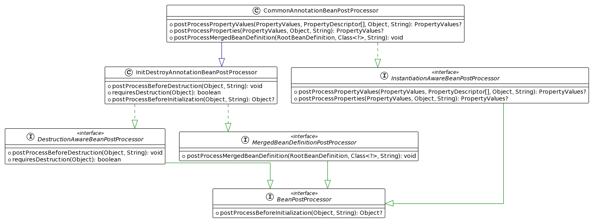
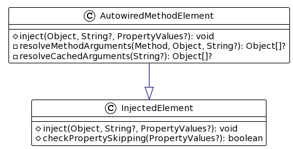

# 资料

[Spring官方文档](https://docs.spring.io/spring-framework/docs/current/reference/html/core.html#spring-core)

[示例代码](../source-note-spring)

Spring源码视频(看了P8)：https://www.bilibili.com/video/BV1sd4y1m7e1
# 源码环境搭建

## 本地编译源码配置

`IDEA配置`

> JVM参数不要输出警告信息：--illegal-access=warn --add-opens java.base/java.lang=ALL-UNNAMED


`build.gradle`


`settings.gradle`


`spring-beans.gradle`


## AspectJ Compiler 配置

> AJC官网地址：https://www.eclipse.org/aspectj/downloads.php
>
> 我下载的版本：http://www.eclipse.org/downloads/download.php?file=/tools/aspectj/aspectj-1.9.6.jar
>
> 可以指定的AJC编译器参数：https://www.mojohaus.org/aspectj-maven-plugin/ajc_reference/standard_opts.html
>
> IDEA配置AJC教程：https://www.jetbrains.com/help/idea/2020.3/using-the-aspectj-ajc-compiler.html#controlling_aspectpath

1. 本地安装AJC

`java -jar aspectj-1.9.6.jar`

2. IDEA配置使用AJC

安装插件


配置编译器


需要使用AJC的模块需要指定


## 依赖

`build.gradle` 

```groovy
dependencies {
    // lombok
    annotationProcessor 'org.projectlombok:lombok:1.18.2'
    compileOnly 'org.projectlombok:lombok:1.18.2'
    testAnnotationProcessor 'org.projectlombok:lombok:1.18.2'
    testCompileOnly 'org.projectlombok:lombok:1.18.2'
  
  	// junit5 测试依赖
    testImplementation 'org.junit.jupiter:junit-jupiter-api:5.8.1'
    testRuntimeOnly 'org.junit.jupiter:junit-jupiter-engine:5.8.1'
}
```
# 源码分析

1. [先看懂new一个IOC容器会发生什么](#Spring容器创建的核心流程)，也就是IOC容器的生命周期。重点就看refresh方法做了啥，关注用到了那些类型的对象，回调了类的那些方法。

2. [再看getBean发生了啥](#bean 创建的生命周期)，也就是一个bean的生命周期，也是一样的套路看用到了哪些类型的对象，回调了类的那些方法

3. 根据功能看源码，比如 @EnableAsync ，那就看看这个注解做了啥，原理很简单，一般都是导入特殊的类(比如后置处理器)，类的方法会在 bean的生命周期中被回调，从而实现功能

## [ASM 技术](https://asm.ow2.io/)

> 简单来说，ASM是一个操作Java字节码的类库。
>
> #### 第一个问题，ASM的操作对象是什么呢？
>
> ASM所操作的对象是字节码（ByteCode）数据
>
> #### 第二个问题，ASM是如何处理字节码（ByteCode）数据的？
>
> - ASM处理字节码（ByteCode）的方式是“拆分－修改－合并”
> - ASM处理字节码（ByteCode）数据的思路是这样的：第一步，将.class文件拆分成多个部分；第二步，对某一个部分的信息进行修改；第三步，将多个部分重新组织成一个新的.class文件。
> - 说白了就是文件解析，并不会把这个 .class 文件加载到 JVM 中，就是文件的解析工具

为什么要使用 ASM ?

- 扫描到所有的 class 资源后，要判断该 class 是否作为一个 bean对象（比如标注了@Component 注解），
  如果我们通过反射来判断，那么在 Spring 启动阶段就会加载很多的Class，这势必会浪费系统资源和耗时（因为可能很多的类，是不需要Spring进行管理的）。
## Spring容器创建的核心流程
### 整体生命周期
```java
    /**
 *  `new AnnotationConfigApplicationContext(AppConfig.class)` 会发生什么？？？
 *
 * 1. 执行AnnotationConfigApplicationContext构造器 {@link AnnotationConfigApplicationContext#AnnotationConfigApplicationContext()}
 *      实例化属性reader {@link AnnotatedBeanDefinitionReader#AnnotatedBeanDefinitionReader(BeanDefinitionRegistry)}
 *      reader 属性的构造器里面会注册BeanFactoryPostProcessor {@link AnnotationConfigUtils#registerAnnotationConfigProcessors(BeanDefinitionRegistry)}
 *          默认会注册这五个鬼东西：
 *
 *              1. ConfigurationClassPostProcessor 类型：BeanFactoryPostProcessor
 *                  - 在BeanFactory初始化阶段，会使用该处理器 扫描配置类注册BeanDefinition到IOC容器中
 *
 *              2. CommonAnnotationBeanPostProcessor 类型：BeanPostProcessor
 *                  - 处理@PostConstruct、@PreDestroy 标注的方法回调。处理@Resource 字段、方法的依赖注入
 *
 *              3. AutowiredAnnotationBeanPostProcessor 类型：BeanPostProcessor
 *                  - 处理有 `@Autowired | @Value`  的字段、方法，进行依赖注入
 *                  - `@Autowired` 推断构造器
 *                  - `@Lookup` 标注的方法，记录到BeanDefinition中，在后面实例化bean的时候会创建代理对象
 *
 *              4. EventListenerMethodProcessor 类型：BeanFactoryPostProcessor、SmartInitializingSingleton
 *                  - 作为 BeanFactoryPostProcessor 的功能。会存储IOC容器中所有的 EventListenerFactory 类型的bean，作为处理器的属性
 *                  - 作为 SmartInitializingSingleton 的功能。：用来处理 @EventListener 注解的，会在提前实例化单例bean的流程中 回调该实例的方法
 *                      BeanFactory 的{@link DefaultListableBeanFactory#preInstantiateSingletons()}：
 *                          - 创建所有单例bean。
 *                          - 回调 {@link SmartInitializingSingleton#afterSingletonsInstantiated()}
 *
 *              5. DefaultEventListenerFactory 类型：EventListenerFactory
 *                  就是 EventListenerMethodProcessor 解析 @EventListener 的时候会用这个工厂来创建 ApplicationListener
 *
 *  2. 解析入参,添加到BeanDefinitionMap中 {@link AnnotationConfigApplicationContext#register(Class[])}
 *
 *  3. 刷新IOC容器 {@link AbstractApplicationContext#refresh()}
 *
 *      准备刷新 {@link AbstractApplicationContext#prepareRefresh()}
 *          - 初始化属性
 *          - 为IOC容器设置两个属性：applicationListeners、earlyApplicationEvents
 *
 *      获取并刷新BeanFactory {@link AbstractApplicationContext#obtainFreshBeanFactory()}
 *          - 是 AnnotationConfigApplicationContext 类型的IOC容器，直接返回IOC容器的BeanFactory
 *          - 是 ClassPathXmlApplicationContext 类型的IOC容器，会创建新的BeanFactory，并解析xml 注册BeanDefinition 到BeanFactory中
 *
 *      准备BeanFactory {@link AbstractApplicationContext#prepareBeanFactory(ConfigurableListableBeanFactory)}
 *          - 给BeanFactory 的属性设置值：beanClassLoader、beanExpressionResolver、propertyEditorRegistrars、
 *              ignoredDependencyInterfaces、resolvableDependencies、tempClassLoader
 *          - 往BeanFactory注册 BeanPostProcessor
 *              比如 {@link ApplicationContextAwareProcessor},该处理器是处理bean实现了XxAware接口的 {@link ApplicationContextAwareProcessor#postProcessBeforeInitialization(Object, String)}
 *          - 往BeanFactory注册 单例bean，比如 environment
 *
 *      留给子类的模板方法，入参就是准备好的BeanFactory。 {@link AbstractApplicationContext#postProcessBeanFactory(ConfigurableListableBeanFactory)}
 *
 *      执行BeanFactoryPostProcessor,完成BeanFactory的创建 {@link AbstractApplicationContext#invokeBeanFactoryPostProcessors(ConfigurableListableBeanFactory)}
 *          先执行 {@link BeanDefinitionRegistryPostProcessor#postProcessBeanDefinitionRegistry(BeanDefinitionRegistry)}
 *          这里会使用while循环保证 如果在postProcessBeanDefinitionRegistry 里面注册了BeanDefinitionRegistryPostProcessor也能执行。
 *          然后再执行 {@link BeanFactoryPostProcessor#postProcessBeanFactory(ConfigurableListableBeanFactory)}
 *
 *          注：解析配置类并注册BeanDefinition到BeanFatory中就是在这个环节实现的，通过 {@link ConfigurationClassPostProcessor#postProcessBeanDefinitionRegistry(BeanDefinitionRegistry)}
 *
 *      注册 BeanPostProcessor。 {@link AbstractApplicationContext#registerBeanPostProcessors(ConfigurableListableBeanFactory)}
 *          其实就是 获取 BeanFactory 的 BeanDefinitionMap 属性中，从属性中获取 BeanPostProcessor 类型的bean，然后 getBean() 拿到bean对象，
 *          然后添加到 BeanFactory 的beanPostProcessors属性中
 *
 *          注：
 *              - BeanPostProcessor的注册是有序的。优先级：PriorityOrdered 大于 Ordered 大于 nonOrdered 大于 internalPostProcessors(MergedBeanDefinitionPostProcessor类型)
 *              - 最后在添加一个 `beanFactory.addBeanPostProcessor(new ApplicationListenerDetector(applicationContext));`
 *                  ApplicationListenerDetector的作用：
 *                      - 合并BeanDefinition阶段：处理的bean 是 ApplicationListener 类型的，在Map属性记录 bean。key:beanName,value:是否是单例
 *                      - bean初始化后阶段：处理的bean 是 ApplicationListener 类型的，属性Map中的value是true(也就是单例的)，那就将当前bean添加到IOC容器的 applicationEventMulticaster 属性中
 *                          `this.applicationContext.addApplicationListener((ApplicationListener<?>) bean);`
 *                      - bean销毁阶段：从IOC容器的 ApplicationEventMulticaster 属性移除当前 bean
 *
 *      初始化MessageSource,就是往BeanFactory注册国际化资源解析器。 {@link AbstractApplicationContext#initMessageSource()}
 *          -  就是读取国际化资源文件，然后根据属性名获取到资源文件中的属性，支持使用不同的Local获取到不同资源文件的内容，属性信息还支持设置占位符
 *
 *      初始化 ApplicationEventMulticaster，就是往BeanFactory注册事件广播器 {@link AbstractApplicationContext#initApplicationEventMulticaster()}
 *          - 用来发布事件的。其实就是将事件发布到注册到广播器中的ApplicationListener，发布时，若存在父容器，还会将事件传递给父容器
 *
 *      开始刷新，留给子类实现的。{@link AbstractApplicationContext#onRefresh()}
 *          SpringBoot web应用，就是在这里启动的web容器，或者是初始化web容器
 *          注：可以在这里往 {@link AbstractApplicationContext#earlyApplicationEvents} 属性设置值，这样子就可以在下面注册监听器环节发布早期事件，然后对应的
 *              事件监听器就能收到 BeanFactory已经准备好了，可以在事件监听器里面做操作
 *
 *      注册监听器 {@link AbstractApplicationContext#registerListeners()}
 *          - 实例化 BeanFactory 中类型为 ApplicationListener 的bean，然后添加到 BeanFactory 的属性 ApplicationEventMulticaster 中(这个就是在上面穿件的)
 *          - IOC容器的 earlyApplicationEvents 属性不为空，通过 ApplicationEventMulticaster 将时间发布到 ApplicationListener
 *
 *      完成BeanFactory的初始化 {@link AbstractApplicationContext#finishBeanFactoryInitialization(ConfigurableListableBeanFactory)}
 *          - 设置 BeanFactory 的一些属性：conversionService、embeddedValueResolvers
 *              都是在依赖注入时会用到。conversionService是用来做类型转换的，embeddedValueResolvers 是解析 占位符的，比如 @Value("${name}")
 *
 *          - 提前创建 LoadTimeWeaverAware 类型的bean
 *          - 提前实例化单例bean {@link DefaultListableBeanFactory#preInstantiateSingletons()}
 *
 *      完成刷新 {@link AbstractApplicationContext#finishRefresh()}
 *          - 清缓存 {@link DefaultResourceLoader#clearResourceCaches()}
 *          - 初始化LifecycleProcessor，BeanFactory中没有这个bean就注册个默认值，会作为IOC容器的lifecycleProcessor属性 {@link AbstractApplicationContext#initLifecycleProcessor()}
 *          - refresh完成了 传播给 LifecycleProcessor {@link getLifecycleProcessor().onRefresh()}
 *              就是回调 Lifecycle 类型bean的方法
 *
 *          - 发布 ContextRefreshedEvent 事件  {@link AbstractApplicationContext#publishEvent(ApplicationEvent)}
 * */
```
### AnnotationConfigApplicationContext 的实例化

创建IOC容器
```txt
new AnnotationConfigApplicationContext(AppConfig.class)
```
会执行无参构造器
```java
class AnnotationConfigApplicationContext {
  public AnnotationConfigApplicationContext() {
    StartupStep createAnnotatedBeanDefReader = this.getApplicationStartup().start("spring.context.annotated-bean-reader.create");
    /**
     * 读取器，读取class成BeanDefinition然后注册到BeanFactory中，读取的时候会解析 @Lazy、@Primary、DependsOn、@Role、Description 等信息设置到BeanDefinition中
     *
     * 比如 将入参配置类注册到 BeanFactory 中会用到
     *  {@link AnnotationConfigApplicationContext#register(Class[])}
     *      {@link AnnotatedBeanDefinitionReader#doRegisterBean(Class, String, Class[], Supplier, BeanDefinitionCustomizer[])}
     *
     * 实例化时会执行 `AnnotationConfigUtils.registerAnnotationConfigProcessors(this.registry);`
     *  {@link AnnotationConfigUtils#registerAnnotationConfigProcessors(BeanDefinitionRegistry, Object)}
     *      1. 给BeanFactory设置依赖比较器 `beanFactory.setDependencyComparator(AnnotationAwareOrderComparator.INSTANCE);`
     *          - 依赖类型是集合时，会使用这个排序
     *          - 依赖类型不是集合时，会使用这个拿到@Priority排序值，排序值小的就是要注入的
     *
     *      2. 给BeanFactory设置自动注入候选者解析器 `beanFactory.setAutowireCandidateResolver(new ContextAnnotationAutowireCandidateResolver());`
     *          - @Lazy的处理、@Qualifier的处理
     *
     *      3. 注册bean到beanDefinitionMap中：
     *          - ConfigurationClassPostProcessor：用来解析配置类，注册BeanDefinition
     *          - AutowiredAnnotationBeanPostProcessor：处理@Autowired、@Value依赖注入
     *          - CommonAnnotationBeanPostProcessor：处理@Resource依赖注入，@PreDestroy、@PostConstruct方法回调
     *          - PersistenceAnnotationBeanPostProcessor：处理@PersistenceContext、@PersistenceUnit依赖注入的
     *          - EventListenerMethodProcessor：处理方法有@EventListener的bean，使用 EventListenerFactory 将方法构造成 ApplicationListener 注册到事件广播器
     *          - DefaultEventListenerFactory：用来将@EventListener标注的方法解析成ApplicationListener的
     * */
    this.reader = new AnnotatedBeanDefinitionReader(this);
    createAnnotatedBeanDefReader.end();
    /**
     * 扫描器，用来扫描class文件的。
     *
     * 在实例化过程中会解析`META-INF/spring.components`文件，然后在 {@link ClassPathScanningCandidateComponentProvider#findCandidateComponents(String)} 会根据索引文件是否有内容
     * 从而决定是索引扫描还是包扫描
     *
     * `CandidateComponentsIndexLoader.loadIndex(this.resourcePatternResolver.getClassLoader());`
     * */
    this.scanner = new ClassPathBeanDefinitionScanner(this);
  }
}
```
### prepareBeanFactory
```java
    /**
 * 准备BeanFactory {@link AbstractApplicationContext#prepareBeanFactory(ConfigurableListableBeanFactory)}
 *
 * 给BeanFactory设置属性值：
 *  - 为我们的bean工厂设置 ResourceEditorRegistrar(登记员)，这个是用来加工 PropertyEditorRegistry，也就是 SimpleTypeConverter，而 SimpleTypeConverter 是进行依赖注入时，对要注入的值进行converter的
 *      `beanFactory.addPropertyEditorRegistrar(new ResourceEditorRegistrar(this, getEnvironment()));`
 *  - 设置忽略依赖接口。在填充bean的时候，会遍历{@link BeanWrapper#getPropertyDescriptors()}，判断不是忽略依赖接口的方法，才会添加到 PropertyValues ，最后会将 PropertyValues 的内容注入到bean中。
 *      因为这些接口是通过 ApplicationContextAwareProcessor 后置处理器注入的
 *      `beanFactory.ignoreDependencyInterface`
 *  - 注册可解决的依赖。在依赖注入时会从 BeanDefinitionMap 和 {@link DefaultListableBeanFactory#resolvableDependencies} 属性中找到类型匹配的bean
 *      `beanFactory.registerResolvableDependency`
 *  - 注册单例bean，注意这不是注册到BeanDefinitionMap的，而是直接设置到单例池中(也就是不会执行bean创建的生命周期)。
 *      通过这种方式注册的bean，在BeanDefinitionMap是不记录的，是存在这个属性中 {@link DefaultListableBeanFactory#manualSingletonNames}
 *      在依赖注入的解析环节，会从BeanFactory的 BeanDefinitionMap和manualSingletonNames 中查询匹配依赖类型的bean {@link DefaultListableBeanFactory#doGetBeanNamesForType(ResolvableType, boolean, boolean)}
 *      `beanFactory.registerSingleton`
 *
 * 给BeanFactory添加BeanPostProcessor：
 *  - ApplicationContextAwareProcessor: 会在bean的`postProcessBeforeInitialization`阶段回调XxAware接口的方法
 *  - ApplicationListenerDetector: 会在bean的`postProcessAfterInitialization`阶段，将ApplicationListener类型的bean，添加到事件广播器中
 *  - LoadTimeWeaverAwareProcessor: 会在bean的`postProcessBeforeInitialization`阶段，将LoadTimeWeaver注入到目标bean。
 *      注： LoadTimeWeaver 是 Instrumentation 的装饰器，而 Instrumentation 可以理解成JVM实例的映射，可往其添加 ClassFileTransformer 拦截Class的加载，从而
 *          实现AspectJ加载器织入
 *
 * */
```
### AbstractApplicationContext#finishRefresh

```java
    /**
 * {@link AbstractApplicationContext#refresh()}
 * {@link AbstractApplicationContext#finishRefresh()}
 *
 *  1. 初始化 LifecycleProcessor。其实就是将BeanFactory中的LifecycleProcessor 设置成 IOC容器的属性，设置这个属性的目的，是将bean的生命周期和IOC容器的生命周期做关联。
 *      `initLifecycleProcessor();`
 *      注：如果BeanFactory中没有设置LifecycleProcessor，那么会实例化一个 `new DefaultLifecycleProcessor()` 然后设置到BeanFactory中
 *
 *  2. 触发 LifecycleProcessor 的刷新
 *      `getLifecycleProcessor().onRefresh();`
 *
 *  3. 发布 ContextRefreshedEvent 事件
 *      `publishEvent(new ContextRefreshedEvent(this));`
 *      Tips：其实就是回调BeanFactory中的 ApplicationListener 类型的bean 和 @EventListener 标注的方法
 *
 * {@link DefaultLifecycleProcessor#onRefresh()}
 *      1. 拿到容器中 Lifecycle 类型的bean
 *          `Map<String, Lifecycle> lifecycleBeans = getLifecycleBeans();`
 *
 *      2. 遍历 lifecycleBeans 过滤是autoStartup的，按照phase分组收集
 *           int phase = (bean instanceof Phased ? ((Phased) bean).getPhase() : 0);
 *
 *          Tips: SmartLifecycle 实现了 Phased，而 Lifecycle 没有实现
 *
 *      3. 收集结果按照 phase 的值升序排序，遍历，执行 `doStart`
 *          3.1 拿到这个bean的依赖项
 *              `String[] dependenciesForBean = getBeanFactory().getDependenciesForBean(beanName);`
 *          3.2 优先启动依赖项
 *              `doStart(lifecycleBeans, dependency, autoStartupOnly);`
 *
 *              Tips: 比如 使用 @Autowired注入的bean 和 使用@DependsOn("bean") 都属于依赖项
 *
 *          3.3 回调 start 方法
 *              `((Lifecycle)bean).start();`
 *              注：为了避免重复启动，这里只有是 !bean.isRunning() 才会回调 start方法
 *
 *      注：onRefresh 只会启动 SmartLifecycle#isAutoStartup 为true的bean，说白了就是回调 Lifecycle#start 方法。回调是有优先级的，按照 phase 升序的顺序
 * */
```

## BeanFactoryPostProcessor


特点：只会在 IOC 生命周期中 执行一次。就是一个bean工厂执行一次

```java
    /**
 * 有两个接口可用：
 *
 * - {@link BeanDefinitionRegistryPostProcessor#postProcessBeanDefinitionRegistry(BeanDefinitionRegistry)}
 *     - 可用来修改和注册 BeanDefinition（Spring的注解开发 就是通过 ConfigurationClassPostProcessor 来解析配置类注册beanDefinition的）
 *     - 可以在这里面套娃注册 BeanDefinitionRegistryPostProcessor，也可以注册 BeanFactoryPostProcessor。因为底层是使用 while 循环来处理
 *
 * - {@link BeanFactoryPostProcessor#postProcessBeanFactory(ConfigurableListableBeanFactory)}
 *     - 此时的参数就是beanFactory，可以注册修改BeanDefinition或者创建Bean
 *     - 可以在这里创建bean 来实现提前创建的目的，但是会破坏bean的生命周期，因为此时BeanFactory还没有设置BeanPostProcessor属性，所以此时使用BeanFactory创建的bean是不会被后置处理器所处理的
 *     - 在这里注册 BeanDefinitionRegistryPostProcessor、BeanFactoryPostProcessor 是没有用的，不会作为BeanFactory的后置处理器被回调方法
 * */

```
## ConfigurationClassPostProcessor

> Spring注解开发就是靠这个类来实现的

### 示例代码

```java
@Configuration
@Lazy
public class FullConfigClassTest {
    public static class A {
    }

    public void test() {
        System.out.println("a2()--->" + a2());
        System.out.println("a2()--->" + a2());

        System.out.println("a3()--->" + a3());
        System.out.println("a3()--->" + a3());

        System.out.println("a4()--->" + a4());
        System.out.println("a4()--->" + a4());
    }

    public static void main(String[] args) {
        System.setProperty(org.springframework.cglib.core.DebuggingClassWriter.DEBUG_LOCATION_PROPERTY, "/Users/haitao/Desktop/xx");
        AnnotationConfigApplicationContext context = new AnnotationConfigApplicationContext(FullConfigClassTest.class);
        //        context.getBean(FullConfigClassTest.class).test();
        System.out.println("====");
        context.getBean("a");
    }

    @Bean
    public A a() {
        System.out.print("a1()--->");
        printHitIntercept();

        System.out.print("a2()--->");
        this.a2();
        System.out.print("a22()--->");
        this.a2();

        System.out.print("a3()--->");
        a3();
        System.out.print("a4()--->");
        a4();
        return new A();
    }

    @Bean
    //    @Scope("prototype")
    public A a2() {
        printHitIntercept();
        return new A();
    }

    public A a3() {
        printHitIntercept();
        return new A();
    }

    @Bean
    public static A a4() {
        printHitIntercept();
        return new A();
    }

    private static void printHitIntercept() {
        System.out.println(Arrays.stream(Thread.currentThread().getStackTrace())
                .map(StackTraceElement::getMethodName)
                .filter(item -> item.contains("intercept"))
                .collect(Collectors.toList()));
    }


}
```

### 类图

```java
/**
 * ConfigurationClassPostProcessor
 *
 * BeanFactory执行阶段：修改、注册BeanDefinition阶段 -> 处理BeanFactory阶段
 *
 * 修改、注册BeanDefinition阶段 {@link ConfigurationClassPostProcessor#postProcessBeanDefinitionRegistry(BeanDefinitionRegistry)}
 *      解析JavaConfig注册解析出来的BeanDefinition 到 BeanDefinitionMap中
 *
 *
 * 处理BeanFactory阶段 {@link ConfigurationClassPostProcessor#postProcessBeanFactory(ConfigurableListableBeanFactory)}
 *      - 增强配置类class {@link ConfigurationClassPostProcessor#enhanceConfigurationClasses(ConfigurableListableBeanFactory)}
 *      - 注册 ImportAwareBeanPostProcessor 到BeanFactory中
 * */
```

在`postProcessBeanFactory`阶段会注册[ImportAwareBeanPostProcessor](#ImportAwareBeanPostProcessor)到容器中


### 细说`ConfigurationClassPostProcessor#postProcessBeanDefinitionRegistry`
> 这就是配置类解析原理咯
>
> 配置类是通过 [ClassPathBeanDefinitionScanner](#ClassPathBeanDefinitionScanner) 解析、注册到BeanDefinitionMap中的，
>
> 而`ConfigurationClassPostProcessor`是在实例化`AnnotationConfigApplicationContext`的时候设置到BeanFactory中的
>
> 因为`ConfigurationClassPostProcessor`实现了`BeanDefinitionRegistryPostProcessor`接口，所以万恶之源应该从`postProcessBeanDefinitionRegistry`方法开始看

```java
    /**
 * 1. BeanDefinitionRegistryPostProcessor 回调
 * {@link org.springframework.context.annotation.ConfigurationClassPostProcessor#postProcessBeanDefinitionRegistry(BeanDefinitionRegistry)}
 *
 * 2. 处理方法
 * {@link org.springframework.context.annotation.ConfigurationClassPostProcessor#processConfigBeanDefinitions(BeanDefinitionRegistry)}
 *
 * 3. 遍历此时BeanFactory中注册的bean是否是配置类。比如 new ApplicationContext入参传入的Class 
 *       什么才是配置类？{@link org.springframework.context.annotation.ConfigurationClassUtils#checkConfigurationClassCandidate(BeanDefinition, MetadataReaderFactory)}
 *       有 @Configuration(proxyBeanMethods=true) full配置类
 *       有 @Configuration(proxyBeanMethods=false) lite配置类
 *       无 @Configuration 但是有  (@Component || @ComponentScan || @Import || @ImportResource || @Bean ) lite配置类
 *       都不满足就不是配置类
 *
 *       将配置类添加到集合中 --> configCandidates
 *
 * 4. 对 configCandidates 进行升序排序。可通过 @Order 实现排序
 *
 * 5. 创建解析器
 * {@link org.springframework.context.annotation.ConfigurationClassParser#ConfigurationClassParser(org.springframework.core.type.classreading.MetadataReaderFactory, org.springframework.beans.factory.parsing.ProblemReporter, org.springframework.core.env.Environment, org.springframework.core.io.ResourceLoader, org.springframework.beans.factory.support.BeanNameGenerator, org.springframework.beans.factory.support.BeanDefinitionRegistry)}
 *
 * 6. 使用解析器解析 configCandidates。{@link org.springframework.context.annotation.ConfigurationClassParser#parse(java.util.Set)}
 *      注：解析是有序的。先解析完非 @Import(DeferredImportSelector.class) 的配置类，在解析 @Import(DeferredImportSelector.class)
 *
 *      1. 先解析的内容 @Component、@ComponentScans、@ComponentScan、@Bean、@ImportResource、@Import(非实现DeferredImportSelector.class)
 *          {@link org.springframework.context.annotation.ConfigurationClassParser#processConfigurationClass(org.springframework.context.annotation.ConfigurationClass, java.util.function.Predicate)}
 *          为了处理配置类的父类是配置类的情况，采用 do...while 递归解析 保证所有的内容都能解析完
 *              {@link org.springframework.context.annotation.ConfigurationClassParser#doProcessConfigurationClass(org.springframework.context.annotation.ConfigurationClass, org.springframework.context.annotation.ConfigurationClassParser.SourceClass, java.util.function.Predicate)}
 *                  1. 有@Component 注解，解析成员内部类信息 {@link org.springframework.context.annotation.ConfigurationClassParser#processMemberClasses(org.springframework.context.annotation.ConfigurationClass, org.springframework.context.annotation.ConfigurationClassParser.SourceClass, java.util.function.Predicate)}
 *
 *                  2. 解析 @PropertySource。
 *                      就是将注解对应的资源文件 构造成 PropertySource 类型的对象，并将对象存到 {@link AbstractEnvironment#propertySources} 属性中，
 *                      使用 `context.getEnvironment().getProperty("name")` 就能读到 资源文件 中定义的内容了。
 *
 *                  3. 对 @ComponentScans、@ComponentScan 解析。
 *                      实例化 Scanner，默认会添加对@Component 解析的 includeFilter {@link ClassPathBeanDefinitionScanner#ClassPathBeanDefinitionScanner(BeanDefinitionRegistry, boolean, Environment, ResourceLoader)}
 *                      {@link org.springframework.context.annotation.ComponentScanAnnotationParser#parse(org.springframework.core.annotation.AnnotationAttributes, java.lang.String)}
 *                      {@link org.springframework.context.annotation.ClassPathBeanDefinitionScanner#doScan(java.lang.String...)}
 *                      3.1 excludeFilter + includeFilter + @Conditional 的校验 {@link org.springframework.context.annotation.ClassPathScanningCandidateComponentProvider#isCandidateComponent(org.springframework.core.type.classreading.MetadataReader)}
 *                          注：
 *                      3.2 设置BeanDefinition信息：beanName、@Autowired、@Lazy、@Primary、@DependsOn、@Role、@Description
 *                      3.3 校验是否可以注册到BeanDefinitionMap中 {@link org.springframework.context.annotation.ClassPathBeanDefinitionScanner#checkCandidate(java.lang.String, org.springframework.beans.factory.config.BeanDefinition)}
 *                      3.4 注册 BeanDefinition 到 IOC 容器中{@link ClassPathBeanDefinitionScanner#registerBeanDefinition(BeanDefinitionHolder, BeanDefinitionRegistry)}
 *                      注：这部分已经将扫描到的bean注册到BeanFactory中了
 *
 *                  4. 解析 @Import
 *                      {@link ConfigurationClassParser#processImports(ConfigurationClass, ConfigurationClassParser.SourceClass, Collection, Predicate, boolean)}
 *                      4.1 查找当前处理的类上面的注解，会遍历注解上的注解，拿到@Import，收集成 List<@Import>，然后遍历所有 @Import的值
 *
 *                      4.2 值是 ImportSelector 类型的
 *                          - 是 selector instanceof DeferredImportSelector 类型的，存到parser中，
 *                              this.deferredImportSelectorHandler.handle(configClass, (DeferredImportSelector) selector);
 *
 *                          - else 。回调接口方法，然后使用方法的返回值递归执行当前方法
 *                              String[] importClassNames = selector.selectImports(currentSourceClass.getMetadata());
 *                              processImports(configClass, currentSourceClass, importSourceClasses, exclusionFilter, false);
 *
 *                      4.3 值是 ImportBeanDefinitionRegistrar 类型的。记录到configClass中
 *                          configClass.addImportBeanDefinitionRegistrar(registrar, currentSourceClass.getMetadata());
 *
 *                      4.4 其他情况，当做配置类进行解析，也就是重复步骤1
 *                          processConfigurationClass(candidate.asConfigClass(configClass), exclusionFilter);
 *
 *                      注：所以说使用@Import导入的值，都会当成一个配置类进行解析
 *
 *                  5. 记录下 @ImportResource ,记录到configClass中
 *                      configClass.addImportedResource(resolvedResource, readerClass);
 *
 *                  6. 记录下 @Bean 的方法,记录到configClass中
 *                      configClass.addBeanMethod(new BeanMethod(methodMetadata, configClass));
 *
 *                  Tips：解析的结果记录到 configClass 说明是处理了，解析的结果记录到parser说明还未处理。
 *
 *      2. 后解析的内容 @Import(DeferredImportSelector.class)，就是解析4.2步骤设置的值
 *          {@link org.springframework.context.annotation.ConfigurationClassParser.DeferredImportSelectorHandler#process()}
 *          其实就是回调接口的方法，将接口的方法，遍历返回值回调 步骤4
 *
 *      解析完的结果就是 Set<ConfigurationClass> configurationClasses
 *
 * 7. 遍历 configurationClasses，将解析完的配置内容 定义成 BeanDefinition 注册到 BeanDefinitionMap中
 *      {@link org.springframework.context.annotation.ConfigurationClassBeanDefinitionReader#loadBeanDefinitions(java.util.Set)}
 *      {@link org.springframework.context.annotation.ConfigurationClassBeanDefinitionReader#loadBeanDefinitionsForConfigurationClass(org.springframework.context.annotation.ConfigurationClass, org.springframework.context.annotation.ConfigurationClassBeanDefinitionReader.TrackedConditionEvaluator)}
 *          1. 注册 @Import(非BeanDefinitionRegistry.class) 导入的类
 *              {@link ConfigurationClassBeanDefinitionReader#registerBeanDefinitionForImportedConfigurationClass(ConfigurationClass)}
 *          2. 注册 @Bean
 *              {@link ConfigurationClassBeanDefinitionReader#loadBeanDefinitionsForBeanMethod(BeanMethod)}
 *          3. 解析 @ImportResource 的值，解析的过程就会将spring.xml的内容注册到BeanFactory中
 *              {@link ConfigurationClassBeanDefinitionReader#loadBeanDefinitionsFromImportedResources(Map)}
 *          4. 回调 @Import(ImportBeanDefinitionRegistrar.class) 的方法，方法的入参有 BeanDefinitionRegistry，可以使用其注册BeanDefinition
 *              {@link ConfigurationClassBeanDefinitionReader#loadBeanDefinitionsFromRegistrars(Map)}
 * */
```
### 细说`ConfigurationClassPostProcessor#enhanceConfigurationClasses`
> 这里就是区别 full配置类 和 lite配置类的地方了。如果是full配置类会使用Cglib生成代理类，然后将代理类覆盖掉原来BeanDefinition记录的beanClass
```java
/**
 * 强配置类class {@link ConfigurationClassPostProcessor#enhanceConfigurationClasses(ConfigurableListableBeanFactory)}
 *      1. 遍历所有的 full配置类，使用cglib生成代理类的class
 *      2. 使用cglib生成代理类 `Class<?> enhancedClass = enhancer.enhance(configClass, this.beanClassLoader);`
 *          CallbackFilter是ConditionalCallbackFilter
 *              逻辑很简单
 *                  - 是@Bean标注的方法，生成的字节码使用的callback是 BeanMethodInterceptor
 *                  - 方法是 setBeanFactory，生成的字节码使用的callback是 BeanFactoryAwareMethodInterceptor
 *
 *          Callback是 {@link ConfigurationClassEnhancer#CALLBACKS}
 *               BeanMethodInterceptor
 *               BeanFactoryAwareMethodInterceptor
 *          Tips：所以要想知道full配置类中的@Bean的方法，是如果实现的得看 {@link ConfigurationClassEnhancer.BeanMethodInterceptor#intercept(Object, Method, Object[], MethodProxy)}
 *
 *      3. 将cglib生成的class 设置到BeanDefinition中 `beanDef.setBeanClass(enhancedClass);`
 * */
```
### 细说`BeanMethodInterceptor#intercept`
```java
    /**
 * {@link ConfigurationClassEnhancer.BeanMethodInterceptor#intercept(Object, Method, Object[], MethodProxy)}
 *      1. 推断出@Bean方法的beanName的值：有@Bean就返回其属性值，是数组只会返回第一个  没设置就使用  方法名
 *      2. 是 BeanFactory 类型的bean，就创建代理类，只代理 getObject方法
 *          Tips：是使用JDk代理，拦截{@link FactoryBean#getObject()}方法
 *      3. isCurrentlyInvokedFactoryMethod 是true就直接`super.method`,也就是执行被代理类的方法
 *          是通过ThreadLocal来记录当前调用的方法，当循环调用@Bean 方法时，第一次是代理对象方法，再调第二次就是执行的父类方法(也就是被代理类的方法)
 *          return bean;
 *
 *      4. 不满足 isCurrentlyInvokedFactoryMethod ，解析bean引用
 *          说白了就是从BeanFactory找Bean，找不到就会实例化bean，实例化的时候就会往ThreadLocal记录一下，
 *          然后再执行代理对象的方法进行实例化，也就是会回调到当前方法 {@link BeanMethodInterceptor#intercept(Object, Method, Object[], MethodProxy)}
 *          因为实例化的时候记录了当前方法，所以回调当前方法就会满足 isCurrentlyInvokedFactoryMethod 条件，所以就是 super.method 进行实例化
 *          return bean;
 * */
```
## BeanPostProcessor

### 各种BeanPostProcessor子类的特点


特点：每个bean的生命周期中都会执行一次。实例化前、构造器初始化、实例化后、属性填充前、初始化前、初始化后
```java
    /**
 * 核心的接口类型：
 *  1. SmartInstantiationAwareBeanPostProcessor
 *  2. MergedBeanDefinitionPostProcessor
 *  3. InstantiationAwareBeanPostProcessor
 *  4. BeanPostProcessor
 *  5. DestructionAwareBeanPostProcessor
 *
 * 四处地方可以将对象加工厂代理对象：
 *  1. SmartInstantiationAwareBeanPostProcessor#getEarlyBeanReference
 *  2. InstantiationAwareBeanPostProcessor#postProcessBeforeInstantiation
 *      - 在这里为bean创建代理对象，不会出现循环依赖时，因为该方法返回值不为null，就直接return，不会进行依赖注入，也就不会出现循环依赖导致bean不一致的的错误问题
 *  3. BeanPostProcessor#postProcessBeforeInitialization
 *  4. BeanPostProcessor#postProcessAfterInitialization
 *
 *  每个 BeanPostProcessor 回调方法的作用：
 *     提前AOP
 *          {@link org.springframework.beans.factory.config.SmartInstantiationAwareBeanPostProcessor#getEarlyBeanReference(java.lang.Object, java.lang.String)}
 *
 *     实例化前。如果该方法返回值不为null，才会执行后面的步骤 {@link InstantiationAwareBeanPostProcessor#postProcessAfterInstantiation(Object, String)}，然后直接返回该对象。不在执行bean生命周期的构造器初始化、属性填充、初始化操作）
 *          {@link org.springframework.beans.factory.config.InstantiationAwareBeanPostProcessor#postProcessBeforeInstantiation(java.lang.Class, java.lang.String)}
 *
 *     构造器初始化。如果返回值不为null，就会使用返回的构造器进行实例化
 *          {@link org.springframework.beans.factory.config.SmartInstantiationAwareBeanPostProcessor#determineCandidateConstructors(java.lang.Class, java.lang.String)}
 *
 *     合并beanDefinition。这里可以拿到BeanDefinition
 *          {@link org.springframework.beans.factory.support.MergedBeanDefinitionPostProcessor#postProcessMergedBeanDefinition(org.springframework.beans.factory.support.RootBeanDefinition, java.lang.Class, java.lang.String)}
 *          注：紧接着会将提前aop的回调函数存到 三级缓存中，被代理对象就是上面刚刚实例化创建出来的对象
 *
 *     实例化后。可以拿到构造器初始化后的对象
 *          {@link org.springframework.beans.factory.config.InstantiationAwareBeanPostProcessor#postProcessAfterInstantiation(java.lang.Object, java.lang.String)}
 *
 *     属性注入。PropertyValues
 *          {@link org.springframework.beans.factory.config.InstantiationAwareBeanPostProcessor#postProcessProperties(org.springframework.beans.PropertyValues, java.lang.Object, java.lang.String)}
 *
 *     属性注入。PropertyValues（过时方法）
 *          {@link org.springframework.beans.factory.config.InstantiationAwareBeanPostProcessor#postProcessPropertyValues(org.springframework.beans.PropertyValues, java.beans.PropertyDescriptor[], java.lang.Object, java.lang.String)}
 *
 *     初始化前。此时的bean已经完成了属性注入、Wrapper注入，还未执行初始化方法(org.springframework.beans.factory.InitializingBean#afterPropertiesSet())
 *          {@link org.springframework.beans.factory.config.BeanPostProcessor#postProcessBeforeInitialization(java.lang.Object, java.lang.String)}
 *
 *     初始化后。这是bean生命周期的最后一个环节了
 *          {@link org.springframework.beans.factory.config.BeanPostProcessor#postProcessAfterInitialization(java.lang.Object, java.lang.String)}
 *
 *     销毁bean的回调
 *          {@link org.springframework.beans.factory.config.DestructionAwareBeanPostProcessor#requiresDestruction(java.lang.Object)}
 * */
```

### bean生命周期中执行BeanPostProcessor的时机

```java
/** 
 * 万恶的源头 {@link AbstractAutowireCapableBeanFactory#doCreateBean(String, RootBeanDefinition, Object[])}
 * 
 * 1. 实例化前 {@link InstantiationAwareBeanPostProcessor#postProcessBeforeInstantiation(Class, String)}
 * 2. 推断构造器 {@link SmartInstantiationAwareBeanPostProcessor#determineCandidateConstructors(Class, String)}
 *      下一步会进行bean的实例化 {@link AbstractAutowireCapableBeanFactory#instantiateBean(String, RootBeanDefinition)}
 *      
 * 3. 合并BeanDefinition信息 {@link MergedBeanDefinitionPostProcessor#postProcessMergedBeanDefinition(RootBeanDefinition, Class, String)}
 * 4. 添加提前aop回调到三级缓存{@link SmartInstantiationAwareBeanPostProcessor#getEarlyBeanReference(Object, String)}
 *      通过lambda创建匿名内部类，将提前aop的回调方式存到三级缓存中。第一个参数就是上面刚刚实例化出来的bean对象  
 *      `addSingletonFactory(beanName, () -> getEarlyBeanReference(beanName, mbd, bean));`
 *      
 * 5. 实例化后 {@link InstantiationAwareBeanPostProcessor#postProcessAfterInstantiation(Object, String)}
 *      这里返回值是boolean，如果返回false  那么将不会执行下面的属性注入流程
 *      
 * 6. 解析要注入的属性值 {@link InstantiationAwareBeanPostProcessor#postProcessProperties(PropertyValues, Object, String)}
 * 7. 解析要注入的属性值(过时方法){@link InstantiationAwareBeanPostProcessor#postProcessPropertyValues(PropertyValues, PropertyDescriptor[], Object, String)}
 *      然后就是将解析的属性值，注入到bean对象中 {@link AbstractAutowireCapableBeanFactory#applyPropertyValues(String, BeanDefinition, BeanWrapper, PropertyValues)}
 *      
 * 8. 初始化前 {@link BeanPostProcessor#postProcessBeforeInitialization(Object, String)}
 *      此时已经完成了bean的实例化、属性注入、XxAware接口的回调
 *      
 * 9. 初始化后 {@link BeanPostProcessor#postProcessAfterInitialization(Object, String)}
 *      此时完成 初始化方法的回调。afterPropertiesSet
 *      
 * 10. 销毁bean的时候回调 {@link DestructionAwareBeanPostProcessor#requiresDestruction(Object)}
 * */
```
### ApplicationListenerDetector

```java
/**
 * ApplicationListenerDetector
 * 
 * BeanPostProcessor执行过程：实例化前后置->推断构造器后置->实例化bean->合并BeanDefinition后置(hit)->实例化后后置->属性注入后置->初始化前后置(hit)->初始化后后置->销毁前后置(hit)
 * 
 * 合并BeanDefinition {@link ApplicationListenerDetector#postProcessMergedBeanDefinition(RootBeanDefinition, Class, String)}
 *      记录 ApplicationListener 类型的bean 在 {@link ApplicationListenerDetector#singletonNames} 属性中
 *
 * 初始化后 {@link ApplicationListenerDetector#postProcessAfterInitialization(Object, String)}
 *      遍历属性`singletonNames` 是单例bean就注册到事件广播器中 `this.applicationContext.addApplicationListener((ApplicationListener<?>) bean);`
 *
 * 销毁阶段 {@link ApplicationListenerDetector#postProcessBeforeDestruction(Object, String)}
 *      销毁的bean是 ApplicationListener 类型，就从事件广播器中移除
 * */
```
### ImportAwareBeanPostProcessor

```java
/**
 * ImportAwareBeanPostProcessor
 *
 * BeanPostProcessor执行过程：实例化前后置->推断构造器后置->实例化bean->合并BeanDefinition后置->实例化后后置->属性注入后置(hit)->初始化前后置(hit)->初始化后后置->销毁前后置
 *
 * 属性注入后置 {@link ConfigurationClassPostProcessor.ImportAwareBeanPostProcessor#postProcessProperties(PropertyValues, Object, String)}
 *      给 EnhancedConfiguration 类型的bean注入 beanFactory 属性值
 *      注：full配置类生成的代理类 就是实现了 EnhancedConfiguration 接口，所以这里的目的是为了给full配置类的代理类设置属性
 *
 * 初始化前后置 {@link ConfigurationClassPostProcessor.ImportAwareBeanPostProcessor#postProcessBeforeInitialization(Object, String)}
 *      给 ImportAware 类型的bean注入注解元数据。
 *
 *      Tips：注意只有当前bean是通过@Import导入的才会有元数据，比如下面的代码 bean是A，然后其元数据其实是Config这个类的元数据,
 *      因为解析@Import是会递归判断配置类的注解上是否有@Import，找到就记录配置类作为@Import的元数据
 *
 *      @Import(A.class)
 *      @interface MyAnnotation{}
 *
 *      @Component
 *      @MyAnnotation
 *      class Config{}
 * */
```
## bean 创建的生命周期

[为什么使用三级缓存？](#为什么使用三级缓存？)

### 整体流程

```java
/** 
 * {@link org.springframework.beans.factory.support.AbstractBeanFactory#getBean(java.lang.String, java.lang.Class, java.lang.Object...)}
 * {@link org.springframework.beans.factory.support.AbstractBeanFactory#doGetBean(java.lang.String, java.lang.Class, java.lang.Object[], boolean)}
 *      循环依赖核心代码：如果bean正在创建 -> 二级缓存获取 -> 三级缓存 对正在创建的bean 进行提前AOP 然后返回
 *      {@link org.springframework.beans.factory.support.DefaultSingletonBeanRegistry#getSingleton(java.lang.String)}
 * {@link org.springframework.beans.factory.support.AbstractAutowireCapableBeanFactory#createBean(java.lang.String, org.springframework.beans.factory.support.RootBeanDefinition, java.lang.Object[])}
 * {@link org.springframework.beans.factory.support.AbstractAutowireCapableBeanFactory#doCreateBean(java.lang.String, org.springframework.beans.factory.support.RootBeanDefinition, java.lang.Object[])}
 *      {@link org.springframework.beans.factory.support.AbstractAutowireCapableBeanFactory#createBeanInstance(java.lang.String, org.springframework.beans.factory.support.RootBeanDefinition, java.lang.Object[])}
 *      {@link org.springframework.beans.factory.support.AbstractAutowireCapableBeanFactory#populateBean(java.lang.String, org.springframework.beans.factory.support.RootBeanDefinition, org.springframework.beans.BeanWrapper)}
 *      {@link org.springframework.beans.factory.support.AbstractAutowireCapableBeanFactory#initializeBean(java.lang.String, java.lang.Object, org.springframework.beans.factory.support.RootBeanDefinition)}
 * 
 * */

```

### 细说各个环节

1. 所有的bean 都是通过 `getBean()` 来创建的

```java
/**
 *
 * {@link AbstractApplicationContext#refresh()}
 * {@link AbstractApplicationContext#finishBeanFactoryInitialization(ConfigurableListableBeanFactory)}
 * {@link DefaultListableBeanFactory#preInstantiateSingletons()}
 *  1. 先完成单例bean的实例化, 遍历 beanDefinitionNames
 *      - 不是抽象的 && 是单例的 && 不是懒加载的
 *      - 是不是 FactoryBean :
 *          - 是：
 *              - 创建 FactoryBean 实例
 *              - 判断 是否立即初始化 FactoryBean#getObject 返回的bean
 *          - 不是：
 *              getBean(beanName);
 *              {@link AbstractBeanFactory#getBean(String)}
 *
 *          注：创建bean 都是执行 getBean
 *
 *
 *  2. 单例bean实例化后，遍历 beanDefinitionNames
 *      - 是 SmartInitializingSingleton 类型的bean，回调 {@link SmartInitializingSingleton#afterSingletonsInstantiated() }
 *
 * */
```

2. `getBean()` 流程

```java
/**
 * {@link AbstractBeanFactory#doGetBean(String, Class, Object[], boolean)}
 * 根据beanName 从单例池获取bean
 *  是否存在
 *      存在：
 *          - beanName 是 &开头的 直接返回
 *          - 不是 &开头，获取的 bean 不是 FactoryBean 的实例 直接返回
 *          - 不是 &开头，获取的 bean 是 FactoryBean 的实例，那就是要返回 FactoryBean#getObject 返回的bean
 *              1. 从 factoryBeanObjectCache 中获取
 *              2. 缓存中不存在，执行 `FactoryBean#getObject` 存储缓存，然后返回
 *      不存在：
 *          - 当前beanFactory 中不存在 该beanName 的 definition，判断父 beanFactory 是否存在，存在就执行  org.springframework.beans.factory.BeanFactory#getBean(java.lang.String)
 *          - 获取该bean 所有的 dependsOn 的值，遍历执行 org.springframework.beans.factory.support.AbstractBeanFactory#getBean(java.lang.String)
 *          - 是单例bean
 *               {@link org.springframework.beans.factory.support.DefaultSingletonBeanRegistry#getSingleton(java.lang.String, org.springframework.beans.factory.ObjectFactory)}
 *          - 是多例bean
 *               {@link org.springframework.beans.factory.support.AbstractBeanFactory#createBean(java.lang.String, org.springframework.beans.factory.support.RootBeanDefinition, java.lang.Object[])}
 *          - 其他bean（web应用的：request域、session域、application域）
 *               {@link org.springframework.beans.factory.config.Scope#get(java.lang.String, org.springframework.beans.factory.ObjectFactory)}
 * */
```

3. `DefaultSingletonBeanRegistry#getSingleton` 流程

```java
/**
 * DefaultSingletonBeanRegistry#getSingleton
 * 1. 从单例缓存池中获取不到 bean `this.singletonObjects.get(beanName);`
 *  - 单例池获取 -> 二级缓存获取 -> 三级缓存获取，执行缓存里的ObjectFactory 进行提前AOP
 *  - 提前AOP，【第一次】执行beanPostProcessor
 * @see org.springframework.beans.factory.config.SmartInstantiationAwareBeanPostProcessor#getEarlyBeanReference(java.lang.Object, java.lang.String)
 * 2. 标记当前bean 正在创建（用来解决循环依赖）`this.singletonsCurrentlyInCreation.add(beanName)`
 * 3. 创建bean 
 *  @see AbstractAutowireCapableBeanFactory#createBean(String, RootBeanDefinition, Object[])
 * 4. 删除标记 `this.singletonsCurrentlyInCreation.remove(beanName)`
 * 5. 将bean 放入单例池
 *  @see DefaultSingletonBeanRegistry#addSingleton(String, Object)
 *  1. 加入到单例缓存池中
 *  2. 从三级缓存中移除
 *  3. 从二级缓存中移除
 * */
```

4. `AbstractAutowireCapableBeanFactory#createBean` 可以通过后置处理器，快速返回，不要执行bean创建的生命周期

```java
/**
 * @see AbstractAutowireCapableBeanFactory#createBean(String, RootBeanDefinition, Object[])
 * 1. 【第二次】执行beanPostProcessor 可以实现 不执行后面 bean的构造器、属性注入、初始化流程（简而言之可以拦截bean的创建过程）
 *  - 返回值是否为null:
 *      为null：继续走 bean 的生命周期流程
 *      不为null：执行beanPostProcessor，执行bean的初始化后动作（AOP和注解事务是在 `postProcessAfterInitialization` 实现的）
 *          @see org.springframework.beans.factory.config.BeanPostProcessor#postProcessAfterInitialization(java.lang.Object, java.lang.String)
 * @see org.springframework.beans.factory.config.InstantiationAwareBeanPostProcessor#postProcessBeforeInstantiation(java.lang.Class, java.lang.String)
 * 2. 真正开始创建bean了，返回创建结果(这里才是bean的核心生命周期流程) 
 * @see org.springframework.beans.factory.support.AbstractAutowireCapableBeanFactory#doCreateBean(java.lang.String, org.springframework.beans.factory.support.RootBeanDefinition, java.lang.Object[])
 * */
```

5. `AbstractAutowireCapableBeanFactory#doCreateBean` bean创建的生命周期

```java
/**
 * 1. 构造器初始化
 *  @see AbstractAutowireCapableBeanFactory#createBeanInstance(String, RootBeanDefinition, Object[])
 *  【第三次】执行beanPostProcessor，返回构造器
 *      @see SmartInstantiationAwareBeanPostProcessor#determineCandidateConstructors(Class, String)
 * 2. 【第四次】执行beanPostProcessor, 对 @Autowired @Value的注解的预解析
 *  @see MergedBeanDefinitionPostProcessor#postProcessMergedBeanDefinition(RootBeanDefinition, Class, String)
 *  3. 满足（是单例bean && 允许循环引用 && 当前bean在真正创建bean集合中）往三级缓存中，记录 当前实例化的bean 的 提前AOP 操作
 * @see DefaultSingletonBeanRegistry#addSingletonFactory(String, ObjectFactory)
 *      - 参数 ObjectFactory
 *          @see AbstractAutowireCapableBeanFactory#getEarlyBeanReference(String, RootBeanDefinition, Object)
 *          - `getEarlyBeanReference` 里面其实是提前AOP的操作，说白了就是执行beanPostProcessor
 *              @see SmartInstantiationAwareBeanPostProcessor#getEarlyBeanReference(Object, String)
 *  4. 属性注入
 * @see AbstractAutowireCapableBeanFactory#populateBean(String, RootBeanDefinition, BeanWrapper)
 *      1. 【第五次】执行beanPostProcessor, 停止属性注入
 *          @see InstantiationAwareBeanPostProcessor#postProcessAfterInstantiation(Object, String)
 *      2. 对属性的值进行解析(会使用 TypeConverter )，存到 `PropertyValues`（注意这里还没有把值设置到bean对象中，只是存到 `PropertyValues`）
 *          @see AutowireCapableBeanFactory#resolveDependency(DependencyDescriptor, String, Set, TypeConverter)
 *      3. 【第六次】执行beanPostProcessor, 也是解析配置的属性值 记录在 `PropertyValues`
 *          @see InstantiationAwareBeanPostProcessor#postProcessProperties(PropertyValues, Object, String)
 *      4. 【第七次】执行beanPostProcessor，也是解析配置的属性值 记录在 `PropertyValues`
 *          @see InstantiationAwareBeanPostProcessor#postProcessPropertyValues(PropertyValues, PropertyDescriptor[], Object, String)
 *      5. 如果上面解析的 PropertyValues 不为null，就把 `PropertyValues` 注入到 bean实例中，完成属性注入
 *          @see AbstractAutowireCapableBeanFactory#applyPropertyValues(String, BeanDefinition, BeanWrapper, PropertyValues)
 *  5. 初始化操作
 * @see AbstractAutowireCapableBeanFactory#initializeBean(String, Object, RootBeanDefinition)
 *      1. 完成对 XxxAware 接口的方法回调
 *          @see AbstractAutowireCapableBeanFactory#invokeAwareMethods(String, Object)
 *      2. 【第八次】执行beanPostProcessor, 比如 执行 @PostConstruct 标注的方法
 *          @see BeanPostProcessor#postProcessBeforeInitialization(Object, String)
 *      3. 执行初始化方法, 执行 org.springframework.beans.factory.InitializingBean#afterPropertiesSet()
 *          @see AbstractAutowireCapableBeanFactory#invokeInitMethods(String, Object, RootBeanDefinition)
 *      4. 【第九次】执行beanPostProcessor, @EnableAspectJAutoProxy 、@EnableTransactionManagement 都是在这里完成代理对象的创建的
 *          @see BeanPostProcessor#postProcessAfterInitialization(Object, String)
 *  6. 销毁bean
 *      【第十次】执行beanPostProcessor
 *          @see org.springframework.beans.factory.config.DestructionAwareBeanPostProcessor.requiresDestruction
 * */
```
### 实现bean创建的优先级

```java
/**
 * 如何实现bean创建的优先级：
 * 1. 实现 BeanFactoryPostProcessor（缺点：破坏了bean的生命周期）
 * 2. 重写 cn.haitaoss.javaconfig.ordercreatebean.MySmartInstantiationAwareBeanPostProcessor#postProcessBeforeInstantiation(java.lang.Class, java.lang.String)
 *  这个是 BeanPostProcessor 中最先执行的回调方法，其他的BeanPostProcessor 也可以
 * 3. 重写 onRefresh 方法，通过发布并消费早期事件
 *      cn.haitaoss.javaconfig.applicationlistener.MyAnnotationConfigApplicationContext#onRefresh()
 * 4. 使用 @DependsOn("b")
 */
```

#### 早期事件实现

通过重写 `onRefresh` 发布早期事件，实现bean的提前创建 示例

```java
public class MyAnnotationConfigApplicationContext extends AnnotationConfigApplicationContext {
    public MyAnnotationConfigApplicationContext(Class<?>... componentClasses) {
        super(componentClasses);
    }

    @Override
    protected void onRefresh() throws BeansException {
        publishEvent(new MyApplicationEvent("beanDefinition 全部加载完了，可以自定义bean加载顺序了") {
            @Override
            public Object getSource() {
                return super.getSource();
            }
        });
    }

    public static void main(String[] args) {
        new MyAnnotationConfigApplicationContext(AppConfig.class);
    }
}

```

```java
@Component
public class MyApplicationListener implements ApplicationListener<MyApplicationEvent>, ApplicationContextAware {
    private ApplicationContext applicationContext;

    public MyApplicationListener() {
        System.out.println("MyApplicationListener....");
    }

    @Override
    public void onApplicationEvent(MyApplicationEvent event) {
        System.out.println("event is : " + event);
        System.out.println("编译 提前加载bean的逻辑");

        applicationContext.getBean("testPreCreate3");
    }

    @Override
    public void setApplicationContext(ApplicationContext applicationContext) throws BeansException {
        this.applicationContext = applicationContext;
    }
}

```
#### 后置处理器实现

```java
/**
 * @author haitao.chen
 * email haitaoss@aliyun.com
 * date 2023-02-12 09:53
 * 指定的bean会是最先创建的bean (在 BeanFactoryPostProcesso 、BeanPostProcessor、MessageSource、ApplicationEventMulticaster 之后创建)
 */
@Target(ElementType.TYPE)
@Retention(RetentionPolicy.RUNTIME)
@Import(EarlyCreate.EarlyCreateDeferredImportSelector.class)
public @interface EarlyCreate {
    String[] value() default {};

    class EarlyCreateDeferredImportSelector implements DeferredImportSelector {
        @Override
        public Class<? extends Group> getImportGroup() {
            //            return EarlyCreateGroup.class;
            return DeferredImportSelector.super.getImportGroup();
        }

        @Override
        public String[] selectImports(AnnotationMetadata importingClassMetadata) {
            return new String[]{EarlyCreateBeanPostProcessor.class.getName()};
        }

        @Override
        public Predicate<String> getExclusionFilter() {
            return DeferredImportSelector.super.getExclusionFilter();
        }
    }

    class EarlyCreateBeanPostProcessor implements BeanPostProcessor, BeanFactoryAware, ImportAware {
        private BeanFactory beanFactory;

        @Override
        public void setBeanFactory(BeanFactory beanFactory) throws BeansException {
            this.beanFactory = beanFactory;
        }

        @Override
        public void setImportMetadata(AnnotationMetadata importMetadata) {
            Optional.ofNullable(importMetadata.getAnnotationAttributes(EarlyCreate.class.getName()))
                    .map(map -> map.get("value"))
                    .map(item -> (String[]) item)
                    .ifPresent(beanNames -> Stream.of(beanNames)
                            .forEach(beanFactory::getBean));
        }
    }


    // 会有默认的，没有特殊需求可以不设置
    class EarlyCreateGroup implements DeferredImportSelector.Group {
        @Override
        public void process(AnnotationMetadata metadata, DeferredImportSelector selector) {

        }

        @Override
        public Iterable<Entry> selectImports() {
            return null;
        }
    }

}
```


## 依赖注入原理

 ### @Resource、@Autowired、@Value

 @Resource、@Autowired、@Value 标注字段、方法，则表示需要依赖注入(就是反射给字段设置值、反射执行方法)

 在依赖注入的前提上：

 - 使用@Lazy则表示注入的是代理对象，执行代理对象时才会真正进行依赖的解析
 - 使用@Qualifier("beanName")，匹配了多个注入的值时，遍历每个候选者，找到限定beanName一致的候选者
 - 使用@Primary，匹配了多个注入的值时，有@Primary的候选者作为最终的注入值
 - 使用@Priority，匹配了多个注入的值时，然后没有@Primary的候选者，才会根据@Priority的排序值，找到至最小的作为最终的注入值

 注：匹配了多个注入的值时，没有@Qualifier、@Primary、@Primary限定，那就根据字段的名字、或者方法的参数名作为限定名匹配候选者

 ### 怎么实现的？

 都是通过BeanPostProcessor实现的。

 - `CommonAnnotationBeanPostProcessor` 处理 `@Resource`
 - `AutowiredAnnotationBeanPostProcessor`处理`@Autowired 、@Value`

 - 在实例化`AnnotationConfigApplicationContext`时
   - 注册`CommonAnnotationBeanPostProcessor、AutowiredAnnotationBeanPostProcessor`到BeanFactory中的
   - 给BeanFactory设置自动注入候选者解析器`ContextAnnotationAutowireCandidateResolver`。对注入的依赖进行排序，获取依赖类的@Priority的值。
   
 - 在`prepareBeanFactory`时
   - 给BeanFactory添加`ResourceEditorRegistrar`。登记员用来加工`PropertyEditorRegistry`
   - 给BeanFactory添加忽略的依赖接口`ignoredDependencyInterfaces`。是这些接口的方法不应该进行自动注入
   - 给BeanFactory添加可解析的依赖 `resolvableDependencies`。也叫伪装bean不在BeanDefinitionMap中但支持注入这些类型
   - 给BeanFactory添加 `manualSingletonNames`。自制的bean，即不使用BeanFactory初始化bean，直接注册到单例池，不在BeanDefinitionMap，但是在单例池中，支持注入这些类型

 - 在`finishBeanFactoryInitialization`时：
   - 给BeanFactory设置`ConversionService`。在依赖注入时，默认会使用`SimpleTypeConverter`要对注入值进行类型转换会使用这个东西，这个其实是`PropertyEditorRegistry`的子类，然后 `ConversionService` 就是其属性，真正进行类型转换是使用`ConversionService`
   
   ```java
   // SimpleTypeConverter 其实就是 PropertyEditorRegistry的子类
   SimpleTypeConverter typeConverter = new SimpleTypeConverter();
   // 设置 conversionService
   typeConverter.setConversionService(getConversionService()); 
   // ResourceEditorRegistrar 对 typeConverter 进行加工，其实就是给 typeConverter 注册PropertyEditor
   registrar.registerCustomEditors(typeConverter);
   ```

### 循环依赖知识

```java
/**
 * 只有单例bean支持循环依赖，原型和Scope是不支持循环依赖的
 * 看
 * {@link AbstractBeanFactory#doGetBean(String, Class, Object[], boolean)}
 * */

/**
 * 循环依赖bean校验逻辑
 * 看 {@link AbstractAutowireCapableBeanFactory#doCreateBean(String, RootBeanDefinition, Object[])}
 *
 * 这里是为了处理二级缓存中的bean 和 执行了初始化操作的 bean 不一致的校验，不一致说明可能存在
 * 依赖注入的bean 和 实际存入单例池中的bean 不一致的问题。对于不一致，下面的处理是报错
 *
 *
 * 比如 A 注入了 B，B 注入了 A
 * 先是 getBean(A),然后其 populateBean 环节要注入B, 所以会 getBean(B)，然后其 populateBean 环节要注入A,所以要 getBean(A)
 * 此时发现A正在创建，所以会读取三级缓存的value，然后执行提前AOP得到一个 proxyBeanA ，并将 proxyBeanA 存入二级缓存，然后将 proxyBeanA 注入到 B中，
 * 然后B就创建完了，然后B就会被注入到A中，所以A的 populateBean 结束了，然后会执行 initializeBean。假设在 initializeBean 生成了 proxyBeanA2 。
 * 这就出现了 注入到B中的A，和实际最终生成的A不一致的问题，对于这中情况，只能直接报错了，下面的逻辑就是为了应付这种情况的，
 *
 * 注：当然 提前AOP 也不一定会创建代理对象，我这里只是举例了 提前AOP和初始化都创建了代理对象的场景，方便说明
 * */
```
### 为什么使用三级缓存？

```java
protected Object doCreateBean(String beanName, RootBeanDefinition mbd,
                                  @Nullable Object[] args) throws BeanCreationException {

        // 实例化bean
        bean = createBeanInstance(beanName, mbd, args);

        if (earlySingletonExposure) {
            /**
             * TODOHAITAO 循环依赖-添加到三级缓存中
             * 把我们的早期对象包装成一个 singletonFactory 对象，该对象提供了一个 getObject方法，该方法内部调用 getEarlyBeanReference(beanName, mbd, bean)
             * 实现提前AOP
             * */
            addSingletonFactory(beanName, () -> getEarlyBeanReference(beanName, mbd, bean));
        }

        // Initialize the bean instance.
        Object exposedObject = bean;
        // TODOHAITAO 填充bean，就是依赖注入或者给属性设置值
        populateBean(beanName, mbd, instanceWrapper); // getBean()
        // TODOHAITAO 进行对象初始化操作（在这里可能生成代理对象）
        exposedObject = initializeBean(beanName, exposedObject, mbd);

        /**
         * 这里是为了处理二级缓存中的bean 和 执行了初始化操作的 bean 不一致的校验，不一致说明可能存在
         * 依赖注入的bean 和 实际存入单例池中的bean 不一致的问题。对于不一致，下面的处理是报错
         *
         *
         * 比如 A 注入了 B，B 注入了 A
         * 先是 getBean(A),然后其 populateBean 环节要注入B, 所以会 getBean(B)，然后其 populateBean 环节要注入A,所以要 getBean(A)
         * 此时发现A正在创建，所以会读取三级缓存的value，然后执行提前AOP得到一个 proxyBeanA ，并将 proxyBeanA 存入二级缓存，然后将 proxyBeanA 注入到 B中，
         * 然后B就创建完了，然后B就会被注入到A中，所以A的 populateBean 结束了，然后会执行 initializeBean。假设在 initializeBean 生成了 proxyBeanA2 。
         * 这就出现了 注入到B中的A，和实际最终生成的A不一致的问题，对于这中情况，只能直接报错了，下面的逻辑就是为了应付这种情况的，
         *
         * 注：当然 提前AOP 也不一定会创建代理对象，我这里只是举例了 提前AOP和初始化都创建了代理对象的场景，方便说明
         *
         * */
        if (earlySingletonExposure) {
            /**
             * 去缓存中获取到我们的对象,由于传递的 allowEarlyReference 是false要求只能在一级二级缓存中去获取。
             * 说白了，就尝试从二级缓存中获取bean。
             *
             * 注：在这里就能体会到三级缓存的好处了。因为这里是只会从一级缓存和二级缓存中获取内容(其实只可能从二级缓存中拿到，一级缓存是拿不到的，因为此时还未将单例bean存入一级缓存)
             *     如果二级缓存拿到的值不为null，就校验一下 exposedObject(执行了初始化后置处理器返回的值) 和 bean(简单实例化出来的) 是否一致，
             *     若不一致，就需要判断一下，这个bean是否注入给了其他bean对象，若注入给了其他bean对象，那么就只能报错了，因为已经注入给了其他bean的值 和 exposedObject 不一致。
             *
             *     假设我们采用二级缓存来解决循环依赖的问题。思路如下：
             *          一级缓存用来缓存最终完全的bean，二级缓存一开始存入的是 ObjectFactory ，当出现了循环依赖时，读取二级缓存的值,然后回调方法 ObjectFactory#getObject 得到 提前AOP的bean。
             *          将 提前AOP的bean 存入进二级缓存，也就是进行值覆盖。
             *
             *          一级缓存：< beanName,最终的bean >
             *          二级缓存：< beanName, ObjectFactory 或者 提前AOP得到的bean >
             *
             *          这就会出现一个问题，很难确定二级缓存存储得值 是 ObjectFactory 还是 提前AOP得到的bean，
             *          你可能会这么想 `earlySingletonReference instanceof ObjectFactory` 来检验，但这是不靠谱的，因为有可能bean的类型就是 ObjectFactory 的
             *          所以呢，只能使用东西标记二级缓存的值  是 ObjectFactory 还是 提前AOP得到的bean，
             *          比如 这么设计： ThreadLocal< beanName, boolean > earlyLocal ： false 表示二级缓存的值是 ObjectFactory，true 表示二级缓存的值是 提前AOP得到的bean
             *
             *          那么下面的 判断逻辑应当改成 ` if ( earlySingletonReference != null && earlyLocal.get().get(beanName) )
             *
             *          所以呢肯定是需要使用东西来标记一下，是否执行了 ObjectFactory 得到 提前AOP得到的bean，Spring是采用的三级缓存来标记，
             *          这就是为啥使用三级缓存
             *
             * */
            Object earlySingletonReference = getSingleton(beanName, false);
            /**
             * 能够获取到，说明是在二级缓存拿到的。也就是这个 beanName 产生了循环依赖的问题，
             * */
            /**
             *  相等，说明初始化操作并没有对bean进行代理，那就没事。二级缓存的值作为最后要存入单例池中的值
             *  不相等，说明对bean进行了代理。这就会导致循环依赖了bean的那些东西，注入的bean是不对的，我们需要判断一下
             *      那些东西是否已经创建完了，创建完，那就没得搞了，只能报错了。
             */
            if (exposedObject == bean) {
                exposedObject = earlySingletonReference;
            }
            /**
             * hasDependentBean(beanName) 说明，这个bean已经注入到其他的bean对象中
             * */
            else if (!this.allowRawInjectionDespiteWrapping && hasDependentBean(beanName)) {
                /**
                 * 获取依赖了 beanName 的bean。其实就是获取哪些bean注入了 beanName这个bean
                 *
                 * 在依赖注入时会记录，比如@Resource的注入逻辑 {@link org.springframework.context.annotation.CommonAnnotationBeanPostProcessor#autowireResource(BeanFactory, org.springframework.context.annotation.CommonAnnotationBeanPostProcessor.LookupElement, String)}
                 * */
                String[] dependentBeans = getDependentBeans(beanName);
                Set<String> actualDependentBeans = new LinkedHashSet<>(dependentBeans.length);
                for (String dependentBean : dependentBeans) {
                    /**
                     * 尝试挽救一下，如果 dependentBean 还没有创建完成，那就没问题了
                     *
                     * 创建完成的标记，是在这个地方设置的，也就是在 doGetBean 的一开始就设置了
                     * {@link AbstractBeanFactory#doGetBean(String, Class, Object[], boolean)}
                     * {@link AbstractBeanFactory#markBeanAsCreated(String)}
                     * */
                    if (!removeSingletonIfCreatedForTypeCheckOnly(dependentBean)) {
                        /**
                         * 已经创建完了，就记录一下。
                         * */
                        actualDependentBeans.add(dependentBean);
                    }
                }
                // 报错
                if (!actualDependentBeans.isEmpty()) {
                    throw new BeanCurrentlyInCreationException();
                }
            }
        }
        return exposedObject;

    }
```


### 示例代码

```java
@Component
public class Test {

    /**
     * 当方法返回值不是null时，参数列表的 @Qualifier("a2") 和 方法上的@Qualifier("a") 必须一致，否则是匹配不到bean的
     * {@link QualifierAnnotationAutowireCandidateResolver#isAutowireCandidate(BeanDefinitionHolder, DependencyDescriptor)}
     * */
    @Autowired(required = false)
    @Lazy
    //    @Qualifier("a")
    public void x(@Qualifier("a2") A a, @Lazy A axx) {
        System.out.println(a);
        System.out.println(axx);
    }

    /**
     * 方法返回值不是null，只会进行参数@Qualifier 的配
     * */
    @Autowired
    @Qualifier("a")
    public Object x2(@Qualifier("a2") A a) {
        System.out.println(a);
        return null;
    }

    @Resource
    @Lazy
    public void x3(@Lazy A a) {
        System.out.println(a);
    }

    @Autowired
    @Qualifier("a")
    public List<A> aList;
    @Resource
    public List<A> aList2;

    @Value("#{a2}")
    public A a2;

    @Bean
    public A a() {
        return new Son1();
    }

    @Bean
    //    @Primary
    public A a2() {
        return new Son2();
    }


    public class A {
    }

    @Priority(-1)
    public class Son1 extends A {
    }

    public class Son2 extends A {
    }

    public static void main(String[] args) throws Exception {
        AnnotationConfigApplicationContext context = new AnnotationConfigApplicationContext(Test.class);
        System.out.println(context.getBean(Test.class).aList);
        System.out.println(context.getBean(Test.class).aList2);
        System.out.println(context.getBean(Test.class).a2);
    }


}
```
### AutowiredAnnotationBeanPostProcessor

> - 处理有 `@Autowired | @Value`  的字段、方法，进行依赖注入
>
> - `@Autowired` 推断构造器
> - `@Lookup` 标注的方法，记录到BeanDefinition中，在后面实例化bean的时候会创建代理对象


```java
/**
 * AutowiredAnnotationBeanPostProcessor
 *
 * BeanPostProcessor执行过程：实例化前后置->推断构造器后置(hit)-->实例化bean->合并BeanDefinition后置(hit)->实例化后后置->属性注入后置(hit)->初始化前后置>初始化后后置->销毁前后置
 *
 * 推断构造器阶段 {@link AutowiredAnnotationBeanPostProcessor#determineCandidateConstructors(Class, String)}
 *      - 作用一：解析类中(会递归解析父类)标注了@Lookup的方法，装饰成`new LookupOverride(method, lookup.value())`对象设置成BeanDefinition的属性。
 *          在实例化bean的时候，会获取该属性判断是否需要生成Cglib代理对象
 *
 *      - 推断构造器。
 *          变量：`candidateConstructors = new Constructor<?>[0];`
 *          存在@Autowired标注的构造器
 *              @Autowired(required=true) 只能标注一个。candidateConstructors = [这一个]
 *              @Autowired(required=false) 可以标注多个。candidateConstructors = [多个+无参构造器(如果存在)]
 *          不存在
 *              只有一个构造器且是有参的。candidateConstructors = [这一个]
 *
 *          `return candidateConstructors.length>0 ? candidateConstructors : null`
 *          返回null，就是没有候选的构造器集合，后面的实例化自然会调用无参构造器实例化
 *
 * 合并BeanDefinition阶段 {@link AutowiredAnnotationBeanPostProcessor#postProcessMergedBeanDefinition(RootBeanDefinition, Class, String)}
 *      1. 拿到bean的InjectionMetadata对象
 *          {@link AutowiredAnnotationBeanPostProcessor#findAutowiringMetadata(String, Class, PropertyValues)}
 *          - beanName 或者 beanClazz.getName 作为key，从缓存中{@link AutowiredAnnotationBeanPostProcessor#injectionMetadataCache}取出InjectionMetadata
 *          - InjectionMetadata 是空 或者需要刷新，就解析beanCass构建 InjectionMetadata 对象 {@link AutowiredAnnotationBeanPostProcessor#buildAutowiringMetadata(Class)}
 *              - do...while 递归解析clazz及其所有父类，拿到其中标注了 @Autowired、@Value 的方法和字段构造成InjectedElement，然后记录在局部变量elements中
 *                  `new AutowiredFieldElement(field, required)`
 *                  `new AutowiredMethodElement(method, required, pd)`
 *              - 创建对象 `InjectionMetadata.forElements(elements, clazz);`
 *              - InjectionMetadata 对象的属性{@link InjectionMetadata#injectedElements}就是记录了标注了 @Autowired、@Value 注解的Method和Field
 *          - 存入缓存 {@link AutowiredAnnotationBeanPostProcessor#injectionMetadataCache}
 *          - 返回 InjectionMetadata
 *      2. 检查 InjectionMetadata 对象
 *          {@link InjectionMetadata#checkConfigMembers}
 *          - 将 {@link InjectionMetadata#injectedElements} 记录到BeanDefinition中 {@link RootBeanDefinition#registerExternallyManagedConfigMember(Member)}
 *          - 将 {@link InjectionMetadata#injectedElements} 设置到 {@link InjectionMetadata#checkedElements} 表示已经检查过了
 *
 * 属性注入 {@link AutowiredAnnotationBeanPostProcessor#postProcessProperties(PropertyValues, Object, String)}
 *      1. 拿到bean解析而成的InjectionMetadata {@link AutowiredAnnotationBeanPostProcessor#findAutowiringMetadata(String, Class, PropertyValues)}
 *      2. 执行 {@link InjectionMetadata#inject(Object, String, PropertyValues)}
 **/
```
### CommonAnnotationBeanPostProcessor

> 处理@PostConstruct、@PreDestroy 标注的方法回调。处理@Resource 字段、方法的依赖注入



```java
/**
 * CommonAnnotationBeanPostProcessor 有啥用？？
 * 
 * BeanPostProcessor执行过程：实例化前后置->推断构造器后置->实例化bean->合并BeanDefinition后置(hit)->实例化后后置->属性注入后置(hit)->初始化前后置(hit)->初始化后后置->销毁前后置(hit)
 *
 * 合并BeanDefinition阶段 {@link CommonAnnotationBeanPostProcessor#postProcessMergedBeanDefinition(RootBeanDefinition, Class, String)}
 *      1. 回调父类方法 {@link InitDestroyAnnotationBeanPostProcessor#postProcessMergedBeanDefinition(RootBeanDefinition, Class, String)}
 *          - 解析class生成 LifecycleMetadata {@link InitDestroyAnnotationBeanPostProcessor#buildLifecycleMetadata(Class)}
 *          - do...while 循环，递归父类，找到有 @PostConstruct、@PreDestroy 的方法 记录成 LifecycleElement，其中@PostConstruct记录在initMethods,@PreDestroy记录在destroyMethods
 *          - 创建对象`new LifecycleMetadata(clazz, initMethods, destroyMethods)`
 *
 *      2. 记录有 @Resource 字段、方法的类，解析成 `new InjectionMetadata(clazz, elements))`，其中elements的类型`ResourceElement`
 *          - 解析class生成 InjectionMetadata {@link CommonAnnotationBeanPostProcessor#buildResourceMetadata(Class)}
 *          - do...while 递归父类,找到有 @Resource 的字段、方法 装饰成 ResourceElement，记录在局部变量 elements
 *          - 创建对象`InjectionMetadata.forElements(elements, clazz)`
 *          
 *      注：这里主要是缓存起来，一个类对应一个 LifecycleMetadata、InjectionMetadata 对象，对象的属性是记录 回调的字段、方法
 *
 * 属性注入阶段 {@link CommonAnnotationBeanPostProcessor#postProcessProperties(PropertyValues, Object, String)}
 *      1. 拿到bean解析而成的InjectionMetadata {@link CommonAnnotationBeanPostProcessor#findResourceMetadata(String, Class, PropertyValues)}
 *      2. 执行 {@link InjectionMetadata#inject(Object, String, PropertyValues)}
 *
 * CommonAnnotationBeanPostProcessor 继承 InitDestroyAnnotationBeanPostProcessor，所以看父类的实现逻辑
 * 初始化前阶段 {@link InitDestroyAnnotationBeanPostProcessor#postProcessBeforeInitialization(Object, String)}
 *      1. 从缓存中拿到类对应的 LifecycleMetadata，拿不到就解析类生成 LifecycleMetadata。{@link InitDestroyAnnotationBeanPostProcessor#findLifecycleMetadata(Class)}
 *      2. 回调init方法`metadata.invokeInitMethods(bean, beanName);`
 *          其实就是遍历 {@link InitDestroyAnnotationBeanPostProcessor.LifecycleMetadata#initMethods} 属性，反射执行method。一个initMethod就是@PostConstruct标注的方法
 *
 * 销毁前阶段 {@link InitDestroyAnnotationBeanPostProcessor#postProcessBeforeDestruction(Object, String)}
 *      1. 从缓存中拿到类对应的 LifecycleMetadata，拿不到就解析类生成 LifecycleMetadata。{@link InitDestroyAnnotationBeanPostProcessor#findLifecycleMetadata(Class)}
 *      2. 回调Destroy方法`metadata.invokeDestroyMethods(bean, beanName);`
 *          其实就是遍历 {@link InitDestroyAnnotationBeanPostProcessor.LifecycleMetadata#destroyMethods} 属性，反射执行method。一个destroyMethod就是@PreDestroy标注的方法
 * */
```
### 细说`InjectionMetadata#inject`
```java
/**
 * 执行注入 {@link InjectionMetadata#inject(Object, String, PropertyValues)}
 *
 * 遍历其属性，执行每个属性的注入方法
 * for (InjectedElement element : elementsToIterate){
 *      element.inject(target, beanName, pvs);
 * }
 * 
 * InjectedElement举例下面这三种：
 *  - @Autowired、@Value 的字段 ---> AutowiredFieldElement
 *  - @Autowired、@Value 的方法字段 ---> AutowiredMethodElement
 *  - @Resource标注的方法、字段 ---> ResourceElement，`inject` 执行的是父类 {@link InjectionMetadata.InjectedElement#inject(Object, String, PropertyValues)}
 * */
```
### 细说`InjectedElement#inject`


```java
/**
 * 依赖注入：@Resource标注的字段、方法是执行父类方法 {@link InjectionMetadata.InjectedElement#inject(Object, String, PropertyValues)}
 *
 * 是字段，直接反射设置值
 *      `field.set(target, getResourceToInject(target, requestingBeanName));`
 *
 * 是方法，先判断是否应该跳过，不跳过就反射执行方法
 *      - 检查是否跳过 {@link InjectionMetadata.InjectedElement#checkPropertySkipping(PropertyValues)}
 *          就是判断 PropertyValues 中有没有这个方法的信息，存在就跳过
 *      - 反射执行方法 `method.invoke(target, getResourceToInject(target, requestingBeanName));`
 *
 * 获取注入的值，会在这里判断是否创建代理对象 {@link CommonAnnotationBeanPostProcessor.ResourceElement#getResourceToInject(Object, String)}
 *      - element没有@Lazy注解，直接获取注入值 {@link CommonAnnotationBeanPostProcessor#getResource(CommonAnnotationBeanPostProcessor.LookupElement, String)}
 *      - element有@Lazy注解，构建代理对象作为注入值 {@link CommonAnnotationBeanPostProcessor#buildLazyResourceProxy(CommonAnnotationBeanPostProcessor.LookupElement, String)}
 *          1. 定义内部类TargetSource
 *              TargetSource ts = new TargetSource() {
 *                  @Override
 *                  public Object getTarget() {
 *                      // 执行代理对象的方法时，会调`getTarget`得到被代理对象，所以是在执行代理对象的方法时才会执行依赖的解析
 *                      // 这就是@Lazy的原理哦，延时创建
 *                      return getResource(element, requestingBeanName);
 *                  }
 *              };
 *
 *          2. return 创建的代理对象
 *              ProxyFactory pf = new ProxyFactory();
 *              pf.setTargetSource(ts);
 *              return pf.getProxy(classLoader);
 * getResource
 *  {@link CommonAnnotationBeanPostProcessor#getResource(CommonAnnotationBeanPostProcessor.LookupElement, String)}
 *  {@link CommonAnnotationBeanPostProcessor#autowireResource(BeanFactory, CommonAnnotationBeanPostProcessor.LookupElement, String)}
 *      - BeanFactory中没有依赖的名字`!factory.containsBean(name)`
 *          构造 {@link CommonAnnotationBeanPostProcessor.LookupElement#getDependencyDescriptor()} 
 *              字段使用这个`new LookupDependencyDescriptor((Field) this.member, this.lookupType);`
 *              方法使用这个`new LookupDependencyDescriptor((Method) this.member, this.lookupType);`
 *          通过 DependencyDescriptor 从BeanFactory得到依赖值 {@link DefaultListableBeanFactory#resolveDependency(DependencyDescriptor, String, Set, TypeConverter)}
 *      - BeanFactory中有依赖的名字
 *          通过name从BeanFactory得到依赖值 {@link AbstractBeanFactory#getBean(String, Class)}
 *      - 记录依赖关系 {@link ConfigurableBeanFactory#registerDependentBean(String, String)} 
 * 			Tips:所以说@Resource 是byName再byType
 * */
```
### 细说`AutowiredFieldElement#inject`


```java
/**
 * 依赖注入：@Autowired、@Value 标注的字段会执行这个 {@link AutowiredAnnotationBeanPostProcessor.AutowiredFieldElement#inject(Object, String, PropertyValues)}
 *  - 解析字段值 `value = resolveFieldValue(field, bean, beanName);`
 *  - 反射给字段设置值 `field.set(bean, value);`
 *
 * 解析字段值 {@link AutowiredAnnotationBeanPostProcessor.AutowiredFieldElement#resolveFieldValue(Field, Object, String)}
 *      - 构造`new DependencyDescriptor(field, this.required);`
 *      - 通过 DependencyDescriptor 从BeanFactory得到依赖值 {@link DefaultListableBeanFactory#resolveDependency(DependencyDescriptor, String, Set, TypeConverter)}
 *      - 记录依赖关系 {@link ConfigurableBeanFactory#registerDependentBean(String, String)}
 *      - 缓存起来 `this.cachedFieldValue = cachedFieldValue;`
 * */
```
### 细说`AutowiredMethodElement#inject`



```java
/**
 * 依赖注入：@Autowired、@Value 标注的方法会执行这个{@link AutowiredAnnotationBeanPostProcessor.AutowiredMethodElement#inject(Object, String, PropertyValues)}
 *      - 解析方法参数列表的值 `arguments = resolveMethodArguments(method, bean, beanName);`
 *      - 反射执行方法 `method.invoke(bean, arguments);`
 *
 * 解析参数列表的值 {@link AutowiredAnnotationBeanPostProcessor.AutowiredMethodElement#resolveMethodArguments(Method, Object, String)}
 *      - 遍历方法参数列表，挨个解析 `for (int i = 0; i < arguments.length; i++) {}`
 *      - 构造，也就是一个参数是一个DependencyDescriptor
 *          MethodParameter methodParam = new MethodParameter(method, i);
 *          DependencyDescriptor currDesc = new DependencyDescriptor(methodParam, this.required);
 *      - 通过 DependencyDescriptor 从BeanFactory得到依赖值 {@link DefaultListableBeanFactory#resolveDependency(DependencyDescriptor, String, Set, TypeConverter)}
 *      - 记录依赖关系 {@link ConfigurableBeanFactory#registerDependentBean(String, String)}
 *      - 缓存起来 `this.cachedMethodArguments = cachedMethodArguments;`
 * */
```
### 细说`DefaultListableBeanFactory#resolveDependency`
```java
/**
 * 解析依赖 {@link DefaultListableBeanFactory#resolveDependency(DependencyDescriptor, String, Set, TypeConverter)}
 *  1. 有@Lazy就创建代理对象快速返回 `Object result = getAutowireCandidateResolver().getLazyResolutionProxyIfNecessary(descriptor, requestingBeanName);`
 *      - 使用BeanFactory的AutowireCandidateResolver 解析 {@link ContextAnnotationAutowireCandidateResolver#getLazyResolutionProxyIfNecessary(DependencyDescriptor, String)}
 *          - 是否有@Lazy注解 {@link ContextAnnotationAutowireCandidateResolver#isLazy(DependencyDescriptor)}
 *              字段 DependencyDescriptor：字段是否有@Lazy注解
 *              方法的参数 DependencyDescriptor：参数是否有@Lazy注解，没有在接着看其Method是否有@Lazy注解
 *          - 有就创建代理对象 {@link ContextAnnotationAutowireCandidateResolver#buildLazyResolutionProxy(DependencyDescriptor, String)}
 *                  TargetSource ts = new TargetSource() {
 *                       public Object getTarget() {
 *                           // 执行代理对象的方法时，会调`getTarget`得到被代理对象，所以是在执行代理对象的方法时才会执行依赖的解析
 *                           // 这就是@Lazy的原理哦，延时解析依赖
 *                           return dlbf.doResolveDependency(descriptor, beanName, autowiredBeanNames, null);
 *                       }
 *                   };
 *                   ProxyFactory pf = new ProxyFactory();
 *                   pf.setTargetSource(ts);
 *                   return pf.getProxy();
 *
 *      - 解析的值不是null，就return
 *
 *  2. 开始解析依赖 {@link DefaultListableBeanFactory#doResolveDependency(DependencyDescriptor, String, Set, TypeConverter)}
 * */
```
### 细说`DefaultListableBeanFactory#doResolveDependency`
```java
/**
* 开始解析依赖 {@link DefaultListableBeanFactory#doResolveDependency(DependencyDescriptor, String, Set, TypeConverter)}
*
*  标记一下，正在进行依赖解析 `InjectionPoint previousInjectionPoint = ConstructorResolver.setCurrentInjectionPoint(descriptor);`
*
*  处理有@Value的情况，没有@Value就会往下判断了
*      - 拿到@Value注解的值。查找顺序: 字段、方法参数没有@Value() -> 如果是方法参数依赖，就看看方法上有没有@Value
*          `Object value = getAutowireCandidateResolver().getSuggestedValue(descriptor);`
*          {@link QualifierAnnotationAutowireCandidateResolver#getSuggestedValue(DependencyDescriptor)}
*
*      - value是String类型
*          - 解析占位符 {@link AbstractBeanFactory#resolveEmbeddedValue(String)}
*              `String strVal = resolveEmbeddedValue((String) value);`
*          - 进行SpEL的解析,这里就会从容器中获取bean
*              `value = evaluateBeanDefinitionString(strVal, bd);`
*              {@link AbstractBeanFactory#evaluateBeanDefinitionString(String, BeanDefinition)}
*
*      - 拿到 TypeConverter `TypeConverter converter = (typeConverter != null ? typeConverter : getTypeConverter());`
*              SimpleTypeConverter typeConverter = new SimpleTypeConverter();
*              typeConverter.setConversionService(getConversionService()); // 从容器中获取一个name 是 conversionService 的bean
*              registerCustomEditors(typeConverter); // 使用BeanFactory的ResourceEditorRegistrar对typeConverter进行加工，默认是有这个`ResourceEditorRegistrar`
*              return typeConverter;
*      - 使用 TypeConverter，直接return 完成依赖的解析 `return converter.convertIfNecessary(value, type, descriptor.getTypeDescriptor());`
*
*  依赖类型是多个的情况 `Object multipleBeans = resolveMultipleBeans(descriptor, beanName, autowiredBeanNames, typeConverter);` {@link DefaultListableBeanFactory#resolveMultipleBeans(DependencyDescriptor, String, Set, TypeConverter)}
*      - 就是依赖的类型是 数组、Collection、Map的时候才会处理
*      - 查找AutowireCandidates {@link DefaultListableBeanFactory#findAutowireCandidates(String, Class, DependencyDescriptor)}
*      - 使用converter转换 `Object result = converter.convertIfNecessary(matchingBeans.values(), type);`
*      - 使用依赖排序器，对结果进行排序 {@link DefaultListableBeanFactory#adaptDependencyComparator(Map)}
*      - multipleBeans!=null 直接`return multipleBeans;`
*
*  查找AutowireCandidates `Map<String, Object> matchingBeans = findAutowireCandidates(beanName, type, descriptor);` {@link DefaultListableBeanFactory#findAutowireCandidates(String, Class, DependencyDescriptor)}
*      - 没有匹配的bean,这个依赖还是必须的，那就直接抛出异常 `matchingBeans.isEmpty() && isRequired(descriptor) `
*
*  存在多个候选bean，需要确定唯一一个。因为到这一步的依赖肯定是单个对象的，所以要从多个候选者中确定唯一的一个 `matchingBeans.size() > 1`
*      - {@link DefaultListableBeanFactory#determineAutowireCandidate(Map, DependencyDescriptor)}
*
*  拿到唯一的bean `instanceCandidate = matchingBeans.get(autowiredBeanName);`
*
*  是否需要实例化,
*      if (instanceCandidate instanceof Class)
*          instanceCandidate = descriptor.resolveCandidate(autowiredBeanName, type, this); // 这个就是 `getBean()`
*
*  返回依赖的值 `return instanceCandidate;`
*
*  移除标记 `ConstructorResolver.setCurrentInjectionPoint(previousInjectionPoint);`
*
*  Tips：先判断是不是@Value的自动注入，解析结果不为null直接return；再看看依赖类型是不是多个(数组、集合、Map) 解析到值就return；最后就是依赖类型是单个对象的情况咯，
*  单个对象的依赖就需要从多个候选者中确定唯一一个，确定不了就报错咯
* */
```
### 细说`DefaultListableBeanFactory#findAutowireCandidates`
```java
/**
 * {@link DefaultListableBeanFactory#findAutowireCandidates(String, Class, DependencyDescriptor)}
 *
 *  - 局部变量，记录候选bean,key是beanName，value是bean对象或者是beanClass `Map<String, Object> result = CollectionUtils.newLinkedHashMap();`
 *
 *  - 通过类型从BeanFactory找到匹配的candidateNames {@link BeanFactoryUtils#beanNamesForTypeIncludingAncestors(ListableBeanFactory, Class, boolean, boolean)}
 *      {@link DefaultListableBeanFactory#getBeanNamesForType(Class, boolean, boolean)}
 *      {@link DefaultListableBeanFactory#doGetBeanNamesForType(ResolvableType, boolean, boolean)}
 *          - 先从 BeanDefinitionMap 中找，根据依赖的类型进行匹配
 *          - 再从 manualSingletonNames 中找，根据依赖的类型进行匹配。这种是 {@link DefaultListableBeanFactory#registerSingleton(String, Object)} 这样子注册的，直接就放到单例池不会在BeanDefinitionMap中有记录
 *
 *  - 再从 resolvableDependencies 找到类型匹配的候选者。因为依赖是已经实例化好了，所以直接记录到result中。
 *      `result.put(beanName, autowiringValue);`
 *      Tips：resolvableDependencies 也叫bean伪装，因为这些依赖值是直接new出来的，不是通过`getBean()` 创建出来的。相当于扩展了BeanFactory可以注入的依赖类型。
 *
 *  - 遍历 candidateNames，是自动注入候选者就 `getBean()` 创建出bean对象，然后存到result中
 *      是自动注入候选者 {@link QualifierAnnotationAutowireCandidateResolver#isAutowireCandidate(BeanDefinitionHolder, DependencyDescriptor)}
 *          1. 先检查 这个就是检查BeanDefinition的属性值 {@link AbstractBeanDefinition#isAutowireCandidate()}
 *          2. 匹配了，再检查字段依赖@Qualifier校验,和方法依赖其参数@Qualifier校验
 *          3. 匹配了，是方法依赖且方法返回值不是Void，再才进行方法@Qualifier的匹配
 *          Tips：就是看看 @Qualifier("name") 与 candidateName 一致，就是true
 *
 *      是，就记录到result中 {@link DefaultListableBeanFactory#addCandidateEntry(Map, String, DependencyDescriptor, Class)}
 *          分为三种情况：
 *          1. 依赖类型是 数组、集合、Map等 `descriptor instanceof MultiElementDescriptor`
 *              依赖类型是多个，所以需要把类型的bean都通过BeanFactory创建出来
 *              - 通过BeanFactory得到bean实例 {@link DependencyDescriptor#resolveCandidate(String, Class, BeanFactory)}
 *              - 记录 `result.put(candidateName, beanInstance);`
 *
 *          2. candidateName 已经在单例池创建好了，所以可以直接拿
 *              - 通过BeanFactory得到bean实例 {@link DependencyDescriptor#resolveCandidate(String, Class, BeanFactory)}
 *              - 记录 `result.put(candidateName, beanInstance);`
 *
 *          3. 依赖类型不是多个，且单例池没有，那么只记录其class,目的是防止不依赖的bean也被创建了
 *              - 从BeanFactory中 通过beanName拿到其类型， {@link AbstractBeanFactory#getType(String)}
 *              - 记录 `result.put(candidateName, getType(candidateName));`
 *              Tips：确定好唯一一个beanName的时候才会在实例化的。
 *
 *          Tips: `DependencyDescriptor#resolveCandidate` 其实就是 `beanFactory.getBean(beanName)`
 *
 *  - 返回 result
 * */
```
### 细说`DefaultListableBeanFactory#determineAutowireCandidate`
```java
/**
 * 确定自动注入候选者 {@link DefaultListableBeanFactory#determineAutowireCandidate(Map, DependencyDescriptor)}
 *
 * 先通过@Primary查找 {@link DefaultListableBeanFactory#determinePrimaryCandidate(Map, Class)}
 *   如果 candidateName 有@Primary就返回。这里是会有判断的存在多个候选者有@Primary就抛出异常，所以说一个依赖类型只能有一个@Primary注解标注
 *  `return candidateName;`
 *
 * 没有找到@Primary，在通过beanClass的@Priority(1) {@link DefaultListableBeanFactory#determineHighestPriorityCandidate(Map, Class)}
 *   返回排序值小的结果。这个是为了处理依赖类型是父类，然后容器中有多个子类实现的时候，可以通过@Priority(1) 来决定那个子类优先级搞。
 *  `return candidateName;`
 *      Tips：如果容器存在同一类型的bean有多个，就会报错，因为@Primary()的值都一样，无法确定，只能报错咯
 *
 * 兜底方法，bean实例是resolvableDependencies里面的 或者 beanName是(字段名 或者 方法参数名)，也能确定出唯一的候选者
 *  `return candidateName;`
 *
 * 都没得，就``return null``
 * 
 * Tips: 如果依赖类型不是多个的会通过 @Primary -> @Priority -> bean实例是resolvableDependencies里面的 -> beanName是(字段名 或者 方法参数名) 确定出唯一的候选者
 * */
```

### 细说`AbstractBeanFactory#evaluateBeanDefinitionString`
[看SpEL](#SpEL)

说白了就是解析SpEL表达式。对于`#{beanA}` 就是从BeanFactory中获取bean对象

```java
/**
 * 比如 @Value("#{beanA}")
 *
 * {@link AbstractBeanFactory#evaluateBeanDefinitionString(String, BeanDefinition)}
 *
 * 使用 `StandardBeanExpressionResolver` 进行计算 {@link StandardBeanExpressionResolver#evaluate(String, BeanExpressionContext)}
 *      `return this.beanExpressionResolver.evaluate(value, new BeanExpressionContext(this, scope));`
 *
 *      // value 就是 "#{beanA}" ,而beanExpressionParserContext 就是替换掉 #{}。也就是变成了 beanA ，也就是要访问 beanA这个属性
 *      Expression expr = new SpelExpressionParser().parseExpression(value, this.beanExpressionParserContext);
 *      StandardEvaluationContext sec = new StandardEvaluationContext(evalContext);
 *      // 设置属性访问器，就是用来解析 beanA 属性时，会调用这个访问器来获取值
 *      sec.addPropertyAccessor(new BeanExpressionContextAccessor());
 *      // 返回SpEL解析的结果
 *      expr.getValue(sec);
 *
 * 通过属性访问器，读取 beanA 属性值 {@link BeanExpressionContextAccessor#read(EvaluationContext, Object, String)}
 *      `(BeanExpressionContext) target).getObject(name)` {@link BeanExpressionContext#getObject(String)}
 *      而 BeanExpressionContext 包装了BeanFactory和Scope。所以`getObject`
 *
 *      if (this.beanFactory.containsBean(key)) {
 * 			return this.beanFactory.getBean(key);
 *      }
 * 		else if (this.scope != null) {
 * 			return this.scope.resolveContextualObject(key);
 *      }
 * 		else {
 * 			return null;
 *      }
 * */
```
### 细说`TypeConverterSupport#convertIfNecessary` 

> 对依赖进行转换是执行`TypeConverterSupport#convertIfNecessary`。
>
> `TypeConverterSupport` 其实是聚合了 `PropertyEditor` 和 `ConversionService`,这两个才是真正干活的东西。
>
> `ConversionService`真正干活是使用`GenericConverter`,`ConversionService`只是聚合了多个`GenericConverter`而已。
>
> `PropertyEditorRegistrar` 是用来加工 `PropertyEditorRegistry`的，就是用来给其设置`PropertyEditor`的。
>
> 扩展`PropertyEditorRegistrar` 是通过 `CustomEditorConfigurer`
>
> `PropertyEditorSupport` 是JDK提供的，`ConversionService`是Spring提供的。
>
> [参看代码](#类型转换)


```java
/**
 * 依赖注入时，会拿到TypeConverter {@link AbstractBeanFactory#getTypeConverter()} ，进行转换
 *      SimpleTypeConverter typeConverter = new SimpleTypeConverter();
 *      // 从容器中获取一个name是 conversionService 的bean
 *      typeConverter.setConversionService(getConversionService());
 *      // 使用BeanFactory的ResourceEditorRegistrar对typeConverter进行加工
 *      // 主要是设置这个属性 {@link PropertyEditorRegistrySupport#overriddenDefaultEditors}
 *      registerCustomEditors(typeConverter);
 *
 * 执行转换 {@link TypeConverterSupport#convertIfNecessary(Object, Class, MethodParameter)}
 *
 * 拿到自定义的PropertyEditor `PropertyEditor editor = this.propertyEditorRegistry.findCustomEditor(requiredType, propertyName);`
 *      先使用 propertyName + requiredType 从这个属性找 {@link PropertyEditorRegistrySupport#customEditorsForPath}
 *      找不到在使用 requiredType 从这个属性找 {@link PropertyEditorRegistrySupport#customEditors}
 *      Tips: 可以通过往容器中注入 CustomEditorConfigurer 来扩展这两个属性值
 *
 * 没有自定义的 PropertyEditor 但是有 ConversionService
 *      通过值类型 和 要赋值的对象 类型，判断是否可以转换。 {@link ConversionService#canConvert(TypeDescriptor, TypeDescriptor)}
 *          其实就是遍历 ConversionService 的属性 {@link GenericConversionService.Converters} 找到合适的 GenericConverter
 *              {@link GenericConversionService.Converters#find(TypeDescriptor, TypeDescriptor)}
 *                  {@link GenericConversionService.Converters#getRegisteredConverter(TypeDescriptor, TypeDescriptor, GenericConverter.ConvertiblePair)}
 *
 *      可以，就使用converter转换 {@link ConversionService#convert(Object, TypeDescriptor, TypeDescriptor)}
 *
 *      return 装换的结果
 *
 * 执行转换 {@link TypeConverterDelegate#doConvertValue(Object, Object, Class, PropertyEditor)}
 *      没有自定义的PropertyEditor 那就找默认的，先从这里面找 {@link PropertyEditorRegistrySupport#overriddenDefaultEditors}
 *      找不到在重这里面找 {@link PropertyEditorRegistrySupport#defaultEditors}
 *
 * return 装换的结果
 *
 * Tips: 具体的转换功能是有 PropertyEditor 和 ConversionService 实现的，而 ConversionService 的具体转换功能是由 GenericConverter 实现的。
 * */
```
## @EnableAspectJAutoProxy

> [示例代码](#@Aspect)
>
> [Spring AOP 文档](https://docs.spring.io/spring-framework/docs/current/reference/html/core.html#aop-api)
>
> pointcut表达式 https://zhuanlan.zhihu.com/p/63001123
>
> CGLIB介绍与原理 https://blog.csdn.net/zghwaicsdn/article/details/50957474
>
> 只是看懂 Spring Aop 的实现原理，至于具体的AspectJ表达式如何匹配的没有看
### 类图

```java
/**
 * 是基础类型 {@link AnnotationAwareAspectJAutoProxyCreator#isInfrastructureClass(Class)}
 * 应该跳过 {@link AspectJAwareAdvisorAutoProxyCreator#shouldSkip(Class, String)}
 *
 * 得到 specificInterceptors(这个bean匹配的advice和advisor集合)
 * {@link AbstractAdvisorAutoProxyCreator#getAdvicesAndAdvisorsForBean(Class, String, TargetSource)}
 * {@link AbstractAdvisorAutoProxyCreator#findEligibleAdvisors(Class, String)}
 *      查找候选的advisor集合 {@link AnnotationAwareAspectJAutoProxyCreator#findCandidateAdvisors()}
 *          执行父类的方法，查到Advisor {@link AbstractAdvisorAutoProxyCreator#findCandidateAdvisors()}
 *          构建Advisors {@link BeanFactoryAspectJAdvisorsBuilder#buildAspectJAdvisors()}
 *              使用工厂解析@Aspect创建Advisor{@link AspectJAdvisorFactory#getAdvisors(MetadataAwareAspectInstanceFactory)}
 *
 *      查询当前类可以应用的 advisor(这里是筛选可以应用的) {@link AbstractAdvisorAutoProxyCreator#findAdvisorsThatCanApply(List, Class, String)}
 *
 *      扩展 Advisor {@link AspectJAwareAdvisorAutoProxyCreator#extendAdvisors(List)}
 *
 *      对Advisor进行升序排序 {@link AspectJAwareAdvisorAutoProxyCreator#sortAdvisors(List)}
 *
 * 创建代理对象 {@link AbstractAutoProxyCreator#createProxy(Class, String, Object[], TargetSource)}
 *      构建Advisor，主要是看看是否需要装饰 {@link AbstractAutoProxyCreator#buildAdvisors(String, Object[])}
 *          `proxyFactory.addAdvisors(advisors);`
 *      使用ProxyFactory创建代理对象
 * */
```


> @Aroun、@Before、@After、@AfterThrowing、@AfterReturning 解析成的 Advice
>
> @Before 需要使用 MethodBeforeAdviceAdapter 解析成 MethodBeforeAdviceInterceptor
>
> @AfterReturning 需要使用 AfterReturningAdviceAdapter 解析成 AfterReturningAdviceInterceptor


> ### Advisor是啥
>
> `@Around、@Before、@After、@AfterReturning、@AfterThrowing` 会被解析成 `PointcutAdvisor`
>
> `DeclareParents` 会被解析成 `IntroductionAdvisor`
>
> ### PointcutAdvisor 和 IntroductionAdvisor 的区别
>
> 在进行切入点匹配时：
>
> - PointcutAdvisor：使用其Poincut属性，进行ClassFilter+MethodMatcher
> - IntroductionAdvisor：进行ClassFilter
>
> 在创建代理对象时：
>
> - PointcutAdvisor：会获取其Advice属性，转换成MethodInterceptor对象，组成InterceptorChain，在执行代理对象的方法时，会执行与方法匹配的Interceptors
> - IntroductionAdvisor：
>   1. 会拿到其 interfaces 设置为代理对象的接口，然后创建代理对象，所以创建出来的代理对象可以强转成对应的接口，从而实现 不修改被代理的情况下新增方法。
>   2. 和PointcutAdvisor一样。会获取其Advice属性，转换成MethodInterceptor对象，组成InterceptorChain，在执行代理对象的方法时，会执行与方法匹配的Interceptors


### 1. 使用`@EnableAspectJAutoProxy`会发生什么?

会往容器中添加 `AnnotationAwareAspectJAutoProxyCreator` 类的BeanDefinition，然后在IOC容器创建的时候会进行实例化。

```java
/**
 *
 * 1. 使用注解 {@code @EnableAspectJAutoProxy(exposeProxy = true, proxyTargetClass = true)} {@link EnableAspectJAutoProxy}
 *      该注解会导入 {@code @Import(AspectJAutoProxyRegistrar.class)} {@link AspectJAutoProxyRegistrar}
 *
 * 2. 所以会在解析配置类阶段，回调 {@link AspectJAutoProxyRegistrar#registerBeanDefinitions(AnnotationMetadata, BeanDefinitionRegistry)} 来注册bean
 *
 * 3. 会执行 {@link AopConfigUtils#registerAspectJAnnotationAutoProxyCreatorIfNecessary(BeanDefinitionRegistry)} 注册bean
 *      就是注册这个 {@link AnnotationAwareAspectJAutoProxyCreator}
 *
 * 4. 将注解的属性值，设置到BeanDefinition中，当bean进行属性填充的设置会设置到bean的属性属性中。
 *      proxyTargetClass，决定是否使用cglib代理 -> {@link AopConfigUtils#forceAutoProxyCreatorToUseClassProxying(BeanDefinitionRegistry)}
 *      exposeProxy，在执行 MethodInterceptor时是否将代理对象存到ThreadLocal中 -> {@link AopConfigUtils#forceAutoProxyCreatorToExposeProxy(BeanDefinitionRegistry)}
 * */
```
### 2. `AnnotationAwareAspectJAutoProxyCreator` 的实例化

```java
/**
 *
 * AnnotationAwareAspectJAutoProxyCreator 实现了 SmartInstantiationAwareBeanPostProcessor、BeanFactoryAware
 *
 * 1. 刷新IOC容器 {@link AbstractApplicationContext#refresh()}
 * 2. 注册 BeanPostProcessor {@link AbstractApplicationContext#registerBeanPostProcessors(ConfigurableListableBeanFactory)}
 *     所以 这里会 创建 AnnotationAwareAspectJAutoProxyCreator
 *
 * 3. 创建 AnnotationAwareAspectJAutoProxyCreator {@link BeanFactory#getBean(String, Class)}
 *
 * 4. 在实例化后,初始化前会回调 {@link BeanFactoryAware#setBeanFactory(BeanFactory)}
 *
 * 5. 也就是会回调 {@link AbstractAdvisorAutoProxyCreator#setBeanFactory(BeanFactory)}
 *      就是对属性赋值进行初始化，方法体会执行 {@link AnnotationAwareAspectJAutoProxyCreator#initBeanFactory(ConfigurableListableBeanFactory)}
 *          {@link AbstractAdvisorAutoProxyCreator#initBeanFactory(ConfigurableListableBeanFactory)}
 *              // 这是用来检索 BeanFactory 中所有 Advisor 类型的bean
 *              this.advisorRetrievalHelper = new BeanFactoryAdvisorRetrievalHelperAdapter(beanFactory);
 *
 *          // 这是用来将 @Aspect 标注的bean，将标注了[@Pointcut,@Around,@Before,@After,@AfterReturning,@AfterThrowing]的方法 解析成 Advisor
 *          this.aspectJAdvisorFactory = new ReflectiveAspectJAdvisorFactory(beanFactory);
 *
 *          // 依赖 aspectJAdvisorFactory。遍历BeanFactory所有的bean，然后使用 aspectJAdvisorFactory 来生成 Advisor，将结果缓存
 *          this.aspectJAdvisorsBuilder = new BeanFactoryAspectJAdvisorsBuilderAdapter(beanFactory, this.aspectJAdvisorFactory);
 * */
```
### 3. `AnnotationAwareAspectJAutoProxyCreator` 后置处理器回调

#### 实例化前阶段
```java
/**
 * AnnotationAwareAspectJAutoProxyCreator 没有重写方法，所以执行父类的{@link AbstractAutoProxyCreator#postProcessBeforeInstantiation(Class, String)}
 *
 * 1. beanName是空 或者 targetSourcedBeans(已AOP代理对象集合)属性没有记录过该beanName
 *      - advisedBeans(增强bean集合) 中记录了，就 return null
 *      - 是基础bean {@link AnnotationAwareAspectJAutoProxyCreator#isInfrastructureClass(Class)} 或者 应该跳过 {@link AspectJAwareAdvisorAutoProxyCreator#shouldSkip(Class, String)}
 *          记录一下 `this.advisedBeans.put(cacheKey, Boolean.FALSE);`
 *          return null
 *
 *  2. 生成 TargetSource {@link AbstractAutoProxyCreator#getCustomTargetSource(Class, String)}
 *      需要设置 TargetSourceCreator 属性 {@link AbstractAutoProxyCreator#setCustomTargetSourceCreators(TargetSourceCreator...)} 才会有用，
 *      但是看源码没有用到，所以这个方法一直返回null
 *
 *  3. TargetSource 不为null
 *      - 记录targetSourcedBeans(被代理对象集合) `this.targetSourcedBeans.add(beanName);`
 *      - 得到这个bean匹配的advice和advisor集合 {@link AbstractAdvisorAutoProxyCreator#getAdvicesAndAdvisorsForBean(Class, String, TargetSource)}
 *      - 创建代理对象 {@link AbstractAutoProxyCreator#createProxy(Class, String, Object[], TargetSource)}
 *      - 记录AOP代理对象  `this.proxyTypes.put(cacheKey, proxy.getClass());`
 *      - 返回生成的代理对象
 * */
```
#### 提前AOP阶段
```java
/**
 *
 *  AnnotationAwareAspectJAutoProxyCreator 没有重写方法，所以执行父类的 {@link AbstractAutoProxyCreator#getEarlyBeanReference(Object, String)}
 *
 *  1. 记录提前代理引用集合 `this.earlyProxyReferences.put(cacheKey, bean);`
 *  2. 需要就创建代理对象 {@link AbstractAutoProxyCreator#wrapIfNecessary(Object, String, Object)}
 * */
```
#### 初始化后阶段
```java
/**
 * AnnotationAwareAspectJAutoProxyCreator 没有重写方法，所以执行父类的 {@link AbstractAutoProxyCreator#postProcessAfterInitialization(Object, String)}
 *
 * 1. earlyProxyReferences(提前代理引用集合) 中没有这个 bean
 * 2. 需要就创建代理对象 {@link AbstractAutoProxyCreator#wrapIfNecessary(Object, String, Object)}
 * */
```
#### 细说`AbstractAutoProxyCreator#wrapIfNecessary`
```java
/**
 * 1. targetSourcedBeans(已AOP代理对象集合) 中记录了当前bean
 *      说明已经在实例化前阶段就创建好了代理对象，这里啥都不干直接返回入参bean
 * 2. Advisor相关的bean 或者 是不符合AOP增强的bean `Boolean.FALSE.equals(this.advisedBeans.get(cacheKey))`
 *      直接返回入参bean
 *      
 * 3. 是基础类型{@link AnnotationAwareAspectJAutoProxyCreator#isInfrastructureClass(Class)} 或者 应该跳过{@link AspectJAwareAdvisorAutoProxyCreator#shouldSkip(Class, String)}
 *      - 记录 `this.advisedBeans.put(cacheKey, Boolean.FALSE);`
 *      - 直接返回bean
 *      
 * 4. 得到 specificInterceptors(这个bean匹配的advice和advisor集合) {@link AbstractAdvisorAutoProxyCreator#getAdvicesAndAdvisorsForBean(Class, String, TargetSource)}
 *
 * 5. specificInterceptors 是空，也就是说没有匹配的advisor，那就不需要创建代理对象
 *      - 记录 `this.advisedBeans.put(cacheKey, Boolean.FALSE);`
 *      - 直接返回bean
 * 6. specificInterceptors 不是空
 *      - 记录 advisedBeans(处理过的bean集合) `this.advisedBeans.put(cacheKey, Boolean.TRUE);`
 *      - 创建代理对象 {@link AbstractAutoProxyCreator#createProxy(Class, String, Object[], TargetSource)}
 *          `Object proxy = createProxy(bean.getClass(), beanName, specificInterceptors, new SingletonTargetSource(bean));`
 *      - 记录AOP代理对象  `this.proxyTypes.put(cacheKey, proxy.getClass());`
 *      
 *  写本本上：TargetSource 是 SingletonTargetSource
 * */
```
### 细说`isInfrastructureClass`
```java
/**
 * 是基础类型{@link AnnotationAwareAspectJAutoProxyCreator#isInfrastructureClass(Class)}
 *
 * 调用父类的方法进行判断 {@link AbstractAutoProxyCreator#isInfrastructureClass(Class)}
 *      是这些类型 Advice、Pointcut、Advisor、AopInfrastructureBean 就 return true
 *
 * 是否是Aspect {@link AspectJAdvisorFactory#isAspect(Class)}
 *     有@Aspect 注解 且不是 AspectJ language 的语法 就 return true
 * */
```
### 细说`shouldSkip`
```java
/**
 * 应该跳过{@link AspectJAwareAdvisorAutoProxyCreator#shouldSkip(Class, String)}
 *
 * 1. 查找候选的Advisors {@link AnnotationAwareAspectJAutoProxyCreator#findCandidateAdvisors()}
 *      - 执行父类的方法，查到Advisor {@link AbstractAdvisorAutoProxyCreator#findCandidateAdvisors()}
 *          执行这个方法，找到BeanFactory中Advisor类型的bean {@link BeanFactoryAdvisorRetrievalHelper#findAdvisorBeans()}
 *
 *      - 构建Advisors {@link BeanFactoryAspectJAdvisorsBuilder#buildAspectJAdvisors()}
 *          找到BeanFactory中标注了@Aspect注解的bean，然后解析(@Around、@Before、@After、@AfterReturning、@AfterThrowing)注解的方法生成Advisor {@link AspectJAdvisorFactory#getAdvisors(MetadataAwareAspectInstanceFactory)}
 *      
 *      - 返回List<Advisor>
 *
 * 2. 当前beanName是advisor中的一个。
 *      遍历Advisors，advisor.getAspectName.equals(beanName) return true
 *
 * 3. 执行父类的方法 {@link AbstractAutoProxyCreator#shouldSkip(Class, String)}
 *      beanName 是类全名开头 且 结尾是.ORIGINAL return true
 * */
```
### 细说 `getAdvicesAndAdvisorsForBean`
```java
/**
 *
 * 查找符合条件的Advisor集合
 *  {@link AbstractAdvisorAutoProxyCreator#getAdvicesAndAdvisorsForBean(Class, String, TargetSource)}
 *  {@link AbstractAdvisorAutoProxyCreator#findEligibleAdvisors(Class, String)}
 *
 * 查找候选的advisor集合 {@link AnnotationAwareAspectJAutoProxyCreator#findCandidateAdvisors()}
 *      - 执行父类的方法，查到Advisor {@link AbstractAdvisorAutoProxyCreator#findCandidateAdvisors()}
 *          执行这个方法，找到BeanFactory中Advisor类型的bean {@link BeanFactoryAdvisorRetrievalHelper#findAdvisorBeans()}
 *      - 构建Advisors {@link BeanFactoryAspectJAdvisorsBuilder#buildAspectJAdvisors()}
 *          找到BeanFactory中标注了@Aspect注解的bean，然后解析(@Around、@Before、@After、@AfterReturning、@AfterThrowing)注解的方法生成Advisor {@link AspectJAdvisorFactory#getAdvisors(MetadataAwareAspectInstanceFactory)}
 *
 * 查询当前类可以应用的 advisor(这里是筛选可以应用的) {@link AbstractAdvisorAutoProxyCreator#findAdvisorsThatCanApply(List, Class, String)}
 *      匹配规则：类匹配 + 切入点表达式匹配
 *      {@link AopUtils#findAdvisorsThatCanApply(List, Class)}
 *          {@link AopUtils#canApply(Advisor, Class, boolean)}
 *              - 符合 advisor instanceof IntroductionAdvisor，只需要类匹配
 *                  `((IntroductionAdvisor) advisor).getClassFilter().matches(targetClass)` return true
 *
 *              - 符合 advisor instanceof PointcutAdvisor，{@link AopUtils#canApply(Pointcut, Class, boolean)}
 *                  `((PointcutAdvisor) advisor).getPointcut()`
 *                   类匹配 + bean所有的父类和接口的方法，只要 Pointcut的AspectJ表达式匹配其中一个方法  return true
 *              - 其余情况，return true
 *
 * 扩展 Advisor {@link AspectJAwareAdvisorAutoProxyCreator#extendAdvisors(List)}
 *     符合条件 {@link AspectJProxyUtils#isAspectJAdvice(Advisor)}
 *     就扩展一个 `ExposeInvocationInterceptor.ADVISOR`
 *
 * 对Advisor进行升序排序 {@link AspectJAwareAdvisorAutoProxyCreator#sortAdvisors(List)}
 *      默认的排序规则 {@link AnnotationAwareOrderComparator.sort(advisors);} ，可以通过 Ordered接口、@Order、@Priority 设置排序值
 *
 * 返回排序后的Advisor集合 eligibleAdvisors
 * */
```
### 细说`AbstractAutoProxyCreator#createProxy`

> 就是构建Advisor然后使用ProxyFactory创建代理对象

```java
/**
 *
 * 创建代理对象 {@link AbstractAutoProxyCreator#createProxy(Class, String, Object[], TargetSource)}
 *
 * 使用 ProxyFactory 来创建代理对象
 *
 * 构建Advisor，主要是看看是否需要装饰 {@link AbstractAutoProxyCreator#buildAdvisors(String, Object[])}
 *      - 解析属性，装饰成Advisor commonInterceptors {@link AbstractAutoProxyCreator#resolveInterceptorNames()}
 *          注：
 *              - 但是没啥用，我看这个属性是空的。子类需要调用 {@link AbstractAutoProxyCreator#setInterceptorNames(String...)} 才能设置属性值
 *              - commonInterceptors 就是 BeanFactory.getBean("interceptorName") ，就是随便的一个bean，所有后面需要 wrap成Advisor
 *
 *      - 合并集合 allInterceptors = specificInterceptors + commonInterceptors
 *
 *      - 装饰成Advisor {@link DefaultAdvisorAdapterRegistry#wrap(Object)}
 *          1. 是 adviceObject instanceof Advisor 直接返回
 *          2. 不是 adviceObject instanceof Advice 直接抛异常
 *          3. 是 advice instanceof MethodInterceptor，装饰成`new DefaultPointcutAdvisor(advice);`返回
 *          4. 遍历 adapters 找到适配的，就装饰成`new DefaultPointcutAdvisor(advice);`返回
 *              注：{@link DefaultAdvisorAdapterRegistry#DefaultAdvisorAdapterRegistry()} 默认注册这三个适配器：MethodBeforeAdviceAdapter、AfterReturningAdviceAdapter、ThrowsAdviceAdapter
 *
 * 设置ProxyFactory参数：
 *      ProxyFactory proxyFactory = new ProxyFactory();
 *      // addAdvisor 也是关键点。添加的 advisor 是 IntroductionAdvisor 类型，就拿到Advisor的接口信息{@link DeclareParentsAdvisor#getInterfaces()}设置到proxyFactory中
 * 	    proxyFactory.addAdvisors(advisors);
 *      proxyFactory.setTargetSource(targetSource); // AnnotationAwareAspectJAutoProxyCreator 使用的是 SingletonTargetSource
 *      proxyFactory.addAdvisors(advisors);
 *
 * 创建代理对象 proxyFactory.getProxy(classLoader);
 * */
```
### 细说`AnnotationAwareAspectJAutoProxyCreator#findCandidateAdvisors`

> 就是解析容器中标注了`@Aspect`的bean
>
>  * @Aspect 类的方法上的`@Pointcut、@Around、@Before、@After、@AfterReturning、@AfterThrowing` 会解析成 {@link InstantiationModelAwarePointcutAdvisorImpl}
>  * @Aspect 类的字段上的`@DeclareParents()` 会被解析成 {@link DeclareParentsAdvisor}
>
> 我们应该关注Advisor的Advice属性是什么类型的，因为代理对象的拦截器是使用Advice来解析成MethodInterceptor的
>
> - DeclareParentsAdvisor 的Advice 是这个DelegatePerTargetObjectIntroductionInterceptor
> - InstantiationModelAwarePointcutAdvisorImpl 的Advice 是通过工厂创建的
>   - 所以我们应当关注这个`InstantiationModelAwarePointcutAdvisorImpl#getAdvice()`

```java
/**
 * 查找候选的Advisor，第一次会触发对@Aspect标注的类进行解析，然后将其中的增强method解析成Advisor 实例
 *
 * {@link AnnotationAwareAspectJAutoProxyCreator#findCandidateAdvisors()}
 * {@link BeanFactoryAspectJAdvisorsBuilder#buildAspectJAdvisors()}
 * {@link ReflectiveAspectJAdvisorFactory#getAdvisors(MetadataAwareAspectInstanceFactory)}
 *
 * 校验类，就是判断类有@Aspect注解 {@link AbstractAspectJAdvisorFactory#validate(Class)}
 *
 * 声明局部变量
 *      `List<Advisor> advisors = new ArrayList<>();` 用来记录切面类解析生成的Advisor
 *      `MetadataAwareAspectInstanceFactory lazySingletonAspectInstanceFactory = new LazySingletonAspectInstanceFactoryDecorator(aspectInstanceFactory);` 用来记录当前切面类的元数据的
 *
 * 获取 methods {@link ReflectiveAspectJAdvisorFactory#getAdvisorMethods(Class)}
 *      1. 找到类中除了@Pointcut注解的方法 {@link ReflectiveAspectJAdvisorFactory#adviceMethodFilter}
 *      2. 对方法进行排序 {@link ReflectiveAspectJAdvisorFactory#adviceMethodComparator}
 *          升序排序：先按照 method 上面的注解排序(Around、Before、After、AfterReturning、AfterThrowing)，如果相同在按照 methodName 排序。
 *          注：没有这些注解的方法，的排序是最大的，所以会在最后面
 *
 *
 * 遍历 methods 生成Advisor {@link ReflectiveAspectJAdvisorFactory#getAdvisor(Method, MetadataAwareAspectInstanceFactory, int, String)}
 *      - 通过方法的注解值生成 AspectJExpressionPointcut 对象 {@link ReflectiveAspectJAdvisorFactory#getPointcut(Method, Class)}
 *          {@link AbstractAspectJAdvisorFactory#findAspectJAnnotationOnMethod(Method)}
 *          比如,就是拿到 `execution(* test(..))`
 *              @Before("execution(* test(..))")
 *              public void enhanceBefore() {}
 *
 *      - 创建Advisor实例 {@link InstantiationModelAwarePointcutAdvisorImpl#InstantiationModelAwarePointcutAdvisorImpl(AspectJExpressionPointcut, Method, AspectJAdvisorFactory, MetadataAwareAspectInstanceFactory, int, String)}
 *          InstantiationModelAwarePointcutAdvisorImpl 记录了 Pointcut、AspectJAdvisorFactory。因为Advisor的使用是{@link Advisor#getAdvice()} 拿到其Advice属性,将Advice解析成MethodInterceptor的。
 *          而 {@link InstantiationModelAwarePointcutAdvisorImpl#getAdvice()} 就是通过AspectJAdvisorFactory创建Advice。
 *          这个工厂就是这个 ReflectiveAspectJAdvisorFactory
 *
 *      - Advisor不是null，添加到局部变量 `advisors.add(advisor);`
 *
 * 遍历所有的Field 执行 {@link ReflectiveAspectJAdvisorFactory#getDeclareParentsAdvisor(Field)}
 *      就是字段上有这个 @DeclareParents(value="",defaultImpl=A.class)  会解析成 {@link DeclareParentsAdvisor}
 *      DeclareParentsAdvisor 的Advice 是这个类型{@link DelegatePerTargetObjectIntroductionInterceptor}
 *
 * 总结：
 *  - @Aspect 类的方法上的@Pointcut、@Around、@Before、@After、@AfterReturning、@AfterThrowing 会解析成 {@link InstantiationModelAwarePointcutAdvisorImpl}
 *  - @Aspect 类的字段上的@DeclareParents() 会被解析成 {@link DeclareParentsAdvisor}
 * */
```
### 细说`InstantiationModelAwarePointcutAdvisorImpl#getAdvice()`
> 就是解析 @Around、@Before、@After、@AfterThrowing、@AfterReturning 成 Advice
```java
/**
 *
 * 获取Advice {@link InstantiationModelAwarePointcutAdvisorImpl#getAdvice()}
 *
 * 属性 {@link InstantiationModelAwarePointcutAdvisorImpl#instantiatedAdvice} 不是空
 *      return instantiatedAdvice
 *
 * 实例化Advice {@link InstantiationModelAwarePointcutAdvisorImpl#instantiateAdvice(AspectJExpressionPointcut)}
 *      通过工厂创建Advice{@link ReflectiveAspectJAdvisorFactory#getAdvice(Method, AspectJExpressionPointcut, MetadataAwareAspectInstanceFactory, int, String)}
 *          1. 拿到方法的注解(@Pointcut、@Around、@Before、@After、@AfterReturning、@AfterThrowing)信息
 *              {@link AbstractAspectJAdvisorFactory#findAspectJAnnotationOnMethod(Method)}
 *              {@link AbstractAspectJAdvisorFactory#findAnnotation(Method, Class)}
 *              得到的就是 AspectJAnnotation 对象
 *
 *          2. 使用 AspectJAnnotation 进行 switch-case 匹配
 *              case AtPointcut:
 *                 return null; 说白了就是不处理 @Pointcut
 *              case AtAround:
 *                 springAdvice = new AspectJAroundAdvice(...);
 *              case AtBefore:
 *                 // 使用的时候会通过适配器装成MethodInterceptor {@link MethodBeforeAdviceAdapter}
 *                 springAdvice = new AspectJMethodBeforeAdvice(...);
 *              case AtAfter:
 *                 springAdvice = new AspectJAfterAdvice(...);
 *              case AtAfterReturning:
 *                 // 使用的时候会通过适配器装成MethodInterceptor {@link AfterReturningAdviceAdapter}
 *                 springAdvice = new AspectJAfterReturningAdvice(...);
 *
 *          3. argNames 获取注解的参数名 {@link AbstractAspectJAdvisorFactory.AspectJAnnotationParameterNameDiscoverer#getParameterNames(Method)}
 *              @Before(value = "execution(* test(..))", argNames = "A,B")
 *              public void enhanceBefore(ProceedingJoinPoint proceedingJoinPoint, String A, String B) {}
 *              就是拿到 argNames 这个属性
 *          4. 设置参数name {@link AbstractAspectJAdvice#setArgumentNamesFromStringArray(String...)}
 *              如果第三步解析的参数 argNames 不为null，会校验参数名字是否合法，然后补全参数。
 *               argNames = "A,B"是两个参数，而enhanceBefore 的参数列表是三个，只有当参数列表的第一个参数类型是 ProceedingJoinPoint、JoinPoint、JoinPoint.StaticPart 才会设置默认的参数名`THIS_JOIN_POINT`
 *
 *          4. 参数绑定 {@link AbstractAspectJAdvice#calculateArgumentBindings()}
 *              会校验写的增强方法的参数列表是否合法。
 *              @Around 支持 ProceedingJoinPoint、JoinPoint、JoinPoint.StaticPart 类型
 *              @Before、@After、@AfterThrowing、@AfterReturning 支持 JoinPoint、JoinPoint.StaticPart 类型
 *              注：必须是参数列表的第一个参数
 *
 *          5. 返回 springAdvice
 *
 *      return (advice != null ? advice : EMPTY_ADVICE);
 *
 * 属性赋值 `this.instantiatedAdvice = advice`
 *
 * return instantiatedAdvice
 * */
```
### 使用容器中的Advice
```java
@EnableAspectJAutoProxy
@Component
public class AopTest5 {

    @Component
    @SuppressWarnings("serial")
    class BeforeAbstractAdvisorAutoProxyCreator implements InstantiationAwareBeanPostProcessor, PriorityOrdered {
        @Override
        public boolean postProcessAfterInstantiation(Object bean, String beanName) throws BeansException {
            if (AopConfigUtils.AUTO_PROXY_CREATOR_BEAN_NAME.equals(beanName)) {
                /**
                 * 设置默认的Advice。
                 * 因为默认扫描的Advisor 只会扫描 Advisor类型和@Aspect的bean解析成Advisor，所以容器中Advice类型的bean是不会解析的，
                 * 需要设置这个属性 才能解析定义的Advice类型的bean
                 * {@link AbstractAutoProxyCreator#resolveInterceptorNames()}
                 * */
                AbstractAdvisorAutoProxyCreator.class.cast(bean).setInterceptorNames("myAdvice");
            }
            return InstantiationAwareBeanPostProcessor.super.postProcessAfterInstantiation(bean, beanName);
        }

        @Override
        public int getOrder() {
            return 0;
        }
    }

    @Component
    @SuppressWarnings("serial")
    class MyAdvice implements MethodInterceptor {
        @Nullable
        @Override
        public Object invoke(@Nonnull MethodInvocation invocation) throws Throwable {
            return invocation.proceed();
        }
    }
}
```
### 注册`AdvisorAdapter`

```java
// AdvisorAdapterRegistrationManager 是用来将 AdvisorAdapter 注册到 {@link AbstractAutoProxyCreator#advisorAdapterRegistry}
@Import(AdvisorAdapterRegistrationManager.class)
// 要保证myAdvisorAdapter优先于切面类之前创建，否则没用
@DependsOn("myAdvisorAdapter")
@EnableAspectJAutoProxy
@Component
public class AopTest6 {
    @Component
    @SuppressWarnings("serial")
    class MyAdvice2 implements Advice {
    }

    @Component
    @SuppressWarnings("serial")
    class MyAdvisorAdapter implements AdvisorAdapter {

        @Override
        public boolean supportsAdvice(Advice advice) {
            return advice instanceof MyAdvice2;
        }

        @Override
        public MethodInterceptor getInterceptor(Advisor advisor) {
            return MethodInvocation::proceed;
        }

    }
}
```
## @EnableAsync

> [文档](https://docs.spring.io/spring-framework/docs/current/reference/html/integration.html#scheduling-annotation-support-async)
>
> `@EnableAsync` 会创建用来解析`@Async`注解的Advisor
>
> - `@Async` 标注在类上，类中所有的方法都会被代理
> - `@Async` 标注在方法上，方法会被代理
> - `@Async("beanName")` 通过注解值，指定方法要使用的的Executor
>
> 注：equals、hashCode、toString 是不会代理的

### 示例代码
```java
@EnableAsync(mode = AdviceMode.PROXY)
@Component
// @Async
public class EnableAsyncTest {
    @Async
    public void asyncTask() {
        System.out.println("EnableAsyncTest.asyncTask--->" + Thread.currentThread().getName());
    }

    @Async("executor")
    public void asyncTask2() {
        System.out.println("EnableAsyncTest.asyncTask2--->" + Thread.currentThread().getName());
    }

    @Component
    public static class Config {
        @Bean
        public Executor executor() {
            return Executors.newFixedThreadPool(1, r -> {
                Thread thread = new Thread(r);
                thread.setName("executor-" + Math.random());
                return thread;
            });
        }

        // @Bean
        public AsyncConfigurer asyncConfigurer() {
            return new AsyncConfigurer() {
                @Override
                public Executor getAsyncExecutor() {
                    return Executors.newFixedThreadPool(1, r -> {
                        Thread thread = new Thread(r);
                        thread.setName("asyncConfigurer-" + Math.random());
                        return thread;
                    });
                }

                @Override
                public AsyncUncaughtExceptionHandler getAsyncUncaughtExceptionHandler() {
                    return new SimpleAsyncUncaughtExceptionHandler();
                }
            };
        }
    }


    public static void main(String[] args) throws Exception {
        AnnotationConfigApplicationContext context = new AnnotationConfigApplicationContext(EnableAsyncTest.class);
        EnableAsyncTest bean = context.getBean(EnableAsyncTest.class);
        bean.asyncTask();
        bean.asyncTask2();
        TimeUnit.SECONDS.sleep(1000);
    }
}
```
### 类图
> [ProxyFacoty#getProxy原理](#`ProxyFactory#getProxy`)


### `@EnableAsync会发生什么`
```java
/**
 * 使用`@EnableAsync` 会导入`@Import(AsyncConfigurationSelector.class)`
 *
 * 解析配置类在解析@Import的时候，因为 {@link AsyncConfigurationSelector} 的父类 AdviceModeImportSelector 实现了 {@link ImportSelector}
 *     所以会回调这个方法 {@link AdviceModeImportSelector#selectImports(AnnotationMetadata)}
 *      - 拿到注解 `@EnableAsync(mode = AdviceMode.PROXY)` 的mode属性值，回调子类方法 {@link AsyncConfigurationSelector#selectImports(AdviceMode)}
 *
 * 执行 {@link AsyncConfigurationSelector#selectImports(AdviceMode)}
 *      该方法返回这个类 ProxyAsyncConfiguration, 也就是会将其添加到 BeanDefinitionMap中。
 *
 * {@link ProxyAsyncConfiguration}
 *      其父类 AbstractAsyncConfiguration 使用 `@Autowired(required = false)` 注入 AsyncConfigurer 类型的bean，作为其属性
 *      {@link AbstractAsyncConfiguration#executor}
 *      {@link AbstractAsyncConfiguration#exceptionHandler}
 *
 *      而 ProxyAsyncConfiguration 通过@Bean的方式注册 AsyncAnnotationBeanPostProcessor 到BeanDefinitionMap中，并将上面两个属性设置到
 *      AsyncAnnotationBeanPostProcessor 中
 *
 * {@link AsyncAnnotationBeanPostProcessor}
 *      该类继承 AbstractBeanFactoryAwareAdvisingPostProcessor ，而 AbstractBeanFactoryAwareAdvisingPostProcessor 实现 BeanFactoryAware、BeanPostProcessor
 *
 *      {@link AsyncAnnotationBeanPostProcessor#setBeanFactory(BeanFactory)}
 *         实例化属性 `AsyncAnnotationAdvisor advisor = new AsyncAnnotationAdvisor(this.executor, this.exceptionHandler);` 该属性
 *         就是增强器咯，具体的切面规则+增强逻辑都在这里面
 *
 *      {@link AbstractAdvisingBeanPostProcessor#postProcessAfterInitialization(Object, String)}
 *          看看处理的bean 是否满足 advisor 切面规则，满足就设置 advisor 创建出代理对象
 **/
```
### `new AsyncAnnotationAdvisor`
```java
/**
 *
 * `new AsyncAnnotationAdvisor`
 *      构造器{@link AsyncAnnotationAdvisor#AsyncAnnotationAdvisor(Supplier, Supplier)}，主要是设置了两个属性
 *      this.advice = buildAdvice(executor, exceptionHandler); // 具体@Async的增强逻辑
 *      this.pointcut = buildPointcut(asyncAnnotationTypes); // 切入点表达式，用来判断是否满足@Async的切面逻辑
 *
 * 构建Advice {@link AsyncAnnotationAdvisor#buildAdvice(Supplier, Supplier)}
 *      AnnotationAsyncExecutionInterceptor interceptor = new AnnotationAsyncExecutionInterceptor(null); // 实例化 MethodInterceptor
 *      interceptor.configure(executor, exceptionHandler); // 将 AsyncAnnotationBeanPostProcessor 的两个属性设置给 interceptor
 *      注：增强逻辑看其父类 {@link AsyncExecutionInterceptor#invoke(MethodInvocation)}
 *
 * 构建Pointcut {@link AsyncAnnotationAdvisor#buildPointcut(Set)}
 *      创建两个 AnnotationMatchingPointcut，然后使用 {@link ComposablePointcut} 合并Pointcut，该类的特点是将Pointcut的 MethodMatcher、ClassFilter 合成 UnionMethodMatcher、UnionClassFilter。
 *      UnionMethodMatcher、UnionClassFilter 的 matches 是判断其中一个满足就是ture。
 *      {@link ClassFilters.UnionClassFilter#matches(Class)}
 *      {@link MethodMatchers.UnionMethodMatcher#matches(Method, Class)}}
 *
 *      注：两个 AnnotationMatchingPointcut 一个是匹配类有@Async就是true，另一个是方法有@Async就是true。也就是说
 *      `@Async` 的Pointcut逻辑，就是类或者方法有`@Async`就创建代理对象
 **/
```
### `AbstractAdvisingBeanPostProcessor#postProcessAfterInitialization`
```java
/**
 *
 * {@link AbstractAdvisingBeanPostProcessor#postProcessAfterInitialization(Object, String)}
 *
 * 是 bean instanceof AopInfrastructureBean
 *      直接return bean，这种类型不需要代理
 *
 * 是 bean instanceof Advised
 * 			因为Spring使用Cglib、JDK 创建的代理对象都会添加 Advised 接口，所以这里的目的是 看看被代理类是否符合Pointcut的规则
 *      满足 `!advised.isFrozen() ` && isEligible(AopUtils.getTargetClass(bean)
 *          将 @Async 的增强逻辑，添加到 被代理类中，也就是扩展被代理类的Advisor
 *          `advised.addAdvisor(this.advisor);`
 *      Tips：
 *          - `!advised.isFrozen()` 不是冻结的，表示还可以扩展 Advisor，因为如果是冻结的会在创建代理Cglib代理对象的时候就解析Advisor设置CallBack
 *          - isEligible 是符合条件的，就是 类有@Async 或者 方法有@Async 才会是true
 *
 * 兜底操作
 *      是符合条件的 {@link AbstractBeanFactoryAwareAdvisingPostProcessor#isEligible(Object, String)},就是 类有@Async 或者 方法有@Async 才会是true，创建代理对象
 *      proxyFactory.addAdvisor(this.advisor); // 这个类型 AsyncAnnotationAdvisor
 *      proxyFactory.getProxy(classLoader);
 **/
```
### `AsyncExecutionInterceptor#invoke`
[为啥执行该方法，看Spring代理对象的执行](#细说`ReflectiveMethodInvocation#proceed()`)

```java
/**
 * {@link AsyncExecutionInterceptor#invoke(MethodInvocation)}
 *      拿到方法对应的Executor。
 *          可以通过 @Async("beanName") 注解的值拿到，在BeanFactory中找，找不到就报错。没有设置注解值，就找默认的，
 *          默认查找顺序：AsyncConfigurer(bean对象)-> TaskExecutor(bean对象) -> Executor(bean对象) -> `new SimpleAsyncTaskExecutor()`
 *
 *      装饰成Callable `Callable<Object> task = () -> { Object result = invocation.proceed() }`
 *
 *      使用Executor执行Callable {@link AsyncExecutionAspectSupport#doSubmit(Callable, AsyncTaskExecutor, Class)}
 *          支持三种特殊的返回值类型 CompletableFuture、ListenableFuture、Future 会有返回值，其他的返回null
 * */
```
## @EnableTransactionManagement

### 简单说说Spring事务

> [官方文档](https://docs.spring.io/spring-framework/docs/current/reference/html/data-access.html#transaction-declarative-annotations)
>
> 前置知识：Connection是支持设置 事务隔离级别、是否只读的 ，是否自动提交事务
>
> ### 对Spring事务的理解
>
> 简单来说 **一个事务**就是**一个数据库连接**，因为连接支持设置 **事务隔离级别**、**是否只读的** ，**是否自动提交**。所以`@Transactional`才支持设置是否只读和事务隔离级别的。
>
> Spring事务就是使用**事务管理器**配置的`DataSource`获取一个数据库连接，获取连接之后**将连接设置成非自动提交、再根据`@Transactional`的信息设置是否只读、隔离级别**，然后在事务内使用**这个连接**执行sql，就能保证执行的sql是同一事物的。
>
> 那就引出一个问题，用户如何拿到Spring事务创建的连接？
>
> 很简单，将连接存到一个地方：[事务资源( resources )](#扩展: TransactionSynchronizationManager)，你从里面取就行了。又为了保证每个线程的共享数据问题，Spring是将连接存到ThreadLocal中的，又因为在事务内可能会使用不同的`DataSource`获取连接，所以是使用Map来存储，key是`DataSource`,value是连接。
>
> **一个事务**就是**一个数据库连接**，而事务管理器只能配置一个`DataSource`，也就是说只能使用事务管理器配置的`DataSource`才能从ThreadLocal中取到**经过事务管理加工过的数据库连接**，如果用户使用**与事务管理器不一致的**`DataSource`从ThreadLocal是拿不到的，拿不到那就只能使用`DataSource`**创建一个新的连接**，这个连接是直接通过`DataSource`获取的，具体的参数就看`DataSource`的配置，所以使用这个连接执行 与 事务管理器创建的连接都**不是同一个连接(事务)**，这就会导致使用这个连接执行SQL会发生Spring事务失效。
>
> 然后呢，为了第三方能快速的对接Spring事务，说人话就是能拿到Spring事务管理创建的连接。Spring提供了一个工具类
>
> [DataSourceUtils](#扩展: DataSourceUtils)`,作用就是根据传入的`DataSource返回连接。
>
> ### [事务连接与事务内连接](#扩展: ResourceHolderSupport&ConnectionHolder)
>
> 注：这个是我根据自己的理解，瞎叫的。
>
> **事务连接**只能有一个，**事务内连接**有多个(事务内创建的连接)，事务连接属于事务内创建的连接，而事务内创建的连接不一定是事务连接。
>
> 使用事务管理器开启(`DataSourceTransactionManager#doBegin`) 的连接 才是 **事务连接**，在事务内使用`DataSourceUtils`获取连接，参数`DataSource`从`resources`中取不到，就创建连接，并把连接标记成**事务内连接**，并存到**事务同步资源(synchronizations)**和**事务资源(resources)**中，存到`synchronizations`的目的是在事务暂停、完成时会回调，存到`resources`的目的是再使用`DataSource`获取连接，就能拿到之前创建的事务内连接
>
> #### 事务注解的使用
>
> 1. `@EnableTransactionManagement` 启用事务的功能
> 2. `@Transactional` 标注在 类或者方法上，表示开始事务
> 3. 想使用`@Transactional` 必须的配置`TransactionManager`(事务管理器)。配置方式有两种：
>    - 注入类型的bean`TransactionManager`
>    - 注入类型的bean`TransactionManagementConfigurer`
> 4. 使用`@TransactionalEventListener`可以在事务完成时接收发布的事件
>
> #### 第三方持久层框架对接Spring事务
>
> ​	持久层框架要想使用Spring事务的功能，需要使用Spring提供的`DataSourceUtils`(工具类) 获取连接
>
> #### 事务传播行为
>
> - TransactionDefinition.PROPAGATION_REQUIRED：支持当前事务，如果不存在就创建一个新的
> - TransactionDefinition.PROPAGATION_SUPPORTS：支持当前事务，如果不存在就以非事务的方式执行
> - TransactionDefinition.PROPAGATION_MANDATORY：支持当前事务，如果不存在就抛出异常
> - TransactionDefinition.PROPAGATION_REQUIRES_NEW：创建一个新的事务，如果存在事务就暂停当前事务
> - TransactionDefinition.PROPAGATION_NOT_SUPPORTED：非事务的方式执行，如果存在事务就暂停当前事务
> - TransactionDefinition.PROPAGATION_NEVER：非事务的方式执行，如果存在事务就抛出异常
> - TransactionDefinition.PROPAGATION_NESTED：如果当前存在事务，则在嵌套事务内执行。否则与 PROPAGATION_REQUIRED 类似的操作
>   - 是`DataSourceTransactionManager` 则是使用 savepoint 来实现嵌套事务
>
> #### Spring事务设置到重要的类
>
> - TransactionManager 事务管理器
> - TransactionSynchronizationManager 事务同步管理
> - TransactionSynchronization 事务同步
>   -  ConnectionSynchronization（没有被Spring事务管理，是自动提交的，只不过在Spring事务结束的时候会回调接口 关闭连接，取消绑定的资源）
>   - TransactionalApplicationListenerSynchronization（在事务完成时，回调方法发布时间，回调callback）
> - 事务对象 DataSourceTransactionObject
> - 事务状态 DefaultTransactionStatus
> - 事务信息 TransactionAspectSupport.TransactionInfo
> - DataSourceUtils 使用这个工具类获取连接，才能使用对接上Spring事务的功能
### 类图

`@EnableTransactionManagement`


`InfrastructureAdvisorAutoProxyCreator`


`TransactionInfo`

> 每个`@Transaction`方法对应一个 TransactionInfo 实例

;

    //    @Bean
    public TransactionManagementConfigurer transactionManagementConfigurer() {
        return new TransactionManagementConfigurer() {
            @Override
            public TransactionManager annotationDrivenTransactionManager() {
                JdbcTransactionManager jdbcTransactionManager = new JdbcTransactionManager();
                jdbcTransactionManager.setDataSource(dynamicDataSource());
                return jdbcTransactionManager;
            }
        };
    }

    @Bean
    public TransactionManager transactionManager() {
        DataSourceTransactionManager dataSourceTransactionManager = new DataSourceTransactionManager();
        dataSourceTransactionManager.setDataSource(dynamicDataSource());
        return dataSourceTransactionManager;
    }

    @Bean
    public JdbcTemplate jdbcTemplate() {
        JdbcTemplate jdbcTemplate = new JdbcTemplate();
        jdbcTemplate.setDataSource(dynamicDataSource());
        return jdbcTemplate;
    }

    @Bean
    public AbstractRoutingDataSource dynamicDataSource() {
        AbstractRoutingDataSource dataSource = new AbstractRoutingDataSource() {
            @Override
            protected Object determineCurrentLookupKey() {
                return currentDB.get();
            }
        };
        HashMap<Object, Object> map = new HashMap<>();
        map.put("db1", dataSource1());
        map.put("db2", dataSource2());
        dataSource.setTargetDataSources(map);
        dataSource.setDefaultTargetDataSource(dataSource1());
        return dataSource;
    }

    @Bean
    public DataSource dataSource1() {
        return genDs.apply("d1");
    }

    @Bean
    public DataSource dataSource2() {
        return genDs.apply("d2");
    }

    public Function<String, DataSource> genDs = dbName -> {
        DruidDataSource druidDataSource = new DruidDataSource();
        druidDataSource.setDriverClassName("com.mysql.cj.jdbc.Driver");
        druidDataSource.setUrl(String.format("jdbc:mysql://localhost:3306/%s?useUnicode=true&characterEncoding=UTF-8&useSSL=false&allowMultiQueries=true", dbName));
        druidDataSource.setUsername("root");
        druidDataSource.setPassword("root");
        return druidDataSource;
    };
}
```

#### 出现异常不回滚

```java
@EnableTransactionManagement(mode = AdviceMode.PROXY, order = 1)
@Configuration
public class EnableTransactionManagementTest2 {
    /**
     * 测试事务回滚失败场景
     *
     * 首先对方法的增强都是通过Advisor接口实现的，具体的增强逻辑是 Advisor的Advice。
     *
     * 拿到Advisor：
     * 1. 直接从容器中拿到Advisor类型的bean，添加到集合中
     * 2. 解析@Aspect类 中的AOP注解 生成Advisor，添加到集合中
     *
     * 对集合 List<Advisor> 进行升序排序：可以通过 @Order 指定排序值，值越小的先执行，值相同就不动(默认策略)。
     *
     * 而事务的实现就是往容器中注入Advisor类型的bean，所以其添加到集合中的顺序肯定比AOP的Advisor要早。
     *
     * 当我们不给切面类和事务注解设置排序值，该默认值是Integer的最大值，又因为事务比切面类先添加的，所以在默认情况下
     * 事务的Advice会比切面类先执行，所以方法抛出异常时最先捕获到的是 AOP，如果AOP不把异常往上抛出，则事务Advice就捕获不到异常，从而不会回滚。
     *
     * 但是，当我们给切面类设置排序值，让其优先于事务Advice先执行时，就可以保证 事务Advice是最先接触到异常的从而可以及时回滚。
     */
    /*@Component
    @EnableAspectJAutoProxy*/
    @Aspect
    @Order(-1) // 指定排序值，让AOP先执行，从而保证最先拿到异常的是事务Advice 从而能及时回滚
    public class MyAspect {
        @Around("execution(* *test2(..))")
        public void around(ProceedingJoinPoint proceedingJoinPoint) {
            try {
                proceedingJoinPoint.proceed();
            } catch (Throwable e) {
                System.err.println("MyAspect--->捕获到异常不抛出，所以事务不会回滚，异常信息：" + e.getMessage());
            }
        }
    }

    @Bean
    @Role(BeanDefinition.ROLE_INFRASTRUCTURE)
    public static DefaultIntroductionAdvisor MyAdvisor() {
        return new DefaultIntroductionAdvisor(new MethodInterceptor() {
            @Nullable
            @Override
            public Object invoke(@Nonnull MethodInvocation invocation) throws Throwable {
                try {
                    return invocation.proceed();
                } catch (Throwable e) {
                    System.err.println("MyAdvisor--->捕获到异常不抛出，所以事务不会回滚，异常信息：" + e.getMessage());
                    return null;
                }
            }
        }) {
            @Override
            public boolean matches(Class<?> clazz) {
                return EnableTransactionManagementTest2.class.isAssignableFrom(clazz);
            }

            @Override
            public int getOrder() {
                return -1;
            }
        };
    }

    @Autowired
    public JdbcTemplate jdbcTemplate;

    @Transactional(rollbackFor = Exception.class)
    public void test2() {
        System.out.println("数据库->" + jdbcTemplate.queryForObject("select database()", String.class));
        jdbcTemplate.execute("truncate table t1");
        jdbcTemplate.execute("insert into t1 values('haitao')");
        throw new RuntimeException("抛出异常");
    }

    @Bean
    public JdbcTemplate jdbcTemplate() {
        JdbcTemplate jdbcTemplate = new JdbcTemplate();
        jdbcTemplate.setDataSource(dataSource1());
        return jdbcTemplate;
    }

    @Bean
    public DataSource dataSource1() {
        return genDs.apply("d1");
    }

    private Function<String, DataSource> genDs = dbName -> {
        DruidDataSource druidDataSource = new DruidDataSource();
        druidDataSource.setDriverClassName("com.mysql.cj.jdbc.Driver");
        druidDataSource.setUrl(String.format("jdbc:mysql://localhost:3306/%s?useUnicode=true&characterEncoding=UTF-8&useSSL=false&allowMultiQueries=true", dbName));
        druidDataSource.setUsername("root");
        druidDataSource.setPassword("root");
        return druidDataSource;
    };

    @Bean
    public TransactionManager annotationDrivenTransactionManager() {
        JdbcTransactionManager jdbcTransactionManager = new JdbcTransactionManager();
        jdbcTransactionManager.setDataSource(dataSource1());
        return jdbcTransactionManager;
    }

    public static void main(String[] args) throws Exception {
        AnnotationConfigApplicationContext context = new AnnotationConfigApplicationContext(EnableTransactionManagementTest2.class);
        context.getBean(EnableTransactionManagementTest2.class).test2();
        System.out.println("表记录" + context.getBean(JdbcTemplate.class).queryForList("select * from t1", String.class));
    }
}
```
#### 事务传播行为
```java
/**
 * @author haitao.chen
 * email haitaoss@aliyun.com
 * date 2022-10-20 20:40
 * 事务传播行为
 */
@EnableTransactionManagement
@EnableAspectJAutoProxy(exposeProxy = true)
@Component
@Import(Config.class)
public class EnableTransactionManagementTest6 {
  @Autowired
  public JdbcTemplate jdbcTemplate;

  @Autowired
  public ApplicationEventMulticaster multicaster;


  @Transactional(rollbackFor = Exception.class, propagation = Propagation.REQUIRED)
  public void test(Propagation propagation) {
    System.out.println("数据库->" + jdbcTemplate.queryForObject("SELECT database()", String.class));
    jdbcTemplate.execute("TRUNCATE TABLE t1");
    jdbcTemplate.execute("INSERT INTO t1 VALUES('haitao')");

    switch (propagation.value()) {
      case TransactionDefinition.PROPAGATION_NESTED:
        ((EnableTransactionManagementTest6) AopContext.currentProxy()).nested();
        break;
      case TransactionDefinition.PROPAGATION_REQUIRES_NEW:
        ((EnableTransactionManagementTest6) AopContext.currentProxy()).requires_new();
        break;
      case TransactionDefinition.PROPAGATION_REQUIRED:
        ((EnableTransactionManagementTest6) AopContext.currentProxy()).required();
        break;
      case TransactionDefinition.PROPAGATION_NOT_SUPPORTED:
        ((EnableTransactionManagementTest6) AopContext.currentProxy()).not_supported();
        break;
    }
    jdbcTemplate.execute("INSERT INTO t1 VALUES('haitao2')");
    //        throw new RuntimeException("抛出异常");
  }

  @Transactional(rollbackFor = Exception.class, propagation = Propagation.NOT_SUPPORTED)
  public void not_supported() {
    //        seeTable();
    jdbcTemplate.execute("INSERT INTO t1 VALUES('not_supported-->haitao')");
  }

  @Transactional(rollbackFor = Exception.class, propagation = Propagation.REQUIRED)
  public void required() {
    //        seeTable();
    jdbcTemplate.execute("INSERT INTO t1 VALUES('required-->haitao')");
  }

  @Transactional(rollbackFor = Exception.class, propagation = Propagation.NESTED)
  public void nested() {
    //        seeTable();
    jdbcTemplate.execute("INSERT INTO t1 VALUES('NESTED-->haitao')");
  }

  @Transactional(rollbackFor = Exception.class, propagation = Propagation.REQUIRES_NEW/*,isolation = Isolation.READ_UNCOMMITTED*/)
  public void requires_new() {
    //        seeTable();
    jdbcTemplate.execute("INSERT INTO t1 VALUES('REQUIRES_NEW-->haitao')");
  }

  @Transactional(propagation = Propagation.NEVER)
  public void test1() {
    jdbcTemplate.execute("INSERT INTO t1 VALUES('NEVER-->haitao')");
    jdbcTemplate.execute("INSERT INTO t1 VALUES('NEVER-->haitao')");
    jdbcTemplate.execute("INSERT INTO t1 VALUES('NEVER-->haitao')");
    seeTable();
  }

  public void seeTable() {
    System.out.println("表记录" + jdbcTemplate.queryForList("SELECT * FROM t1", String.class));
  }

  public static void main(String[] args) throws Exception {
    AnnotationConfigApplicationContext context = new AnnotationConfigApplicationContext(EnableTransactionManagementTest6.class);
    EnableTransactionManagementTest6 bean = context.getBean(EnableTransactionManagementTest6.class);
    // bean.test_show_db();// 测试动态数据源
    try {
      //            bean.seeTable();
      //            bean.test(Propagation.NESTED);
      //                        bean.test(Propagation.REQUIRES_NEW);
      //            bean.test(Propagation.REQUIRED);
      //            bean.test(Propagation.NOT_SUPPORTED);
      //            bean.test1();
    } catch (Exception e) {
      e.printStackTrace();
    } finally {
    }
    //        bean.seeTable();
  }
}
```
#### `@TransactionalEventListener` 的使用
```java
/**
 * @author haitao.chen
 * email haitaoss@aliyun.com
 * date 2022-10-20 20:40
 * 事务事件，在事务完成时会将事件发布到事务监听器
 */
@EnableTransactionManagement
@EnableAspectJAutoProxy(exposeProxy = true)
@Component
@Import(Config.class)
public class EnableTransactionManagementTest7 {
    @Autowired
    public JdbcTemplate jdbcTemplate;

    @Autowired
    public ApplicationEventMulticaster multicaster;

    // @Transactional(propagation = Propagation.NEVER)
    @Transactional(propagation = Propagation.REQUIRED)
    public void test_transaction_event() {
        /**
         * 必须在有事务的情况下发布，才能注册到事务同步资源中 {@link TransactionSynchronizationManager#synchronizations},
         * 然后在事务结束之后，才发布数据到 @TransactionalEventListener
         * */
        multicaster.multicastEvent(new ApplicationEvent("自定义的事务事件") {
            @Override
            public Object getSource() {
                return super.getSource();
            }
        });
        System.out.println("test_transaction_event事务结束了...");
    }

    // @TransactionalEventListener(fallbackExecution = true) // 不在事务下发布的事件也处理
    @TransactionalEventListener(phase = TransactionPhase.AFTER_COMPLETION)
    public void receive(ApplicationEvent applicationEvent) {
        System.out.println("接受到事务完成事件-->" + applicationEvent);
    }

    /**
     * 默认的 ListenerFactory bean，之前写的太死了不支持扩展 SynchronizationCallback
     * {@link AbstractTransactionManagementConfiguration#transactionalEventListenerFactory()}
     * */
    //    @Component
    public static class MyTransactionalEventListenerFactory extends TransactionalEventListenerFactory {

        @Override
        public ApplicationListener<?> createApplicationListener(String beanName, Class<?> type, Method method) {
            ApplicationListener<?> applicationListener = super.createApplicationListener(beanName, type, method);
            if (applicationListener instanceof TransactionalApplicationListenerMethodAdapter) {
                TransactionalApplicationListenerMethodAdapter listener = (TransactionalApplicationListenerMethodAdapter) applicationListener;
                // 设置callback
                listener.addCallback(new TransactionalApplicationListener.SynchronizationCallback() {
                    @Override
                    public void preProcessEvent(ApplicationEvent event) {
                        System.out.println("preProcessEvent-->" + event);
                    }

                    @Override
                    public void postProcessEvent(ApplicationEvent event, Throwable ex) {
                        System.out.println("postProcessEvent-->" + event);
                    }
                });
            }
            return applicationListener;
        }
    }

    public static void main(String[] args) throws Exception {
        AnnotationConfigApplicationContext context = new AnnotationConfigApplicationContext(EnableTransactionManagementTest7.class);
        EnableTransactionManagementTest7 bean = context.getBean(EnableTransactionManagementTest7.class);

        bean.test_transaction_event();
    }
}
```

#### 事务切换数据源失效

```java
/**
 * @author haitao.chen
 * email haitaoss@aliyun.com
 * date 2022-10-20 20:40
 * 在事务内切换数据源
 */
@EnableTransactionManagement
@EnableAspectJAutoProxy(exposeProxy = true)
@Component
@Import(Config.class)
public class EnableTransactionManagementTest8 {
    @Autowired
    public JdbcTemplate jdbcTemplate;

    public void test_show_db() {
        EnableTransactionManagementTest8 currentProxy = (EnableTransactionManagementTest8) AopContext.currentProxy();
        System.out.println("开启事务的情况----->");
        currentProxy.transaction_showDb();
        System.out.println("不开启事务的情况----->");
        currentProxy.no_transaction_showDb();
    }

    @Transactional
    public void transaction_showDb() {
        /**
         *  在事务内动态数据源无效的。因为一开事物就会使用DataSource作为key缓存连接在 resources(事务资源) 中
         *  而 JdbcTemplate 依赖了Spring事务，即会执行 {@link DataSourceUtils#getConnection(DataSource)} 获取连接，
         *  会使用 DataSource 作为key从 resources 中查询资源，找到就返回。因为开启了事务所以多次获取是无效的，都是返回resources中缓存的值。
         * */
        showDB();
    }

    public void no_transaction_showDb() {
        /**
         *  由于 JdbcTemplate 依赖了Spring事务，即会执行 {@link DataSourceUtils#getConnection(DataSource)} 获取连接，
         *  会使用 DataSource 作为key从 resources 中查询资源，找到就返回。没开启事务所以从resources中找不到，所以会执行
         *  {@link AbstractRoutingDataSource#getConnection()} 获取连接，又因为不开启事务，所以并不会将连接缓存到 resource、synchronizations 中，
         *  所以每次执行SQL，都会 {@link AbstractRoutingDataSource#getConnection()}，从而每次都是新连接
         * */
        showDB();
    }

    private void showDB() {
        currentDB.set("db1");
        System.out.println("数据库->" + jdbcTemplate.queryForObject("select database()", String.class));
        currentDB.set("db2");
        System.out.println("数据库->" + jdbcTemplate.queryForObject("select database()", String.class));
    }

    public static void main(String[] args) throws Exception {
        AnnotationConfigApplicationContext context = new AnnotationConfigApplicationContext(EnableTransactionManagementTest8.class);
        EnableTransactionManagementTest8 bean = context.getBean(EnableTransactionManagementTest8.class);
        bean.test_show_db();// 测试动态数据源
    }
}
```

#### 嵌套事务的方式解决事务内无法切换数据源问题

```java
/**
 * @author haitao.chen
 * email haitaoss@aliyun.com
 * date 2022-10-20 20:40
 * 嵌套事务的方式解决事务内无法切换数据源问题
 * 原理：如果子事务是新开的，会先将父事务给暂停(就是移除事务资源)，所以子事务获取连接就可以通过DataSource在get一个，而不是从事务资源缓存中取
 */
@EnableTransactionManagement
@EnableAspectJAutoProxy(exposeProxy = true)
@Component
@Import(Config.class)
public class EnableTransactionManagementTest5 {
    @Autowired
    public JdbcTemplate jdbcTemplate;

    @Transactional
    public void test_show_db(Propagation propagation) {
        showDB();
        EnableTransactionManagementTest5 currentProxy = (EnableTransactionManagementTest5) AopContext.currentProxy();
        currentDB.set("db2");
        switch (propagation.value()) {
            case TransactionDefinition.PROPAGATION_NESTED:
                currentProxy.nested();
                break;
            case TransactionDefinition.PROPAGATION_REQUIRES_NEW:
                currentProxy.requires_new();
                break;
            case TransactionDefinition.PROPAGATION_REQUIRED:
                currentProxy.required();
                break;
            case TransactionDefinition.PROPAGATION_NOT_SUPPORTED:
                currentProxy.not_supported();
                break;
        }
        currentDB.remove();
    }

    @Transactional(propagation = Propagation.NOT_SUPPORTED)
    public void not_supported() {
        showDB();
    }

    @Transactional(propagation = Propagation.REQUIRED)
    public void required() {
        showDB();
    }

    @Transactional(propagation = Propagation.NESTED)
    public void nested() {
        showDB();
    }

    @Transactional(propagation = Propagation.REQUIRES_NEW)
    public void requires_new() {
        showDB();
    }

    private void showDB() {
        System.out.println("数据库->" + jdbcTemplate.queryForObject("select database()", String.class));
    }

    public static void main(String[] args) throws Exception {
        AnnotationConfigApplicationContext context = new AnnotationConfigApplicationContext(EnableTransactionManagementTest5.class);
        EnableTransactionManagementTest5 bean = context.getBean(EnableTransactionManagementTest5.class);
        System.out.println("---->NESTED");
        bean.test_show_db(Propagation.NESTED); // 不可以
        System.out.println("---->REQUIRES_NEW");
        bean.test_show_db(Propagation.REQUIRES_NEW); // 可以
        System.out.println("---->REQUIRED");
        bean.test_show_db(Propagation.REQUIRED); // 不可以
        System.out.println("---->NOT_SUPPORTED");
        bean.test_show_db(Propagation.NOT_SUPPORTED); // 可以
    }
}
```
### 使用`@EnableTransactionManagement`会发生什么?

> 就是注册解析`@Transactional` 注解的Advisor，而Advisor使用的Advice是`TransactionInterceptor`
>
> 所以要想知道Spring事务是如何实现的得看 [TransactionInterceptor#invoke](#细说`TransactionInterceptor#invoke`)

```java
/**
 * 使用`@EnableTransactionManagement` 会导入`@Import(TransactionManagementConfigurationSelector.class)`
 *
 * 解析配置类在解析@Import的时候，因为 {@link TransactionManagementConfigurationSelector} 的父类 AdviceModeImportSelector 实现了 {@link ImportSelector}
 *     所以会回调这个方法 {@link AdviceModeImportSelector#selectImports(AnnotationMetadata)}
 *      - 拿到注解 `@EnableTransactionManagement(mode = AdviceMode.PROXY)` 的mode属性值，回调子类方法 {@link TransactionManagementConfigurationSelector#selectImports(AdviceMode)}
 *
 *
 * 执行 {@link TransactionManagementConfigurationSelector#selectImports(AdviceMode)}
 *      该方法返回这两个类 AutoProxyRegistrar、ProxyTransactionManagementConfiguration, 也就是会将其添加到 BeanDefinitionMap中。
 *
 * AutoProxyRegistrar {@link AutoProxyRegistrar}
 *      继承 ImportBeanDefinitionRegistrar，所以解析@Import时会回调 {@link AutoProxyRegistrar#registerBeanDefinitions(AnnotationMetadata, BeanDefinitionRegistry)}
 *      该方法会执行 {@link AopConfigUtils#registerAutoProxyCreatorIfNecessary(BeanDefinitionRegistry)} 也就是会注册
 *      `InfrastructureAdvisorAutoProxyCreator` 到容器中。而这个类主要是拿到容器中 Advisor 类型的bean，且 Role 是 {@link BeanDefinition#ROLE_INFRASTRUCTURE} 才作为 Advisor，
 *      然后遍历Advisor 判断处理的bean是否符合条件，符合就创建代理对象。
 *      总结：就是注册InfrastructureAdvisorAutoProxyCreator,这个东西是BeanPostProcessor 在实例化前、提前AOP、初始后 会判断bean，是否要进行代理
 *
 * ProxyTransactionManagementConfiguration {@link ProxyTransactionManagementConfiguration}
 *      继承 AbstractTransactionManagementConfiguration
 *          1. 会依赖注入 {@link TransactionManagementConfigurer}，这个是用来配置事务管理器的 {@link AbstractTransactionManagementConfiguration#txManager}
 *          2. 会通过@Bean注册 {@link TransactionalEventListenerFactory}，用于处理 @TransactionalEventListener 标注的方法，将方法构造成事件监听器，注册到事件广播器中
 *
 *      ProxyTransactionManagementConfiguration 通过@Bean 注册 Advisor、Advisor的Advice 和 AnnotationTransactionAttributeSource
 *          Advisor {@link BeanFactoryTransactionAttributeSourceAdvisor}
 *              实现 PointcutAdvisor 接口，所以是否要进行代理得看 {@link PointcutAdvisor#getPointcut()}，其Pointcut 是 TransactionAttributeSourcePointcut
 *
 *          Advice {@link TransactionInterceptor}
 *              事务增强逻辑，就是靠这个实现的
 *
 *          Advisor和Advice都依赖这个bean {@link AnnotationTransactionAttributeSource}
 *              用来查找、解析@Transactional。方法上找、类上找
 **/
```
### `InfrastructureAdvisorAutoProxyCreator`
[具体逻辑和`@EnableAspectJAutoProxy`是一样的](#@EnableAspectJAutoProxy)，区别就是：

```java
/**
 * InfrastructureAdvisorAutoProxyCreator 的功能比较单一
 *
 * 只查找BeanFactory中Advisor类型 且 Role == BeanDefinition.ROLE_INFRASTRUCTURE 的bean  {@link InfrastructureAdvisorAutoProxyCreator#isEligibleAdvisorBean(String)}
 * 然后使用这些Advisor判断执行后置处理器的bean是否符合增强规则，使用符合的Advisors来给bean创建代理对象
 * */
```
注意：如果同时使用这两个注解，会注入的是`AnnotationAwareAspectJAutoProxyCreator`bean，因为这个就包含了`InfrastructureAdvisorAutoProxyCreator` 的功能
```java
@EnableTransactionManagement
@EnableAspectJAutoProxy
@Component
public class A{}
```
### `TransactionAttributeSourcePointcut`
```java
/**
 * TransactionAttributeSourcePointcut
 *
 * 类匹配和方法匹配是使用 transactionAttributeSource 来解析注解的
 *      - ClassFilter {@link TransactionAttributeSourcePointcut.TransactionAttributeSourceClassFilter}
 *          类不是java包下的 不是 Ordered类 就是匹配
 *
 *      - MethodMatcher {@link TransactionAttributeSourcePointcut#matches(Method, Class)}
 *          查找 方法->方法声明的类 有@Transactional 就是匹配
 * */
```
### `AnnotationTransactionAttributeSource`
```java
/**
 * AnnotationTransactionAttributeSource
 *  功能很简单，就是解析 @Transactional 注解，解析成 TransactionAttribute 对象。
 *  而 TransactionAttributeSourcePointcut 的 {@link MethodMatcher#matches(Method, Class)} 是执行下面的方法，返回值不是null 就是匹配
 *
 * {@link AbstractFallbackTransactionAttributeSource#computeTransactionAttribute(Method, Class)}
 *
 *  1. 方法不是public
 *      return null
 *  2. 尝试从 方法上找，有@Transactional就解析注解值，然后返回
 *      不为null，就return
 *
 *  3. 尝试从 方法声明类上找，有@Transactional就解析注解值，然后返回
 *      不为null，就return
 *
 *  4. 尝试从 代理对象的方法上找，有@Transactional就解析注解值，然后返回
 *      不为null，就return
 *
 *  5. 尝试从 代理对象找， 有@Transactional就解析注解值，然后返回
 *      不为null，就return
 *
 *  注：
 *      1. 也就是说@Transactional 得标注在public方法上才有用
 *      2. 解析是遍历所有的 TransactionAnnotationParser ，解析的结果不为null就返回，也就是谁先解析到就用其解析结果
 *          {@link TransactionAnnotationParser#parseTransactionAnnotation(AnnotatedElement)}
 *      3. Spring默认会使用SpringTransactionAnnotationParser，会将 @Transactional 解析成 RuleBasedTransactionAttribute 对象
 *          就是将注解的属性值设置到对象中
 * */
```
### `TransactionInterceptor#invoke`

啥也没干，直接执行`TransactionAspectSupport#invokeWithinTransaction`
### `TransactionAspectSupport#invokeWithinTransaction`

```java
/**
 * 具体的代理逻辑
 *
 * 事务Advice {@link TransactionInterceptor} ,两个关键属性
 *  - {@link TransactionAspectSupport#transactionManager}
 *  - {@link TransactionAspectSupport#transactionAttributeSource}
 *
 * 事务Advice的增强逻辑
 *  {@link TransactionInterceptor#invoke(MethodInvocation)}
 *  {@link TransactionAspectSupport#invokeWithinTransaction(Method, Class, TransactionAspectSupport.InvocationCallback)}
 *      1. 得到 `TransactionAttributeSource tas = getTransactionAttributeSource();`
 *          也就是这个 AnnotationTransactionAttributeSource
 *
 *      2. 使用 tas 解析得到  `final TransactionAttribute txAttr = (tas != null ? tas.getTransactionAttribute(method, targetClass) : null);`
 *          {@link TransactionAttributeSource#getTransactionAttribute(Method, Class)}
 *          找@Transactional注解(先找方法->再从类找)，将注解的属性值映射到 TransactionAttribute 实例中。
 *          注：默认的解析器，解析的结果是这个类 RuleBasedTransactionAttribute
 *
 *      3. 推断出要用的事务管理器 `final TransactionManager tm = determineTransactionManager(txAttr);`
 *          {@link TransactionAspectSupport#determineTransactionManager(TransactionAttribute)}
 *          推断顺序：@Transactional("tm1") 使用name从BeanFactory中获取bean  -> 默认的(通过TransactionManagementConfigurer来设置) -> BeanFactory中找TransactionManager类型的bean
 *          注：找不到事务管理器就报错了
 *
 *      4.  创建事务，说白了就是通过DataSource获取Connection然后设置到事务管理器中 `TransactionInfo txInfo = createTransactionIfNecessary(ptm, txAttr, joinpointIdentification);`
 *          {@link TransactionAspectSupport#createTransactionIfNecessary(PlatformTransactionManager, TransactionAttribute, String)}
 *
 *      5. 放行方法，出现异常就回滚或者提交
 *          try{
 *              // 放行方法
 *              retVal = invocation.proceedWithInvocation();
 *          }catch(Throwable ex){
 *              出现异常的处理，看看是回滚还是提交事务。
 *              看看异常类型是不是要回滚的类型，是就回滚，否则就提交事务 {@link RuleBasedTransactionAttribute#rollbackOn(Throwable)}
 *              而具体的回滚类型是根据 @Transactional(rollbackFor = RuntimeException.class, rollbackForClassName = "a",noRollbackFor = Throwable.class, noRollbackForClassName = "b")
 *              的值解析
 *              completeTransactionAfterThrowing(txInfo, ex);
 *          }finally {
 *              // 清除事务信息
 *              cleanupTransactionInfo(txInfo);
 *          }
 *          // 提交事务，其实就是执行 {@link AbstractPlatformTransactionManager#commit(TransactionStatus)}
 *          commitTransactionAfterReturning(txInfo);
 **/
```
### `TransactionAspectSupport#createTransactionIfNecessary`
```java
/**
 * 创建事务 {@link TransactionAspectSupport#createTransactionIfNecessary(PlatformTransactionManager, TransactionAttribute, String)}
 *      1. 根据 @Transactional 通过事务管理器获取 DefaultTransactionStatus(事务状态) {@link AbstractPlatformTransactionManager#getTransaction(TransactionDefinition)}
 *
 *      2. 将事务管理器、事务属性、方法标识和事务状态 装饰成 TransactionInfo
 *
 *      3. return TransactionInfo
 **/
```
### `AbstractPlatformTransactionManager#getTransaction`
```java
/**
 * {@link AbstractPlatformTransactionManager#getTransaction(TransactionDefinition)} 得到事务状态，返回的是 DefaultTransactionStatus
 *
 *  1. `Object transaction = doGetTransaction();` 其实就是创建事务对象，获取的意思是从 resource 中拿到资源设置给事务对象
 *       会创建 DataSourceTransactionObject 对象，然后注入属性值：
 *          从ThreadLocal中拿到 Map<DataSource,ConnectionHolder> {@link TransactionSynchronizationManager#resources}
 *          DataSource 作为key，从 resources 拿到 ConnectionHolder 设置给事务对象
 *
 *  2. `isExistingTransaction(transaction)` 存在事务，就是事务对象有连接 且 连接是活动的事务 才是true
 *          `return handleExistingTransaction(def, transaction, debugEnabled);` 存在事务的处理，就是根据传播行为看看是：暂停当前事务，新建事务，设置保存点等操作
 *
 *  3. 配置的事务传播行为是 PROPAGATION_MANDATORY 就报错，走到这一步说明是没有事务的，因为这个配置的要求是没有事务就报错
 *
 *  4. 配置的事务传播行为是 PROPAGATION_REQUIRED || PROPAGATION_REQUIRES_NEW || PROPAGATION_NESTED
 *      4.1 `SuspendedResourcesHolder suspendedResources = suspend(null);` 暂停事务所有的资源
 *          其实就是从ThreadLocal中取出这两个属性内容，记录到 SuspendedResourcesHolder 中
 *              {@link TransactionSynchronizationManager#synchronizations}
 *              {@link TransactionSynchronizationManager#resources}
 *
 *      4.2 `return startTransaction(def, transaction, debugEnabled, suspendedResources);` 开始事务，暂停的资源会记录在新事务状态中，因为事务结束之后要恢复之前的资源
 *          开始事务 {@link AbstractPlatformTransactionManager#startTransaction(TransactionDefinition, Object, boolean, AbstractPlatformTransactionManager.SuspendedResourcesHolder)}
 *
 *  5. 创建空事务，其实就是没有事务。因为上面的条件都不满足，那就是说明不需要开启事务
 *      `return DefaultTransactionStatus`
 * */
```
### `AbstractPlatformTransactionManager#startTransaction`
```java
/**
 * 开始事务 {@link AbstractPlatformTransactionManager#startTransaction(TransactionDefinition, Object, boolean, AbstractPlatformTransactionManager.SuspendedResourcesHolder)}
 *
 *  1. `DefaultTransactionStatus status = new DefaultTransactionStatus()` 初始化事务状态对象
 *
 *  2. `doBegin(transaction, definition);` 就是根据@Transactional注解值给事务对象设置属性
 *      2.1 事务对象没有连接或者连接isSynchronizedWithTransaction 就通过数据源创建连接，然后设置给事务对
 *      2.2 将 @Transactional 的信息设置到连接和事务对象中（设置的内容：自动提交、是否只读、隔离级别、超时时间）
 *      2.3 是新创建的连接，就使用数据源作为key，将连接绑定是事务资源中 {@link TransactionSynchronizationManager#resources}
 *      2.4 设置 ConnectionHolder 属性 isSynchronizedWithTransaction 为true
 *
 *  3. `prepareSynchronization(status, definition);` 准备同步，就是在 TransactionSynchronizationManager(事物同步管理对象)记录信息
 *      - 记录事务隔离级别
 *      - 是否只读
 *      - 事务的name
 *      - {@link TransactionSynchronizationManager#synchronizations} 属性初始化。
 *          注：这个属性很关键，就是当前事务对象的同步资源(事件、与事务管理器不同DataSource生成的数据库连接等等)
 *
 *  4. `return status`
 * */
```
### `AbstractPlatformTransactionManager#suspend`
```java
/**
 * 暂停事务 {@link AbstractPlatformTransactionManager#suspend(Object)}
 *
 *  1. if  `TransactionSynchronizationManager.isSynchronizationActive()` 是活动的事务（表示当前线程存在开启的事务）
 *      - 暂停事对象的同步资源
 *          1. 就是拿到 {@link TransactionSynchronizationManager#synchronizations}，遍历执行 {@link TransactionSynchronization#suspend()}
 *              对于 ConnectionSynchronization 类型，就是取消对 Connection 的引用(如果该Connection存在事务资源中，就取消resources(事务资源)对该Connection的引用;)
 *          2. 清空线程事务同步资源，就是把属性从ThreadLocal中移除
 *          3. 返回 事务同步资源
 *
 *      - 暂停事务对象资源
 *          1. 取消事务对象绑定的连接信息 txObject.setConnectionHolder(null);
 *          2. 从resources(事务资源)中移除事务对象对应的资源(就是移除DataSource作为key的资源) {@link TransactionSynchronizationManager#unbindResource(Object)}
 *          3. 返回 移除的事务资源
 *
 *      - 装饰成SuspendedResourcesHolder，就是记录现在得值(事务同步资源、移除的事务资源)，后面恢复事务需要重新设置到 TransactionSynchronizationManager
 *
 *      - return SuspendedResourcesHolder
 *
 *  2. else-if `transaction != null` 事务不是null
 *      - `Object suspendedResources = doSuspend(transaction);` 暂停事务对象资源
 *
 *      - 将暂停的事务对象资源 装饰到 SuspendedResourcesHolder 中
 *
 *      - return SuspendedResourcesHolder
 *
 *  3. else
 *      return null
 * */
```
### AbstractPlatformTransactionManager#isExistingTransaction
```java
/**
 * 是存在事务(空事务不算存在事务)
 * {@link AbstractPlatformTransactionManager#isExistingTransaction(Object)}
 * {@link DataSourceTransactionManager#isExistingTransaction(Object)}
 *      `return (txObject.hasConnectionHolder() && txObject.getConnectionHolder().isTransactionActive());`
 *
 * 在开始事务时会给事务对象创建连接，并将连接的 isTransactionActive 设置为true
 * 只有在事务完成时，才会将事务的持有的 getConnectionHolder().isTransactionActive() 设置为false
 *
 * 空事务不算存在事务，因为空事务不会开启事务(不会给事务对象创建数据库连接)，也就不会将连接的 isTransactionActive 设置为true
 *
 * 在空事务下，使用{@link DataSourceUtils#doGetConnection(DataSource)}获取连接，也不会设置 isTransactionActive 为true，
 * 只会设置 synchronizedWithTransaction 为true，表示是事务内的连接，然后将连接存到 {@link TransactionSynchronizationManager#resources}
 * 再次执行 {@link DataSourceUtils#doGetConnection(DataSource)} 就能拿到连接，进行复用
 *
 * 所以可以通过 isTransactionActive=true 判断 是否存在事务
 * */
```
### `AbstractPlatformTransactionManager#handleExistingTransaction`

```java
/**
 *
 * 存在事务的处理 {@link AbstractPlatformTransactionManager#handleExistingTransaction(TransactionDefinition, Object, boolean)}
 *
 *  1. 事务传播行为是 PROPAGATION_NEVER，直接报错
 *
 *  2. 事务传播行为是 PROPAGATION_NOT_SUPPORTED
 *      2.1 `Object suspendedResources = suspend(transaction);` 暂停事务所有的资源
 *
 *      2.2 `return DefaultTransactionStatus` ,因为传播行为是以非事务的方式执行，所以不需要开启事务
 *
 *  3. 事务传播行为是 PROPAGATION_REQUIRES_NEW
 *      3.1 `SuspendedResourcesHolder suspendedResources = suspend(transaction);` 暂停事务所有的资源
 *      3.2 `return startTransaction(definition, transaction, debugEnabled, suspendedResources);`  开启新事物，会记录暂停事务的信息
 *
 *  4. 事务传播行为是 PROPAGATION_NESTED
 *      - 是 DataSourceTransactionManager 事务管理器，就在当前事务上创建保存点
 *      - 不是，就 `return startTransaction(definition, transaction, debugEnabled, null);`
 * */
```
### `TransactionAspectSupport#completeTransactionAfterThrowing`
```java
/**
 * 出现异常时完成事务，看看是回滚还是提交事务。{@link TransactionAspectSupport#completeTransactionAfterThrowing(TransactionAspectSupport.TransactionInfo, Throwable)}
 *      1. 判断异常是否是需要回滚的类型：
 *          - 使用 @Transactional 配置的rollback进行匹配，匹配就返回结果
 *          - 没有匹配rollback，就判断异常是不是  RuntimeException 、Error 是就回滚
 *          - 执行回滚 {@link AbstractPlatformTransactionManager#rollback(TransactionStatus)}
 *
 *      2. 不匹配就提交事务 {@link AbstractPlatformTransactionManager#commit(TransactionStatus)}
 *
 *      注：无论是rollback还是commit最终都会执行 {@link AbstractPlatformTransactionManager#cleanupAfterCompletion(DefaultTransactionStatus)} ，恢复暂停的资源
 * */
```
### `TransactionAspectSupport#cleanupTransactionInfo`
```java
/**
 * 清除事务信息 {@link TransactionAspectSupport#cleanupTransactionInfo(TransactionAspectSupport.TransactionInfo)}
 *      `transactionInfoHolder.set(this.oldTransactionInfo);` 很简单，就是回复上一个事务信息到ThreadLocal中
 * */
```
### `AbstractPlatformTransactionManager#rollback`
```java
/**
 * 回滚 {@link AbstractPlatformTransactionManager#rollback(TransactionStatus)}
 *
 *  1. 回调TransactionSynchronization(事务同步资源)
 *     beforeCompletion()
 *
 *  2. 回滚
 *
 *  3. 回调TransactionSynchronization(事务同步资源)
 *     afterCompletion(int status)
 *
 *  4. 恢复暂停的事务资源  {@link AbstractPlatformTransactionManager#cleanupAfterCompletion(DefaultTransactionStatus)}
 * */
```
### `AbstractPlatformTransactionManager#commit`
```java
/**
 * 提交事务 {@link AbstractPlatformTransactionManager#commit(TransactionStatus)}
 *      1. 回调TransactionSynchronization(事务同步资源)
 *          beforeCommit(boolean readOnly)
 *          beforeCompletion()
 *
 *      2. 提交事务
 *
 *      3. 回调TransactionSynchronization(事务同步资源)
 *          afterCommit()
 *          afterCompletion(int status)
 *
 *      4. 恢复暂停的事务资源  {@link AbstractPlatformTransactionManager#cleanupAfterCompletion(DefaultTransactionStatus)}
 * */
```
### `AbstractPlatformTransactionManager#cleanupAfterCompletion`
```java
/**
 * 完成后清除现场 {@link AbstractPlatformTransactionManager#cleanupAfterCompletion(DefaultTransactionStatus)}
 *      1. `TransactionSynchronizationManager.clear();` 清空所有同步信息
 *
 *      2. `doCleanupAfterCompletion(status.getTransaction());` 就是从 {@link TransactionSynchronizationManager#resources} 中移除资源，并恢复事务对象的Connection原来的属性值
 *
 *      3. {@link AbstractPlatformTransactionManager#resume(Object, AbstractPlatformTransactionManager.SuspendedResourcesHolder)} 恢复暂停的资源到 TransactionSynchronizationManager 中
 *          - 恢复事务资源
 *          - 恢复事务同步资源
 * */
```
### `@TransactionalEventListener`
```java
/**
 *  首先`@EnableTransactionManagement`会导入ProxyTransactionManagementConfiguration
 *  其父类 AbstractTransactionManagementConfiguration 会使用 @Bean注入 TransactionalEventListenerFactory
 *  而TransactionalEventListenerFactory 是用来解析 @TransactionalEventListener 成 TransactionalApplicationListenerMethodAdapter 注册到事件广播器中
 *
 *
 *  接收事件的逻辑 {@link TransactionalApplicationListenerMethodAdapter#onApplicationEvent(ApplicationEvent)}
 *      if 是活动的事务(只要进入事务方法就是true)  且 实际激活的事务(必须不是空事务)
 *          TransactionSynchronizationManager.registerSynchronization(new TransactionalApplicationListenerSynchronization<>(event, this, this.callbacks));
 *          注册事务同步资源，在事务完成时(rollback或者commit)会调用其 listener、callbacks。也就是延时事件的发布
 *          注：
 *              - listener 就是 TransactionalApplicationListenerMethodAdapter
 *              - 要想满足这个条件，就必须要事务方法内发布事件，否则是不满足的
 *
 *      else-if annotation.fallbackExecution()
 *          `processEvent(event);` 处理事件，其实就是回调 @TransactionalEventListener 标注的方法
 *      else
 *          啥都不干
 * */
```
### newTransactionStatus与prepareSynchronization
```java
/**
 * 存在事务 和 不存在事务 两个分支，返回的事务状态都会执行 newTransactionStatus、prepareSynchronization
 *      1. `newTransactionStatus` 是对之前设置的 newTransaction 做兜底校验
 *      2. `prepareSynchronization` 最终的 newTransaction 是true，那就设置事务信息到 TransactionSynchronizationManager 中
 *
 *
 * new事务状态(很关键，会对newSynchronization值做兜底校验)
 * {@link AbstractPlatformTransactionManager#newTransactionStatus(TransactionDefinition, Object, boolean, boolean, boolean, Object)}
 *      1. newSynchronization 且 !isSynchronizationActive  就是 真的新同步
 *       `boolean actualNewSynchronization = newSynchronization && !TransactionSynchronizationManager.isSynchronizationActive();`
 *
 *        Tips：
 *          兜底的校验是不是真的 actualNewSynchronization ,这一步校验非常关键，因为 prepareSynchronization 处理，就是根据这个值，
 *          判断是否要覆盖(设置) TransactionSynchronizationManager 中记录的线程的事务资源,如果搞错了就会把现有的事务同步信息给覆盖掉，
 *          所以设置的参数 newSynchronization 不准，还需要保证 !isSynchronizationActive 才算是 actualNewSynchronization
 *          而 !isSynchronizationActive == false 是当 事务完成了、事务暂停了或者根本就没有事务(空事务也算是事务，没有事务指的是都没有执行事务方法)
 *
 *        注：newSynchronization 就是前面说了 "留意这些值"
 *
 *      2. 真正的 new 事务状态对象
 *          `new DefaultTransactionStatus(transaction, newTransaction, actualNewSynchronization,definition.isReadOnly(), debug, suspendedResources);`
 *
 *
 * 准备同步(就是设置TransactionSynchronizationManager)
 * {@link AbstractPlatformTransactionManager#prepareSynchronization(DefaultTransactionStatus, TransactionDefinition)}
 *  事务状态是新同步，才需要设置 `if status.isNewSynchronization()`
 *      1. 真的活动的事务。就是得有事务，且事务是新的才是true
 *          `TransactionSynchronizationManager.setActualTransactionActive(status.hasTransaction());`
 *           hasTransaction --> transaction != null && newTransaction
 *           注：这两个都是前面说了 "留意这些值"
 *
 *      2. 记录事务隔离级别
 *          `TransactionSynchronizationManager.setCurrentTransactionIsolationLevel()`
 *      3. 是否只读
 *          `TransactionSynchronizationManager.setCurrentTransactionReadOnly(definition.isReadOnly());`
 *      4. 事务的name
 *          `TransactionSynchronizationManager.setCurrentTransactionName(definition.getName());`
 *      5. 同步属性初始化，会根据这个属性是否为null判断 是不是 isNewSynchronization
 *          `TransactionSynchronizationManager.initSynchronization();`
 * */
```
### 扩展: AbstractRoutingDataSource

```java
/**
 * 动态数据源原理 AbstractRoutingDataSource
 *
 * AbstractRoutingDataSource 实现 InitializingBean
 *      其接口方法 {@link AbstractRoutingDataSource#afterPropertiesSet()} 会对属性赋值
 *          - 将属性 {@link AbstractRoutingDataSource#targetDataSources} 拷贝到 {@link AbstractRoutingDataSource#resolvedDataSources}
 *          - 将属性 {@link AbstractRoutingDataSource#defaultTargetDataSource} 拷贝到 {@link AbstractRoutingDataSource#resolvedDefaultDataSource}
 *          Tips：拷贝的过程中会解析target里面的值，解析的结果存到 resolve中
 *
 * 使用姿势，获取连接。 {@link AbstractRoutingDataSource#getConnection()}
 *      1. 推断出数据源 {@link AbstractRoutingDataSource#determineTargetDataSource()}
 *          - 拿到 lookupKey {@link AbstractRoutingDataSource#determineCurrentLookupKey()}
 *              子类重写这个方法，一般就是改成从ThreadLocal中获取
 *          - 使用 lookupKey 从属性 {@link AbstractRoutingDataSource#resolvedDataSources} 获取数据源
 *          - 没找到，就使用默认数据源 {@link AbstractRoutingDataSource#resolvedDefaultDataSource}
 *          - 默认数据源也没得，直接报错
 *      2. 使用推断的数据源，获取连接 {@link DataSource#getConnection()}
 *
 *      Tips：获取连接其实是从多个数据源中确定唯一一个数据源，再获取连接。用到的数据都是通过 {@link AbstractRoutingDataSource#afterPropertiesSet()} 接口方法设置的
 */
```
### 扩展: DataSourceUtils

> 这个工具类是Spring提供的用于获取数据库连接。持久层框架想使用Spring事务的功能，就得使用该工具类获取连接
```java
/**
 * 使用DataSourceUtils获取连接
 *      {@link DataSourceUtils#getConnection(DataSource)}
 *      {@link DataSourceUtils#doGetConnection(DataSource)}
 *
 *  1. `TransactionSynchronizationManager.getResource(dataSource);` 使用 dataSource 为key，从 resources(事物资源)中获取资源
 *      存在连接 且 连接是事务的同步资源 就返回这个连接
 *          事务的同步资源：指的是在事务内创建的连接，目的就是为了在一个事务内能重复使用。
 *              1. 开始事务时，创建的连接就会设置这个属性为true
 *                  {@link DataSourceTransactionManager#doBegin(Object, TransactionDefinition)}
 *
 *              2. 当前方法(doGetConnection)，创建了新的连接，线程开启了事务(空事务也算是事务)，会设置这个属性为true
 *                  {@link DataSourceUtils#doGetConnection(DataSource)}
 *
 *  2. `Connection con = dataSource.getConnection();` 获取连接
 *      注：如果是AbstractRoutingDataSource,就会先推断出数据源在获取连接
 *
 *  3. if TransactionSynchronizationManager.isSynchronizationActive() 如果线程存在事务
 *
 *      3.1 设置属性，标记是事务的同步资源 `holderToUse.setSynchronizedWithTransaction(true);`
 *
 *      3.2 `TransactionSynchronizationManager.registerSynchronization(new ConnectionSynchronization(holderToUse, dataSource));`
 *          注册到属性中 {@link TransactionSynchronizationManager#synchronizations}。存到这个属性的好处，在事务完成时(rollback、commit)会回调接口，释放连接
 *
 *      3.3 `TransactionSynchronizationManager.bindResource(dataSource, holderToUse);`
 *          是新的连接就注册到 事物资源中，所以第二次获取连接就会返回resources中缓存的值
 *
 *      Tips：什么叫如果线程存在事务？可以这么理解，只要Java虚拟机栈中存在@Transactional的方法，这个判断就是true(空事务也算)
 * */
```
### 扩展: TransactionSynchronizationManager
```java
public abstract class TransactionSynchronizationManager {

    /**
     * 事务资源，就是当前事物内涉及到的所有资源（数据库连接）
     *
     * 比如数据库连接：
     *      Key：DataSource 对象
     *      Value：ConnectionHolder
     *
     * 什么时候会设置值：
     *      1. 开启新事务时，会通过 DataSource 获取连接，并将连接存到这里
     *      2. 执行 {@link org.springframework.jdbc.datasource.DataSourceUtils#getConnection(DataSource)} 获取连接，使用 DataSource 做为key从 resources中找不到连接，
     *          就会使用 DataSource获取连接，存到 synchronizations 和 这里
     *      注：前提是在事务内执行。简单来说就是Java虚拟机栈中存在@Transactional的方法(就是有{@link TransactionInterceptor#invoke(MethodInvocation)})
     *
     * 什么时候移除key对应属性值：
     *      - 暂停当前事务
     *      - 完成当前事务(rollback或者commit)
     *      Tips：{@link TransactionSynchronizationManager#doUnbindResource(Object)}
     */
    private static final ThreadLocal<Map<Object, Object>> resources =
            new NamedThreadLocal<>("Transactional resources");

    /**
     * 事务同步资源，就是在事务中产生的 非事务管理器数据源生成的连接或者是用于在事务完成时(rollback或者commit)要触发事件，都算是事务同步资源
     *
     * 比如：
     *      - ConnectionSynchronization
     *          使用工具类获取连接会设置 {@link org.springframework.jdbc.datasource.DataSourceUtils#doGetConnection(DataSource)}
     *          这种连接和事务连接不一样，是直接通过数据源获取的连接，不会配置自动提交、超时时间、隔离级别，默认是啥就是啥，
     *          唯一的作用就是在事务完成时(rollback或者commit) 释放掉这些连接
     *          比如：获取连接用的数据源(d1)和事务管理的数据源(d2)不是同一个时，就会将d1创建的连接装饰成 ConnectionSynchronization，
     *              并将该对象存到 synchronizations 属性中，然后对应的连接也会存到注册到 resources 中
     *
     *      - TransactionalApplicationListenerSynchronization
     *          发布事务事件时会设置 {@link TransactionalApplicationListenerMethodAdapter#onApplicationEvent(ApplicationEvent)}
     *          作用就是在事务完成时(rollback或者commit) 回调其 TransactionalApplicationListener、SynchronizationCallback
     *
     * 什么时候会设置值：简单来说就是Java虚拟机栈中存在@Transactional的方法(就是有{@link TransactionInterceptor#invoke(MethodInvocation)})
     *      具体一点就是执行完 {@link TransactionAspectSupport#createTransactionIfNecessary(PlatformTransactionManager, TransactionAttribute, String)}
     *      该属性就会被初始化，在使用过程中会根据 `synchronizations.get() != null ` 来判断是激活了事务同步 {@link TransactionSynchronizationManager#isSynchronizationActive()}
     *
     * 什么时候清空该属性值：
     *      1. 暂停当前事务
     *      2. 完成当前事务(rollback或者commit)
     *      Tips：{@link TransactionSynchronizationManager#clear()}
     */
    private static final ThreadLocal<Set<TransactionSynchronization>> synchronizations =
            new NamedThreadLocal<>("Transaction synchronizations");

    /**
     * 实际激活的事务。
     *  - 当前线程的事务不是空事务 就是 true
     *  - 空事务 或者 执行非事务方法就是 false
     */
    private static final ThreadLocal<Boolean> actualTransactionActive =
            new NamedThreadLocal<>("Actual transaction active");
  
		private static final ThreadLocal<String> currentTransactionName =
            new NamedThreadLocal<>("Current transaction name");

    private static final ThreadLocal<Boolean> currentTransactionReadOnly =
            new NamedThreadLocal<>("Current transaction read-only status");

    private static final ThreadLocal<Integer> currentTransactionIsolationLevel =
            new NamedThreadLocal<>("Current transaction isolation level");
}  
```
### 扩展: ResourceHolderSupport&ConnectionHolder

```java
public abstract class ResourceHolderSupport implements ResourceHolder {

	/**
	 * 事务的同步资源，在事务内获取的资源，这个属性就是true。
	 *
	 * 将 synchronizedWithTransaction 设置为true 的情况
	 * 	1. 开启事务创建的连接 {@link org.springframework.jdbc.datasource.DataSourceTransactionManager#doBegin(Object, TransactionDefinition)}
	 * 	2. 执行 {@link org.springframework.jdbc.datasource.DataSourceUtils#doGetConnection(DataSource)} 获取连接
	 * 		(空事务下 和 事务下使用与事务管理器配置的数据源不一致的数据源获取的连接)
	 *
	 *
	 * 	只有在事务完成时，才会将该属性设置为false。
	 *	{@link {@link DataSourceTransactionManager#doCleanupAfterCompletion(Object)}}
	 *
	 * 而在事务暂停时，其实并没有修改为false，因为没必要，因为事务暂停是直接将 DataSourceTransactionObject的ResourceHolderSupport类型的属性移除了
	 * ，并存到SuspendedResourcesHolder对象中，
	 * 所以根本就没必要，因为从ThreadLocal中读不到了，并不会影响新事物的执行
	 *	{@link AbstractPlatformTransactionManager#suspend(Object)}
	 */
}  
```

```java
public class ConnectionHolder extends ResourceHolderSupport {
    /**
     * 激活的事务。就是当前事务对象用的连接
     *
     * 该属性是true说明已存在事务 {@link DataSourceTransactionManager#isExistingTransaction(Object)}
     *
     * 开启事务，其实就是给 DataSourceTransactionObject 设置ResourceHolderSupport类型的属性，
     * 此时会将 transactionActive 和 synchronizedWithTransaction(父类的属性) 设置为true，只有在事务完成时，才会将该属性设置为false。
     *    {@link org.springframework.jdbc.datasource.DataSourceTransactionManager#doBegin(Object, TransactionDefinition)}
     *    {@link DataSourceTransactionManager#doCleanupAfterCompletion(Object)}
     *
     * 而在事务暂停时，其实并没有修改为false，因为没必要，因为事务暂停是直接将 DataSourceTransactionObject的ResourceHolderSupport类型的属性移除了，
     * 并存到SuspendedResourcesHolder对象中，所以根本就没必要，因为从ThreadLocal中读不到了，并不会影响新事物的执行
     *    {@link AbstractPlatformTransactionManager#suspend(Object)}
     *
     * 和其父类属性{@link ResourceHolderSupport#synchronizedWithTransaction}很像
     * 区别：是事务对象的连接 transactionActive 是true，是事务内创建的连接 synchronizedWithTransaction 是true，
     *      而事务对象的连接肯定是事务内创建的连接，事务内创建的连接 不一定是事务对象的连接。
     *      比如你在事务方法内(空事务也算) 使用 {@link DataSourceUtils#doGetConnection(DataSource)}获取连接，使用的数据源和事务管理器的数据源不一致，
     *      那就会创建出新的连接，这个连接 这称为事务内创建的连接 只会将连接的 synchronizedWithTransaction 设置为true，
     *
     *      Tips：
     *      1. 事务对象的连接 至多只有一个，空事务没有
     *      2. 事务内创建的连接 有多个
     */
    private boolean transactionActive = false;
}
```
### 扩展: TransactionInfo

```java
protected static final class TransactionInfo {
        /**
         * 事务管理器
         */
        @Nullable
        private final PlatformTransactionManager transactionManager;

        /**
         * 事务属性。比如@Transactional注解的值就封装在里面
         */
        @Nullable
        private final TransactionAttribute transactionAttribute;

        /**
         * 完全限定的方法名（就是会方法的唯一标识字符串）
         */
        private final String joinpointIdentification;

				/**
         * 事务状态：比如事务对象、资源(ConnectionHolder)、suspendedResources(被暂停事务的信息)
         * 这个是最重要的东西，事务管理器开启事务其实就是创建这个对象
         * {@link PlatformTransactionManager#getTransaction(TransactionDefinition)}
         * {@link DefaultTransactionStatus}
         */
        @Nullable
        private TransactionStatus transactionStatus;

        /**
         * 老的事务信息
         */
        @Nullable
        private TransactionInfo oldTransactionInfo;
}
```
### 扩展: DefaultTransactionStatus

```java
public class DefaultTransactionStatus extends AbstractTransactionStatus {

    /**
     * 事务对象，若是空事务该属性就是null
     */
    @Nullable
    private final Object transaction;

    /**
     * 新事务。事务是新开启的(非事务也算)，这个属性就是true。
     *
     * 用处：在事务完成时，会判断 transaction != null && newTransaction 就做处理(从事务资源中移除、释放连接等操作)
     *      {@link AbstractPlatformTransactionManager#cleanupAfterCompletion(DefaultTransactionStatus)}
     *
     * 举例事务嵌套：
     *  - require->require 第一个是true，第二个是false
     *  - require->nested 第一个是true，第二个是false
     *  - require->require_new  第一个、第二个都是true
     *  - require->not_supported  第一个是true，第二个是false
     *  - not_supported->not_supported  第一个、第二个都是true(因为not_supported不算存在事务，所以再次执行也是按照新事物算)
     *
     */
    private final boolean newTransaction;

    /**
     * 新同步。
     * 是true，那么在事务开启时会将事务的信息设置到 TransactionSynchronizationManager 中
     *  {@link AbstractPlatformTransactionManager#prepareSynchronization}
     *
     * 单事务：该属性就是true，
     * 嵌套事务：父事务肯定是true，而子事务，只有子事务和父事务不一样才是新的
     *
     * 举例事务嵌套：
     *  - require->require 第一个是true，第二个是false
     *  - require->nested 第一个是true，第二个是false
     *  - require->require_new  第一个、第二个都是true
     *  - require->not_supported  第一个、第二个都是true
     */
    private final boolean newSynchronization;

    private final boolean readOnly;

    private final boolean debug;

    /**
     * 暂停的资源(上一个事务的连接和TransactionSynchronization等)
     *    {@link AbstractPlatformTransactionManager.SuspendedResourcesHolder}
     */
    @Nullable
    private final Object suspendedResources;
}
```
### 扩展: DefaultTransactionStatus的赋值过程

[最终都会执行newTransactionStatus与prepareSynchronization](#newTransactionStatus与prepareSynchronization)

```java
/**
 * 使用事务管理器获取一个事务，主要分成存在事务和不存在事务的两个分支
 * {@link AbstractPlatformTransactionManager#getTransaction(TransactionDefinition)}
 *
 * 存在事务的分支
 * {@link AbstractPlatformTransactionManager#handleExistingTransaction(TransactionDefinition, Object, boolean)}
 *      PROPAGATION_NOT_SUPPORTED
 *          1. 暂停事务 `Object suspendedResources = suspend(transaction);`
 *          2. 返回事务状态 `return prepareTransactionStatus(definition, null, false, newSynchronization, debugEnabled, suspendedResources);`
 *          留意这些值：
 *              transaction=null
 *              newTransaction=false
 *              newSynchronization=(getTransactionSynchronization() == SYNCHRONIZATION_ALWAYS);
 *                  // getTransactionSynchronization() 是事务管理器的属性，默认是SYNCHRONIZATION_ALWAYS，也就是true
 *
 *      PROPAGATION_REQUIRES_NEW
 *          1. 暂停事务 `Object suspendedResources = suspend(transaction);`
 *          2. 返回事务状态 `return startTransaction(definition, transaction, debugEnabled, suspendedResources);`
 *          注：走的是开启事务的路线 startTransaction
 *
 *      PROPAGATION_NESTED
 *          事务管理器配置的 是 使用保存点来实现嵌套事务
 *              1. 准备事务状态 `DefaultTransactionStatus status = prepareTransactionStatus(definition, transaction, false, false, debugEnabled, null);`
 *              2. 设置保存点 `status.createAndHoldSavepoint();`
 *              留意这些值：
 *                  transaction=transaction
 *                  newTransaction=false
 *                  newSynchronization=false
 *
 *          事务管理器配置的 不是 使用保存点来实现嵌套事务
 *              1. 返回事务状态 `return startTransaction(definition, transaction, debugEnabled, null);`
 *              注：走的是开启事务的路线 startTransaction
 *
 *      PROPAGATION_SUPPORTS or PROPAGATION_REQUIRED
 *          1. 返回事务状态 `return prepareTransactionStatus(definition, transaction, false, newSynchronization, debugEnabled, null);`
 *          留意这些值：
 *              transaction=transaction
 *              newTransaction=false
 *              newSynchronization=(getTransactionSynchronization() != SYNCHRONIZATION_NEVER);
 *                  // getTransactionSynchronization() 是事务管理器的属性，默认是SYNCHRONIZATION_ALWAYS，也就是true
 *
 *      Tips：可以发现嵌套事务的执行，并不会暂停当前事务，不暂停也就是不会从 TransactionSynchronizationManager 移除当前线程的事务资源。
 *
 *
 * 不存在事务的分支
 *      if PROPAGATION_REQUIRED | PROPAGATION_REQUIRES_NEW | PROPAGATION_NESTED
 *          1. 暂停事务 `Object suspendedResources = suspend(null);`
 *          2. 返回事务状态 `return startTransaction(definition, transaction, debugEnabled, suspendedResources);`
 *          注：走的是开启事务的路线 startTransaction
 *
 *          transaction=transaction
 *          newTransaction=true
 *          newSynchronization=(getTransactionSynchronization() != SYNCHRONIZATION_NEVER);
 *              // getTransactionSynchronization() 是事务管理器的属性，默认是SYNCHRONIZATION_ALWAYS，也就是true
 *          DefaultTransactionStatus status = newTransactionStatus(
 *                 definition, transaction, true, newSynchronization, debugEnabled, suspendedResources);
 *
 *      else 就说明，设置的是空事务的事务传播行为
 *          1. 返回事务状态 `return prepareTransactionStatus(def, null, true, newSynchronization, debugEnabled, null);`
 *          留意这些值：
 *              transaction=null
 *              newTransaction=true
 *              newSynchronization=(getTransactionSynchronization() == SYNCHRONIZATION_ALWAYS);
 *                  // getTransactionSynchronization() 是事务管理器的属性，默认是SYNCHRONIZATION_ALWAYS，也就是true
 *
 *
 * 开启事务做了啥？
 * {@link AbstractPlatformTransactionManager#startTransaction(TransactionDefinition, Object, boolean, AbstractPlatformTransactionManager.SuspendedResourcesHolder)}
 *      1. new事务状态 `DefaultTransactionStatus status = newTransactionStatus(definition, transaction, true, newSynchronization, debugEnabled, suspendedResources);`
 *          留意这些值：
 *              transaction=transaction
 *              newTransaction=true
 *              newSynchronization=(getTransactionSynchronization() != SYNCHRONIZATION_NEVER);
 *                  // getTransactionSynchronization() 是事务管理器的属性，默认是SYNCHRONIZATION_ALWAYS，也就是true
 *      2. 开始 `doBegin(transaction, definition);`
 *          就是通过数据源获取连接，将超时时间、隔离级别、非自动提交设置给连接，将连接存到 resouces 中
 *
 *      3. 准备同步信息 `prepareSynchronization(status, definition);`
 *      4. 返回事务状态 `return status;`
 *
 * 准备事务状态是做了啥？
 * {@link AbstractPlatformTransactionManager#prepareTransactionStatus(TransactionDefinition, Object, boolean, boolean, boolean, Object)}
 *     1. new事务状态  `new事务状态 `DefaultTransactionStatus status = newTransactionStatus(definition, transaction, true, newSynchronization, debugEnabled, suspendedResources);``
 *     2. 准备同步信息 `prepareSynchronization(status, definition);`
 *     3. 返回事务状态 `return status;`
 *
 *
 * 所以说，存在事务 和 不存在事务 两个分支，返回的事务状态都会执行 newTransactionStatus、prepareSynchronization
 *      1. `newTransactionStatus` 是对之前设置的 newTransaction 做兜底校验
 *      2. `prepareSynchronization` 最终的 newTransaction 是true，那就设置事务信息到 TransactionSynchronizationManager 中
 * */
```
## @EnableScheduling

> [文档](https://docs.spring.io/spring-framework/docs/current/reference/html/integration.html#scheduling-enable-annotation-support)
>
> ### 使用Spring的定时任务
>
> 1. `@EnableScheduling` 启用任务调度，其实就是注册一个BeanPostProcessor
> 2. `@Scheduled` 标注在方法上，定时任务会执行方法。
> 3. `@Scheduled` 会被解析成 cron定时任务、周期任务、延时任务
> 4. 一个方法可以标注多个`@Scheduled` 
> 5. 可以使用`SchedulingConfigurer、TaskScheduler、ScheduledExecutorService`配置调度任务需要的线程池
>
> **注：任务调度最终是使用JDK提供的`ScheduledExecutorService`实现的**
>
> ### 关键的类
>
> - bean：SchedulingConfigurer
>     功能很强大，接口方法的入参是 ScheduledTaskRegistrar 对象，那就可以做很多事情，比如：设置任务调度器、调度任务、销毁任务等等
>
> - bean：TaskScheduler、ScheduledExecutorService
>     给 ScheduledTaskRegistrar 设置任务调度器的
>
> - bean：ScheduledAnnotationBeanPostProcessor
>     用来解析@Scheduled成Task，然后注册到 ScheduledTaskRegistrar 中
>
> - ScheduledTaskRegistrar
>     调度任务注册器，可以注册、销毁定时任务
>
> - TaskScheduler
>     任务调度器，依赖了 ScheduledExecutorService
>
> - ScheduledTask
>     要调度的Task的装饰对象，是 Task + ScheduledFuture 的装饰对象
>
> - ScheduledFuture
>     用来取消定时任务的执行
>
> - ScheduledExecutorService
>     JDK提供的创建定时任务的工具类，调度任务会返回 ScheduledFuture
>
> - 具体有这几种Task
>
>     - TriggerTask：延时一次执行，run方法是执行完具体的Task后，使用触发器获取下次执行时间 再发起延时一次执行的任务，从而实现递归执行，也就是实现定时任务
>     - CronTask：和TriggerTask是一样的原理，区别是下次执行时间是解析cron表达式获取的
>     - FixedDelayTask：固定延时时间执行任务
>     - FixedRateTask：固定周期执行任务
>
>     **注：延时任务的特点是任务的耗时+延时时间等于下次任务的执行时间，而周期任务是到了就执行**
> 
### 示例代码
#### JDK提供的定时任务API
```java
/**
 * @author haitao.chen
 * email haitaoss@aliyun.com
 * date 2022-11-05 09:29
 * JDK提供的定时任务API
 */
public class TestJDKSchedulerAPI {
    /**
     * `ScheduledExecutorService`是基于多线程的，设计的初衷是为了解决`Timer`单线程执行，多个任务之间会互相影响的问题。
     *
     * 它主要包含4个方法：
     *  - `schedule(Runnable command,long delay,TimeUnit unit)`，带延迟时间的调度，只执行一次，调度之后可通过Future.get()阻塞直至任务执行完毕。
     *  - `schedule(Callable<V> callable,long delay,TimeUnit unit)`，带延迟时间的调度，只执行一次，调度之后可通过Future.get()阻塞直至任务执行完毕，并且可以获取执行结果。
     *  - `scheduleAtFixedRate`，表示以固定频率执行的任务，如果当前任务耗时较多，超过定时周期period，则当前任务结束后会立即执行。
     *  - `scheduleWithFixedDelay`，表示以固定延时执行任务，延时是相对当前任务结束为起点计算开始时间。
     *  注：返回值是 ScheduledFuture ,可以执行 {@link Future#cancel(boolean)} 中断定时任务的执行
     * */
    @SneakyThrows
    public static void main(String[] args) {
        ScheduledExecutorService scheduledExecutorService = Executors.newScheduledThreadPool(2);
        Runnable run = () -> {
            System.out.println(LocalDateTime.now() + "--->" + Thread.currentThread().getName() + "--->执行了...Runnable");
            try {
                TimeUnit.SECONDS.sleep(2);
            } catch (InterruptedException e) {
                throw new RuntimeException(e);
            }

            // throw new RuntimeException("中断周期任务的执行");
        };
        Callable<String> call = () -> {
            System.out.println(LocalDateTime.now() + "--->" + Thread.currentThread().getName() + "--->执行了...Callable");
            return "return...msg";
        };

        // 延时3秒执行
        scheduledExecutorService.schedule(run, 3, TimeUnit.SECONDS);
        System.out.println("=============================================");

        // 延时3秒执行,堵塞等待结果
        ScheduledFuture<String> schedule = scheduledExecutorService.schedule(call, 3, TimeUnit.SECONDS);
        schedule.cancel(true);
        /*String ret = schedule.get();
        System.out.println("ret = " + ret);*/
        System.out.println("=============================================");


        // 第一次执行延时一秒，后面按照1秒一次执行
        scheduledExecutorService.scheduleAtFixedRate(run, 1, 1, TimeUnit.SECONDS);
        System.out.println("=============================================");

        // 第一次执行延时一秒，任务执行完之后延时3秒在执行任务
        scheduledExecutorService.scheduleWithFixedDelay(run, 1, 1, TimeUnit.SECONDS);

        //        scheduledExecutorService.shutdown();
    }
}
```
#### 计算cron表达式下次执行时间

```java
public class TestSpringCronAPI {

    public static void main(String[] args) throws Exception {
        // String expression = "*/1 5 12 * * ?";
        // String expression = "* * 10 2 * ?";
        String expression = "0 0 10 2 * ?";
        CronExpression parse = CronExpression.parse(expression);

        Instant instant1 = new Date().toInstant();
        Function<Instant, ZonedDateTime> fun = instant -> ZonedDateTime.ofInstant(instant, ZoneId.systemDefault());
        // 下一次执行时间
        for (int i = 0; i < 10; i++) {
            ZonedDateTime next = parse.next(fun.apply(instant1));
            System.out.println(next.format(DateTimeFormatter.ISO_DATE_TIME));
            instant1 = next.toInstant();
        }
    }
}
```
#### 配置任务调度器

```java
/**
 * @author haitao.chen
 * email haitaoss@aliyun.com
 * date 2022-11-05 10:02
 * 配置任务调度器
 */
@Configuration
@EnableScheduling
public class SchedulerConfig {
    //    @Bean
    public SchedulingConfigurer schedulingConfigurer() {
        return new SchedulingConfigurer() {
            @Override
            public void configureTasks(ScheduledTaskRegistrar taskRegistrar) {
                // 可以通过这个扩展要执行的 Task
                taskRegistrar.addFixedRateTask(null);
                taskRegistrar.addFixedDelayTask(null);
                taskRegistrar.addCronTask(null);
                taskRegistrar.addTriggerTask(null);

                /**
                 * 配置 调度器，用来调度 taskRegistrar 里面记录的task。设置了这个 下面@Bean注册的就没用了
                 * 只支持：ScheduledExecutorService、TaskScheduler 两种类型
                 * */
                taskRegistrar.setScheduler(null);
            }
        };
    }

    /**
     * {@link ScheduledAnnotationBeanPostProcessor#DEFAULT_TASK_SCHEDULER_BEAN_NAME} -> taskScheduler
     *
     * 查找顺序 ：TaskScheduler -> ScheduledExecutorService
     * 注：都是byName 'taskScheduler' 找，找不到在byType找。找不到或者匹配多个不会报错只会导致 taskScheduler 是 null而已，后面会设置默认值
     *      this.localExecutor = Executors.newSingleThreadScheduledExecutor();
     *      this.taskScheduler = new ConcurrentTaskScheduler(this.localExecutor);
     * */
    @Bean
    public TaskScheduler taskScheduler() {
        ConcurrentTaskScheduler concurrentTaskScheduler = new ConcurrentTaskScheduler(scheduledExecutorService());
        // 错误处理器，定时任务抛出了异常的处理操作
        concurrentTaskScheduler.setErrorHandler(new ErrorHandler() {
            @Override
            public void handleError(Throwable t) {
                System.err.println("执行任务出问题了，错误信息：" + t.getMessage());

                // 抛出异常就会中断任务
                // throw new RuntimeException(t.getMessage());
            }
        });
        return concurrentTaskScheduler;
    }

    @Bean
    public ScheduledExecutorService scheduledExecutorService() {
        return Executors.newScheduledThreadPool(20);
    }

}
```
#### `@Scheduled`的使用方式

```java
/**
 * @author haitao.chen
 * email haitaoss@aliyun.com
 * date 2022-11-05 10:02
 * `@Scheduled`的使用：定时任务、周期任务、延时任务
 */
@Import(SchedulerConfig.class)
public class TestSpringScheduler2 {
    @Scheduled(cron = "*/1 * * * * ?") // [秒] [分] [时] [日期] [月] [星期] 好像采用的是延时执行
    @Scheduled(fixedRate = 1, timeUnit = TimeUnit.SECONDS)
    @Scheduled(fixedDelay = 1, initialDelay = 1)
    @Scheduled(fixedDelay = 1, initialDelayString = "1")
    /**
     *  @Scheduled(initialDelay = 1, initialDelayString = "", cron = "", fixedDelay = 1, fixedDelayString = "", fixedRate = 1, fixedRateString = "", timeUnit = TimeUnit.MILLISECONDS)
     *  1. initialDelayString、fixedDelayString、fixedRateString、cron 表示支持表达式
     *  2. initialDelay、initialDelayString 设置任务启动时延时时间，这两个属性是互斥的只能设置一个
     *  3. cron、fixedDelay、fixedDelayString、fixedRate、fixedRateString 是互斥的只能设置一个。也就是说明一个@Scheduled只能解析成一个Task
     *  4. timeUnit 时间单位。初始延时时间、固定延时、固定频率 的时间会使用这个单位计算
     * */
    public void task1() {
        System.out.println(LocalDateTime.now() + "--->" + Thread.currentThread().getName() + "--->执行了...Runnable");
        try {
            TimeUnit.SECONDS.sleep(2);
        } catch (InterruptedException e) {

        }
        throw new RuntimeException("模拟任务出错");
    }

    public static void main(String[] args) {
        new AnnotationConfigApplicationContext(TestSpringScheduler2.class);
    }
}
```
#### 销毁`@Scheduled`注册的定时任务

```java
/**
 * @author haitao.chen
 * email haitaoss@aliyun.com
 * date 2022-11-05 10:02
 * 销毁通过 @Scheduled 注册的定时任务
 */
@Import(SchedulerConfig.class)
public class TestSpringScheduler3 {

    @Scheduled(fixedDelay = 1, initialDelayString = "1", timeUnit = TimeUnit.SECONDS)
    public void task1() {
        System.out.println(LocalDateTime.now() + "--->" + Thread.currentThread().getName() + "--->执行了...Runnable");
    }

    @SneakyThrows
    public static void main(String[] args) {
        AnnotationConfigApplicationContext context = new AnnotationConfigApplicationContext(TestSpringScheduler3.class);
        TimeUnit.SECONDS.sleep(2);

        /*// 销毁并不会从单例池中删掉，只是会触发 销毁bean的后置处理器，从而销毁依赖该bean的 ScheduledTask
        context.getBeanFactory().destroyBean(context.getBean(TestSpringScheduler3.class));
        System.out.println("TestSpringScheduler3 销毁了，其对应的schedule task 也会被销毁...");*/

        // 销毁全部注册的定时任务，并关闭线程池
        context.getBean(ScheduledAnnotationBeanPostProcessor.class).destroy();
        System.out.println("没有活跃的线程，进程结束了");
    }
}
```
#### 动态注册、销毁定时任务

```java
/**
 * @author haitao.chen
 * email haitaoss@aliyun.com
 * date 2022-11-05 10:02
 *  动态注册、销毁定时任务
 */
@Import(SchedulerConfig.class)
public class TestSpringScheduler4 implements SchedulingConfigurer {
    private ScheduledTaskRegistrar taskRegistrar;
    private final ConcurrentHashMap<String, ScheduledTask> taskMap = new ConcurrentHashMap<>();

    @Override
    public void configureTasks(ScheduledTaskRegistrar taskRegistrar) {
        // 暴露出来
        this.taskRegistrar = taskRegistrar;
    }

    public void addTask(String key, CronTask cronTask) {
        ScheduledTask scheduledTask = taskRegistrar.scheduleCronTask(cronTask);
        taskMap.put(key, scheduledTask);
    }

    public void destoryTask(String key) {
        taskMap.remove(key).cancel();
    }


    @SneakyThrows
    public static void main(String[] args) {
        AnnotationConfigApplicationContext context = new AnnotationConfigApplicationContext(TestSpringScheduler4.class);
        TestSpringScheduler4 bean = context.getBean(TestSpringScheduler4.class);

        Runnable run = () -> System.out.println(LocalDateTime.now() + "--->" + Thread.currentThread().getName() + "--->执行了...Runnable");
        String t1 = "t1";
        bean.addTask(t1, new CronTask(run, "*/1 * * * * ?"));

        TimeUnit.SECONDS.sleep(2);

        bean.destoryTask(t1);
        System.out.println(String.format("中断：%S 任务", t1));
    }
}
```
### 使用`@EnableScheduling`会发生什么
```java
/**
 * @EnableScheduling 会 @Import(SchedulingConfiguration.class)
 *
 * 而 {@link SchedulingConfiguration} 会通过 @Bean 的方式注册 ScheduledAnnotationBeanPostProcessor 到BeanFactory中
 *
 * BeanPostProcessor执行过程：
 * 实例化前后置->推断构造器后置->实例化bean->合并BeanDefinition后置->实例化后后置->属性注入后置->初始化前后置->初始化后后置(hit)->销毁前后置(hit)
 *
 * {@link ScheduledAnnotationBeanPostProcessor}
 *      其构造器会实例化一个属性 `this.registrar = new ScheduledTaskRegistrar();`
 *      ScheduledTaskRegistrar 这个很关键，用来注册、执行定时任务的，定时任务的执行时依赖JDK的ScheduledExecutorService
 *
 * 初始化后后置 {@link ScheduledAnnotationBeanPostProcessor#postProcessAfterInitialization(Object, String)}
 *      1. bean 是 AopInfrastructureBean、TaskScheduler、ScheduledExecutorService 类型
 *          `return bean` 啥都不干
 *      2. 在 nonAnnotatedClasses 中记录了，说明解析过了，没有@Scheduled标注的方法
 *          `return bean` 啥都不干
 *      3. 递归解析 bean的父类，bean的接口的父接口 里面的方法，判断是否有 @Scheduled、@Schedules
 *
 *      3.1 没有 @Scheduled、@Schedules
 *          `this.nonAnnotatedClasses.add(targetClass);` 记录到集合中，下次就不要在判断了
 *
 *      3.2 有 @Scheduled、@Schedules
 *          先遍历所有的方法，循环体内有按照注解遍历。因为方法可以写多个 @Scheduled ，也就是多个注解对应一个方法。
 *          进行解析 {@link ScheduledAnnotationBeanPostProcessor#processScheduled(Scheduled, Method, Object)}
 *          Tips：解析的出的ScheduledTask 会存到 {@link ScheduledAnnotationBeanPostProcessor#scheduledTasks} 属性中，用于bean销毁时将依赖bean的Task给注销
 *                  `Map<Object, Set<ScheduledTask>> scheduledTasks`
 *
 * 销毁前后置 {@link ScheduledAnnotationBeanPostProcessor#postProcessBeforeDestruction(Object, String)}
 *      1. 取出bean对应的task `Set<ScheduledTask> tasks = this.scheduledTasks.remove(bean);`
 *      2. 回调方法注销定时任务 `ScheduledTask#cancel()`
 *
 *
 * 监听事件 {@link ScheduledAnnotationBeanPostProcessor#onApplicationEvent(ContextRefreshedEvent)}
 *      完成注册 {@link ScheduledAnnotationBeanPostProcessor#finishRegistration()} 就是遍历 scheduledTasks 中的task进行调度。
 *      注：在IOC容器refresh结束时会执行{@link AbstractApplicationContext#finishRefresh()}，从而发布 ContextRefreshedEvent 事件，也就是这个时机 该方法会被回调
 *
 * ScheduledAnnotationBeanPostProcessor 销毁时 {@link ScheduledAnnotationBeanPostProcessor#destroy()}
 *      1. 遍历 scheduledTasks，注销所有的任务
 *      2. 回调其属性 ScheduledTaskRegistrar 的销毁方法 {@link ScheduledTaskRegistrar#destroy()}
 *          2.1 停止所有调度的任务
 *          2.2 关闭线程池
 *
 * 单例bean初始化后 {@link ScheduledAnnotationBeanPostProcessor#afterSingletonsInstantiated()}
 *      1. 清除已解析的单例bean信息，因为是单例bean所有不会再创建了，所以这里可以直接情况，省内存
 *          `this.nonAnnotatedClasses.clear();`
 *      2. 没有 ApplicationContext 就提前注册task
 *          {@link ScheduledAnnotationBeanPostProcessor#finishRegistration()}
 *
 *      注：在refresh阶段实例完所有单例bean后，会遍历单例bean，单例bean实现SmartInitializingSingleton接口，就回调
 * */
```
### `ScheduledAnnotationBeanPostProcessor#processScheduled`
```java
/**
* 解析@Scheduled注解 {@link ScheduledAnnotationBeanPostProcessor#processScheduled(Scheduled, Method, Object)}
*
*      1. 计算初始延时时间
*          就是这两个的值算出来的值 `@Scheduled(initialDelay = -1, timeUnit = TimeUnit.MILLISECONDS)` 都是默认值算出的结果就是 -1 表示没有初始延时时间
*
*      2. 再次初始延时时间
*          拿到注解的值 `@Scheduled(initialDelayString = "")` 支持占位符，计算的结果设置为 初始延时时间
*          注：@Scheduled(initialDelayString = "1", initialDelay = 1) 是互斥的，这里会检验initialDelay指定了，就报错
*
*      3. 处理cron表达式
*          拿到注解的值 @Scheduled(cron = "1 * * * * ?") 支持占位符。
*          将cron表达式和method反射内容装饰成 CronTask 对象，然后使用 {@link ScheduledTaskRegistrar#scheduleCronTask(CronTask)} 调度任务，
*          会返回 ScheduledTask
*       4. 处理 fixedDelay
*          拿到注解的值 @Scheduled(fixedDelay = 1)
*          会装饰成 FixedDelayTask，然后 {@link ScheduledTaskRegistrar#scheduleFixedDelayTask(FixedDelayTask)} 调度任务，
*          会返回 ScheduledTask
*          注：如果cron指定了，这里就会报错。
*
*       5. 处理 fixedDelayString 表达式
*          拿到注解的值 @Scheduled(fixedDelayString = "1") 支持占位符。
*          会装饰成 FixedDelayTask，然后 {@link ScheduledTaskRegistrar#scheduleFixedDelayTask(FixedDelayTask)} 调度任务，
*          会返回 ScheduledTask
*          注：如果cron、fixedDelay指定了，这里就会报错。
*
*      6. 处理 fixedRate
*          拿到注解的值 @Scheduled(fixedRate = 1)
*          会装饰成 FixedRateTask，然后 {@link ScheduledTaskRegistrar#scheduleFixedDelayTask(FixedDelayTask)} 调度任务，
*          会返回 ScheduledTask
*          注：如果cron、fixedDelay、fixedDelayString指定了，这里就会报错。
*
*      7. 处理 fixedRateString
*          拿到注解的值 @Scheduled(fixedRateString = "1")
*          会装饰成 FixedRateTask，然后 {@link ScheduledTaskRegistrar#scheduleFixedDelayTask(FixedDelayTask)} 调度任务，
*          会返回 ScheduledTask
*          注：如果cron、fixedDelay、fixedDelayString、fixedRate指定了，这里就会报错。
*
*      8. 如果没有解析出 ScheduledTask 那就报错
*
*      9. 记录到属性中 {@link ScheduledAnnotationBeanPostProcessor#scheduledTasks}
*          bean作为key，ScheduledTask作为value存进去
*          注：目的是bean销毁的时候，拿到依赖bean的ScheduledTask，取消定时任务
*
*      注：
*          1. ScheduledTask = ScheduledFuture + Task，ScheduledFuture 用于取消定时任务的执行，Task 就是定时任务的执行内容
*          2. 一个 @Scheduled 只能解析成 CronTask、FixedDelayTask、FixedRateTask 其中一个，配置多个就报错
*          3. 这里主要是将 Task注册到 ScheduledTaskRegistrar 中，并没有开始调度任务，等Spring refresh 结束时会回调 ScheduledAnnotationBeanPostProcessor
*              从而回调 ScheduledTaskRegistrar 调度任务，其实是使用JDK提供的定时任务API实现的
* */
```
### `ScheduledAnnotationBeanPostProcessor#finishRegistration`
```java
/**
 * 完成注册 {@link ScheduledAnnotationBeanPostProcessor#finishRegistration()}
 *  就是给 ScheduledTaskRegistrar 设置任务调度器，然后回调其方法
 *
 *  1. 加工 ScheduledTaskRegistrar
 *      从容器中获取 SchedulingConfigurer 类型的bean，遍历回调方法 {@link SchedulingConfigurer#configureTasks(ScheduledTaskRegistrar)}
 *      Tips：传入的是 ScheduledTaskRegistrar，所以可以在这里 注册任务、设置任务调度器或者将 ScheduledTaskRegistrar 实例暴露出去
 *
 *  2. 有待调度的task 但是 ScheduledTaskRegistrar 没有 TaskScheduler，那就需要给其设置任务调度器
 *      beanL类型查找顺序 ：TaskScheduler -> ScheduledExecutorService
 *      注：都是byName taskScheduler 找，找不到在byType找。找不到或者匹配多个无法确定，也不会报错只会导致 taskScheduler 是 null而已，后面会设置默认值的
 *          this.localExecutor = Executors.newSingleThreadScheduledExecutor();
 *          this.taskScheduler = new ConcurrentTaskScheduler(this.localExecutor);
 *
 *  3. 回调接口方法，调度注册的task
 *      {@link ScheduledTaskRegistrar#afterPropertiesSet()}
 * */
```
### `ScheduledTaskRegistrar#afterPropertiesSet`
```java
/**
 * 其实就是调度注册的Task {@link ScheduledTaskRegistrar#afterPropertiesSet()}
 *                     {@link ScheduledTaskRegistrar#scheduleTasks()}
 *
 *  1. 属性 {@link ScheduledTaskRegistrar#taskScheduler} 是null
 *      // 设置默认值
 *      this.localExecutor = Executors.newSingleThreadScheduledExecutor();
 *      this.taskScheduler = new ConcurrentTaskScheduler(this.localExecutor);
 *
 *  2. 有 triggerTasks，遍历执行调度 {@link ScheduledTaskRegistrar#scheduleTriggerTask(TriggerTask)} 返回值不为null就存到 {@link org.springframework.scheduling.config.ScheduledTaskRegistrar#scheduledTasks} 属性中
 *
 *      触发器任务。最终用的是JDK的API实现的延时执行一次任务 {@link ScheduledThreadPoolExecutor#schedule(Runnable, long, TimeUnit)}
 *      其Runnable是ReschedulingRunnable,而 {@link ReschedulingRunnable#run()}
 *      就是递归执行 schedule 方法，也就是run方法被执行，会执行 {@link Trigger#nextExecutionTime(TriggerContext)} 得到下次执行时间
 *      ,下次执行时间-当前时间就等于要延时执行的时间
 *
 *  3. 有 cronTasks，遍历执行调度 {@link ScheduledTaskRegistrar#scheduleCronTask(CronTask)} 返回值不为null就存到 {@link org.springframework.scheduling.config.ScheduledTaskRegistrar#scheduledTasks} 属性中
 *      定时任务，和TriggerTask是一样的。
 *      注：区别就是定时任务的 Trigger 是解析 cron表达式，获取下次执行时间，是这个 {@link CronTrigger#CronTrigger(String, TimeZone)}
 *
 *  4. 有 fixedRateTasks，遍历执行调度 {@link ScheduledTaskRegistrar#scheduleFixedRateTask(IntervalTask)} 返回值不为null就存到 {@link org.springframework.scheduling.config.ScheduledTaskRegistrar#scheduledTasks} 属性中
 *      周期任务。最终用的是JDK的API实现的周期任务
 *          {@link ScheduledThreadPoolExecutor#scheduleAtFixedRate(Runnable, long, long, TimeUnit)}
 *          {@link ScheduledThreadPoolExecutor#scheduleAtFixedRate(Runnable, long, long, TimeUnit)}
 *
 *  5. 有 fixedDelayTasks，遍历执行调度 {@link ScheduledTaskRegistrar#scheduleFixedDelayTask(IntervalTask)} 返回值不为null就存到 {@link org.springframework.scheduling.config.ScheduledTaskRegistrar#scheduledTasks} 属性中
 *      延时任务。最终用的是JDK的API实现的周期任务(在任务结束后再延时，也就是任务的耗时会影响下个任务的执行时间)
 *          {@link ScheduledThreadPoolExecutor#scheduleWithFixedDelay(Runnable, long, long, TimeUnit)}
 *          {@link ScheduledThreadPoolExecutor#scheduleWithFixedDelay(Runnable, long, long, TimeUnit)}
 *
 *  结论：Spring提供的定时任务处理器 ScheduledTaskRegistrar，支持四种定时任务：触发器任务、Cron任务、固定周期任务、固定延时任务。都是依赖JDK提供的ScheduledThreadPoolExecutor实现的。
 *      Cron任务是特殊的触发器任务。触发器任务的特点是通过JDK的延时执行一次API的实现，其run方法会拿到触发器下次执行时间-当前时间得到延时时间，再次发起一个 延时执行一次 的任务，从而实现
 *      任务的递归执行
 *
 * 调度的大致逻辑
 *      {@link ScheduledTaskRegistrar#scheduleTriggerTask(TriggerTask)}
 *      {@link ScheduledTaskRegistrar#scheduleCronTask(CronTask)}
 *      {@link ScheduledTaskRegistrar#scheduleFixedRateTask(FixedRateTask)}
 *      {@link ScheduledTaskRegistrar#scheduleFixedDelayTask(FixedDelayTask)}
 *
 *      1. 使用 Task 作为key从属性 {@link ScheduledTaskRegistrar#unresolvedTasks} 获取 ScheduledTask
 *
 *      2. 拿不到，将 Task 装饰成 ScheduledTask，记录一下是 newTask
 *
 *      3. taskScheduler(任务调度器) 不是null，使用任务调度器调度任务，并将返回的 ScheduledFuture 记录到 ScheduledTask 中
 *          `scheduledTask.future = this.taskScheduler.schedule(task.getRunnable(), task.getTrigger());`
 *          Tips：ScheduledFuture 这个是用来取消定时任务的
 *
 *      4.  taskScheduler(任务调度器) 是null
 *          4.1 将 task 记录到对应的集合中
 *          4.2 task作为key，ScheduledTask作为value 存到属性 {@link ScheduledTaskRegistrar#unresolvedTasks} 中
 *          Tips: BeanPostProcessor解析@Scheduled注册定时任务就是走的这个逻辑，目的是将 ScheduledTask 存到后置处理器中，然后后置处理器可以在bean销毁的时候
 *                  销毁bean产生的定时任务
 *
 *      5. 是 newTask，返回ScheduledTask 否则返回null
 * */
```
## @EnableCaching
> 官方文档：https://docs.spring.io/spring-framework/docs/current/reference/html/integration.html#cache
>
> [SpEL的简单使用](#SpEL)
### 类图


### 示例代码

#### SpringCacheConfig

```java
/**
 * @author haitao.chen
 * email haitaoss@aliyun.com
 * date 2022-11-07 20:17
 *
 */
@EnableCaching
public class SpringCacheConfig {
    //    @Bean
    public CachingConfigurer cachingConfigurer() {
        return new CachingConfigurerSupport() {
            @Override
            public CacheManager cacheManager() {
                return concurrentMapCacheManager();
            }
        };
    }

    //    @Bean
    public CacheManager concurrentMapCacheManager() {
        ConcurrentMapCacheManager cacheManager = new ConcurrentMapCacheManager();
        return cacheManager;
    }

    @Bean
    public CacheManager caffeineCacheManager() {
        CaffeineCacheManager caffeineCacheManager = new CaffeineCacheManager();
        return caffeineCacheManager;
    }
}
```

#### 简单使用

```java
@CacheConfig(cacheNames = "emp")
@Import(SpringCacheConfig.class)
public class EnableCachingTest {
    @Data
    public static class Emp {
        static int count;
        private String eId;
        private String eName;

        public void setEName(String eName) {
            this.eName = eName + count++;
        }
    }

   /* @Caching(cacheable = {@Cacheable(cacheNames = {"a", "b"}),
            @Cacheable(condition = "#root.methodName.startsWith('x')"),},
            evict = {@CacheEvict(beforeInvocation = true, allEntries = true,condition = "@enableCachingTest != null ")},
            put = {@CachePut})*/
    @CacheEvict(beforeInvocation = true, allEntries = true,condition = "@enableCachingTest != null ")
    public void test() {
        System.out.println("hello spring cache");
    }

    @Caching(put = {
            @CachePut(key = "#emp.EId", unless = "#result == null"),
            @CachePut(cacheNames = "emp", key = "#emp.EName", unless = "#result == null")
    })
    public Emp edit(Emp emp) {
        System.out.println("cache option ---> 更新缓存的值");
        return emp;
    }

    @CacheEvict(cacheNames = "emp", key = "#eId")
    public void delete(String eId) {
        System.out.println("cache option ---> 清空缓存");
    }

    @Cacheable(cacheNames = "emp", key = "#eId")
    public Emp get(String eId) {
        System.out.println("cache option ---> 查询数据库");
        Emp emp = new Emp();
        emp.setEId(eId);
        emp.setEName("haitao");
        return emp;
    }

    @Cacheable(cacheNames = "emp", key = "#eName")
    public Emp getEName(String eName) {
        return new Emp();
    }

    public static void main(String[] args) {
        AnnotationConfigApplicationContext context = new AnnotationConfigApplicationContext(EnableCachingTest.class);
        EnableCachingTest bean = context.getBean(EnableCachingTest.class);
        System.out.println("---->查询<----");
        System.out.println(bean.get("1"));
        System.out.println(bean.get("1"));

        Emp emp = new Emp();
        emp.setEId("1");
        emp.setEName("haitao");
        bean.edit(emp);

        System.out.println("---->查询<----");
        System.out.println(bean.get("1"));
        System.out.println(bean.get("1"));

        bean.delete("1");

        System.out.println("---->查询<----");
        System.out.println(bean.get("1"));
        System.out.println(bean.get("1"));

        System.out.println("======");
        bean.test();
    }

}
```

### 使用`@EnableCaching`会发生什么?
```java
/**
 * Tips：@EnableCaching 和 @EnableTransactionManagement 可以说是一模一样
 *
 * 使用`@EnableCaching` 会导入`@Import(CachingConfigurationSelector.class)`
 *
 * 解析配置类在解析@Import的时候，因为 {@link CachingConfigurationSelector} 的父类 AdviceModeImportSelector 实现了 {@link ImportSelector}
 *     所以会回调这个方法 {@link AdviceModeImportSelector#selectImports(AnnotationMetadata)}
 *      - 拿到注解 `@EnableCaching(mode = AdviceMode.PROXY)` 的mode属性值，回调子类方法 {@link CachingConfigurationSelector#selectImports(AdviceMode)}
 *
 *
 * 执行 {@link CachingConfigurationSelector#selectImports(AdviceMode)}
 *      该方法固定返回这两个类 AutoProxyRegistrar、ProxyCachingConfiguration, 也就是会将其添加到 BeanDefinitionMap中。
 *      如果类路径中存在JavaCache相关的API还会返回 ProxyJCacheConfiguration，这里就不细说了。
 *          <dependency>
 *              <groupId>javax.cache</groupId>
 *              <artifactId>cache-api</artifactId>
 *              <version>0.3</version>
 *          </dependency>
 *
 * AutoProxyRegistrar {@link AutoProxyRegistrar}
 *      继承 ImportBeanDefinitionRegistrar，所以解析@Import时会回调 {@link AutoProxyRegistrar#registerBeanDefinitions(AnnotationMetadata, BeanDefinitionRegistry)}
 *      该方法会执行 {@link AopConfigUtils#registerAutoProxyCreatorIfNecessary(BeanDefinitionRegistry)} 也就是会注册
 *      `InfrastructureAdvisorAutoProxyCreator` 到容器中。而这个类主要是拿到容器中 Advisor 类型的bean，且 Role 是 {@link BeanDefinition#ROLE_INFRASTRUCTURE} 才作为 Advisor，
 *      然后遍历Advisor 判断处理的bean是否符合条件，符合就创建代理对象。
 *      总结：就是注册InfrastructureAdvisorAutoProxyCreator,这个东西是BeanPostProcessor 在实例化前、提前AOP、初始后 会判断bean，是否要进行代理
 *
 * ProxyCachingConfiguration {@link ProxyCachingConfiguration}
 *      继承 AbstractCachingConfiguration
 *          1. 会依赖注入 {@link CachingConfigurer}，这个是用来配置缓存相关组件的：CacheManager、CacheResolver、KeyGenerator、CacheErrorHandler
 *          2. 会通过@Bean注册 {@link TransactionalEventListenerFactory}，用于处理 @TransactionalEventListener 标注的方法，将方法构造成事件监听器，注册到事件广播器中
 *
 *      ProxyCachingConfiguration 通过@Bean 注册 Advisor、Advisor的Advice 和 AnnotationCacheOperationSource
 *          Advisor {@link BeanFactoryCacheOperationSourceAdvisor}
 *              实现 PointcutAdvisor 接口，所以是否要进行代理得看 {@link PointcutAdvisor#getPointcut()}，其Pointcut 是 CacheOperationSourcePointcut
 *
 *          Advice {@link CacheInterceptor}
 *              缓存增强逻辑，就是靠这个实现的
 *
 *          AnnotationCacheOperationSource  {@link AnnotationCacheOperationSource}
 *              Advisor和Advice都依赖这个bean，用来查找、解析@Cacheable、@CacheEvict、@CachePut、@Caching。方法上找、类上找
 **/
```
### CacheOperationSourcePointcut
```java
/**
 * CacheOperationSourcePointcut
 *
 * 类匹配和方法匹配是使用 AnnotationCacheOperationSource 来解析注解的
 *      - ClassFilter {@link CacheOperationSourcePointcut.CacheOperationSourceClassFilter}
 *          是 CacheManager 就是false，表示不匹配
 *          类不是java包下的 不是 Ordered类 就是匹配
 *
 *      - MethodMatcher {@link CacheOperationSourcePointcut#matches(Method, Class)}
 *          查找 被代理方法->被代理类->代理方法->代理类 有 @Cacheable | @CacheEvict | @CachePut | @Caching 就是匹配，会将注解解析成 CacheOperation 对象
 *          注：
 *              - 如果方法不是public的直接就是不匹配
 *              - 注解是可以重复标注的，所以解析的结果是 List<CacheOperation>
 *              - @Caching 的解析是拿到其三个属性值 按照 @Caching、@Cacheable、@CacheEvict、@CachePut 挨个解析
 *              - 查找注解的优先级：
 *                  - 方法：方法有匹配的注解、方法的接口方法有匹配的注解、父类方法有匹配的注解 已最小维度为准，返回的是方法上匹配的注解
 *                  - 类：类有匹配的注解、类的父类有匹配的注解、类的接口有匹配的注解 已最小维度为准，返回的是类上匹配的注解
 * */
```
### AnnotationCacheOperationSource
```java
/**
 * AnnotationCacheOperationSource
 *  功能很简单，就是解析 @Cacheable、@CacheEvict、@CachePut、@Caching 注解成 CacheOperation 对象,设置 CacheOperation 对象属性时，会获取类上的 @CacheConfig 的值
 *  设置给 CacheOperation 作为默认值
 *
 *  用处： CacheOperationSourcePointcut 的 {@link CacheOperationSourcePointcut#matches(Method, Class)} 是执行下面的方法，返回值 !CollectionUtils.isEmpty 就是匹配
 *
 * 执行父类的方法
 * {@link AbstractFallbackCacheOperationSource#getCacheOperations(Method, Class)}
 * {@link AbstractFallbackCacheOperationSource#computeCacheOperations(Method, Class)}
 *
 *  1. 方法不是public
 *      return null
 *
 *  2. 执行 findCacheOperations(方法)
 *      不为null，就return
 *
 *  3. 执行 findCacheOperations(方法声明类)
 *      不为null，就return
 *
 *  4. 执行 findCacheOperations(代理对象的方法)
 *      不为null，就return
 *
 *  5. 执行 findCacheOperations(代理对象)
 *      不为null，就return
 *
 * findCacheOperations 最终会执行这个
 * {@link AnnotationCacheOperationSource#determineCacheOperations(AnnotationCacheOperationSource.CacheOperationProvider)}
 *  1. 初始化变量 `Collection<CacheOperation> ops = null;`
 *
 *  1. 遍历 CacheAnnotationParser 进行解析，默认就只有 SpringCacheAnnotationParser
 *      {@link SpringCacheAnnotationParser#parseCacheAnnotations(Method)}
 *      {@link SpringCacheAnnotationParser#parseCacheAnnotations(Class)}
 *
 *  2. 解析结果不为null
 *          汇总每个 CacheAnnotationParser 的解析结果 Collection<CacheOperation>
 *      ops = new ArrayList<>();
 *      ops.addAll(解析结果); // 因为一个方法上是可以写多个 @Cacheable、@CacheEvict、@CachePut、@Caching,所以每个parser解析结构是集合
 *
 *  3. 返回 ops
 *
 *
 * 解析Cache注解
 * {@link SpringCacheAnnotationParser#parseCacheAnnotations(SpringCacheAnnotationParser.DefaultCacheConfig, AnnotatedElement, boolean)}
 *  逻辑很简单，从方法或者类上 找 @Cacheable、@CacheEvict、@CachePut、@Caching 每个都会解析成 CacheOperation 对象，
 *      比如：
 *           - 方法：方法有匹配的注解、方法的接口方法有匹配的注解、父类方法有匹配的注解 已最小维度为准，返回的是方法上匹配的注解
 *           - 类：类有匹配的注解、类的父类有匹配的注解、类的接口有匹配的注解 已最小维度为准，返回的是类上匹配的注解
 *
 *  1. 查找 @Cacheable、@CacheEvict、@CachePut、@Caching 存到 `Collection<? extends Annotation> anns`
 *
 *  2. `anns.isEmpty()`
 *      return null
 *
 *  3. 分成四种 @Cacheable、@CacheEvict、@CachePut、@Caching 分批处理
 *      @Cacheable      ---> CacheableOperation
 *      @CacheEvict     ---> CacheEvictOperation
 *      @CachePut       ---> CachePutOperation
 *      @Caching        这个是拿到三个属性值，分别遍历三个属性值，和上面的解析是一样的。
 *
 *      注：解析就是将注解的属性值设置到 CacheOperation 对象中，在映射属性值完成后，都会执行 `applyDefault` 应用默认属性
 *
 * 应用默认属性
 * {@link SpringCacheAnnotationParser.DefaultCacheConfig#applyDefault(CacheOperation.Builder)}
 *  1. 拿到类上的 @CacheConfig 注解，获取其属性值
 *
 *  2. CacheOperation 没有设置 cacheNames，而 @CacheConfig 有 cacheNames
 *      将 @CacheConfig 的 cacheNames 设置给 CacheOperation对象
 *
 *  3. CacheOperation 没有设置 key和keyGenerator，而 @CacheConfig 有 keyGenerator
 *      将 @CacheConfig 的 keyGenerator 设置给 CacheOperation对象
 *
 *  4. CacheOperation 没有设置 cacheResolver，而 @CacheConfig 有 cacheResolver
 *     将 @CacheConfig 的 cacheResolver 设置给 CacheOperation对象
 *
 *  5. CacheOperation 没有设置 cacheManager，而 @CacheConfig 有 cacheManager
 *     将 @CacheConfig 的 cacheManager 设置给 CacheOperation对象
 * */
```
### CacheInterceptor#invoke
```java
/**
 * 拦截器方法的执行
 * {@link CacheInterceptor#invoke(MethodInvocation)}
 * {@link CacheAspectSupport#execute(CacheOperationInvoker, Object, Method, Object[])}
 *
 *      1. 使用 AnnotationCacheOperationSource 拿到 方法、类中缓存注解的解析结果
 *          `Collection<CacheOperation> operations = cacheOperationSource.getCacheOperations(method, targetClass);`
 *          {@link AbstractFallbackCacheOperationSource#getCacheOperations(Method, Class)}
 *
 *      2. operations 是空
 *          `return invocation.proceed();` 直接放行方法
 *
 *      3. operations 不是空
 *
 *      4. 将 operations、方法、方法参数、执行方法的对象和执行方法的类型 装饰成 CacheOperationContexts 对象
 *          `CacheOperationContexts cocs = new CacheOperationContexts(operations, method, args, target, targetClass)`
 *          {@link CacheAspectSupport.CacheOperationContexts}
 *
 *      5. 执行方法
 *          `return execute(invoker, method,cocs);`
 *          {@link CacheAspectSupport#execute(CacheOperationInvoker, Method, CacheAspectSupport.CacheOperationContexts)}
 * */
```
### CacheOperationContexts
```java
/**
 * List<CacheOperation> 装饰成 CacheOperationContexts
 * {@link CacheAspectSupport.CacheOperationContexts}
 *  这个类就两个属性：
 *      - private final MultiValueMap<Class<? extends CacheOperation>, CacheOperationContext> contexts;
 *      - private final boolean sync;
 *
 *  1. 遍历 operations，将 CacheOperation 转成 CacheOperationContext，存到 contexts 中
 *      `this.contexts.add(op.getClass(), getOperationContext(op, method, args, target, targetClass));`
 *      {@link CacheAspectSupport#getOperationContext(CacheOperation, Method, Object[], Object, Class)}
 *
 *  2. 推断是否同步，设置给 sync 属性
 *  `this.sync = determineSyncFlag(method);`
 *  {@link CacheAspectSupport.CacheOperationContexts#determineSyncFlag(Method)}
 *      是对 @Cacheable(sync=true) 的重重校验：
 *      1. 没有 @Cacheable(sync=true) 就 `return false`
 *      2. 有`sync=true`的情况
 *          2.1 只允许写一个缓存注解
 * 	        2.2 cacheNames 属性，只能写一个name
 * 	        2.3 unless 属性，不能设置
 * 	        注：不满足这三点就直接报错 `throw new IllegalStateException`
 * */
```
### CacheOperationContext
```java
/**
 * CacheOperation 装饰成 CacheOperationContext
 * {@link CacheAspectSupport#getOperationContext(CacheOperation, Method, Object[], Object, Class)}
 *
 *  1. 将 CacheOperation 装饰成 CacheOperationMetadata 对象。
 *      `CacheOperationMetadata metadata = getCacheOperationMetadata(operation, method, targetClass);`
 *          1. 获取 KeyGenerator 实例
 *              获取的优先级：
 *                  - 缓存注解设置了 keyGenerator 属性，就根据属性名 getBean()
 *                  - 通过 CachingConfigurer 类型的bean设置的
 *                      {@link CachingConfigurer#keyGenerator()}
 *                  - new SimpleKeyGenerator()
 *
 *          2. 获取 CacheResolver 实例
 *              获取的优先级：
 *                  - 缓存注解设置了 cacheResolver 属性，就根据属性名 getBean()
 *                  - 缓存注解设置了 cacheManager 属性，就根据属性名 getBean(),然后装饰成 `new SimpleCacheResolver(cacheManager)`
 *                  - 通过 CachingConfigurer 类型的bean设置的，如果设置了 cacheResolver 就返回，没有就判断有cacheManager，就装饰成SimpleCacheResolver返回
 *                      {@link CachingConfigurer#cacheResolver()}
 *                      {@link CachingConfigurer#cacheManager()}
 *                      Tips：也就是说CachingConfigurer必须得设置 CacheResolver或者CacheManager 其中一个，否则这里拿不到
 *
 *          3. CacheResolver 非空校验，为null就报错
 *
 *          4. 设置给 CacheOperationMetadata 对象
 *
 *          5. 缓存起来，key是 method+targetClass+CacheOperation 生成的
 *              `this.metadataCache.put(cacheKey, metadata);`
 *
 *          注：CacheOperationMetadata 的关键属性：KeyGenerator、CacheResolver、CacheOperation、method、targetClass，
 *              而CacheResolver里面组合了CacheManager，是用来获取Cache实例的
 *
 *  2. 装饰成 CacheOperationContext `return new CacheOperationContext(metadata, args, target);`
 *      2.1 提取参数 `this.args = extractArgs(metadata.method, args);`
 *          {@link CacheAspectSupport.CacheOperationContext#extractArgs(Method, Object[])}
 *          处理方法的最后一个参数是可变参数的情况。若是可变参数，就拿到最后一个参数，将其铺平，和其它参数放在一块
 *          目的是：在生成缓存key时会根据方法参数来生成，方法的入参相同应当是同一个key。
 *                  但是动态参数的入参每次都是new数组来存储，这就导致方法的参数是一样的，但是动态参数是不同的对象，          
 *                  所以这里需要将动态参数给铺平
 *
 *      2.2 获取 Caches `this.caches = CacheAspectSupport.this.getCaches(this, metadata.cacheResolver);`
 *          {@link CacheAspectSupport#getCaches(CacheOperationInvocationContext, CacheResolver)}
 *           1. 使用 CacheResolver 解析得到Cache `Collection<? extends Cache> caches = cacheResolver.resolveCaches(context);`
 *               {@link CacheResolver#resolveCaches(CacheOperationInvocationContext)}
 *               以 SimpleCacheResolver 为例 {@link AbstractCacheResolver#resolveCaches(CacheOperationInvocationContext)}
 *                   - 拿到注解中的name，比如：@Cacheable(cacheNames = {"a", "b"})
 *                   - 属性是空 `return Collections.emptyList();`
 *                   - 遍历 cacheNames，使用 CacheManager获取Cache实例，返回的实例是null就报错
 *                       {@link CacheManager#getCache(String)}
 *                       注：常用的CacheManager都支持，没有预设Cache就在getCache的时候创建，所以我们不提前在CacheManager中预设cacheName的键值对也没事
 *                       ConcurrentMapCacheManager、CaffeineCacheManager 都支持
 *                   - 返回所有Cache实例
 *
 *           2. caches.isEmpty() 就报错，也就是说，我们的缓存注解必须设置 cacheNames 属性
 *
 *           3. 返回 caches
 *
 *      2.3 记录在 CacheOperationContext 的属性中
 *          this.metadata
 *          this.args
 *          this.target
 *          this.caches
 *          this.cacheNames
 *
 * Tips：在判断是否 是否需要缓存、更新缓存、情况缓存 就是通过 CacheOperationContext 拿到所有需要的信息
 * */
```
### CacheAspectSupport#execute
```java
/**
 * 执行，这就是三个缓存注解生效的地方了，都是在这里判断的
 * {@link CacheAspectSupport#execute(CacheOperationInvoker, Method, CacheAspectSupport.CacheOperationContexts)}
 *
 *  1. 是同步的 `CacheOperationContexts.isSynchronized`
 *
 *      1.1 同步的方法上只允许有一个缓存注解，所以拿第一个就行了
 *          `CacheOperationContext context = contexts.get(CacheableOperation.class).iterator().next();`
 *
 *      1.2 条件不通过 `! isConditionPassing`
 *          直接return放行方法 `return invokeOperation(invoker);`
 *
 *      1.3 条件通过 `isConditionPassing`。
 *          生成key。这个就是将结果存入Cache实例的key
 *              `Object key = generateKey(context, CacheOperationExpressionEvaluator.NO_RESULT);`
 *          同步的方法上只允许有一个 缓存注解，所以拿第一个Cache实例就行了
 *              `Cache cache = context.getCaches().iterator().next();`
 *
 *      1.4 返回结果 `return wrapCacheValue(method, handleSynchronizedGet(invoker, key, cache));`
 *          handleSynchronizedGet 就是 使用 key从Cache中获取，获取不到就invoke方法获取值，会将方法返回值值存到 Cache 中。
 *          存入Cache的细节：
 *            1. 如果方法返回值是Optional类型的，会 {@link Optional#get()} 存到缓存
 *            2. 如果Cache配了序列化器，会将值序列化在存到缓存中，获取的时候也会判断是否有序列化器 有就反序列化值
 *          wrapCacheValue 就是如果方法的返回值是 Optional 类型的，就包装一下
 *
 *          注：这里并没有看到具体的同步操作，这个同步的实现得看具体的Cache实例来实现的
 *
 *  2. 不是同步的
 *
 *  3. 处理 @CacheEvict(beforeInvocation = true)
 *      `processCacheEvicts(contexts.get(CacheEvictOperation.class), true,CacheOperationExpressionEvaluator.NO_RESULT);`
 *
 *      3.1 拿到CacheEvictOperation的注解信息，`CacheOperationContext.get(CacheEvictOperation.class)`
 *      3.2 遍历 List<CacheOperationContext>, 是`beforeInvocation = true` 且 isConditionPassing
 *          清空缓存 `performCacheEvict(context, operation, result);`
 *          就是遍历 CacheOperationContext.getCaches()，清除缓存，
 *          就看是根据key删除 还是直接清空整个Cache，比如 @CacheEvict(allEntries = true) 就是清空整个缓存
 *
 *  4. 获取缓存 `Cache.ValueWrapper cacheHit = findCachedItem(contexts.get(CacheableOperation.class));`
 *      4.1 拿到 CacheableOperation 的注解信息，`CacheOperationContext.get(CacheableOperation.class)`
 *      4.2 遍历 List<CacheOperationContext>, 是 isConditionPassing
 *          就是遍历 CacheOperationContext.getCaches() ，使用生成的key从Cache中获取值，值不是null，就return
 *
 *  5. 生成局部变量`List<CachePutRequest> cachePutRequests = new ArrayList<>();`
 *      该属性是记录符合条件的 @CachePut + @Cacheable，后面需要更新的，更新的时候会进行 unless 判断
 *
 *  6. 没有命中缓存 `cacheHit == null`
 *      6.1 拿到 CacheableOperation 的注解信息，`CacheOperationContext.get(CacheableOperation.class)`
 *      6.2 遍历 List<CacheOperationContext>, 是 isConditionPassing
 *          构造成 CachePutRequest 对象，存到 cachePutRequests 中
 *          `putRequests.add(new CachePutRequest(CacheOperationContext, key));`
 *
 *  7. if (有缓存 且 没有符合条件的的@CachePut)
 *      就是不需要更新，那就直接拿缓存的值就行了
 *      cacheValue = cacheHit.get();
 *      returnValue = wrapCacheValue(method, cacheValue);
 *
 *  8. else , 放行方法，拿到返回值
 *      returnValue = invokeOperation(invoker);
 *      cacheValue = unwrapReturnValue(returnValue);
 *
 *  9. 收集符合条件的@CachePut，存到 cachePutRequests 属性中
 *      9.1 拿到 CacheableOperation 的注解信息，`CacheOperationContext.get(CachePutOperation.class)`
 *      9.2 遍历 List<CacheOperationContext>, 是 isConditionPassing
 *          构造成 CachePutRequest 对象，存到 cachePutRequests 中
 *          `putRequests.add(new CachePutRequest(CacheOperationContext, key));`
 *
 *  10. 遍历 cachePutRequests，设置缓存值到 Cache 中
 *      `cachePutRequest.apply(cacheValue);`
 *      {@link CacheAspectSupport.CachePutRequest#apply(Object)}
 *      1. 指定了unless属性，就执行SpEL，结果是false 才可以设置缓存。
 *          `@Cacheable(unless = "#result != null ")`
 *      2. 没有指定unless属性，就是可以设置缓存
 *
 *      3. 若可以设置缓存，就是遍历 CacheOperationContext.getCaches() 根据key设置缓存
 *
 *  11. 处理 @CacheEvict(beforeInvocation = false)
 *      `processCacheEvicts(contexts.get(CacheEvictOperation.class), false, cacheValue);`
 *
 *      11.1 拿到CacheEvictOperation的注解信息，`CacheOperationContext.get(CacheEvictOperation.class)`
 *      11.2 遍历 List<CacheOperationContext>, 是`beforeInvocation = false` 且 isConditionPassing
 *          清空缓存 `performCacheEvict(context, operation, result);`
 *          就是遍历 CacheOperationContext.getCaches()，清除缓存，
 *          就看是根据key删除 还是直接清空整个Cache，比如 @CacheEvict(allEntries = true) 就是清空整个缓存
 * */
```
### @Cacheable、@CachePut、@CacheEvict 的执行顺序和特点
```java
/**
 * 总结：@Cacheable、@CachePut、@CacheEvict 的执行顺序
 *
 *  三个缓存的执行顺序，和是否能拿到返回值做SpEL判断：
 *      @CacheEvict(beforeInvocation = true) 的条件判断拿不到方法的返回值，是在方法执行前 判断
 *
 *      @Cacheable 的条件判断得分成两种：
 *          - condition：是在方法执行前判断，拿不到方法的返回值
 *          - unless：是在方法执行后判断,或者命中了缓存，可以拿不到方法的返回值或者是缓存的值
 *
 *      @CachePut 的条件判断得分成两种:
 *          - condition：是在方法执行前判断，拿不到方法的返回值
 *          - unless：是在方法执行后判断,或者命中了缓存，可以拿不到方法的返回值或者是缓存的值
 *
 *      @CacheEvict(beforeInvocation = false) 的条件判断可以拿到方法的返回值，是在方法执行后 判断
 *
 * */
```
### condition、key、unless的校验
```java
/**
 * condition、key和unless的校验
 *
 *     `@Cacheable(key = "#a1", condition = "#a1 != null", unless = "#a1 == null")`
 *
 *     key  {@link CacheAspectSupport.CacheOperationContext#generateKey(Object)}
 *          缓存注解设置 key 属性，就解析SpEL表达式，缓存的key = SpEL表达式的值+targetClass+targetMethod
 *          没有key，就使用 KeyGenerator 生成key {@link KeyGenerator#generate(Object, Method, Object...)}
 *
 *          注：解析SpEL表达式是拿不到方法返回值的。很好理解 如果是根据返回值来生成key，不执行方法就拿不到返回值就生成不了key，就不能使用key从Cache中获取缓存值，
 *          这是不合理的呀，这就导致每次都得执行方法才能解析SpEL表达式，那还缓存个蛋蛋
 *
 *          Tips：若是设置了key，那么缓存的key是根据 SpEL表达式的值+targetClass+targetMethod 生成的，也就是说多例bean执行缓存方法 也是能实现缓存一次的效果的，因为是按照类型来生成缓存key的，虽然是多例bean但是都是同一个类
 *                若是没有设置key，那就会使用 KeyGenerator生成key，其接口参数包含了执行方法的实例对象，若是自定义生成key方法用上了实例对象，那么多例bean执行缓存方法 是可以实现按照 实例对象来区分缓存的
 *
 *
 *     condition {@link CacheAspectSupport.CacheOperationContext#isConditionPassing(Object)}
 *          缓存注解设置 condition 属性，就解析SpEL表达式，返回 true 或者 false
 *          没有设置 condition，返回 true
 *          注：解析SpEL表达式是拿不到方法返回值的
 *
 *     unless {@link CacheAspectSupport.CacheOperationContext#canPutToCache(Object)}
 *          缓存注解设置 unless 属性，就解析SpEL表达式，返回 true 表示排除，也就是不可更新缓存，返回false表示不排除，表示可更新缓存
 *          没有设置 unless，返回 true
 *          注：解析SpEL表达式可以拿到方法返回值
 *
 *
 * 很简单，就是将 方法的入参和一些固定参数(method、target、targetClass、args、caches) 构造出 EvaluationContext 然后使用 SpelExpressionParser 解析 SpEL表达式
 * 可以看SpEL的简单使用
 * */
```
[简单模拟Cache注解SpEL解析](#MethodSpELTest)

### CacheOperationExpressionEvaluator#createEvaluationContext

```java
/**
 * {@link CacheOperationExpressionEvaluator#createEvaluationContext(Collection, Method, Object[], Object, Class, Method, Object, BeanFactory)}
 *
 *  1.  构造 SpEL 的根对象
 *      `CacheExpressionRootObject rootObject = new CacheExpressionRootObject(caches, method, args, target, targetClass);`
 *
 *  2. 构造 解析 SpEL 表达式的上下文
 *      `CacheEvaluationContext evaluationContext = new CacheEvaluationContext(rootObject, targetMethod, args, getParameterNameDiscoverer());`
 *      CacheEvaluationContext 主要是重写了 {@link StandardEvaluationContext#lookupVariable(String)}
 *      目的是自定义获取变量的逻辑，重写方法获取变量的逻辑就是 将方法参数名称,p1,a1 设置到变量中
 *             {@link MethodBasedEvaluationContext#lookupVariable(String)}
 *      这也就是为啥 @Cacheable、@CacheEvict、@CachePut 能使用 #p1,@a1,@参数名 来引用方法入参的原理
 *
 *  3. 单独设置 result 变量
 *      if result == RESULT_UNAVAILABLE
 *          evaluationContext.addUnavailableVariable(RESULT_VARIABLE); // 记录不可用变量
 *      else if result != NO_RESULT
 *          evaluationContext.setVariable(RESULT_VARIABLE, result); // 设置变量
 *          只有这三种的解析才会有方法的返回值(缓存值)
 *              - @CachePut(unless="")
 *              - @Cacheable(unless="")
 *              - @CacheEvict(beforeInvocation = false,condition="")
 *
 *  5. 设置BeanResolver，就是SpEL语法 @bean 引用BeanFactory中的bean，是使用这个解析的
 *      `evaluationContext.setBeanResolver(new BeanFactoryResolver(beanFactory));`
 *
 *  6. 返回构造好的 计算上下文
 *      `return evaluationContext;`
 *
 * Tips: addUnavailableVariable 用于记录不可用变量，不是SpEL提供的，是CacheEvaluationContext维护的一个集合，在使用变量是这个的时候，直接报错。
 *      但是目前没啥用处，因为目前就有一个地方引用了，引用的地方直接把异常捕获了没有做任何处理
 *      {@link CacheAspectSupport#hasCachePut(CacheAspectSupport.CacheOperationContexts)}
 *
 * */
```

### MethodBasedEvaluationContext#lookupVariable
```java
/**
 * CacheEvaluationContext 的变量解析过程，这就是为啥注解中写的SpEL表达式能用 #p1 #a1 #name 引用方法入参的原理
 * CacheEvaluationContext 继承 MethodBasedEvaluationContext
 * {@link MethodBasedEvaluationContext#lookupVariable(String)}
 *  1. 执行父类方法获取变量 `Object variable = super.lookupVariable(name);`
 *      variable 不为 null 就返回
 *
 *  2. 还未加载过 `!this.argumentsLoaded)`
 *      2.1 加载参数   `lazyLoadArguments();`
 *      2.2 标记已加载 `this.argumentsLoaded = true;`
 *      2.3 再次执行父类方法拿到变量`variable = super.lookupVariable(name);`
 *
 *  3. 返回变量的值 `return variable`
 *
 *
 * 懒加载参数
 * {@link MethodBasedEvaluationContext#lazyLoadArguments()}
 * 很简单，就是遍历方法的参数个数，一个参数会设置成3个变量
 *  for (int i = 0; i < paramCount; i++) {
 *      setVariable("a" + i, value);
 *      setVariable("p" + i, value);
 *      setVariable(paramNames[i], value);
 *  }
 *
 *  所以说，@Cacheable、@CachePut、@CacheEvict 的 key、condition、unless 中可以使用  #p1,#a1,#name 表示方法的入参
 *
 *  Tips：若方法的最后一个参数是可变参数，会将可变参数收集成数组作为最后一个参数变量的值
 * */
```
### Cache支持的SpEL变量说明

[官网说明](https://docs.spring.io/spring-framework/docs/current/reference/html/integration.html#cache-spel-context)

[看这里就知道为啥能用这些鬼东西了](#CacheOperationExpressionEvaluator#createEvaluationContext)

| Name          | Location           | Description              | Example                |
| :------------ | :----------------- | :----------------------- | :--------------------- |
| `methodName`  | Root object        | 正在调用的方法的名称     | `#root.methodName`     |
| `method`      | Root object        | 正在调用的方法的名称     | `#root.method.name`    |
| `target`      | Root object        | 正在调用的方法的对象     | `#root.target`         |
| `targetClass` | Root object        | 正在调用的方法的对象的类 | `#root.targetClass`    |
| `args`        | Root object        | 当前调用的参数列表       | `#root.args[0]`        |
| `caches`      | Root object        | 当前方法使用的Cache列表  | `#root.caches[0].name` |
| Argument name | Evaluation context | 当前调用方法参数的变量   | #name \| #a1 \| #p1    |
| `result`      | Evaluation context | 方法执行的返回值         | `#result`              |

注：还可以使用 `@beanName` 引用BeanFactory中的bean对象

## @Lookup

### 有啥用？

- 这个注解标注在方法上。
- 如果一个bean对象中的方法标注了 Lookup注解，那么会生成代理对象放入 bean容器中(在是实例化阶段通过后置处理器实现的)。
- 执行代理对象的方法，如果方法是标注了 Lookup 注解的方法时，会直接返回 Lookup 需要查找的bean，并不会执行方法体

使用说明：如果Lookup注解的value没有指定，那么会根据方法的返回值类型查找bean，如果指定了value 那就根据name查找bean

使用场景：A 依赖多例bean B，可以使用Lookup 注解在A中定义一个方法，该方法每次都会从容器中获取一个bean，因为B 是多例的，所以每次都是返回新的对象

### 代码

@Lookup 使用场景：

```java
@Component
public class LookupService {
    @Autowired
    private Demo demo;

    @Lookup("demo")
    public Demo getDemo() {
        System.out.println("哈哈哈，我是废物");
        return null;
    }

    public void test1() {
        System.out.println(demo); // 单例的，不符合 Demo 这个bean的作用域
    }

    public void test2() {
        System.out.println(getDemo()); // 多例的
    }

}

@Component
@Scope("prototype")
class Demo {

}
````

@Lookup 失效的情况

```java
@ComponentScan
public class Test {
    public static void main(String[] args) throws Exception {
        AnnotationConfigApplicationContext context = new AnnotationConfigApplicationContext(Test.class);
        Class<B> bClass = B.class;
        System.out.println(Arrays.toString(context.getBeanDefinitionNames()));
        System.out.println(bClass.cast(context.getBean("bb")).a());
        System.out.println(bClass.cast(context.getBean("SupplierTest")).a());
        System.out.println(bClass.cast(context.getBean("test.B")).a());
    }

    @Bean
    public B bb() {
        // 这样子也会是 @Lookup 失效
        return new B();
    }


    @Component
    public static class B {
        @Lookup
        public A a() {
            System.out.println("@Lookup 失效了");
            return null;
        }

        @Component
        public static class A {

        }
    }
}


@Component
class MyBeanDefinitionRegistryPostProcessor implements BeanDefinitionRegistryPostProcessor {

    @Override
    public void postProcessBeanFactory(ConfigurableListableBeanFactory beanFactory) throws BeansException {

    }

    @Override
    public void postProcessBeanDefinitionRegistry(BeanDefinitionRegistry registry) throws BeansException {
        // 测试 @Lookup 失效的情况
        AbstractBeanDefinition beanDefinition = BeanDefinitionBuilder.genericBeanDefinition(Test.class)
                .getBeanDefinition();
        beanDefinition.setInstanceSupplier(() -> {
            System.out.println("setInstanceSupplier--->");
            return new Test.B();
        });
        registry.registerBeanDefinition("SupplierTest", beanDefinition);
    }
}
```

### 原理

```java
/**
 * @Lookup 注解原理
 *
 * 1. 创建bean
 *      {@link AbstractAutowireCapableBeanFactory#createBean(String, RootBeanDefinition, Object[])}
 *      {@link AbstractAutowireCapableBeanFactory#doCreateBean(String, RootBeanDefinition, Object[])}
 *      {@link AbstractAutowireCapableBeanFactory#createBeanInstance(String, RootBeanDefinition, Object[])}
 *
 * 2. 如果是 BeanDefinition设置了instanceSupplier属性，
 *      {@link AbstractAutowireCapableBeanFactory#obtainFromSupplier(Supplier, String)}
 *      那就直接调用函数是接口返回实例对象。所以会导致@Lookup和replaced-method失效
 *      
 * 3. BeanFactoryName不为空，说白了就是@Bean注册的
 *      {@link AbstractAutowireCapableBeanFactory#instantiateUsingFactoryMethod(String, RootBeanDefinition, Object[])}
 *      - 就是先创建工厂bean `getBean(factoryBeanName)`
 *      - 在通过实例化策略 实例化当前bean {@link InstantiationStrategy#instantiate(RootBeanDefinition, String, BeanFactory, Object, Method, Object...)} 这个策略很简单，直接反射调用 @Bean标注的方法而已。
 *      所以会导致@Lookup和replaced-method失效
 * 
 * 4. 通过 AutowiredAnnotationBeanPostProcessor 处理 @Lookup 注解 给 bd 设置属性
 *      {@link AutowiredAnnotationBeanPostProcessor#determineCandidateConstructors(Class, String)}
 *
 * 5. 实例化bean
 *      {@link AbstractAutowireCapableBeanFactory#instantiateBean(String, RootBeanDefinition)}
 *      {@link SimpleInstantiationStrategy#instantiate(RootBeanDefinition, String, BeanFactory)}
 *          1. bd.methodOverrides.isEmpty();：反射创建对象`BeanUtils.instantiateClass(constructorToUse);`
 *          2. 否则 cglib 创建代理对象 {@link CglibSubclassingInstantiationStrategy#instantiateWithMethodInjection(RootBeanDefinition, String, BeanFactory)}
 *                      Enhancer enhancer = new Enhancer();
 *                      setCallbackFilter(new MethodOverrideCallbackFilter(beanDefinition)); // 返回要执行的callback索引
 *                      setCallbacks(new Callback[] {NoOp.INSTANCE, // callback 数组，就是执行代理对象的方法时，根据filter返回的索引执行对应的callback
 * 	        				new LookupOverrideMethodInterceptor(this.beanDefinition, this.owner),
 * 	        				new ReplaceOverrideMethodInterceptor(this.beanDefinition, this.owner)});
 *
 *          Tips：标注了@Lookup 注解的bean，在实例化的时候会返回cglib生成的代理对象，所以执行方法的时候就会被代理对象拦截，具体的拦截动作看 LookupOverrideMethodInterceptor
 *
 * 5. 增强逻辑是啥 {@link CglibSubclassingInstantiationStrategy.LookupOverrideMethodInterceptor#intercept(Object, Method, Object[], MethodProxy)}
 *      增强逻辑：@Lookup('') 有值，就通过参数值获取bean，没有就通过方法返回值类型获取bean `return getBean()`
 *
 * */
```
## @DependsOn

`@DependsOn` 表示依赖关系，在获取当前bean的时候会先获取`@DependsOn`的值。比如：在getBean(A) 的时候，会获取`@DependsOn` 的值，遍历注解的值 getBean(b)

```java
@Component
@DependsOn("b")
class A {

}

@Component
class B {

}
```

`@DependsOn` 原理

```java
/**
 * {@link AbstractBeanFactory#getBean(String, Class, Object...)}
 *
 * {@link AbstractBeanFactory#doGetBean(String, Class, Object[], boolean)}
 *
 *      单例池中存在bean，就返回不创建了 {@link DefaultSingletonBeanRegistry#getSingleton(String)}
 *
 *      当前BeanFactory中没有该bean的定义，且存在父BeanFactory 就调用父类的 {@link AbstractBeanFactory#doGetBean(String, Class, Object[], boolean)}
 *
 *      遍历当前bean的 @DependsOn 的值 执行 {@link AbstractBeanFactory#getBean(String)}
 *
 *      创建bean {@link AbstractBeanFactory#createBean(String, RootBeanDefinition, Object[])}
 * */
```
## @Lazy

```java
@Component
@Data
public class Test {
    @Autowired
    @Lazy
    private X x;

    @Autowired
    private X x2;
}

@Component
@Lazy
class X {

}
```

```java
/**
 * 创建bean
 * {@link AbstractAutowireCapableBeanFactory#createBean(String, RootBeanDefinition, Object[])}
 * {@link AbstractAutowireCapableBeanFactory#doCreateBean(String, RootBeanDefinition, Object[])}
 *
 * 填充bean
 * {@link AbstractAutowireCapableBeanFactory#populateBean(String, RootBeanDefinition, BeanWrapper)}
 *
 * 后置处理器 解析属性值
 * {@link AutowiredAnnotationBeanPostProcessor#postProcessProperties(PropertyValues, Object, String)}
 *      {@link InjectionMetadata#inject(Object, String, PropertyValues)}
 *      {@link AutowiredAnnotationBeanPostProcessor.AutowiredFieldElement#inject(Object, String, PropertyValues)}
 *      {@link AutowiredAnnotationBeanPostProcessor.AutowiredFieldElement#resolveFieldValue(Field, Object, String)}
 *      {@link DefaultListableBeanFactory#resolveDependency(DependencyDescriptor, String, Set, TypeConverter)}
 *          判断是否是 @Lazy 有就创建代理对象 {@link ContextAnnotationAutowireCandidateResolver#getLazyResolutionProxyIfNecessary(DependencyDescriptor, String)}
 *              {@link ContextAnnotationAutowireCandidateResolver#isLazy(DependencyDescriptor)}
 *              {@link ContextAnnotationAutowireCandidateResolver#buildLazyResolutionProxy(DependencyDescriptor, String)}
 *                  创建代理对象，两种策略 cglib 或者 jdk {@link ProxyFactory#getProxy(ClassLoader)}
 *                      cglib 的代理逻辑是这个 {@link CglibAopProxy.DynamicAdvisedInterceptor#intercept(Object, Method, Object[], MethodProxy)}
 *                      jdk 的代理逻辑是这个 {@link JdkDynamicAopProxy#invoke(Object, Method, Object[])}
 *                      
 * 将解析的属性值设置到bean中 {@link AbstractAutowireCapableBeanFactory#applyPropertyValues(String, BeanDefinition, BeanWrapper, PropertyValues)}
 * */
```
## @EventListener

注册`ApplicationListener`的两种方式：

1. 在任意的一个bean 方法上标注 `@EventListener` 注解。方法只能有一个参数，该参数就是事件对象
2. 一个 bean 实现 `ApplicationListener` 接口

两种注册事件监听器的区别：

1. Spring 发布时间默认是通过 `ApplicationEventMulticaster` 进行广播的，该实例里面注册了IOC容器中类型 `ApplicationListener` 的 bean，当发布事件时 是遍历实例里所有的 `ApplicationListener` ,判断是否能适配，可以适配就回调`ApplicationListener#onApplicationEvent` 也就是要想`ApplicationListener` 能被回调，首先要注册到`ApplicationEventMulticaster` 中
2. 实现 `ApplicationListener` 接口的方式，是在实例化单例bean之前就注册到 `ApplicationEventMulticaster` 中
3. `@EventListener` 是在所有单例bean都注册到IOC容器后，才解析的。

注：所以如果在IOC容器创建单例bean的过程中发布事件，`@EventListener` 的方式是收不到的

### 源码解析

```java
/**
 * 创建 IOC 容器 `new AnnotationConfigApplicationContext(AppConfig.class);`
 *
 * 构造器默认注入两个bean(后面有大用)
 *      - EventListenerMethodProcessor：
 *          - 作为 BeanFactoryPostProcessor 的功能。会存储IOC容器中所有的 EventListenerFactory 类型的bean，作为处理器的属性
 *          - 作为 SmartInitializingSingleton 的功能。用来处理 @EventListener 注解的，会在提前实例化单例bean的流程中 回调该实例的方法
 *
 *      - DefaultEventListenerFactory：用来创建 ApplicationListener
 *
 * 刷新 IOC 容器 {@link AbstractApplicationContext#refresh()}
 *
 * 完成 BeanFactory 的初始化 {@link AbstractApplicationContext#finishBeanFactoryInitialization(ConfigurableListableBeanFactory)}
 *
 * 提前实例化单例bean {@link DefaultListableBeanFactory#preInstantiateSingletons()}
 *
 * 完成所有单例bean初始化后 {@link SmartInitializingSingleton#afterSingletonsInstantiated()}
 *      也就是一开始实例化IOC容器的时候 注入的这个 EventListenerMethodProcessor
 *
 * 回调 {@link EventListenerMethodProcessor#afterSingletonsInstantiated()}
 *      遍历容器里面所有的 bean 进行处理 {@link EventListenerMethodProcessor#processBean(String, Class)}
 *          使用 EventListenerFactory 判断是否适配 {@link EventListenerFactory#supportsMethod(Method)}
 *              将 @EventListener 解析成 ApplicationListener {@link DefaultEventListenerFactory#createApplicationListener(String, Class, Method)}
 *                  解析 @EventListener {@link ApplicationListenerMethodAdapter#resolveDeclaredEventTypes(Method, EventListener)}
 *              注册到 ApplicationListener 到 IOC 容器中 {@link ConfigurableApplicationContext#addApplicationListener(ApplicationListener)}
 * */
```

### @EventListener的使用

```java
@ComponentScan
public class Test extends AnnotationConfigApplicationContext {
    public Test() {
    }

    public Test(Class<?> clazz) {
        super(clazz);
    }

    @Override
    protected void onRefresh() throws BeansException {
        //  发布早期事件 测试一下
        publishEvent(new DemoEvent("早期事件"));
    }

    public static void main(String[] args) {
        Test test = new Test(Test.class);
        test.publishEvent(new DemoEvent("context刷新好了"));
    }
}

@Component
class MyEventListener {
    @EventListener(classes = DemoEvent.class)
    public void a(DemoEvent demoEvent) {
        /**
         * @EventListener 是在刷新bean的时候在解析注册的，所以 早期事件 是不能通过
         * */
        System.out.println("MyEventListener------>" + demoEvent);
    }
}

@Component
class MyApplicationListener implements ApplicationListener<DemoEvent> {
    @Override
    public void onApplicationEvent(DemoEvent event) {
        System.out.println("MyApplicationListener---->" + event);
    }
}

class DemoEvent extends ApplicationEvent {
    private static final long serialVersionUID = 7099057708183571937L;
    public DemoEvent(Object source) {
        super(source);
    }
}

```
### ApplicationListener和@EventListener的区别

```java
@ComponentScan
public class Test extends AnnotationConfigApplicationContext {

    public Test() {
    }

    public Test(Class<?> clazz) {
        super(clazz);
    }

    @Override
    protected void onRefresh() throws BeansException {
        //  发布早期事件 测试一下
        publishEvent(new DemoEvent("早期事件"));
    }

    public static void main(String[] args) {
        Test test = new Test(Test.class);
        test.publishEvent(new DemoEvent("context刷新好了"));
        /* 
控制台输出结果：
MyApplicationListener---->cn.haitaoss.javaconfig.EventListener.DemoEvent[source=早期事件]
MyApplicationListener---->cn.haitaoss.javaconfig.EventListener.DemoEvent[source=单例bean实例化事件]
MyApplicationListener---->cn.haitaoss.javaconfig.EventListener.DemoEvent[source=单例bean初始化事件]
MyApplicationListener---->cn.haitaoss.javaconfig.EventListener.DemoEvent[source=context刷新好了]
MyEventListener------>cn.haitaoss.javaconfig.EventListener.DemoEvent[source=context刷新好了]
         
        */
    }


}

@Component
class MyEventListener {
    @EventListener(classes = DemoEvent.class)
    public void a(DemoEvent demoEvent) {
        /**
         * @EventListener 是在刷新bean的时候在解析注册的，所以 早期事件 是不能通过
         * */
        System.out.println("MyEventListener------>" + demoEvent);
    }
}

@Component
class MyApplicationListener implements ApplicationListener<DemoEvent> {
    @Override
    public void onApplicationEvent(DemoEvent event) {
        System.out.println("MyApplicationListener---->" + event);
    }
}

class DemoEvent extends ApplicationEvent {
    private static final long serialVersionUID = 7099057708183571937L;

    public DemoEvent(Object source) {
        super(source);
    }
}


@Component
class SingleObject implements InitializingBean {
    @Autowired
    ApplicationEventMulticaster applicationEventMulticaster;

    public SingleObject(ApplicationEventMulticaster applicationEventMulticaster) {
        applicationEventMulticaster.multicastEvent(new DemoEvent("单例bean实例化事件"));
    }

    @Override
    public void afterPropertiesSet() throws Exception {
        applicationEventMulticaster.multicastEvent(new DemoEvent("单例bean初始化事件"));
    }
}
```

## @Bean 如何解析的

```java
/**
 * 1. IOC 容器初始化
 * @see org.springframework.context.support.AbstractApplicationContext#refresh()
 * 2. 执行 BeanFactory 的后置处理器
 * @see org.springframework.context.support.AbstractApplicationContext#invokeBeanFactoryPostProcessors(org.springframework.beans.factory.config.ConfigurableListableBeanFactory)
 * 3. invokeBeanDefinitionRegistryPostProcessors 动态注册BeanDefinition。
 * @see org.springframework.context.support.PostProcessorRegistrationDelegate#invokeBeanDefinitionRegistryPostProcessors(java.util.Collection, org.springframework.beans.factory.support.BeanDefinitionRegistry, org.springframework.core.metrics.ApplicationStartup)
 * 4. javaConfig 就是通过 ConfigurationClassPostProcessor 来注册beanDefinition的
 * @see org.springframework.context.annotation.ConfigurationClassPostProcessor#processConfigBeanDefinitions(org.springframework.beans.factory.support.BeanDefinitionRegistry)
 * 5. 解析。解析配置类里面的：配置类、@Bean、@ImportResource、@Import
 * @see org.springframework.context.annotation.ConfigurationClassParser#parse(java.util.Set)
 *  5.1 将@Bean标注的方法添加到configClass中。针对父类里面有@Bean的方法，会把已经处理过的父类 存到 knownSuperclasses 这个Map中，避免重复处理
 *      @see org.springframework.context.annotation.ConfigurationClassParser#doProcessConfigurationClass(org.springframework.context.annotation.ConfigurationClass, org.springframework.context.annotation.ConfigurationClassParser.SourceClass, java.util.function.Predicate)
 *      @see configClass.addBeanMethod(new BeanMethod(methodMetadata, configClass));
 * 6. 从解析完的 configClass 中加载BeanDefinition
 * @see org.springframework.context.annotation.ConfigurationClassBeanDefinitionReader#loadBeanDefinitionsForConfigurationClass(org.springframework.context.annotation.ConfigurationClass, org.springframework.context.annotation.ConfigurationClassBeanDefinitionReader.TrackedConditionEvaluator)
 * 7. 将 BeanMethod 解析完，然后添加到beanDefinitionMap中
 * @see org.springframework.context.annotation.ConfigurationClassBeanDefinitionReader#loadBeanDefinitionsForBeanMethod(org.springframework.context.annotation.BeanMethod)
 * */
```
## @Conditional
```java
/**
 * @Conditional 的判断时机：
 *      1. 扫描类的时候，要将扫描结果注册到 BeanDefinitionMap 时
 *          {@link ClassPathScanningCandidateComponentProvider#isCandidateComponent(MetadataReader)}
 *      2. 解析完配置类了，判断配置类是否应该跳过
 *          {@link ConfigurationClassBeanDefinitionReader#loadBeanDefinitionsForConfigurationClass(ConfigurationClass, ConfigurationClassBeanDefinitionReader.TrackedConditionEvaluator)}
 *      3. 解析完配置类了，配置类不应该跳过，遍历配置类的beanMethods属性(这个就是@Bean标注的方法) 是否需要跳过
 *          {@link ConfigurationClassBeanDefinitionReader#loadBeanDefinitionsForBeanMethod(BeanMethod)}
 * */
```
> @Conditional 会被解析成 Condition 对象，其匹配方法如下
```java
 /**
  * {@link Condition#matches(ConditionContext, AnnotatedTypeMetadata)}
  *  第一个参数是当前的BeanFactory，此时的BeanFactory并不完整，要想保证 @Conditional 能正确判断，应当保证 bean 注册到 BeanFactory 的先后顺序
 *  
 *  Tips: SpringBoot的自动转配用到了很多 @Conditional。而SpringBoot是通过@Import(DeferredImportSelector.class) 延时bean注册到BeanFactory中，从而尽可能的保证 @Conditional 判断的准确性
  */
```
```java
@FunctionalInterface
public interface Condition {
    /**
     *
     * @param context 这里面可以拿到，beanFactory 已经注册的beanDefinition 和 单例bean。所以Condition的判断只能是判断当前环境的
     * @param metadata
     * @return
     */
    boolean matches(ConditionContext context, AnnotatedTypeMetadata metadata);
}
```

```java
@Component
public class Test {
    static class A {}

    static class MyCondition implements Condition {

        @Override
        public boolean matches(ConditionContext context, AnnotatedTypeMetadata metadata) {
            return true;
        }
    }

    @Bean
    @Conditional(MyCondition.class)
    public A a() {
        return new A();
    }
}
```
## @Aspect
注：如何解析的看`@EnableAspectJAutoProxy`
> 1. 单独使用 `@Aspect` 是没用的，得使用`@EnableAspectJAutoProxy` 才会解析`@Aspect`的bean
>
> 2. 同一个`@Aspect`里面的增强才会有序执行
>
> 3. @Aspect("") 注解的属性值有啥用？
>
>    ```java
>    /**
>     *
>     * @Aspect("") 注解的属性值有啥用？
>     *  会根据值选择不同的 MetadataAwareAspectInstanceFactory，这个是描述切面类的
>     *
>     *
>     * {@link BeanFactoryAspectJAdvisorsBuilder#buildAspectJAdvisors()}
>     *      解析@Aspect("")注解信息 {@link AspectMetadata#AspectMetadata(Class, String)}
>     *          `AspectMetadata amd = new AspectMetadata(beanType, beanName);`
>     *
>     *      条款种类是单例的，创建这个工厂`new BeanFactoryAspectInstanceFactory(this.beanFactory, beanName);`
>     *          `amd.getAjType().getPerClause().getKind() == PerClauseKind.SINGLETON`
>     *      条款种类不是单例的，创建这个工厂`new PrototypeAspectInstanceFactory(this.beanFactory, beanName);`
>     * 
>     * 注：在创建Advisor的时候会校验 MetadataAwareAspectInstanceFactory {@link AbstractAspectJAdvisorFactory#validate(Class)}
>     *    会发现不支持 @Aspect("percflow(xxx")、@Aspect("percflowbelow(xxx") 这种
>     * */
>    ```
### @Around、@Before、@After、@AfterReturning、@AfterThrowing

> `@Around`支持 ProceedingJoinPoint、JoinPoint、JoinPoint.StaticPart 作为增强方法的第一个参数
>
> `@Before、@After、@AfterReturning、@AfterThrowing` 只支持 JoinPoint、JoinPoint.StaticPart 作为增强方法的第一个参数
>
> `@Around、@Before、@After、@AfterReturning、@AfterThrowing` 会被解析成` InstantiationModelAwarePointcutAdvisorImpl`
>
> 在解析@Aspect里面的advice方法时，会进行升序排序，也就是这个执行顺序`@Around、@Before、@After、@AfterReturning、@AfterThrowing`

```java
AnnotationConfigApplicationContext context = new AnnotationConfigApplicationContext(AppConfig.class);
context.getBean(AopTest.AopDemo.class).test();
```

```java
@EnableAspectJAutoProxy(exposeProxy = true, proxyTargetClass = true)
@Component
public class AopTest {
    public AopTest() {
        System.out.println("AopTest 构造器");
    }

    @Aspect
    @Component
    public static class AspectDemo {
        /**
         * try{
         * @Around、@Before、@AfterReturning }catch(){
         * @AfterThrowing }finally{
         * @After }
         */
        @Pointcut("execution(* test*(..))")
        private void pointcut() {
        }

        @Around("pointcut()")
        public void around(ProceedingJoinPoint proceedingJoinPoint) {
            try {
                System.out.println("around...");
                proceedingJoinPoint.proceed();
            } catch (Throwable e) {
                throw new RuntimeException(e);
            }
        }

        @Before("pointcut()")
        public void before(/*JoinPoint joinPoint,*/JoinPoint.StaticPart staticPart) {
            System.out.println("before...");
        }

        @After("pointcut()")
        public void after(JoinPoint joinPoint) {
            System.out.println("after...");
        }


        @AfterThrowing("pointcut()")
        public void afterThrowing(JoinPoint joinPoint) {
            System.out.println("afterThrowing...");
        }

        @AfterReturning("pointcut()")
        public void afterReturning(JoinPoint joinPoint) {
            System.out.println("afterReturning...");
        }
    }


    @Component
    public static class AopDemo {
        public void test() {
            System.out.println("AopDemo.test");
        }
    }

}
```
### @Aspect的执行顺序

> 因为解析`@Aspect`的过程是
>
> 然后遍历`@Aspect`的bean进行解析，找到标注了`@Around、@Before、@After、@AfterReturning、@AfterThrowing`的方法，然后进行升序排序，最终都会解析成`InstantiationModelAwarePointcutAdvisorImpl`实例，这个实例对应的排序值 其实就是`@Aspect`对应的排序值，对所有的Advisor排序，通过 `@Order、Ordered、Priority` 进行升序排序。
>
> 所以下面的demo中 才会出现 @Before 比 @Around 先执行的情况。
>
> 总结：@Aspect的解析是有序的，然后@Aspect里面的advice方法的解析也是有序的

```java
AnnotationConfigApplicationContext context = new AnnotationConfigApplicationContext(AppConfig.class);
context.getBean(AopTest2.AopDemo.class).test();
/* 
控制台输出：
AspectDemo2.before...
AspectDemo.around...
*/
```

```java
@EnableAspectJAutoProxy(exposeProxy = true, proxyTargetClass = true)
@Component
public class AopTest2 {
    @Aspect
    @Component
    public static class AspectDemo {

        @Pointcut("execution(* test*(..))")
        private void pointcut() {
        }

        @Around("pointcut()")
        public void around(/*JoinPoint joinPoint,*/JoinPoint.StaticPart staticPart) {
            System.out.println("AspectDemo.around...");
        }

    }


    @Aspect
    @Component
    @Order(-1) // 排序，让其优先执行
    public static class AspectDemo2 {

        @Pointcut("execution(* test(..))")
        private void pointcut() {
        }

        @Before("pointcut()")
        public void before(JoinPoint joinPoint) {
            System.out.println("AspectDemo2.before...");
        }
    }

    @Component
    public static class AopDemo {
        public void test() {
            System.out.println("AopDemo.test");
        }
    }

}
```
### @DeclareParents

> `@DeclareParents(value = "cn.haitaoss.javaconfig.aop.AopTest3.AopDemo", defaultImpl = MyIntroductionImpl.class)`
>
> - value：哪些类是需要增强的，类匹配表达式
>
> - defaultImpl：增强接口的具体实现类，也就是增强方法
>
> - 注解标注的字段类型：得写defaultImpl实现的接口类型
>
> 作用：不修改类的情况下，对类进行增强。
>
> 使用：将被代理对象强转为注解标注的字段类型即可
>
> 为啥能强转？？？
>
> -  `proxyFactory.addAdvisors(advisors);`
>- 该方法会判断 添加的 advisor 是 IntroductionAdvisor 类型，会获取 IntroductionAdvisor 的接口设置到proxyFactory中，从而生成的代理对象就会实现Advisor的接口，所以可以将 代理对象强转成 对应的接口

```JAVA
AnnotationConfigApplicationContext context = new AnnotationConfigApplicationContext(AppConfig.class);
AopTest3.MyIntroduction.class.cast(context.getBean(AopTest3.AopDemo.class)).test1();
```

```JAVA
@EnableAspectJAutoProxy(exposeProxy = true, proxyTargetClass = true)
@Component
public class AopTest3 {
    @Aspect
    @Component
    public static class AspectDemo3 {
        @DeclareParents(value = "cn.haitaoss.javaconfig.aop.AopTest3.AopDemo", defaultImpl = MyIntroductionImpl.class)
        private MyIntroduction x;
    }


    @Component
    public static class AopDemo {
        public void test() {
            System.out.println("AopDemo.test");
        }
    }

    public static class MyIntroductionImpl implements MyIntroduction {

        @Override
        public void test1() {
            System.out.println("MyIntroductionImpl.test1");
        }

    }

    public interface MyIntroduction {
        void test1();
    }
}
```
### IntroductionAdvisor

```java
public class Test {
    public static void main(String[] args) throws Exception {
        AnnotationConfigApplicationContext context = new AnnotationConfigApplicationContext(AppConfig.class);
        AopTest4.MyIntroduction.class.cast(context.getBean(AopTest4.class)).test1();
    }
}
```

```java
@EnableAspectJAutoProxy(exposeProxy = true, proxyTargetClass = true)
@Component
public class AopTest4 {
    @Component
    public static class MyIntroductionAdvisor implements IntroductionAdvisor {
        private MyIntroduction delegate = new MyIntroductionImpl();
        @Override
        public Advice getAdvice() {
            return new MethodInterceptor() {
                @Nullable
                @Override
                public Object invoke(@Nonnull MethodInvocation invocation) throws Throwable {
                    return AopUtils.invokeJoinpointUsingReflection(delegate, invocation.getMethod(), invocation.getArguments());
                }
            };
        }
        @Override
        public boolean isPerInstance() {
            return false;
        }
        @Override
        public ClassFilter getClassFilter() {
            return ClassFilter.TRUE;
        }
        @Override
        public void validateInterfaces() throws IllegalArgumentException {}
        @Override
        public Class<?>[] getInterfaces() {
            return new Class<?>[]{MyIntroduction.class};
        }
    }
    public static class MyIntroductionImpl implements MyIntroduction {
        @Override
        public void test1() {
            System.out.println("MyIntroductionImpl.test1");
        }
    }
    public interface MyIntroduction {
        void test1();
    }
}
```
## @Scope

> 使用：
>
> 1. 先注册Scope `beanFactory.registerScope("haitao", new HaitaoScope());`
>
> 2. 使用@Scope描述bean, `@Scope("haitao")`
>
> 原理：
>
> - `AbstractBeanFactory#doGetBean` 时因为设置了Scope，所以会从Scope中获取bean。就这么简单 没啥特别的
>
> 有啥用：
>
> - 可能通过自定义Scope使用配置bean的热部署。
> 
> 补充知识点
> ```
> /**
>  * 使用 @Scope(proxyMode = ScopedProxyMode.TARGET_CLASS)
>  * 其实会映射成两个 BeanDefinition：
>  *  第一个的beanClass 是 当前类本身，而其beanName是 "scopedTarget. + beanName"
>  *  第二个的beanClass 是 ScopedProxyFactoryBean，而其beanName 是 beanName
>  *
>  * 举例的处理逻辑：
>  *  {@link ClassPathBeanDefinitionScanner#doScan(String...)}
>  *  {@link ConfigurationClassBeanDefinitionReader#registerBeanDefinitionForImportedConfigurationClass(ConfigurationClass)}
>  * */
>```

```java
@Component
public class ScopeTest {
    @Component
    public static class MyBeanFactoryPostProcessor implements BeanFactoryPostProcessor {

        @Override
        public void postProcessBeanFactory(ConfigurableListableBeanFactory beanFactory) throws BeansException {
            beanFactory.registerScope("haitao", new HaitaoScope());
        }
    }

    @org.springframework.context.annotation.Scope("haitao")
    @Component
    public static class Demo {
    }

    public static class HaitaoScope implements Scope {
        static Map<String, Object> cache = new ConcurrentHashMap<>();

        @Override
        public Object get(String name, ObjectFactory<?> objectFactory) {
            return cache.computeIfAbsent(name, x -> objectFactory.getObject());
        }

        @Override
        public Object remove(String name) {
            return cache.remove(name);
        }

        @Override
        public void registerDestructionCallback(String name, Runnable callback) {

        }

        @Override
        public Object resolveContextualObject(String key) {
            return null;
        }

        @Override
        public String getConversationId() {
            return null;
        }

        public static void refresh() {
            cache.clear();
        }
    }
}
```

```java
public class Test {
    public static void main(String[] args) throws Exception {
        // ClassPathXmlApplicationContext classPathXmlApplicationContext = new ClassPathXmlApplicationContext("spring.xml");
        // AnnotationConfigApplicationContext context = new AnnotationConfigApplicationContext(cn.haitaoss.javaconfig.ClassPathBeanDefinitionScanner.Test.class);
        AnnotationConfigApplicationContext context = new AnnotationConfigApplicationContext(AppConfig.class);
        System.out.println(Arrays.toString(context.getBeanDefinitionNames()));

        ScopeTest.Demo d1 = context.getBean(ScopeTest.Demo.class);
        System.out.println(d1.hashCode() + "--->");

        ScopeTest.Demo d2 = context.getBean(ScopeTest.Demo.class);
        System.out.println(d2.hashCode() + "--->");

        ScopeTest.HaitaoScope.refresh();

        ScopeTest.Demo d3 = context.getBean(ScopeTest.Demo.class);
        System.out.println(d3.hashCode() + "--->");
    }
}
```

## @PropertySource

> [@PropertySource官方文档](https://docs.spring.io/spring-framework/docs/current/reference/html/core.html#beans-using-propertysource)
>
> `@PropertySource`得标注在配置类上。会将其资源文件解析成Properties对象，然后装饰成PropertySource对象，再存到Environment中，然后在使用Environment获取属性时，就能读到配置文件的内容了。
>
> 用处：
>
> 1. 解析占位符 [`@Value("${name}")`](#AbstractEnvironment#resolvePlaceholders)
> 2. 获取属性 [context.getEnvironment().getProperty("name")](#AbstractEnvironment.getProperty)
>

### 示例代码

#### @PropertySource的使用

```java
/**
 * @author haitao.chen
 * email haitaoss@aliyun.com
 * date 2022-11-18 11:31
 * 基本用法
 */
@PropertySource(
        // 这四种写法没有区别，都是会移除前缀 classpath: ，移除路径开头的 / ，然后使用 ClassLoader 获取资源
        // value = {"classpath:properties/My.properties", "classpath:properties/My2.properties"}
        // value = {"classpath:/properties/My.properties", "classpath:/properties/My2.properties"}
        // value = {"/properties/My.properties", "/properties/My2.properties"}
        value = {"properties/My.properties", "properties/My2.properties", "properties/My3.properties"}

        // 可以写占位符，占位符的值是资源文件的路径
        //        value = "${config_file}"

        // 不支持 classpath* 因为用的资源解析器是解析单个的
        //        value = {"classpath*:properties/My.properties", "classpath*:properties/My2.properties"}
)
//@PropertySources(value = {@PropertySource("")})
@Component
public class PropertySourceTest {
    @Value("${namexxx:default_name}") // 占位符的值，就是通过属性获取的
    public String name;

    public static void main(String[] args) throws IOException {
        ApplicationContext context = new AnnotationConfigApplicationContext(PropertySourceTest.class);
        System.out.println(context.getBean(PropertySourceTest.class).name);
        Environment environment = context.getEnvironment();
        // 获取属性
        System.out.println(environment.getProperty("name"));
        // 解析占位符
        System.out.println(environment.resolvePlaceholders("${name}"));
    }
}
```

#### 注册Yml内容的属性文件

```java
/**
 * @author haitao.chen
 * email haitaoss@aliyun.com
 * date 2022-11-18 11:31
 * 使用 PropertySourceFactory 解析yml格式的文件
 */
@PropertySource(value = {
        "properties/My3.properties",
        "properties/My4.yaml",
        "properties/My5.yml"},
        factory = PropertySourceFactoryTest.MyPropertySourceFactory.class)
@Component
public class PropertySourceFactoryTest {
    public static class MyPropertySourceFactory extends DefaultPropertySourceFactory {
        @Override
        public org.springframework.core.env.PropertySource<?> createPropertySource(String name, EncodedResource resource) throws IOException {
            String filename = resource.getResource().getFilename();
            if (filename.endsWith(".yml") || filename.endsWith(".yaml")) {
                // 解析 yml 的工具类
                YamlPropertiesFactoryBean yamlPropertiesFactoryBean = new YamlPropertiesFactoryBean();
                yamlPropertiesFactoryBean.setResources(resource.getResource());
                Properties yamlPropertiesFactoryBeanObject = yamlPropertiesFactoryBean.getObject();

                // 将 Properties 构造成 ProperSource 对象
                return new PropertiesPropertySource(StringUtils.hasText(name) ? name : filename,
                        yamlPropertiesFactoryBeanObject);
            }
            // 解析 properties 文件
            return super.createPropertySource(name, resource);
        }
    }

    public static void main(String[] args) throws IOException {
        ApplicationContext context = new AnnotationConfigApplicationContext(PropertySourceFactoryTest.class);
        System.out.println(context.getEnvironment().getProperty("name"));
        System.out.println(context.getEnvironment().getProperty("yml_name"));
        System.out.println(context.getEnvironment().getProperty("yaml_name"));
    }
}
```

#### 模拟配置中心1

```java

/**
 * @author haitao.chen
 * email haitaoss@aliyun.com
 * date 2022-11-18 11:31
 * 模拟配置中心：重写 AbstractApplicationContext#initPropertySources 的方式
 */
@Component
@Data
public class Config_Center_Test {
    @Value("${name}")
    private String configCenterName;

    public static void main(String[] args) throws IOException {
        GenericApplicationContext context = new AnnotationConfigApplicationContext(Config_Center_Test.class) {
            @Override
            protected void initPropertySources() {
                // 会初始化environment属性，默认是这个类型的 StandardEnvironment
                ConfigurableEnvironment environment = getEnvironment();

                // 设置必要的属性，在refresh阶段校验 environment 不存在这些属性，就直接报错
                environment.setRequiredProperties("name");

                // 拿到 environment 存储属性的对象
                MutablePropertySources propertySources = environment.getPropertySources();

                try {
                    System.out.println("模拟从配置中心读取配置文件");
                    // 加载资源文件。改成url就能实现配置中心的效果
                    Resource resource = getResource("file:///Users/haitao/Desktop/spring-framework/spring-mytest/src/main/resources/properties/My.properties");
                    ResourcePropertySource resourcePropertySource = new ResourcePropertySource(resource);
                    propertySources.addLast(resourcePropertySource);
                } catch (IOException e) {
                    throw new RuntimeException(e);
                }
            }
        };
        System.out.println("context.getBean(Config_Center_Test.class).getConfigCenterName() = " + context.getBean(Config_Center_Test.class).getConfigCenterName());

        // 获取属性
        System.out.println(context.getEnvironment().getProperty("name"));
    }
}
```

#### 模拟配置中心2

```java

/**
 * @author haitao.chen
 * email haitaoss@aliyun.com
 * date 2022-11-18 11:31
 * 模拟配置中心：通过Bean的回调方法
 */
@Component
@Data
public class Config_Center_Test2 {

    @Component
    public static class MyBeanDefinitionRegistryPostProcessor implements BeanDefinitionRegistryPostProcessor, ApplicationContextAware {

        private ApplicationContext context;

        @Override
        public void postProcessBeanFactory(ConfigurableListableBeanFactory beanFactory) throws BeansException {
            // 扩展自定义的 PropertySource
            MutablePropertySources propertySources = ((ConfigurableEnvironment) context.getEnvironment()).getPropertySources();

            try {
                System.out.println("模拟从配置中心读取配置文件");
                // 加载资源文件。改成url就能实现配置中心的效果
                Resource resource = context.getResource("file:///Users/haitao/Desktop/spring-framework/spring-mytest/src/main/resources/properties/My.properties");
                ResourcePropertySource resourcePropertySource = new ResourcePropertySource(resource);
                propertySources.addLast(resourcePropertySource);
            } catch (IOException e) {
                throw new RuntimeException(e);
            }
        }

        @Override
        public void postProcessBeanDefinitionRegistry(BeanDefinitionRegistry registry) throws BeansException {

        }

        @Override
        public void setApplicationContext(ApplicationContext applicationContext) throws BeansException {
            this.context = applicationContext;
        }
    }

    @Value("${name}")
    private String configCenterName;

    public static void main(String[] args) throws IOException {
        GenericApplicationContext context = new AnnotationConfigApplicationContext(Config_Center_Test2.class);
        System.out.println("getConfigCenterName() = " + context.getBean(Config_Center_Test2.class).getConfigCenterName());

        // 获取属性
        System.out.println(context.getEnvironment().getProperty("name"));
    }
}
```

### ConfigurationClassParser#processPropertySource

```java
/**
 * @PropertySources和@PropertySource 是在解析配置类的时候，会处理配置类上的 @PropertySources、@PropertySource 注解,所以要想生效，就得标注在配置类上。
 *
 * 作用：就是将注解要加载的文件解析成 ProperSource 类型的对象，存到 environment 中。而 environment 是在解析占位符的时候会用到 @Value,@Scheduler(cron="")，获取属性 等等地方会用到
 *
 * 解析配置类 {@link ConfigurationClassParser#doProcessConfigurationClass(ConfigurationClass, ConfigurationClassParser.SourceClass, Predicate)}
 * 从配置类上找到 @PropertySource、PropertySources 注解，然后遍历进行处理 {@link ConfigurationClassParser#processPropertySource(AnnotationAttributes)}
 *
 * 解析 @PropertySource 注解。
 * {@link ConfigurationClassParser#processPropertySource(AnnotationAttributes)}
 *      1. name `String name = propertySource.getString("name");`
 *          是空字符串，就设置为null
 *
 *      2. 文件编码 `String encoding = propertySource.getString("encoding");`
 *          是空字符串，就设置为null
 *
 *      3. 资源文件 `String[] locations = propertySource.getStringArray("value");`
 *          没有设置，就报错。所以至少得有一个
 *
 *      4. 拿到 PropertySourceFactory 实例
 *         Class factoryClass = propertySource.getClass("factory"); // 默认值 PropertySourceFactory.class
 *         PropertySourceFactory factory = (factoryClass == PropertySourceFactory.class
 *                  ? DEFAULT_PROPERTY_SOURCE_FACTORY : BeanUtils.instantiateClass(factoryClass));
 *
 *          注：默认是 DefaultPropertySourceFactory ，否则就反射实例化得到 PropertySourceFactory 。
 *              DefaultPropertySourceFactory 不支持解析yml格式的内容，所以要想导入 yml 格式的内容需要自定义，
 *              {@link YamlPropertiesFactoryBean#getObject()} 这个是Spring提供的，可解析yml内容成Properties对象，有了Properties对象
 *              就可以构造出 PropertySource 对象
 *
 *      5. 遍历 locations
 *          5.1 解析占位符 `String resolvedLocation = this.environment.resolveRequiredPlaceholders(location);`
 *              注：默认是解析 ${xx} 占位符
 *
 *          5.2 获取资源文件  `Resource resource = this.resourceLoader.getResource(resolvedLocation);`
 *              注：默认使用的是 DefaultResourceLoader
 *
 *          5.3 添加  `addPropertySource(factory.createPropertySource(name, new EncodedResource(resource, encoding)));`
 *              注：就是使用 PropertySourceFactory 对象将 Resource 对象加工成 PropertySource 对象，然后将 PropertySource 存到起来
 *
 * */

```

### ConfigurationClassParser#addPropertySource

```java
/**
 * 添加 PropertySource 对象
 * {@link ConfigurationClassParser#addPropertySource(org.springframework.core.env.PropertySource)}
 *      1. 拿到name，默认就是文件的路径 `String name = propertySource.getName();`
 *
 *      2. 拿到MutablePropertySources `MutablePropertySources propertySources = ((ConfigurableEnvironment) this.environment).getPropertySources();`
 *
 *      3. 已经添加过了 `if this.propertySourceNames.contains(name) `
 *              3.1 拿到存在的值 `PropertySource<?> existing = propertySources.get(name);`
 *
 *              3.2 存在的是 if existing instanceof CompositePropertySource
 *                  将新添加的 PropertySource 追加进去。PropertySource 放到集合的前面，从而保证优先使用
 *                  `((CompositePropertySource) existing).addFirstPropertySource(PropertySource);`
 *
 *              3.3 不是 CompositePropertySource 类型
 *                  构造新对象
 *                      `CompositePropertySource composite = new CompositePropertySource(name);`
 *                  将新的值和存在的值 添加到 composite 中
 *                      `composite.addPropertySource(newSource);`
 *                      `composite.addPropertySource(existing);`
 *                  替换存在的值
 *                      `propertySources.replace(name, composite);`
 *
 *              3.4 return
 *
 *              注：只有 existing 不是 null，才会惊喜扩展或者替换
 *
 *      4. 没有添加过的情况
 *          4.1 添加
 *              拿到最后一个的name `String firstProcessed = this.propertySourceNames.get(this.propertySourceNames.size() - 1);`
 *              放到最后一个之前 `propertySources.addBefore(firstProcessed, propertySource);`
 *              注：也就是使用@PropertySource注册属性文件，后添加的会先生效
 *
 *          4.2 记录添加过了 `this.propertySourceNames.add(name);`
 *
 *  Tips：说白了就是将 @PropertySource 解析结果 PropertySource 对象，存到 {@link ConfigurableEnvironment#getPropertySources()} 属性中
 * */
```
## @Profile

> ### @Profile说明
>
> - `@Profile`可以标注在类或者方法上，其作用是 决定bean是否注册到BeanFactory中，看代码就知道是通过[@Conditional](#@Conditional)实现的
> - 与`@Profile`比较的值是读取属性(系统属性、环境变量、[@PropertySource](#@PropertySource))`spring.profiles.default`或者`spring.profiles.active`得到的。
> - IOC容器读取属性的工具类 `AbstractEnvironment`
>
> ### `@Profile`支持的特殊符号： !、&、|、()
>
> 注意：不适用括号就不能混合使用 `& |` 比如
>  *      “production & us-east | eu-central” 是不支持的，会解析报错
>  *      ”production & (us-east | eu-central)“ 这样子才可以
>
> [@Profile官方文档](https://docs.spring.io/spring-framework/docs/current/reference/html/core.html#beans-definition-profiles-java) 

### 示例代码

```java
@Component
@Profile("haitao|haitao2|(haitao&haitao)") //支持的特殊符号： !、&、|、()
public class ProfileTest {
    
    @Bean
    @Profile("haitao")
    public static Object object() {
        return new Object();
    }
    
    public static void main(String[] args) {
        // 1. 系统环境变量设置激活的Profile：export SPRING_PROFILES_ACTIVE=profile1,
        // 2. JVM系统参数设置激活的Profile： -Dspring.profiles.active="profile1,profile2"
        // 3. Java代码设置激活的Profile
        // System.setProperty("spring.profiles.active", "hait  ao,haitao1,    haitao2"); // 会移除空格 + 支持使用','分割
        // System.setProperty("spring.profiles.default", "haitao");
        System.setProperty("spring.profiles.active", "haitao"); // default 和 active 同时设置，只会使用 active的值进行@Profile的匹配
        AnnotationConfigApplicationContext context = new AnnotationConfigApplicationContext(ProfileTest.class);
        System.out.println(Arrays.toString(context.getBeanDefinitionNames()));

        // 设置激活的 profile
        // context.getEnvironment().setActiveProfiles("development");
    }
}
```

### 原理

```java
/**
 * @Profile 就是通过 @Condition 实现的，就这么简单。难的是表达式的解析
 * @Conditional(ProfileCondition.class)
 *
 * 匹配方法 {@link ProfileCondition#matches(ConditionContext, AnnotatedTypeMetadata)}
 *
 * 具体的匹配逻辑，入参是ProfilesParser解析@Profile的值  {@link AbstractEnvironment#isProfileActive(String)}
 *      return `(currentActiveProfiles.contains(profile) ||
 * 				(currentActiveProfiles.isEmpty() && doGetDefaultProfiles().contains(profile)));`
 *
 *      是激活的profile 或者 ( 没有激活的profile && 是默认的profile )
 *      注：
 * 	        - currentActiveProfiles 是读取环境变量 "spring.profiles.active" 的值，对值进行去空格并按照','分割成集合
 * 	        - doGetDefaultProfiles 是读取环境变量 "spring.profiles.default" 的值，对值进行去空格并按照','分割成集合
 * */

/**
 * 读取顺序是：系统属性 -> 环境变量 -> @PropertySource
 * 注：读到就返回，这也就是为啥 系统属性 大于 环境变量 大于 @PropertySource
 * 为啥是这样看：Spring是如何解析环境变量的就知道了 `context.getEnvironment().getProperty("name")`
 * */
```

[context.getEnvironment().getProperty("name")](#AbstractEnvironment.getProperty)

## @Validated

> Spring没有实现约束注解，具体的约束逻辑的实现是依赖第三方框架的，所以你得先知道如何使用第三方框架。比如 [hibernate-validator](https://docs.jboss.org/hibernate/stable/validator/reference/en-US/html_single/)
>
> 注册`MethodValidationPostProcessor`：可以实现对方法参数和方法返回值的约束校验，前提将`@Validated`标注在类上
>
> 注册`BeanValidationPostProcessor`：可以实现对bean里面的 @NotNull 等注解进行校验

### LocalValidatorFactoryBean

```java
/**
 * LocalValidatorFactoryBean 就是一个工具类，是用来配置 Validator
 * 所以你得懂 Validator 怎么用，可以看看 hibernate-validator 的使用手册
 *
 * 主要是配置了这两个东西：
 * MessageInterpolator：错误消息的模板解析。可以配置Spring的MessageSource也就是错误消息的i18n
 * ConstraintValidatorFactory：约束的创建工厂，会使用 `beanFactory#createBean` 来创建 ConstraintValidator，也就是说可以使用依赖注入等功能
 * */
```

### MethodValidationPostProcessor

[AbstractAdvisingBeanPostProcessor](#`AbstractAdvisingBeanPostProcessor#postProcessAfterInitialization`)

```java
/**
 * MethodValidationPostProcessor 继承 AbstractAdvisingBeanPostProcessor 是一个后置处理器
 * 而 AbstractAdvisingBeanPostProcessor 会在 postProcessAfterInitialization 阶段对 bean进行AOP的判断，判断满足了就进件AOP也就是创建代理对象
 * 判断逻辑：
 *      ClassFilter: 类上有 @Validated 才是 true
 *      MethodMatcher: 不做匹配，都是 true
 *
 * 增强逻辑：{@link MethodValidationInterceptor#invoke(MethodInvocation)}
 *      1. 方法是 FactoryBean.getObjectType/isSingleton 直接放行
 *          `return invocation.proceed();`
 *      2. 拿到 @Validated 注解：从方法上找 -> 再从类上找，拿到注解的属性值，也就是 groups
 *      3. 按照分组进行方法参数的校验
 *          有不满足的约束校验，就抛出异常
 *      4. 放行方法，拿到方法返回值
 *      5. 按照分组进行方法返回值的校验
 *          有不满足的约束校验，就抛出异常
 *
 *  Tips：Spring没有实现约束注解的校验，是依赖第三方框架来实现参数的校验。可以看看 hibernate-validator 怎么用
 * */
```

### BeanValidationPostProcessor

```java
/**
 * 这是对bean进行属性校验的，默认是在 postProcessBeforeInitialization(初始化前后置处理器)
 * 对bean里面的 @NotNull 等注解进行校验
 * */
```

### 示例代码

#### hibernate-validator使用demo

```java
@Data
public class validate_factory {
    public static void main(String[] args) {
    
        ValidatorFactory validatorFactory = Validation.byProvider(HibernateValidator.class)
                .configure()
                // 指定脚本评估工厂，就是处理 @ScriptAssert(script = "value > 0", lang = "spring")
                .scriptEvaluatorFactory(new SpringELScriptEvaluatorFactory())
               /* // 就是配置文件开发，把对类的约束信息，配置到xml里面（好鸡肋啊，写注解不是很方便吗）
                .addMapping((InputStream) null)*/
                // 就是匹配错了，就别匹配后面的约束注解了
                .failFast(true)
                .addProperty("hibernate.validator.fail_fast", "true")
                .addProperty("hibernate.validator.show_validated_value_in_trace_logs", "true")
                .buildValidatorFactory();

        Validator validator = validatorFactory.usingContext()
                // 通过查询 TraversableResolver 接口可以访问哪些属性，哪些属性不能访问
                .traversableResolver(new MyTraversableResolver())
                // 解析模板的。可以在方法内对占位符做国际化的解析
                .messageInterpolator(new MyMessageInterpolator())
                // 约束校验器工厂，用来生成 ConstraintValidator 的
                // .constraintValidatorFactory(new MyConstraintValidatorFactory())
                // 参数名字解析器
                // .parameterNameProvider(new MyParameterNameProvider())
                // 值提取器（就是校验注解标注在对象上，但是其校验的是对象的某个属性，这时候就需要使用值提取器来提取对象的属性）
                .addValueExtractor(new UnwrapByDefaultValueExtractor())
                .getValidator();

      validator.validate(null); // 验证bean中的属性约束
      
      
      ExecutableValidator executableValidator = validator.forExecutables();
      // 验证方法参数
      Set<ConstraintViolation<Car>> violations = executableValidator.validateParameters(
                object,
                method,
                parameterValues
        );
      // 验证方法返回值
      violations = executableValidator.validateReturnValue(
                object,
                method,
                returnValue
        );
      // 验证构造器参数
      violations = executableValidator.validateConstructorParameters(
                constructor,
                parameterValues
        );
      // 验证构造器返回值
      violations = executableValidator.validateConstructorReturnValue(
                constructor,
                createdObject
        );
    }
}
```

#### Spring配置Validator

```java
@Configuration
public class SpringValidatorConfig {
    @Bean
    public LocalValidatorFactoryBean localValidatorFactoryBean() {
        LocalValidatorFactoryBean localValidatorFactoryBean = new LocalValidatorFactoryBean();
        localValidatorFactoryBean.setValidationMessageSource(messageSource());
        return localValidatorFactoryBean;
    }

    @Bean
    public MethodValidationPostProcessor validationPostProcessor(Validator validation) {
        MethodValidationPostProcessor methodValidationPostProcessor = new MethodValidationPostProcessor();
        methodValidationPostProcessor.setValidator(validation);
        return methodValidationPostProcessor;
    }

    @Bean
    public BeanValidationPostProcessor beanValidationPostProcessor(Validator validation) {
        BeanValidationPostProcessor beanValidationPostProcessor = new BeanValidationPostProcessor();
        beanValidationPostProcessor.setValidator(validation);
        return beanValidationPostProcessor;
    }

    @Bean
    public MessageSource messageSource() {
        ResourceBundleMessageSource messageSource = new ResourceBundleMessageSource();
        messageSource.setDefaultEncoding("UTF-8");
        // 不需要指定后缀，在获取指定Locale的信息时，会拼接 _zh_CN.properties 然后通过ClassLoader读取文件
        messageSource.setBasenames("i18n/f1");
        return messageSource;
    }
}
```

#### 自定义约束注解

```java
/**
 *
 * 验证约束由两部分组成：：
 *  1. 定义一个注解，使用 @Constraint 标注
 *  2. 定义 ConstraintValidator 接口的实例，用来实现具体约束的校验逻辑
 *
 *  注：为了将声明与实现相关联，每个 @Constraint 注释都引用相应的 ConstraintValidator 实现类，
 *      在校验约束注解时，会使用 ConstraintValidatorFactory 实例化 ConstraintValidator，然后回调 ConstraintValidator#isValid 方法做校验
 * */
@Target({ElementType.METHOD, ElementType.FIELD, ElementType.ANNOTATION_TYPE, ElementType.CONSTRUCTOR, ElementType.PARAMETER})
@Retention(RetentionPolicy.RUNTIME)
@Constraint(validatedBy = MyConstraint.MyConstraintValidator.class)
public @interface MyConstraint {
    // 这三个属性必须写，会校验的
    String message() default "{javax.validation.constraints.NotNull.message}";

    Class<?>[] groups() default {};

    Class<? extends Payload>[] payload() default {};

    class MyConstraintValidator implements ConstraintValidator<MyConstraint, String> {
        public MyConstraintValidator() {
            System.out.println("MyConstraintValidator...");
        }

        @Autowired
        private ApplicationContext applicationContext; // 因为Spring配置了ConstraintValidatorFactory，所以可以依赖注入

        @Override
        public void initialize(MyConstraint myConstraint) {
            System.out.println("initialize...." + myConstraint.message());
        }

        @Override
        public boolean isValid(String value, ConstraintValidatorContext context) {
            System.out.println("MyConstraintValidator.isValid--->");
            return value.contains("haitao");
        }
    }
}
```

#### 校验方法参数

```java
@Import(SpringValidatorConfig.class)
@Validated
@Data
@AllArgsConstructor
@NoArgsConstructor
public class ValidatedTest {
    @NotNull(message = "{name}不能为null")
    @MyConstraint(message = "1")
    @Value("haitao")
    public String name;

    @NotNull(message = "返回值不能为null")
    public Object test_Validated(@Valid @NotNull ValidatedTest test, @MyConstraint(message = "2") String name) {
        System.out.println("test = " + test);
        return null;
    }

    public static void main(String[] args) {
        AnnotationConfigApplicationContext context = new AnnotationConfigApplicationContext(ValidatedTest.class);

        try {
            ValidatedTest bean = context.getBean(ValidatedTest.class);
            // bean.test_Validated(null,null);
            // bean.test_Validated(new ValidatedTest(), "haitao");
            bean.test_Validated(new ValidatedTest("haitao"), "haitao");
        } catch (ConstraintViolationException e) {
            print_constraint_info(e.getConstraintViolations());
        }
    }

    private static void print_constraint_info(Set<ConstraintViolation<?>> violations) {
        System.out.println("===============================");
        for (ConstraintViolation<?> item : violations) {
            // 错误信息
            System.out.println(item.getMessage());
            // 约束类型
            System.out.println(item.getConstraintDescriptor().getAnnotation().annotationType());
        }
    }
}
```

## @EnableLoadTimeWeaving

> ### 前置知识
>
> 在Java 语言中，从织入切面的方式上来看，存在三种织入方式：**编译期织入、类加载期织入和运行期织入**。编译期织入是指在Java编译期，采用特殊的编译器，将切面织入到Java类中；而类加载期织入则指通过特殊的类加载器，在类字节码加载到JVM时，织入切面；**运行期织入则是采用CGLib工具或JDK动态代理进行切面的织入**。
>
> AspectJ采用编译期织入和类加载期织入的方式织入切面，是语言级的AOP实现，提供了完备的AOP支持。它用AspectJ语言定义切面，在编译期或类加载期将切面织入到Java类中。 
>
> AspectJ提供了两种切面织入方式，第一种通过特殊编译器，在编译期，将AspectJ语言编写的切面类织入到Java类中，可以通过一个Ant或Maven任务来完成这个操作；**第二种方式是类加载期织入，也简称为LTW（Load Time Weaving）**。 
>
>
> [Instrumentation Doc](https://docs.oracle.com/javase/7/docs/api/java/lang/instrument/Instrumentation.html)：Instrumentation 是一个JVM实例 暴露出来的全局上下文对象，所有的class都会使用 Instrumentation 做处理然后再加载到JVM中
>
> 有两种方法可以获得 **Instrumentation** 接口的实例:
>
> 1. 执行程序时指定agent。在这种情况下，JVM会将一个 *Instrumentation* 实例传递给代理类的`premain`方法。
>
>    `java -javaagent:/path/spring-instrument-5.3.10.jar Main`
>
> 2. 程序启动后，使用工具类动态的添加agent，JVM会将一个 *Instrumentation* 实例传递给代理类的`agentmain`方法
>
>    ```java
>    @Test
>    public void test_agent() throws Exception {
>        // 通过目标Java程序的PID 建立拿到其jvm实例
>        VirtualMachine virtualMachine = VirtualMachine.attach("PID");
>        // 使用jvm实例动态的加载agent
>        virtualMachine.loadAgentPath("/path/agent.jar", "args");
>        // 断开连接
>        virtualMachine.detach();
>    }
>    ```
>
> [ClassFileTransformer Doc](https://docs.oracle.com/javase/7/docs/api/java/lang/instrument/ClassFileTransformer.html) : 往 Instrumentation 注册 ClassFileTransformer  从而可以转换class文件，转换发生在 JVM 定义类之前。
>
> **注：agent.jar 可以参考 Spring的 `spring-instrument-5.3.10.jar`**
>
> ### 个人理解
>
> **Instrumentation** 是一个JVM实例 暴露出来的全局上下文对象，所有的class都会使用 Instrumentation 做处理然后再加载到JVM中。
>
> 想拿到 Instrumentation 对象，可以写一个类，JVM在执行Main方法前会 传入Instrumentation作为参数回调我们指定的方法，这样子我们写的代码就有了 Instrumentation 的引用了。
>
> Instrumentation的使用很简单，可以 Instrumentation.addTransformer(ClassFileTransformer) 。而 **ClassFileTransformer** 是开发人员自己定义的类。
>
> 在 字节码文件 加载到 JVM之前 ，JVM会回调我们使用 Instrumentation.addTransformer(ClassFileTransformer) 添加的 ClassFileTransformer 类，所以开发人员就能控制字节码文件
>
> 我们在 ClassFileTransformer 的方法里面可以修改字节码的内容(增加、删除、修改 字段或者方法都可以)

### 示例代码

#### @EnableLoadTimeWeaving 和`<context:load-time-weaver/>`

`META-INF/aop.xml`

```xml
<?xml version="1.0"?>
<aspectj>
    <weaver options="-verbose -debug -showWeaveInfo">
        <include within="cn..*"/>
    </weaver>

    <aspects>
        <!-- weave in just this aspect -->
        <aspect name="cn.haitaoss.javaconfig.EnableLoadTimeWeaving.Test.ProfilingAspect"/>
    </aspects>

</aspectj>
```

`spring5.xml`

```xml
<?xml version="1.0" encoding="UTF-8"?>
<beans xmlns="http://www.springframework.org/schema/beans"
       xmlns:xsi="http://www.w3.org/2001/XMLSchema-instance"
       xmlns:context="http://www.springframework.org/schema/context"
       xsi:schemaLocation=
               "http://www.springframework.org/schema/beans http://www.springframework.org/schema/beans/spring-beans.xsd
                http://www.springframework.org/schema/context http://www.springframework.org/schema/context/spring-context.xsd">
    <context:load-time-weaver aspectj-weaving="on"/>
    <!--    <context:load-time-weaver/>-->
    <context:component-scan base-package="cn.haitaoss.javaconfig.EnableLoadTimeWeaving"/>
</beans>
```

```java
// 添加 ClassFileTransformer 的时机太晚了，导致有些class的加载拦截不到，从而出现 Aspectj 加载期织入 失效
@EnableLoadTimeWeaving
@Component
@ComponentScan
public class Test {
    public void a() {
        System.out.println("Test.a...");
    }

    @Component
    public static class Bean {
        public void a() {
            System.out.println("Bean.a...");
        }
    }

    @Aspect
    public static class ProfilingAspect {

        @DeclareParents(value = "cn.haitaoss.javaconfig.EnableLoadTimeWeaving.*", defaultImpl = LogAdvice.class)
        private Runnable advice;

        @Around("execution(public * cn.haitaoss..*(..))")
        public Object profile(ProceedingJoinPoint pjp) throws Throwable {
            System.out.println("<----ProfilingAspect.before---->");
            Object proceed = pjp.proceed();
            System.out.println("<----ProfilingAspect.after---->");
            return proceed;
        }

        public static class LogAdvice implements Runnable {

            @Override
            public void run() {
                System.out.println("invoke...");
            }
        }
    }

    public static void main(String[] args) throws Exception {
      	// VM参数 javaagent:/Users/haitao/Desktop/spring-framework/spring-instrument/build/libs/spring-instrument-5.3.10.jar
        // Java配置类的方式
        /*ApplicationContext context = new AnnotationConfigApplicationContext(Test.class) {
            @Override
            protected void postProcessBeanFactory(ConfigurableListableBeanFactory beanFactory) {
                // 在 invokeBeanFactoryPostProcessors 之前就开启 AspectJ织入 ，从而保证每个bean都能被拦截到
                AspectJWeavingEnabler.enableAspectJWeaving(null, beanFactory.getBeanClassLoader());
            }
        };*/
        // xml配置文件的方式
        ApplicationContext context = new ClassPathXmlApplicationContext("spring5.xml");

        System.out.println("=====");
        context.getBean(Test.class)
                .a();
        context.getBean(Bean.class)
                .a();
        System.out.println("=====");
        new Test().a();
        new Bean().a();
        System.out.println("=====");
        System.out.println(Arrays.toString(context.getBeanDefinitionNames()));

        /**
         *  Instrumentation 是一个JVM实例 暴露出来的全局上下文对象，所有的class都会使用 Instrumentation 做处理然后再加载到JVM中
         *
         *  不同的ClassLoader 但都属于一个JVM实例，所以下面两个类的加载都会经过 Instrumentation 处理
         * */
        context.getClassLoader()
                .loadClass("cn.haitaoss.javaconfig.EnableLoadTimeWeaving.AService");
        new ClassLoader() {}.loadClass("cn.haitaoss.javaconfig.EnableLoadTimeWeaving.AService");
    }
}
```

#### 自定义ClassFileTransformer

```java
@Component
@Order(Integer.MAX_VALUE)
public class MyBeanFactoryPostProcessor implements BeanFactoryPostProcessor, LoadTimeWeaverAware {
    private LoadTimeWeaver loadTimeWeaver;
    private String dir = "/Users/haitao/Desktop/";
    //    private String dir = "C:\\Users\\RDS\\Desktop\\code\\";

    @Override
    public void setLoadTimeWeaver(LoadTimeWeaver loadTimeWeaver) {
        this.loadTimeWeaver = loadTimeWeaver;
        extendTransformer();
    }

    @Override
    public void postProcessBeanFactory(ConfigurableListableBeanFactory beanFactory) throws BeansException {}

    private void extendTransformer() {
        // 添加自定义了 ClassFileTransformer
        loadTimeWeaver.addTransformer(new ClassFileTransformer() {
            @Override
            public byte[] transform(ClassLoader loader, String className, Class<?> classBeingRedefined,
                                    ProtectionDomain protectionDomain,
                                    byte[] classfileBuffer) throws IllegalClassFormatException {
                // 包名包含 haitaoss
                if (className.contains("haitaoss")) {
                    File file = new File(dir + className + ".class");
                    new File(file.getParent()).mkdirs();
                    try (FileOutputStream fileOutputStream = new FileOutputStream(file)) {
                        // 输出本地文件中
                        fileOutputStream.write(classfileBuffer);
                        fileOutputStream.flush();
                    } catch (Exception e) {
                        System.err.println(e.getMessage());
                    }
                }
                // 表示不转换
                return null;
            }
        });
    }
}
```

### 类图


### 使用@EnableLoadTimeWeaving 会发生什么

```java
/**
* @EnableLoadTimeWeaving 注解会 @Import(LoadTimeWeavingConfiguration.class)
* 也就是 {@link LoadTimeWeavingConfiguration} 会注册到BeanFactory中
*
* 而 LoadTimeWeavingConfiguration
*  1. 会使用 @Autowired(required = false)拿到 {@link LoadTimeWeavingConfigurer} 类型的bean，作为其属性
*      `this.ltwConfigurer = ltwConfigurer;`
*
*  2. 会通过 @Bean 注册 LoadTimeWeaver 到BeanFactory中
*
*      2.1 实例化 LoadTimeWeaver
*          LoadTimeWeaver loadTimeWeaver = null;
*          if this.ltwConfigurer != null
*              loadTimeWeaver = this.ltwConfigurer.getLoadTimeWeaver();
*          if (loadTimeWeaver == null)
* 		    	loadTimeWeaver = new DefaultContextLoadTimeWeaver(this.beanClassLoader);
*
* 	    2.2 启动Aspectj织入
* 	        `AspectJWeavingEnabler.enableAspectJWeaving(loadTimeWeaver, this.beanClassLoader);`
* 	            `weaverToUse.addTransformer(new AspectJClassBypassingClassFileTransformer(new ClassPreProcessorAgentAdapter()));`
* 	        也就是间接的往 Instrumentation 中注册 {@link ClassFileTransformer} ，从而能拦截到 class文件加载到JVM的过程，在加载之前通过 Aspectj 对
*          class文件进行修改增加增强逻辑
*
* 	    2.3 返回bean
* 	        `return loadTimeWeaver`
*
*
* 在执行BeanFactory后置处理器时
*  {@link AbstractApplicationContext#invokeBeanFactoryPostProcessors(ConfigurableListableBeanFactory)}
*      1. 回调 BeanDefinitionRegistryPostProcessor 和 BeanFactoryPostProcessor 的方法。就是完成了配置类的解析注册到BeanFactory中。
*      2. 判断容器中是否存在 LoadTimeWeaver 这个bean，有就添加一个后置处理，用于暴露LoadTimeWeaver给其他bean
*          `beanFactory.addBeanPostProcessor(new LoadTimeWeaverAwareProcessor(beanFactory));`
*
*  Tips: 添加 ClassFileTransformer 的时机太晚了，导致有些class的加载拦截不到，从而出现 Aspectj 加载期织入 失效
* */
```

### 使用`<context:load-time-weaver/>`会发生什么

```java
/**
 * <context:load-time-weaver aspectj-weaving="on"/>
 *
 * 1. 在 刷新BeanFactory时会解析 `<context:load-time-weaver/>` 标签，解析的结果是注册两个bean到BeanDefinitionMap中
 *  {@link AbstractApplicationContext#refresh()}
 *  {@link AbstractRefreshableApplicationContext#refreshBeanFactory()}
 *  {@link LoadTimeWeaverBeanDefinitionParser#doParse(Element, ParserContext, BeanDefinitionBuilder)}
 *      会注册 AspectJWeavingEnabler 和 DefaultContextLoadTimeWeaver 到 BeanDefinitionMap 中
 *
 *      注：
 *          AspectJWeavingEnabler 实现 LoadTimeWeaverAware、BeanFactoryPostProcessor
 *          DefaultContextLoadTimeWeaver 实现 BeanClassLoaderAware
 *
 *
 * 2. 在准备BeanFactory时
 *  {@link AbstractApplicationContext#prepareBeanFactory(ConfigurableListableBeanFactory)}
 *      判断容器中存在 DefaultContextLoadTimeWeaver 就给BeanFactory注册 LoadTimeWeaverAwareProcessor 后置处理器
 *      `{@link beanFactory.addBeanPostProcessor(new LoadTimeWeaverAwareProcessor (beanFactory));}`
 *  注：
 *      LoadTimeWeaverAwareProcessor 是一个BeanPostProcessor，是用来暴露 LoadTimeWeaver 对象给bean的一个后置处理器，
 *      而 {@link LoadTimeWeaver#addTransformer(ClassFileTransformer)} 方法可以间接的往
 *      {@link Instrumentation} 中注册 {@link ClassFileTransformer} ，从而能拦截到 class文件加载到JVM的过程，拦截到了就可以修改。
 *      Tips：LoadTimeWeaver 是 Instrumentation 的一个包装对象
 *
 * 3. 在调用BeanFactory后置处理器时
 *      3.1 实例化 BeanFactory后置处理器 AspectJWeavingEnabler
 *          AspectJWeavingEnabler 的实例化会被 {@link LoadTimeWeaverAwareProcessor#postProcessBeforeInitialization(Object, String)} 处理
 *          而 postProcessBeforeInitialization 会 getBean(DefaultContextLoadTimeWeaver)，也就是会实例化 DefaultContextLoadTimeWeaver
 *          而 DefaultContextLoadTimeWeaver 的实例化会设置属性
 *              `this.loadTimeWeaver = new InstrumentationLoadTimeWeaver(classLoader);` 说白了就是暴露出 {@link Instrumentation} 对象
 *          然后将 DefaultContextLoadTimeWeaver 实例作为参数回调 {@link AspectJWeavingEnabler#setLoadTimeWeaver(LoadTimeWeaver)}
 *          也就是 AspectJWeavingEnabler 有 DefaultContextLoadTimeWeaver 的引用
 *
 *      3.2 回调BeanFactory后置处理器方法
 *          {@link AspectJWeavingEnabler#postProcessBeanFactory(ConfigurableListableBeanFactory)}
 *          {@link AspectJWeavingEnabler#enableAspectJWeaving(LoadTimeWeaver, ClassLoader)}
 *          `loadTimeWeaver.addTransformer(new AspectJClassBypassingClassFileTransformer(new ClassPreProcessorAgentAdapter()));`
 *              也就是间接的往 Instrumentation 中注册 {@link ClassFileTransformer} ，从而能拦截到 class文件加载到JVM的过程，在加载之前通过 Aspectj 对
 *              class文件进行修改增加增强逻辑
 *
 *
 * Tips：在实例化单例bean之前就往 Instrumentation 中添加了 AspectJClassBypassingClassFileTransformer，所以能确保能实现 Aspectj加载器织入
 * */
```


## SmartLifecycle & Lifecycle

[触发的代码逻辑](#AbstractApplicationContext#finishRefresh)

```java
@Component
public class Test {
    
    public static void main(String[] args) {
        /** 
         * 构造器会执行 context.refresh() 
         * 
         * refresh 只会触发 SmartLifecycle.isAutoStartup() == true 的bean的 Lifecycle.start() 
         * */
        AnnotationConfigApplicationContext context = new AnnotationConfigApplicationContext(Test.class);
        System.out.println(Arrays.toString(context.getBeanDefinitionNames()));

        //context.start(); // 会回调所有 Lifecycle.start()
    }
    
    @Component("baseLifecycle")
    public static class BaseLifecycle implements Lifecycle {
        public BaseLifecycle() {
            System.out.println(this.getClass().getSimpleName() + "...");
        }

        @Override
        public void start() {
            System.out.println(this.getClass().getSimpleName() + ".start()");
        }

        @Override
        public void stop() {
            System.out.println(this.getClass().getSimpleName() + ".stop()");
        }

        @Override
        public boolean isRunning() {
            return false;
        }
    }

    @Component("MyLifecycle2")
    public static class MyLifecycle2 extends BaseLifecycle {
    }

    @Component
    @DependsOn("MyLifecycle2") // 通过依赖的方式，触发 Lifecycle 类型的回调
    public static class MySmartLifecycle1 extends BaseLifecycle implements SmartLifecycle {
        /*@Autowired
        private Lifecycle baseLifecycle;*/

        @Override
        public boolean isAutoStartup() {
            return SmartLifecycle.super.isAutoStartup();
            // return false;
        }

        @Override
        public int getPhase() {
            // return SmartLifecycle.super.getPhase();
            return 1;
        }
    }

    @Component
    public static class MySmartLifecycle2 extends BaseLifecycle implements SmartLifecycle {
        @Override
        public boolean isAutoStartup() {
            return SmartLifecycle.super.isAutoStartup();
            // return false;
        }

        @Override
        public int getPhase() {
            // return SmartLifecycle.super.getPhase();
            return 2;
        }
    }
}
```

## 使用`<context:property-placeholder/>`会发生什么

[IOC容器的生命周期，看 refresh 的生命周期，就知道BeanFactoryPostProcessor是啥时候被回调的](#整体生命周期)

```java
/**
 * 使用 <context:property-placeholder/> 会发生什么
 *
 * 这个标签是被 PropertyPlaceholderBeanDefinitionParser 所解析，解析的结果是往BeanFactory中注册 PropertySourcesPlaceholderConfigurer 类型的bean
 * 所以得看 PropertySourcesPlaceholderConfigurer 有啥特点
 **/
```

### PropertySourcesPlaceholderConfigurer 

[StandardEnvironment有啥用和原理](#StandardEnvironment的实例化)

[PropertyResolver的基本使用](#PropertyPlaceholderHelper)

```java
/**
 * PropertySourcesPlaceholderConfigurer 有啥特点
 * {@link PropertySourcesPlaceholderConfigurer}
 *  1. 实现 EnvironmentAware 接口，会将 Environment 设置为成员属性
 *  2. 实现 BeanFactoryPostProcessor 其实现方法，会在refresh中准备BeanFactory阶段，被执行。重点就是看这个方法
 *  {@link PropertySourcesPlaceholderConfigurer#postProcessBeanFactory(ConfigurableListableBeanFactory)}
 *
 * 细说 PropertySourcesPlaceholderConfigurer#postProcessBeanFactory
 * {@link PropertySourcesPlaceholderConfigurer#postProcessBeanFactory(ConfigurableListableBeanFactory)}
 *
 *  1. 初始化内部属性 propertySources
 *      this.propertySources = new MutablePropertySources();
 *
 *  2. 将 Environment 装饰成 PropertySource，然后添加到 propertySources 中 用于访问 Environment中的属性
 *      this.propertySources.addLast(Environment)
 *
 *  3. 读取 <context:property-placeholder location="classpath:data.properties"/> 属性文件的内容 成 Properties对象，将Properties对象构造成 PropertiesPropertySource
 *      PropertySource<?> localPropertySource =
 *                         new PropertiesPropertySource(LOCAL_PROPERTIES_PROPERTY_SOURCE_NAME, mergeProperties());
 *
 *  4. localOverride == true，那就设置 localPropertySource 到 第一个位置
 *      this.propertySources.addFirst(localPropertySource);
 *
 *  5. localOverride == false，那就设置 localPropertySource 到 最后的位置
 *
 *  6. 将 propertySources 构造成 PropertySourcesPropertyResolver，设置到BeanFactory中
 *
 *      PropertySourcesPropertyResolver propertyResolver = new PropertySourcesPropertyResolver(this.propertySources);
 *      processProperties(beanFactory, propertyResolver);
 *
 *      6.1 为 propertyResolver 设置占位符的前缀、后缀、默认值分隔符
 *          propertyResolver.setPlaceholderPrefix("${");
 *          propertyResolver.setPlaceholderSuffix("}");
 *          propertyResolver.setValueSeparator(":");
 *
 *      6.2 将 propertyResolver 构造成值解析器
 *          StringValueResolver valueResolver = strVal -> propertyResolver.resolvePlaceholders(strVal)
 *
 *      6.3 遍历容器中所有的BeanDefinition(出了当前这个bean本身)，尝试替换某些值的占位符
 *          其实就是使用 valueResolver 解析 BeanDefinition 中一些属性的占位符
 *          比如：ParentName、BeanClassName、FactoryBeanName、FactoryMethodName、Scope、PropertyValues、ConstructorArgumentValues
 *          所以我们才可以在xml这么写
 *          <bean id="id" class="A">
 *              <property name="name" value="${name}"></property>
 *          </bean>
 *
 *      6.4 解析别名中的占位符
 *          beanFactoryToProcess.resolveAliases(valueResolver);
 *
 *      6.5 将 valueResolver 设置到 BeanFactory 中
 *          beanFactoryToProcess.addEmbeddedValueResolver(valueResolver);
 *          注：在依赖注入时，解析@Value会使用这个东西解析占位符
 *
 *  Tips：
 *      放到前面，也就是说 访问属性的顺序是： <context:property-placeholder/> -> Environment
 *      而 Environment 也是一个 MutablePropertySources 其获取属性的顺序是：getSystemProperties -> getSystemEnvironment -> @PropertySource，
 *      所以如果 localOverride 为 true，最终的属性访问顺序其实是： <context:property-placeholder/> -> getSystemProperties -> getSystemEnvironment -> @PropertySource
 * */
```

### 示例代码

> spring6.xml

```xml
<?xml version="1.0" encoding="UTF-8"?>
<beans xmlns="http://www.springframework.org/schema/beans"
       xmlns:xsi="http://www.w3.org/2001/XMLSchema-instance"
       xmlns:context="http://www.springframework.org/schema/context"
       xsi:schemaLocation=
               "http://www.springframework.org/schema/beans http://www.springframework.org/schema/beans/spring-beans.xsd
                http://www.springframework.org/schema/context http://www.springframework.org/schema/context/spring-context.xsd">
    <context:property-placeholder location="classpath:data.properties" local-override="false"/>
   <!-- <bean id="test2" class="cn.haitaoss.javaconfig.PropertyPlaceholder.Test">
        <property name="name" value="${name}"></property>
    </bean>-->
</beans>
```

```java
// @PropertySource("classpath:properties/My.properties")
@Component
@ImportResource("classpath:spring6.xml")
@Data
public class Test {
    @Value("${name}") // 使用的是 BeanFactory#resolveEmbeddedValue 来解析的
    private String name;
    @Autowired
    private Environment environment;
    @Autowired
    private DefaultListableBeanFactory beanFactory;

    public static void main(String[] args) {
        AnnotationConfigApplicationContext context = new AnnotationConfigApplicationContext(Test.class);
        Test bean = context.getBean(Test.class);
        System.out.println("bean = " + bean.getName());

        // 不能获取使用  <context:property-placeholder/> 加载的属性文件的内容
        System.out.println(bean.getEnvironment().getProperty("name"));
        // 可以获取到 <context:property-placeholder/> + Environment 中的信息
        System.out.println(bean.getBeanFactory().resolveEmbeddedValue("${name}"));

    }
}
```

## ClassPathXmlApplicationContext

```java
/**
 * 简单讲讲 Spring.xml 是如何解析并注册BeanDefinition的流程
 *
 * 在 IOC 容器的 refresh 时，会获取BeanFactory，获取的逻辑中会刷新BeanFactory，会在刷新的逻辑中遍历配置的 xml 文件依次解析，解析逻辑看 doRegisterBeanDefinitions
 * {@link AbstractApplicationContext#refresh()}
 * {@link AbstractApplicationContext#obtainFreshBeanFactory()}
 * {@link AbstractRefreshableApplicationContext#refreshBeanFactory()}
 * {@link AbstractXmlApplicationContext#loadBeanDefinitions(DefaultListableBeanFactory)}
 *
 *
 * 解析 spring.xml
 * {@link DefaultBeanDefinitionDocumentReader#doRegisterBeanDefinitions(Element)}
 *
 * 1. 创建一个 BeanDefinitionParserDelegate
 *  BeanDefinitionParserDelegate = createDelegate(getReaderContext(), root, parent);
 *  注:root 就是xml文件的根标签
 *
 * 2. 根标签是默认的命名空间，那就获取标签的属性值 profile。根据环境变量的值校验profile是否满足，不满足直接return，不要解析了
 *  if this.delegate.isDefaultNamespace(root)
 *      String profileSpec = root.getAttribute("profile"); // 获取标签属性的值
 *      String[] specifiedProfiles = StringUtils.tokenizeToStringArray(profileSpec, ",; "); // 按照拆分字符串成数组
 *      getReaderContext().getEnvironment().acceptsProfiles(specifiedProfiles) // 对于多个值，只要一个满足，那就只是true
 *
 * 3. 遍历root的子标签，一个个的解析
 *      NodeList nl = root.getChildNodes();
 *      for (int i = 0; i < nl.getLength(); i++)
 *          Node node = nl.item(i);
 *
 * 4. 子节点是 Element 才解析
 *      if node instanceof Element
 *      Element ele = (Element) node;
 *
 * 5. 标签是默认命名空间
 *      if delegate.isDefaultNamespace(ele)
 *          parseDefaultElement(ele, delegate); // 默认是处理 import 、bean、alias、beans 这四个标签
 *          {@link DefaultBeanDefinitionDocumentReader#parseDefaultElement(Element, BeanDefinitionParserDelegate)}
 *
 * 6. 其他情况
 *      delegate.parseCustomElement(ele);
 *      {@link BeanDefinitionParserDelegate#parseCustomElement(Element)}
 *
 *      比如这些标签：
 *          <context:load-time-weaver/>
 *          <context:component-scan/>
 *          <context:property-placeholder/>
 *
 *      parseCustomElement 的大致流程：
 *          1. 根据标签的命名空间映找到对应的 NamespaceHandler
 *              NamespaceHandler handler = this.readerContext.getNamespaceHandlerResolver()
 *                 .resolve(getNamespaceURI(ele));
 *              注：有哪些NamespaceHandler看 META-INF/spring.handlers
 *
 *          2. 使用 NamespaceHandler 解析 标签。
 *              handler.parse(ele, new ParserContext(this.readerContext, this, containingBd))
 *              {@link NamespaceHandlerSupport#parse(Element, ParserContext)}
 *
 *              注：NamespaceHandlerSupport 有一个 Map<标签名,BeanDefinitionParser>，解析逻辑一般是根据标签名
 *                  拿到对应的 BeanDefinitionParser ，使用 BeanDefinitionParser 解析标签。解析的逻辑是将 标签解析成一个 BeanDefinition，
 *                  只要看 BeanDefinition 的 beanClass 的值，看这个BeanClass的特点，就能知道这个标签的实际效果是啥了
 *
 * Tips：解析的大致流程，对于简单的标签(<bean/>、<context:property-placeholder/>等等)一般是一个标签对应一个BeanDefinition，并将BeanDefinition注册到BeanFactory中。
 *      像 <import resource="classpath:spring5.xml"/> 其实就是读取文件，按照整个spring.xml文件的方式进行解析，
 *      像 <beans/> 就是递归解析
 *
 * */
```

[比如`<context:property-placeholder/>`的解析流程](#使用`<context:property-placeholder/>`会发生什么)

### NamespaceHandler


### 示例代码

```xml
<?xml version="1.0" encoding="UTF-8"?>
<beans profile="env" xmlns="http://www.springframework.org/schema/beans"
       xmlns:xsi="http://www.w3.org/2001/XMLSchema-instance"
       xmlns:context="http://www.springframework.org/schema/context"
       xsi:schemaLocation=
               "http://www.springframework.org/schema/beans http://www.springframework.org/schema/beans/spring-beans.xsd
                http://www.springframework.org/schema/context http://www.springframework.org/schema/context/spring-context.xsd">
    <context:property-placeholder location="classpath:data.properties" local-override="false"/>
    <!-- <bean id="test2" class="cn.haitaoss.javaconfig.PropertyPlaceholder.Test">
         <property name="name" value="${name}"></property>
     </bean>-->
    <import resource="classpath:spring5.xml"/>
    <beans>
        <bean id="1" class="cn.haitaoss.Test"></bean>
    </beans>
</beans>
```

```java
public class Test {

    public static void main(String[] args) {
        ClassPathXmlApplicationContext context = new ClassPathXmlApplicationContext("classpath:spring6.xml");
    }
}
```
## @Qualifier

### 示例代码

```java
@Component
@Data
public class Main {
    @Autowired
    @Qualifier
    private String msg;
    @Autowired
    @Qualifier("1")
    private List<String> list1;
    @Autowired
    @Qualifier
    private List<String> list2;

    @Bean
    @Qualifier("1")
    public String o1() {
        return new String("o1");
    }

    @Bean
    @Qualifier("1")
    public String o11() {
        return new String("o11");
    }

    @Bean
    @Qualifier
    public String o2() {
        return new String("o2");
    }

    public static void main(String[] args) throws Exception {
        AnnotationConfigApplicationContext context = new AnnotationConfigApplicationContext(Main.class);
        Main bean = context.getBean(Main.class);
        System.out.println(bean);
    }
}
```

### 原理

```java
/**
 * @Qualifier 并不只是限定beanName，可以理解成给 依赖进行分组
 * 
 * 依赖解析的大致流程
 * {@link DefaultListableBeanFactory#doResolveDependency(DependencyDescriptor, String, Set, TypeConverter)}
 * {@link DefaultListableBeanFactory#findAutowireCandidates(String, Class, DependencyDescriptor)}
 *  遍历候选的bean过滤是候选者 
 *  {@link DefaultListableBeanFactory#isAutowireCandidate(String, DependencyDescriptor)}
 *  {@link QualifierAnnotationAutowireCandidateResolver#isAutowireCandidate(BeanDefinitionHolder, DependencyDescriptor)}
 *      其实就是校验：
 *          - 字段依赖@Qualifier校验
 *          - 方法参数依赖@Qualifier校验
 *      
 *      依赖没有 @Qualifier 那就不判断，直接就是匹配。
 *      拿到依赖上的注解,过滤出是 @Qualifier 就进行匹配，匹配不满足还会 拿到注解上的注解,过滤出是 @Qualifier 再进行匹配
 *      
 *      进行匹配的逻辑：
 *           BeanDefinition 没有设置 Qualifier 那就从声明bean的地方找：
 *               1. @Bean 标注的方法上找 @Qualifier
 *               2. beanClass 上找 @Qualifier
 *           若找到了 @Qualifier 那就直接和 声明依赖的 @Qualifier 进行 equals 比较，为true就直接return 匹配
 *           否则就拿 依赖注入的 @Qualifier 的注解值 和 beanName 进行匹配
 * 
 * Tips：我们可以利用@Qualifier的匹配逻辑，来实现给要注入的依赖进行分组
 * */
```

# Spring好用的工具类

## ProxyFactoryBean

> 就是生成代理对象的工具类，代理逻辑是容器中的bean，使用beanName指定增强逻辑，会查找
>
> Advisor 和 Interceptor 类型的bean，然后匹配前缀

````java
public class Test {
    @Bean
    public ProxyFactoryBean proxyFactoryBean() {
        ProxyFactoryBean proxyFactoryBean = new ProxyFactoryBean();
				proxyFactoryBean.setInterceptorNames("Advisor*","Interceptor*");
        return proxyFactoryBean;
    }
}
````


## MessageSource

> [Spring messagesource 文档](https://docs.spring.io/spring-framework/docs/current/reference/html/core.html#context-functionality-messagesource)
>
> 就是读取国际化资源文件，然后根据属性名获取到资源文件中的属性，支持使用不同的Local获取到不同资源文件的内容，属性信息还支持设置占位符
>
> 而占位符是用的JDK的MessageFormat实现的，看[JDK文档](https://docs.oracle.com/javase/8/docs/api/java/text/MessageFormat.html)就知道了怎么用了

`resources/i18n/f1.properties`

```text
desc=海涛真的{0}。手机还剩{1,number,percent}电
error=错误
name=姓名
```

```java
public class Test {

    @Bean
    public MessageSource messageSource() {
        ResourceBundleMessageSource messageSource = new ResourceBundleMessageSource();
        messageSource.setDefaultEncoding("UTF-8");
        // 不需要指定后缀，在获取指定Locale的信息时，会拼接 _zh_CN.properties 然后通过ClassLoader读取文件
        messageSource.setBasenames("i18n/f1");
        return messageSource;
    }

    public static void main(String[] args) {
        // System.out.println(Locale.getDefault());
        AnnotationConfigApplicationContext context = new AnnotationConfigApplicationContext(Test.class);
        System.out.println(context.getMessage("name", null, Locale.SIMPLIFIED_CHINESE));
        System.out.println(context.getMessage("name", null, Locale.US));
        System.out.println(context.getMessage("name", null, Locale.forLanguageTag("haitao")));
        System.out.println(context.getMessage("name", null, null));
        // 是使用 MessageFormat 来解析占位符，所以 i18n 文件，可以使用 {index} 的方式 引用参数
        System.out.println(context.getMessage("desc", new Object[]{"帅", 0.5}, null));

        /**
         * JDK API 使用举例
         * https://docs.oracle.com/javase/8/docs/api/java/text/MessageFormat.html
         * */
        System.out.println(MessageFormat.format("海涛真的{0}。手机还剩{1,number,percent}电", "帅", 0.5));
    }
}
```


## StandardEnvironment

> 1. Spring默认是使用 StandardEnvironment
> 2. StandardEnvironment 的实例化会往 MutablePropertySources 添加两个 PropertySource，分别是 `System.getProperties() 、 System.getenv();`
> 3. StandardEnvironment 聚合了 MutablePropertySources、ConfigurablePropertyResolver
> 4. 而 MutablePropertySources 聚合了 PropertySource
> 5. 而 @PropertySource 就是解析成 PropertySource 添加到 MutablePropertySources 中
> 6. 而 PropertySource 聚合了 Properties
> 7. 而 Properties 就是属性文件的解析结果(.yaml  .properties 格式的文件)
> 8. 读取文件可使用 ResourceLoader 这个工具类。支持读取本地文件、网络资源、ClassLoader里面的文件
> 9. `AbstractEnvironment.getProperty("key")` 是执行`ConfigurablePropertyResolver.getProperty`，其实现是拿到 MutablePropertySources 遍历其 PropertySource，能读到就返回。也就是说 属性的读取是有优先级的。获取到属性值会使用`ConfigurablePropertyResolver`来解析占位符，也就是说支持属性文件中使用`${name}`引用其他属性。
> 10. `AbstractEnvironment.resolvePlaceholders("text")`解析占位符，是使用`ConfigurablePropertyResolver`来解析，默认识别的占位符是`${}`


### 示例代码

#### JDK获取属性的API

```java
public class JDK_API_property {
    public static void main(String[] args) {
        /**
         * 测试 JDK API,Spring读取属性 会使用到下面两个API来获取系统设置的属性信息
         * */
        // 环境变量
        Map<String, String> envMap = System.getenv();
        System.out.println("envMap = " + envMap);

        System.out.println("========================================");

        // 系统变量
        Properties properties = System.getProperties();
        System.out.println("properties = " + properties);

    }
}
```

#### Environment 的使用

```java
public class Spring_API_Environment {

    public static void main(String[] args) throws IOException {
        ApplicationContext context = new AnnotationConfigApplicationContext(Spring_API_Environment.class);

        Environment environment = context.getEnvironment();
        System.out.println(environment.getProperty("name"));
        System.out.println(environment.getProperty("${xx:default_xx}")); // 不支持的，这个API是用来读取属性的
        System.out.println(environment.resolvePlaceholders("${name:default}"));
        System.out.println(environment.resolvePlaceholders("name")); // 不支持，没有占位符就直接返回
    }
}
```

#### PropertyPlaceholderHelper

> 解析表达式中占位符的工具，可以占位符替换成属性值

```java
public class Spring_API_PropertyPlaceholderHelper {

    public static void main(String[] args) {
        /**
         * 使用 PropertyPlaceholderHelper 解析占位符
         *
         * Spring默认的占位符的前缀是${ ，后缀是 }，默认值分隔符是 :
         * 比如使用@Value("${name:xx}") 表示获取属性的意思，没有找到name属性就使用:后面的值作为默认值
         * */
        PropertyPlaceholderHelper placeholderHelper = new PropertyPlaceholderHelper("${",
                "}",
                ":",
                true);

        PropertyPlaceholderHelper.PlaceholderResolver placeholderResolver = new PropertyPlaceholderHelper.PlaceholderResolver() {
            Map<String, String> map = new HashMap();

            {
                map.put("name1", "real_name1");
                map.put("name2", "${name3}");
                map.put("name3", "real_name3");
            }

            @Override
            public String resolvePlaceholder(String placeholderName) {
                return map.get(placeholderName);
                /**
                 *  方法的实现使用 {@link PropertySourcesPropertyResolver#getPropertyAsRawString(String)}
                 *  就能对接上Spring的存储环境变量的工具类了
                 * */
                // return context.getEnvironment().getProperty(placeholderName);
            }
        };
        String s = placeholderHelper.replacePlaceholders("${name1}--->${name2}--->${not_value:default_value}", placeholderResolver);
        System.out.println("s = " + s);
    }
}
```

### StandardEnvironment的实例化
```java
/**
 * StandardEnvironment 的实例化
 *
 * IOC容器执行 {@link AbstractApplicationContext#createEnvironment()} 为 {@link AbstractApplicationContext#environment} 属性进行实例化
 * 而 `createEnvironment` 很简单 `new StandardEnvironment();`
 *
 *
 * StandardEnvironment 继承 AbstractEnvironment，所以会执行AbstractEnvironment的无参构造器
 *      // 记录属性
 *      this.propertySources = new MutablePropertySources();
 *      // 构造 ConfigurablePropertyResolver , 这个属性很关键，这是真正获取属性的工具(获取属性值，占位符的解析)
 * 		this.propertyResolver = createPropertyResolver(this.propertySources);
 * 	    // 模板方法，子类可以重新该方法来 扩展 propertySources
 * 		customizePropertySources(propertySources);
 *
 * 所以实例化时会执行这个方法
 * {@link StandardEnvironment#customizePropertySources(MutablePropertySources)}
 *      执行{@link MutablePropertySources#addLast(PropertySource)}扩展PropertySource，
 *      先加入 `System.getProperties()` 再加入 `System.getenv()`
 *
 *      注：addLast 就是往后面加，也就是获取属性的顺序是：getSystemProperties -> getSystemEnvironment
 *
 *
 * 很简单就是返回 PropertySourcesPropertyResolver 
 * {@link AbstractEnvironment#createPropertyResolver(MutablePropertySources)}
 *      `return new PropertySourcesPropertyResolver(propertySources);`
 * */
```
### AbstractEnvironment.getProperty
```java
/**
 * 获取属性。这是代理模式
 * {@link AbstractEnvironment#getProperty(String)}
 *   `return this.propertyResolver.getProperty(key);`
 *   Tips： propertyResolver 是在实例化的时候设置的，是这个类型 PropertySourcesPropertyResolver
 *
 *
 * {@link PropertySourcesPropertyResolver#getProperty(String)}
 *  1. 遍历 {@link MutablePropertySources#propertySourceList}，遍历出来的就是 PropertySource
 *  2. 读取属性 {@link PropertySource#getProperty(String)}
 *      `Object value = propertySource.getProperty(key);`
 *  3. 值不为空 `value != null`
 *      解析占位符 `value = resolveNestedPlaceholders((String) value);`
 *          Tips: 也就是说属性文件(yml、properties)中的value可以使用占位符。默认的占位符是 ${name:default_value}，: 表示读不到属性就返回默认值
 *      打印日志`logKeyFound(key, propertySource, value);`
 *      转换值再返回`return convertValueIfNecessary(value, targetValueType);`
 *
 * 解析嵌套占位符
 * {@link AbstractPropertyResolver#resolveNestedPlaceholders(String)}
 *      {@link AbstractPropertyResolver#resolvePlaceholders(String)}
 * */
```
### AbstractEnvironment#resolvePlaceholders
```java
/**
 * 解析占位符。这是代理模式
 * {@link AbstractEnvironment#resolvePlaceholders(String)}
 *      `return this.propertyResolver.resolvePlaceholders(text);`
 *      Tips： propertyResolver 是在实例化的时候设置的，是这个类型 PropertySourcesPropertyResolver
 *
 *
 * 真正解析占位符的逻辑
 * {@link AbstractPropertyResolver#resolvePlaceholders(String)}
 *      1. 创建属性占位符助理
 *          `nonStrictHelper = PropertyPlaceholderHelper(this.placeholderPrefix, this.placeholderSuffix,
 * 				this.valueSeparator, ignoreUnresolvablePlaceholders);`
 * 			注：
 * 		   	    - 前缀是 ${
 * 		   	    - 后缀是 }
 * 		   	    - 值分隔符是 :
 *
 *      2. 开始解析 `doResolvePlaceholders(text, this.nonStrictHelper);`
 *
 * 开始解析，这也是代理模式
 * {@link AbstractPropertyResolver#doResolvePlaceholders(String, PropertyPlaceholderHelper)}
 *      `return helper.replacePlaceholders(text, this::getPropertyAsRawString);`
 *      注：传入 `this::getPropertyAsRawString` 这个的目的，是为了访问属性
 * */
```
### AbstractPropertyResolver#doResolvePlaceholders
```java
/**
 * 替换占位符
 * {@link PropertyPlaceholderHelper#replacePlaceholders(String, PropertyPlaceholderHelper.PlaceholderResolver)}
 * {@link PropertyPlaceholderHelper#parseStringValue(String, PropertyPlaceholderHelper.PlaceholderResolver, Set)}
 *      1. 查找前缀 `int startIndex = value.indexOf(this.placeholderPrefix);`
 *
 *      2. 没有前缀直接返回 if startIndex == -1
 *          return value;
 *
 *      3. 初始化局部变量 `StringBuilder result = new StringBuilder(value);`
 *
 *      4. 循环替换占位符 `while (startIndex != -1)`
 *          4.1 返回最近后缀的索引 `int endIndex = findPlaceholderEndIndex(result, startIndex);`
 *
 *          4.2 不存在后缀，结束循环 `endIndex == -1`
 *              break
 *
 *          4.3 拿到最近前缀后缀中间的值 `String placeholder = result.substring(startIndex + this.placeholderPrefix.length(), endIndex);`
 *
 *          4.4 递归解析，拿到占位符的值。`placeholder = parseStringValue(placeholder, placeholderResolver, visitedPlaceholders);`
 *              Tips：比如 ${name},拿到的是name对应的属性值，也就是支持 属性文件(yml、properties) 中支持使用占位符引用属性
 *
 *          4.5 获取属性值 `String propVal = placeholderResolver.resolvePlaceholder(placeholder);`
 *
 *          4.6 解析的值为null 且 设置了值分隔符 `if propVal == null && this.valueSeparator != null`
 *              拿到值分割符的下表 `int separatorIndex = placeholder.indexOf(this.valueSeparator);`
 *              `separatorIndex != -1` 表示占位符中存在值分隔符(默认是 : )
 *                  拿到属性名 `String actualPlaceholder = placeholder.substring(0, separatorIndex);`
 *                  拿到默认值 `String defaultValue = placeholder.substring(separatorIndex + this.valueSeparator.length());`
 *                  获取属性值 `propVal = placeholderResolver.resolvePlaceholder(actualPlaceholder);`
 *                  获取不到属性值，就使用默认值作为其值 `propVal = (propVal == null ? defaultValue : propVal)`
 *
 *              Tips: 说明可能是 ${name:default_name} 这种写法, 所以要按照 : 分割后，使用name再次获取属性值
 *
 *          4.6 propVal != null
 *              递归解析,拿到占位符的值。也就是支持属性值也是占位符的情况 `propVal = parseStringValue(propVal, placeholderResolver, visitedPlaceholders);`
 *              从原有字符串中替换掉占位符 `result.replace(startIndex, endIndex + this.placeholderSuffix.length(), propVal);`
 *              拿到下一个占位符的下标 `startIndex = result.indexOf(this.placeholderPrefix, startIndex + propVal.length());`
 *                  接着循环了
 * */
```
## ResourceLoader

> DefaultResourceLoader 支持读取本地文件、网络资源、ClassLoader里面的文件。
>
> PathMatchingResourcePatternResolver 支持使用Ant风格的路径符，返回匹配的资源。而且聚合了`DefaultResourceLoader`
>
> 直接使用这个，功能最多

### 示例代码

#### JDK获取资源的API

```java
public class JDK_API_Resource {
    public static void main(String[] args) throws IOException {
        ClassLoader contextClassLoader = Thread.currentThread().getContextClassLoader();
        
        // 使用ClassLoader 获取一个资源
        contextClassLoader.getResource("classpath:db.sql"); // 不支持
        contextClassLoader.getResource("classpath*:db.sql"); // 不支持
        contextClassLoader.getResource("/db.sql"); // 不支持
        contextClassLoader.getResource("db.sql");
        contextClassLoader.getResource("db.sql");
        contextClassLoader.getResource("META-INF");

        // 使用ClassLoader 获取多个资源
        contextClassLoader.getResources("META-INF"); // 返回全部，就是会找到依赖的jar里面的所有资源

    }
}
```

#### ResourceLoader

```java
public class Spring_API_ResourceLoader {
    public static void main(String[] args) throws IOException {

        /*ApplicationContext context = new AnnotationConfigApplicationContext();
        context.getResource("classpath:demo.xml");
        context.getResources("classpath*:demo.xml");*/

        ResourceLoader resourceLoader = new DefaultResourceLoader();
        Function<String, Resource> fun = resourceLoader::getResource;

        /**
         * 读类路径下的文件(就是通过ClassLoader获取文件)
         *
         * 注：
         *  1. 都是利用 ClassLoader 加载文件
         *  2. 写不写 classpath: 都一样，写了就会除去 classpath: 前缀，然后在使用ClassLoader加载文件
         *  3. 前缀 / 会被移除，因为 {@link ClassLoader#getResource(String)} 不支持
         * */
        System.out.println(fun.apply("classpath:db.sql").exists());
        System.out.println(fun.apply("classpath:/db.sql").exists());
        System.out.println(fun.apply("db.sql").exists());
        System.out.println(fun.apply("/db.sql").exists());
        System.out.println(fun.apply("classpath*:db.sql").exists()); // 不支持

        // 网络资源
        System.out.println(fun.apply("https://www.baidu.com/").exists());
        // 读本地文件
        System.out.println(fun.apply("file:///Users/haitao/Desktop/1.md").exists()); // 找系统文件

        // 是 ResourceLoader 的实现类，支持写Ant分隔的路径符 返回匹配的资源数组
        PathMatchingResourcePatternResolver resolver = new PathMatchingResourcePatternResolver();
        /**
         *  很简单，使用JDK API {@link ClassLoader#getResources(String)} 所以能获取到依赖jar里面的资源
         * */
        Resource[] resources = resolver.getResources("classpath*:org/springframework/core/io/sup*/*.class");
        //        Resource[] resources = context.getResources("classpath*:**/My*properties");
        //        Resource[] resources = context.getResources("classpath*:*/*properties");
        //        Resource[] resources = context.getResources("classpath*:*/My*");
        //        Resource[] resources = context.getResources("file:/Users/haitao/Desktop/*");
        System.out.println(Arrays.stream(resources).map(Resource::getFilename).collect(Collectors.toList()));

        // 其实就是使用 DefaultResourceLoader 实现的
        System.out.println(resolver.getResource("classpath:db.sql").exists());
    }
}
```

### ResourceLoader#getResource
```java
/**
 * 获取资源，参数是描述资源位置的字符串
 * {@link DefaultResourceLoader#getResource(String)}
 *      1. 遍历 ProtocolResolver,能解析就返回解析的结果
 *          注：并没有看到Spring相关的实现类
 *
 *      2. 处理 / 开头 if `location.startsWith("/")`
 *          `return getResourceByPath(location);`
 *           会移除开头的 /，和路径中特殊的符号(比如 \\ 换成 /) 然后使用 ClassLoader 获取资源
 *           {@link ClassLoader#getResource(String)}
 *
 *      3. 处理 classpath: 开头 if `location.startsWith("classpath:")`
 *          `return new ClassPathResource(location.substring(CLASSPATH_URL_PREFIX.length()), getClassLoader());`
 *
 *          移除 classpath: 前缀，移除开头的 /，和路径中特殊的符号(比如 \\ 换成 /)
 *          然后使用 ClassLoader 获取资源 {@link ClassLoader#getResource(String)}
 *          Tips: 所以说写不写 classpath: 都一样，但在IDEA中写了classpath: 可以定位到资源文件
 *
 *      4. 尝试解析成 URL
 *         `URL url = new URL(location);`
 *         比如：
 *          - file:///Users/haitao/1.txt
 *          - https://www.baidu.com
 *
 *      5. 解析成URL失败，那就兜底处理，和第二步一样的逻辑
 *          `return getResourceByPath(location);`
 * */
```
### PathMatchingResourcePatternResolver#getResources
```java
/**
 * 获取资源，参数是描述资源位置的字符串
 * {@link PathMatchingResourcePatternResolver#getResources(String)}
 *      1. 是 classpath*: 开头的 `locationPattern.startsWith("classpath*:")`
 *          移除前缀之后 进行 Ant 路径匹配 `locationPattern.substring("classpath*:".length())`
 *              匹配：返回匹配的资源
 *                  `return findPathMatchingResources(locationPattern);`
 *              不匹配：返回给定名字的所有资源
 *                  `return findAllClassPathResources(locationPattern.substring(CLASSPATH_ALL_URL_PREFIX.length()));`
 *
 *      2. 兜底处理。
 *          移除前缀(war:、:)之后 进行 Ant 路径匹配 `locationPattern.substring("classpath*:".length())`
 *              匹配：返回匹配的资源
 *                  `return findPathMatchingResources(locationPattern);`
 *              不匹配：说明没有通配符，那就只查询单个资源就好了
 *                  `return new Resource[]{getResourceLoader().getResource(locationPattern)};`
 *
 * */
```
## 类型转换

[原理看这里](#细说`TypeConverterSupport#convertIfNecessary` )

> `PropertyEditor` 是JDK提供的，`ConversionService`是Spring提供的。而`TypeConverter`是聚合了这两个东西
>
> 注入 `CustomEditorConfigurer` 可以扩展`TypeConverter`中的`PropertyEditor`
>
> [内置`PropertyEditor`实现](https://docs.spring.io/spring-framework/docs/current/reference/html/core.html#beans-beans-conversion)

### `PropertyEditorTest`

```java
@Component
public class PropertyEditorTest {


    @Bean
    public A a() {
        return new A();
    }

    @Data
    public static class A {
        private String name;

        @Autowired
        public void x(@Value("hello world!!!") A a) {
            System.out.println(a);
        }
    }

    @Bean
    public CustomEditorConfigurer myCustomEditorConfigurer() {
        CustomEditorConfigurer customEditorConfigurer = new CustomEditorConfigurer();

        Map<Class<?>, Class<? extends PropertyEditor>> customEditors = new HashMap<>();
        customEditors.put(A.class, MyPropertyEditor.class);
        customEditorConfigurer.setCustomEditors(customEditors);

        customEditorConfigurer.setPropertyEditorRegistrars(new PropertyEditorRegistrar[]{new PropertyEditorRegistrar() {
            @Override
            public void registerCustomEditors(PropertyEditorRegistry registry) {
                registry.registerCustomEditor(A.class, new MyPropertyEditor());
                registry.registerCustomEditor(A.class, null, new MyPropertyEditor());
                if (registry instanceof SimpleTypeConverter) {
                    SimpleTypeConverter.class.cast(registry).overrideDefaultEditor(A.class, new MyPropertyEditor());
                }
            }
        }});

        return customEditorConfigurer;
    }

    public static class MyPropertyEditor extends PropertyEditorSupport {
        @Override
        public void setValue(Object value) {
            if (value instanceof String) {
                A a = new A();
                a.setName((String) value);
            }
            super.setValue(value);
        }

        @Override
        public void setAsText(String text) throws IllegalArgumentException {
            A a = new A();
            a.setName(text);
            this.setValue(a);
        }

        public static void main(String[] args) {
            /**
             * 使用就是 setValue(Object) setAsText(String) 设置转换值
             * getValue() 就是拿到转换的结果
             * */
            MyPropertyEditor myPropertyEditor = new MyPropertyEditor();
            //        myPropertyEditor.setAsText("hah");
            myPropertyEditor.setValue("hah");
            System.out.println(myPropertyEditor.getValue());
        }
    }

    public static void main(String[] args) throws Exception {
        new AnnotationConfigApplicationContext(PropertyEditorTest.class);
    }

}
```

### `ConversionServiceTest`

```java
@Component
public class ConversionServiceTest {


    @Bean
    public A a() {
        return new A();
    }

    @Data
    public static class A {
        private String name;

        @Value("2022-08-11")
        @DateTimeFormat(pattern = "yyyy-MM-dd")
        private Date date = new Date();

        @Value("101.11")
        @NumberFormat(pattern = "#")
        private Integer money;

        @Value("code,play")
        private String[] jobs;

        @Autowired
        public void x(@Value("hello world!!!") A a) {
            System.out.println(a);
        }
    }

    @Bean// 名字必须是 conversionService 因为在依赖注入的时候是通过这个名字拿的
    public static ConversionService conversionService() {
        // DefaultFormattingConversionService 功能强大： 类型转换 + 格式化
        DefaultFormattingConversionService defaultFormattingConversionService = new DefaultFormattingConversionService();
        defaultFormattingConversionService.addConverter((Converter<String, A>) source -> {
            A a = new A();
            a.setName(source);
            return a;
        });

        return defaultFormattingConversionService;
    }

    public static void main(String[] args) throws Exception {
        new AnnotationConfigApplicationContext(ConversionServiceTest.class);
    }

}
```

### `TypeConverterTest`

```java
public class TypeConverterTest {
    @Data
    public static class A {
        private String name;
    }

    public static void main(String[] args) {
        SimpleTypeConverter simpleTypeConverter = new SimpleTypeConverter();

        simpleTypeConverter.registerCustomEditor(A.class, new PropertyEditorSupport() {
            @Override
            public void setAsText(String text) throws IllegalArgumentException {
                A a = new A();
                a.setName(text);
                super.setValue(a);
            }
        });
        /*DefaultConversionService conversionService = new DefaultConversionService();
        conversionService.addConverter(new Converter<String, A>() {
            @Override
            public A convert(String source) {
                A a = new A();
                a.setName(source);
                return a;
            }
        });
        simpleTypeConverter.setConversionService(conversionService);*/
        System.out.println(simpleTypeConverter.convertIfNecessary("123", A.class));
    }
}
```

## 格式化(Formatter)

> 格式化可以看作是特殊的类型转换，是 String <---> Object 的转换
>
> https://docs.spring.io/spring-framework/docs/current/reference/html/core.html#format

```java
/**
 * Printer：是函数式接口，函数方法逻辑入参是Object 返回值是String
 * Parser：是函数式接口，函数方法逻辑入参是String 返回值是Object
 * Formatter：格式化接口，其实现 Printer 和 Parser 接口
 *
 * AnnotationFormatterFactory：注解格式化接口工厂，就是用来生成 Printer 和 Parser 的
 *  比如：
 *      - NumberFormatAnnotationFormatterFactory 会根据 @NumberFormat(pattern="") 生成对应格式的 Printer 和 Parser
 *      - DateTimeFormatAnnotationFormatterFactory 会根据 @DateTimeFormat(pattern="")  生成对应格式的 Printer 和 Parser
 *
 * FormatterRegistry：格式化注册器，用来将 Printer 和 Parser 加工成 Converter 的。
 *
 * FormatterRegistrar：格式化登记员，是用来加工 FormatterRegistry(格式化注册器) 的。加工的含义就是往 FormatterRegistry 中添加 Converter、Printer、Parser
 *  比如：
 *      - DateTimeFormatterRegistrar：是处理 LocalDate、LocalTime、OffsetTime、LocalDateTime、ZonedDateTime、OffsetDateTime 类型的转换的
 *      - DateFormatterRegistrar：是处理 Calendar、Date 类型的转换的
 *
 * FormattingConversionServiceFactoryBean：是用来FactoryBean，其getObject方法返回的是 FormattingConversionService 也就是生成 FormatterRegistry(格式化注册器)。
 *      FormattingConversionServiceFactoryBean 聚合了上线的东西，用来配置 FormatterRegistry
 *
 *  Tips：可以将 Printer 和 Parser 看成特殊的 Converter。
 *       Printer 是 Object 转成 String 的Converter
 *       Parser 是 String 转成 Object 的Converter
 * */
```


```java
@Data
public class FormatterTest {
    @NumberFormat(style = NumberFormat.Style.PERCENT)
    @Value("56%")
    private double d;

    @DateTimeFormat(pattern = "yyyyMM")
    @Value("202211")
    private Date date;

    @DateTimeFormat(pattern = "yyyyMM")
    @Value("202211")
    private Calendar cal;

    @DateTimeFormat(pattern = "yyyyMM")
    @Value("202211")
    private Long l;

    @Value("20221205")
    private Date defaultDate;

    //@Bean("conversionService")
    public static FormattingConversionService conversionService() {
        /**
         * 实例化DefaultFormattingConversionService，构造器参数传 false
         *
         * 默认是会注册默认的 其实就是执行下面的代码，但是我们想自定义格式化样式，所以传 false，然后写注册代码
         * */
        DefaultFormattingConversionService conversionService = new DefaultFormattingConversionService(false);

        // 支持 @NumberFormat 的格式化
        conversionService.addFormatterForFieldAnnotation(new NumberFormatAnnotationFormatterFactory());

        /**
         * 配置全局的格式化格式
         * */
        // Register JSR-310 date conversion with a specific global format
        DateTimeFormatterRegistrar dateTimeFormatterRegistrar = new DateTimeFormatterRegistrar();
        dateTimeFormatterRegistrar.setDateFormatter(DateTimeFormatter.ofPattern("yyyyMMdd")); // 用于设置 LocalDate 类型的格式化
        dateTimeFormatterRegistrar.setDateTimeFormatter(DateTimeFormatter.ofPattern("yyyyMMdd")); // 用于设置 LocalTime、OffsetTime 类型的格式化
        dateTimeFormatterRegistrar.setTimeFormatter(DateTimeFormatter.ofPattern("yyyyMMdd")); // 用于设置 LocalDateTime、ZonedDateTime、OffsetDateTime 类型的格式化
        // 将内置的格式化器 注册到 conversionService 中
        dateTimeFormatterRegistrar.registerFormatters(conversionService);

        /**
         * 配置全局的格式化格式
         * */
        // Register date conversion with a specific global format
        DateFormatterRegistrar dateFormatterRegistrar = new DateFormatterRegistrar();
        dateFormatterRegistrar.setFormatter(new DateFormatter("yyyyMMdd")); // 用于设置 Calendar、Date 类型的格式化
        // 将内置的格式化器 注册到 conversionService 中
        dateFormatterRegistrar.registerFormatters(conversionService);

        return conversionService;
    }

    @Bean("conversionService")
    public static FormattingConversionServiceFactoryBean formattingConversionServiceFactoryBean(Environment environment) {
        FormattingConversionServiceFactoryBean formattingConversionServiceFactoryBean = new FormattingConversionServiceFactoryBean();

        // 自定义默认格式
        DateTimeFormatterRegistrar dateTimeFormatterRegistrar = new DateTimeFormatterRegistrar();
        dateTimeFormatterRegistrar.setDateFormatter(DateTimeFormatter.ofPattern("yyyyMMdd")); // 用于设置 LocalDate 类型的格式化
        dateTimeFormatterRegistrar.setDateTimeFormatter(DateTimeFormatter.ofPattern("yyyyMMdd")); // 用于设置 LocalTime、OffsetTime 类型的格式化
        dateTimeFormatterRegistrar.setTimeFormatter(DateTimeFormatter.ofPattern("yyyyMMdd")); // 用于设置 LocalDateTime、ZonedDateTime、OffsetDateTime 类型的格式化

        DateFormatterRegistrar dateFormatterRegistrar = new DateFormatterRegistrar();
        dateFormatterRegistrar.setFormatter(new DateFormatter("yyyyMMdd")); // 用于设置 Calendar、Date 类型的格式化

        HashSet<FormatterRegistrar> registrars = new HashSet<>();
        registrars.add(dateTimeFormatterRegistrar);
        registrars.add(dateFormatterRegistrar);

        HashSet<Object> formatters = new HashSet<>();
        formatters.add(new NumberFormatAnnotationFormatterFactory());

        // 配置
        formattingConversionServiceFactoryBean.setFormatters(formatters);
        formattingConversionServiceFactoryBean.setFormatterRegistrars(registrars);
        formattingConversionServiceFactoryBean.setRegisterDefaultFormatters(false);
        formattingConversionServiceFactoryBean.setEmbeddedValueResolver(environment::resolvePlaceholders);
        return formattingConversionServiceFactoryBean;
    }

    public static void main(String[] args) {
        AnnotationConfigApplicationContext context = new AnnotationConfigApplicationContext(FormatterTest.class);
        System.out.println(context.getBean(FormatterTest.class));

        /*ConversionService conversionService = context.getBeanFactory().getConversionService();
        conversionService.convert(null, null);*/
    }
}
```

## Java Bean Validation

> [Spring Java Bean Validation 文档](https://docs.spring.io/spring-framework/docs/current/reference/html/core.html#validation-beanvalidation)
>
> Validator 是 Spring提供的接口，用来编写bean的检验逻辑。可以引用 hibernate-validator  来完成具体的校验逻辑
>
>  DataBinder 是Spring提供用于校验bean工具，会将校验的**错误信息封装**起来。会依赖 Validator 来实现校验逻辑。

### Validator 校验器

```java
public class PersonValidator implements Validator {
    private final Validator addressValidator;

    public PersonValidator(Validator addressValidator) {
        this.addressValidator = addressValidator;
    }

    /**
     * 这个验证器只能验证 Person 类型的实例
     * This Validator validates only Person instances
     */
    public boolean supports(Class clazz) {
        return Person.class.equals(clazz);
    }

    /**
     * Validation 文档
     * https://docs.spring.io/spring-framework/docs/current/reference/html/core.html#validation
     *
     * JavaDoc ValidationUtils
     * https://docs.spring.io/spring-framework/docs/6.0.0/javadoc-api/org/springframework/validation/ValidationUtils.html
     * JavaDoc Errors
     * https://docs.spring.io/spring-framework/docs/6.0.0/javadoc-api/org/springframework/validation/Errors.html
     * JavaDoc MessageCodesResolver
     * https://docs.spring.io/spring-framework/docs/6.0.0/javadoc-api/org/springframework/validation/MessageCodesResolver.html
     * JavaDoc DefaultMessageCodesResolver
     * https://docs.spring.io/spring-framework/docs/6.0.0/javadoc-api/org/springframework/validation/DefaultMessageCodesResolver.html
     *
     * Validator是个工具，而DataBinder是使用工具的人
     * */
    public void validate(Object obj, Errors errors) {
        /**
         * 工具类，字段 name 是空 就将错误信息 记录到 e 里面
         *
         * 因为 Errors 里面包含了 obj的引用
         * */
        ValidationUtils.rejectIfEmpty(errors, "name", "name.empty"); // 是执行 errors.rejectValue 注册的错误信息
        /**
         * e#reject 和 e#rejectValue 默认是使用 DefaultMessageCodesResolver 解析 errorCode
         *      Resolving Codes to Error Messages
         * */
        errors.reject("error");
        /**
         *
         * 而且还注册包含您传递给拒绝方法的字段名称的消息
         * rejectValue 这样子注册信息，还会额外记录：
         *  1.字段的名称
         *  2.字段的类型
         *
         * the first includes the field name and the second includes the type of the field
         * */
        errors.rejectValue("name", "name has error");
        Person p = (Person) obj;
        if (p.getAge() < 0) {
            // 记录错误信息
            errors.rejectValue("age", "negativevalue");
        } else if (p.getAge() > 110) {
            // 记录错误信息
            errors.rejectValue("age", "too.darn.old");
        }

        // 嵌套校验
        try {
            // 先设置一个路径
            errors.pushNestedPath("address");
            // 使用 addressValidator 验证 customer.getAddress() ，验证的结果存到 errors 中
            ValidationUtils.invokeValidator(this.addressValidator, p.getAddress(), errors);
        } finally {
            errors.popNestedPath();
        }
    }

    @Data
    public static class Person {
        private String name;
        private int age;
        private Address address;
    }

    @Data
    public static class Address {
        private String location;
    }
}
```

### DataBinder 使用校验器的工具

```java
public class DataBinderTest {
    public static void main(String[] args) {
        /**
         * DataBinder，可以用来验证bean的信息，然后里面在引入 hibernate-validator 来实现对象的验证
         * 岂不是妙哉
         * https://docs.spring.io/spring-framework/docs/current/reference/html/core.html#validation-binder
         * */
        Address target = new Address();
        target.setLocation("bj");

        DataBinder binder = new DataBinder(target);

        // 会校验 Validator 是否适配绑定的data
        binder.setValidator(new Validator() {
            @Override
            public boolean supports(Class<?> clazz) {
                return Address.class.isAssignableFrom(clazz);
            }

            @Override
            public void validate(Object target, Errors errors) {

            }
        });
        // 使用 hibernate-validator
        binder.addValidators(new SpringValidatorAdapter(Validation.buildDefaultValidatorFactory().getValidator()));
        // bind to the target object
        MutablePropertyValues propertyValues = new MutablePropertyValues();
        propertyValues.add("location", null);
        binder.bind(propertyValues);

        // 用来解析错误信息中的占位符
        binder.setMessageCodesResolver(new DefaultMessageCodesResolver());
        // 校验
        binder.validate();

        // get BindingResult that includes any validation errors
        BindingResult results = binder.getBindingResult();
        System.out.println("results = " + results);

    }

    @Data
    public static class Address {
        private String location;
    }
}
```


## BeanWrapper

> 一个工具而已，没啥特别的

```java
public class BeanWrapperTest {
    /**
     * https://docs.spring.io/spring-framework/docs/current/reference/html/core.html#beans-beans
     * 
     * BeanWrapper 包装bean，然后可以获取属性、设置属性、查询属性可读可写等
     * */
    public static void main(String[] args) {
        BeanWrapper beanWrapper = new BeanWrapperImpl(new Person());
        // setting the Person name..
        beanWrapper.setPropertyValue("name", "Some Person Inc.");
        // ... can also be done like this:
        PropertyValue value = new PropertyValue("name", "Some Person Inc.");
        beanWrapper.setPropertyValue(value);

        // ok, let's create the director and tie it to the Person:
        BeanWrapper jim = new BeanWrapperImpl(new Address());
        jim.setPropertyValue("name", "Jim Stravinsky");
        beanWrapper.setPropertyValue("address", jim.getWrappedInstance());

        // retrieving the salary of the managingDirector through the Person
        String location = (String) beanWrapper.getPropertyValue("address.location");

        beanWrapper.isReadableProperty("name");
        beanWrapper.isWritableProperty("name");

    }

    @Data
    public static class Person {
        private String name;
        private int age;
        private Address address;
    }

    @Data
    public static class Address {
        private String location;
    }
}
```


## SpEL

> [Spring官方文档](https://docs.spring.io/spring-framework/docs/current/reference/html/core.html#expressions)

### SpEL_Simple_Demo

```java
@Data
public class SpEL_Simple_Demo {
    private String name;

    public static void main(String[] args) {
        // 构造器参数就是根对象
        StandardEvaluationContext context = new StandardEvaluationContext(new SpEL_Simple_Demo());
        context.setVariable("newName", "Mike Tesla");

        ExpressionParser parser = new SpelExpressionParser();
        Function<String, Object> consumer = exp -> parser.parseExpression(exp).getValue(context);
        // 字符串
        System.out.println(consumer.apply("'a'"));
        // 运算
        System.out.println(consumer.apply("1+1"));
        // 给root对象的属性赋值
        System.out.println(consumer.apply("name = #newName"));
        // 给变量赋值
        System.out.println(consumer.apply("#newName = 'haitao'"));

        System.out.println(consumer.apply("#newName2")); // 没有这个变量也不会报错，就是null而已

    }
}
```

### SpEL_root

```java
public class SpEL_root {
    public String name;

    public static void main(String[] args) {
        // 构造器参数就是根对象
        StandardEvaluationContext context = new StandardEvaluationContext(new SpEL_root()) {
            @Override
            public Object lookupVariable(String name) {
                /**
                 * 访问变量会执行这个
                 * 就是 "#a" 才会执行
                 * 注："#root" 这个比较特殊，不是回调该方法获取的
                 * */
                System.out.print("lookupVariable--->" + name + "===>");
                return super.lookupVariable(name);
            }
        };
        ExpressionParser parser = new SpelExpressionParser();
        Function<String, Object> consumer = exp -> parser.parseExpression(exp).getValue(context);

        /**
         * #root.name 访问根对象的属性
         * 访问root对象的属性，可以简化成 name
         * #root 是访问根对象，因为root是关键字，不会回调 lookupVariable 获取变量
         * */
        System.out.println(consumer.apply("name"));
        System.out.println(consumer.apply("#root"));
        System.out.println(consumer.apply("#root.name"));

    }
}

```

### SpEL_PropertyAccessor

```java
public class SpEL_PropertyAccessor {
    public String name;

    public static void main(String[] args) {
        StandardEvaluationContext context = new StandardEvaluationContext(new SpEL_PropertyAccessor());
        ExpressionParser parser = new SpelExpressionParser();
        Function<String, Object> consumer = exp -> parser.parseExpression(exp).getValue(context);

        /**
         * PropertyAccessor 用来解析属性是怎么取值的
         *
         * 就是 "a" 才会执行
         * */
        context.addPropertyAccessor(new PropertyAccessor() {
            @Override
            public Class<?>[] getSpecificTargetClasses() {
                //                return new Class[0];
                /**
                 * 返回 null，表示都满足
                 * 不会null，就会匹配 EvaluationContext 类型，匹配了才会使用这个 PropertyAccessor
                 * {@link PropertyOrFieldReference#readProperty(TypedValue, EvaluationContext, String)}
                 *  {@link PropertyOrFieldReference#getPropertyAccessorsToTry(Object, List)}
                 * */
                return null;
            }

            @Override
            public boolean canRead(EvaluationContext context, Object target, String name) throws AccessException {
                System.out.print("canRead...." + name + "\t");
                return true;
            }

            @Override
            public TypedValue read(EvaluationContext context, Object target, String name) throws AccessException {
                System.out.print("read...." + name + "\t");
                return new TypedValue(name);
            }

            @Override
            public boolean canWrite(EvaluationContext context, Object target, String name) throws AccessException {
                return false;
            }

            @Override
            public void write(EvaluationContext context, Object target, String name, Object newValue) throws AccessException {

            }
        });

        System.out.println(consumer.apply("name"));
        System.out.println(consumer.apply("x"));
        System.out.println(consumer.apply("#variable"));
    }
}
```

### SpEL_ParserContext

```java
public class SpEL_ParserContext {
    public static void main(String[] args) {
        StandardEvaluationContext context = new StandardEvaluationContext();
        ExpressionParser parser = new SpelExpressionParser();

        // 模板解析上下文，就是可以去掉模板字符
        System.out.println(parser.parseExpression("#{#variable}",
                new TemplateParserContext()).getValue(context));
    }
}
```

### SpEL_lookupVariable

```java
public class SpEL_lookupVariable {
    public static void main(String[] args) {
        StandardEvaluationContext context = new StandardEvaluationContext() {
            @Override
            public Object lookupVariable(String name) {
                /**
                 * 访问变量会执行这个
                 * 就是 "#a" 才会执行
                 * 注："#root" 这个比较特殊，不是回调该方法获取的
                 * */
                System.out.print("lookupVariable--->" + name + "===>");
                return super.lookupVariable(name);
            }
        };
        // 设置变量
        context.setVariable("newName", "Mike Tesla");

        ExpressionParser parser = new SpelExpressionParser();
        Function<String, Object> consumer = exp -> parser.parseExpression(exp).getValue(context);

        /**
         * name变量的值，这样子写就是访问属性。
         *
         * root对象的访问方式：
         *  1. name
         *  2. #name
         *  3. #root.name
         *
         * 普通变量的访问方式：
         *  1. #newName
         * */
        System.out.println(consumer.apply("#name"));
        System.out.println(consumer.apply("#root"));
        System.out.println(consumer.apply("#newName"));

    }
}
```

### SpEL_BeanResolver

```java
public class SpEL_BeanResolver {

    public static void main(String[] args) {
        StandardEvaluationContext context = new StandardEvaluationContext();
        ExpressionParser parser = new SpelExpressionParser();
        Function<String, Object> consumer = exp -> parser.parseExpression(exp).getValue(context);

        /**
         * 设置BeanResolver,就是 @ 开头的会通过这个解析值
         * */
        context.setBeanResolver(new BeanResolver() {
            @Override
            public Object resolve(EvaluationContext context, String beanName) throws AccessException {
                return "通过BeanResolver解析的值-->" + beanName;
            }
        });
        // 会使用BeanResolver 解析
        System.out.println(consumer.apply("@a"));
        // 模板解析上下文，就是可以去掉模板字符
        System.out.println(parser.parseExpression("#{@x}",
                new TemplateParserContext()).getValue(context));
    }
}
```

### MethodSpELTest

```java
public class MethodSpELTest {
    public static class MyStandardEvaluationContext extends StandardEvaluationContext {
        private Object[] methodArgs;
        private boolean resolved;

        public void setMethodArgs(Object[] methodArgs) {
            this.methodArgs = methodArgs;
        }

        @Override
        public Object lookupVariable(String name) {
            if (!resolved) {
                resolvedMethodArgs();
            }
            return super.lookupVariable(name);
        }

        private void resolvedMethodArgs() {
            for (int i = 0; i < methodArgs.length; i++) {
                setVariable("p" + i, methodArgs[i]);
                setVariable("a" + i, methodArgs[i]);
            }
            resolved = true;
        }
    }

    public static void method(String a, Object object) {
    }

    public static void main(String[] args) throws Exception {
        // 执行方法
        Class<MethodSpELTest> methodSpELTestClass = MethodSpELTest.class;
        Method method = methodSpELTestClass.getMethod("method", String.class, Object.class);
        Object[] methodArgs = {"hello SpEL", new Object()};
        method.invoke(null, methodArgs);

        // 讲方法的入参 传入 构造 StandardEvaluationContext
        ExpressionParser parser = new SpelExpressionParser();
        MyStandardEvaluationContext evaluationContext = new MyStandardEvaluationContext();
        evaluationContext.setMethodArgs(methodArgs);
        Function<String, Object> consumer = exp -> parser.parseExpression(exp).getValue(evaluationContext);

        // 进行表达式解析时 就能用到我们设置的变量了
        System.out.println(consumer.apply("#a0.contains('SpEL')"));
        System.out.println(consumer.apply("#a0.contains('haitao')"));
    }
}
```

## `ProxyFactory#getProxy`

### 示例代码

```java
public class Test{
  @Test
  public void 测试ProxyFactory() {
    ProxyFactory proxyFactory = new ProxyFactory();
    /**
     * 会装饰成 setTargetSource(new SingletonTargetSource(target));
     * 因为代理对象执行的时候是执行 `targetSource.getTart()` 拿到被代理对象的，所以要将 Demo 包装成 TargetSource 类型
     **/
    proxyFactory.setTarget(new Demo());
    // 是否优化，这个也是决定是否使用cglib代理的条件之一
    proxyFactory.setOptimize(true);
    // 接口类型，这个也是决定是否使用cglib代理的条件之一，代理接口的时候才需要设置这个
    proxyFactory.setInterfaces();
    // 约束是否使用cglib代理。但是这个没吊用，会有其他参数一起判断的，而且有优化机制 会优先选择cglib代理
    proxyFactory.setProxyTargetClass(true);
    /**
     * addAdvice 会被装饰成 Advisor
     * 这里不能乱写，因为后面解析的时候 要判断是否实现xx接口的
     * 解析逻辑 {@link DefaultAdvisorAdapterRegistry#getInterceptors(Advisor)}
     * */
    proxyFactory.addAdvice(new MethodBeforeAdvice() {
      @Override
      public void before(Method method, Object[] args, Object target) throws Throwable {
        method.invoke(target, args);
      }
    });
    // 设置 Advisor，有点麻烦 还不如直接通过 addAdvice 设置，自动解析成advisor方便
    proxyFactory.addAdvisor(new DefaultPointcutAdvisor(new MethodBeforeAdvice() {
      @Override
      public void before(Method method, Object[] args, Object target) throws Throwable {
        method.invoke(target, args);
      }
    }));
    proxyFactory.getProxy();
  }
}
```

### 代理逻辑实现原理

> ### CGLIB代理
>
> ```txt
> Enhancer enhancer = new Enhancer();
> enhancer.setCallbacks([DynamicAdvisedInterceptor,...]);
> ```
>
> 使用`new DynamicAdvisedInterceptor(this.advised);` 这个callback来实现对被代理对象的增强。this 就是 ObjenesisCglibAopProxy，而其{@link CglibAopProxy#advised}属性 其实就是 ProxyFactory 从而可以拿到Advisors，从而使用Advisor 对方法进行增强
>
> ### JDK代理
>
> ` Proxy.newProxyInstance(classLoader, this.proxiedInterfaces, this)`
>
> 可以知道 第三个参数(InvocationHandler) 是 this，也就是 JdkDynamicAopProxy，而其{@link JdkDynamicAopProxy#advised}属性 其实就是 ProxyFactory从而可以拿到Advisors
>
> ### DynamicAdvisedInterceptor、JdkDynamicAopProxy
>
> 这两个拦截器的执行逻辑如下：
>
> 1. 得到与当前执行的method匹配的interceptor集合 `AdvisedSupport#getInterceptorsAndDynamicInterceptionAdvice`
>
> 2. 创建实例
>
>    1. `new CglibMethodInvocation(interceptor集合)`
>
>       注：其实是ReflectiveMethodInvocation的子类
>
>    2. `new ReflectiveMethodInvocation(interceptor集合)`
>
> 3. 执行 `ReflectiveMethodInvocation#proceed()`

### 细说`ProxyFactory#getProxy`

```java
/**
 * 创建代理对象
 *  {@link ProxyFactory#getProxy(ClassLoader)}
 *  {@link ProxyCreatorSupport#createAopProxy()}
 *
 *
 * 创建 AopProxy {@link DefaultAopProxyFactory#createAopProxy(AdvisedSupport)}
 *      - 简单来说，被代理对象 不是接口 且 不是Proxy的子类 且 {@link AdvisedSupport#getProxiedInterfaces()}至多只有一个SpringProxy类型的接口 就创建 `new ObjenesisCglibAopProxy(config);`
 *      - 否则创建 `new JdkDynamicAopProxy(config);`
 *      注：config 参数其实就是 ProxyFactory对象
 *
 * 使用 AopProxy 创建代理对象 {@link AopProxy#getProxy(ClassLoader)}
 *      {@link ObjenesisCglibAopProxy#getProxy(ClassLoader)}
 *      {@link JdkDynamicAopProxy#getProxy(ClassLoader)}
 *
 * ObjenesisCglibAopProxy 增强逻辑实现原理 {@link ObjenesisCglibAopProxy#getProxy(ClassLoader)}
 *      Enhancer enhancer = new Enhancer();
 *      enhancer.setCallbacks({@link CglibAopProxy#getCallbacks(Class)}); // 执行方法会回调callback
 *          注：会设置  `new DynamicAdvisedInterceptor(this.advised);` callback，this 就是 ObjenesisCglibAopProxy，而其{@link CglibAopProxy#advised}属性 其实就是 ProxyFactory 从而可以拿到Advisors
 *      enhancer.setCallbackFilter(ProxyCallbackFilter); 
 *          返回要执行的 callback 的索引。在Cglib生成代理对象的字节码时会调CallbackFilter，来设置好每个方法的Callback是啥
 *          设置这个属性，生成cglib生成的代理对象字节码，一看就知道了。`System.setProperty(DebuggingClassWriter.DEBUG_LOCATION_PROPERTY, "C:\\Users\\RDS\\Desktop\\1");` 
 *
 *      执行代理对象的方式时会执行 {@link CglibAopProxy.ProxyCallbackFilter#accept(Method)}
 *          就是 除了 finalize、equals、hashcode 等，都会执行 DynamicAdvisedInterceptor 这个callback
 *      也就是执行 {@link CglibAopProxy.DynamicAdvisedInterceptor#intercept(Object, Method, Object[], MethodProxy)}
 *          1. exposeProxy 属性是 true，往 ThreadLocal中记录当前代理对象  `oldProxy=AopContext.setCurrentProxy(proxy)`
 *          2. 获取被代理对象 {@link TargetSource#getTarget()}。这里也是很细节，
 *              比如：
 *                  - TargetSource实例是这个类型的 {@link AbstractBeanFactoryBasedTargetSource}，所以每次获取target都是从IOC容器中拿，也就是说 如果bean是多例的，每次执行都会创建出新的对象。(@Lazy就是这么实现的)
 *                  - 而 Spring Aop，使用的是SingletonTargetSource，特点是将容器的对象缓存了，执行 `getTarget` 才能拿到被代理对象
 *
 *          3. 根据method得到对应的拦截器链 {@link AdvisedSupport#getInterceptorsAndDynamicInterceptionAdvice(Method, Class)}
 *              拦截器链是空：反射执行
 *              拦截器链不是空：将拦截器链装饰成 CglibMethodInvocation ，然后执行{@link CglibAopProxy.CglibMethodInvocation#proceed()}，其实就是执行其父类 {@link ReflectiveMethodInvocation#proceed()}
 *              注：拦截器链就是 method 匹配到的 advisor 解析的结果，可以看这里 {@link DefaultAdvisorChainFactory#getInterceptorsAndDynamicInterceptionAdvice(Advised, Method, Class)}
 *          4. exposeProxy 属性是 true，恢复之前的值  `AopContext.setCurrentProxy(oldProxy);`
 *
 * JdkDynamicAopProxy 增强逻辑的实现 {@link JdkDynamicAopProxy#getProxy(ClassLoader)}
 *      `Proxy.newProxyInstance(classLoader, this.proxiedInterfaces, this);` 可以知道 第三个参数(InvocationHandler) 是 this，也就是 JdkDynamicAopProxy，而其{@link JdkDynamicAopProxy#advised}属性 其实就是 ProxyFactory从而可以拿到Advisors
 *      所以执行代理对象的方式时会执行 {@link JdkDynamicAopProxy#invoke(Object, Method, Object[])}
 *          1. 是 equals(子类没有重写的情况下)、hashCode(子类没有重写的情况下)、DecoratingProxy.class 的方法、Advised.class 的方法
 *              直接反射执行
 *          2. exposeProxy 属性是 true，往 ThreadLocal中记录当前代理对象  `oldProxy=AopContext.setCurrentProxy(proxy)`
 *          3. 根据method得到对应的拦截器链 {@link AdvisedSupport#getInterceptorsAndDynamicInterceptionAdvice(Method, Class)}
 *              拦截器链是空：反射执行
 *              拦截器链不是空：将拦截器链装饰成 ReflectiveMethodInvocation ，然后执行{@link ReflectiveMethodInvocation#proceed()}
 *              注：拦截器链就是 method 匹配到的 advisor 解析的结果，可以看这里 {@link DefaultAdvisorChainFactory#getInterceptorsAndDynamicInterceptionAdvice(Advised, Method, Class)}
 *          4. exposeProxy 属性是 true，恢复之前的值  `AopContext.setCurrentProxy(oldProxy);`
 * */
```

### 细说`AdvisedSupport#getInterceptorsAndDynamicInterceptionAdvice`

```java
/**
 * {@link AdvisedSupport#getInterceptorsAndDynamicInterceptionAdvice(Method, Class)}
 * {@link DefaultAdvisorChainFactory#getInterceptorsAndDynamicInterceptionAdvice(Advised, Method, Class)}
 *      1. 创建AdvisorAdapterRegistry实例 `AdvisorAdapterRegistry registry = GlobalAdvisorAdapterRegistry.getInstance();`
 *      2. 遍历 {@link Advised#getAdvisors()}属性，其实就是 `new ProxyFactory()` 设置的 advice和advisor参数
 *      3. advisor 是 PointcutAdvisor 类型
 *          - 执行 类匹配+AspectJ匹配
 *          - 匹配正确，使用 AdvisorAdapterRegistry 解析 advisor {@link AdvisorAdapterRegistry#getInterceptors(Advisor)} 成 MethodInterceptor
 *              - 需要在执行时匹配 {@link MethodMatcher#isRuntime()}
 *                  将解析的MethodInterceptor和Pointcut的MethodMatcher 装饰成 `new InterceptorAndDynamicMethodMatcher(interceptor, mm)`
 *                  将装饰结果 一个个添加`interceptorList.add`
 *              - 不需要执行时匹配
 *                  直接 `interceptorList.addAll`
 *      4. advisor 是 IntroductionAdvisor 类型
 *          - 执行 类匹配
 *          - 匹配正确，使用 AdvisorAdapterRegistry 解析 advisor {@link AdvisorAdapterRegistry#getInterceptors(Advisor)} 成 MethodInterceptor
 *              直接 `interceptorList.addAll`
 *      5. 使用 AdvisorAdapterRegistry 解析 advisor {@link AdvisorAdapterRegistry#getInterceptors(Advisor)} 成 MethodInterceptor
 *         直接 `interceptorList.addAll`
 *
 * advisor 解析成 MethodInterceptor 的逻辑 {@link DefaultAdvisorAdapterRegistry#getInterceptors(Advisor)}
 *      1. 声明局部变量 `List<MethodInterceptor> interceptors = new ArrayList<>(3);`
 *      2. 拿到具体Advice `Advice advice = advisor.getAdvice();`
 *      3. advice 是 MethodInterceptor 类型
 *          `interceptors.add(advice)`
 *      4. 遍历AdvisorAdapter {@link DefaultAdvisorAdapterRegistry#adapters}
 *         是适配器支持的Advice {@link AdvisorAdapter#supportsAdvice(Advice)}
 *         使用适配器生成 MethodInterceptor {@link AdvisorAdapter#getInterceptor(Advisor)}
 *         `interceptors.add(MethodInterceptor)`
 *      5. interceptors.isEmpty()
 *          抛出异常，说明这个Advice是非法的
 *      6. 返回 interceptors
 *
 *  注：属性{@link DefaultAdvisorAdapterRegistry#adapters}，会在构造器 {@link DefaultAdvisorAdapterRegistry#DefaultAdvisorAdapterRegistry()} 默认设置3个
 *      1. new MethodBeforeAdviceAdapter()
 *      2. new AfterReturningAdviceAdapter()
 *      3. new ThrowsAdviceAdapter()
 *
 *      如果需要扩展AdviceAdapter，可以往IOC容器中注入这个PostProcessor {@link AdvisorAdapterRegistrationManager}
 *      该PostProcessor的功能：发现创建的bean是AdvisorAdapter类型，就往单例bean {@link GlobalAdvisorAdapterRegistry#instance}
 *          设置AdvisorAdapter {@link AdvisorAdapterRegistry#registerAdvisorAdapter(AdvisorAdapter)}，从而实现扩展adapters
 * */
```

### 细说`ReflectiveMethodInvocation#proceed()`

```java
/**
 * JDK      {@link JdkDynamicAopProxy#invoke(Object, Method, Object[])}
 * Cglib    {@link CglibAopProxy.DynamicAdvisedInterceptor#intercept(Object, Method, Object[], MethodProxy)}
 * 
 * 需要代理的方法都是执行 ReflectiveMethodInvocation#proceed
 * */

/**
 * {@link ReflectiveMethodInvocation#proceed()}
 *      注：属性{@link ReflectiveMethodInvocation#interceptorsAndDynamicMethodMatchers}(拦截器集合) 是通过这个方法得到的{@link DefaultAdvisorChainFactory#getInterceptorsAndDynamicInterceptionAdvice(Advised, Method, Class)}
 *
 *  1. currentInterceptorIndex(当前拦截器索引) 已经是最后一个了
 *      反射执行被代理对象的方法 {@link ReflectiveMethodInvocation#invokeJoinpoint()}
 *
 *  2. `Object interceptorOrInterceptionAdvice = interceptorsAndDynamicMethodMatchers.get(++currentInterceptorIndex)` 当前拦截器索引自增再取出拦截器集合元素
 *
 *  3. if-else分支处理：
 *
 *  是 interceptorOrInterceptionAdvice instanceof InterceptorAndDynamicMethodMatcher
 *      执行 interceptorOrInterceptionAdvice.methodMatcher#matches
 *          true：执行拦截器的拦截逻辑 `dm.interceptor.invoke(this);`
 *          false：执行 {@link ReflectiveMethodInvocation#proceed()}，也就是跳过当前拦截器，递归执行
 *
 *  否则 `((MethodInterceptor) interceptorOrInterceptionAdvice).invoke(this);`
 *
 *  注：也就是说只支持 InterceptorAndDynamicMethodMatcher、MethodInterceptor 这两种类型的interceptor。 而 InterceptorAndDynamicMethodMatcher 的特点是
 *      执行时会判断当前方法是否匹配，匹配才执行其拦截方法
 * */
```

## ClassPathBeanDefinitionScanner

`ClassPathBeanDefinitionScanner` 是用来扫描包路径下的文件，判断是否符合bean的约定，满足就注册到BeanDefinitionMap中

两种扫描机制：

- 索引扫描：文件`META-INF/spring.components`内写上索引，只扫描索引里面的bean

  ```shell
  # key 是要注册的bean
  # value 是includefilter所能解析的注解,可以写多个默认按照`,`分割
  # 会在实例化 ClassPathBeanDefinitionScanner 的时候，解析 META-INF/spring.components 内容解析到 CandidateComponentsIndex 属性中 
  cn.haitaoss.service.UserService=org.springframework.stereotype.Component
  ```

- 包扫描：扫描包下面所有`.class`文件

注：包扫描，默认是扫描包下所有的`.class`文件，你可以搞花活，重写匹配文件的规则

### 原理分析

> 简单描述：
>
> 1. @ComponentScan 注解
> 2. 构造扫描器 ClassPathBeanDefinitionScanner
> 3. 根据 @ComponentScan 注解的属性配置扫描器
> 4. 扫描: 两种扫描方式
>    - 扫描指定的类：工具目录配置了 `resources/META-INF/spring.components` 内容，就只会扫描里面定义的类。这是Spring扫描的优化机制
>    - 扫描指定包下的所有类：获得扫描路径下所有的class文件（Resource对象）
> 5. 利用 ASM 技术读取class文件信息
> 6. ExcludeFile + IncludeFilter + @Conditional 的判断
> 7. 进行独立类、接口、抽象类 @Lookup的判断  `isCandidateComponent`
> 8. 判断生成的BeanDefinition是否重复
> 9. 添加到BeanDefinitionMap容器中

```java
/**
 * 构造器 {@link ClassPathBeanDefinitionScanner#ClassPathBeanDefinitionScanner(BeanDefinitionRegistry)}
 *      构造器会设置这些属性：
 *      1. this.registry = registry; 因为需要将解析的结果注册到IOC容器中，所以必须要得给个IOC容器
 *      2. 如果参数 useDefaultFilters == true，那么就设置添加默认的(识别@Component注解的) includeFilter {@link ClassPathScanningCandidateComponentProvider#registerDefaultFilters()}
 *          useDefaultFilters 默认就是true
 *      3. setEnvironment(environment); 就是用来读取系统属性和环境变量的
 *      4. setResourceLoader(resourceLoader); 这个很关键，扫描优化机制  {@link ClassPathScanningCandidateComponentProvider#setResourceLoader(ResourceLoader)}
 *          会设置这个属性 componentsIndex，该属性的实例化是执行 {@link CandidateComponentsIndexLoader#loadIndex(ClassLoader)}
 *              然后执行 {@link CandidateComponentsIndexLoader#doLoadIndex(ClassLoader)}
 *              就是会读取ClassLoader里面所有的 META-INF/spring.components 文件 {@link CandidateComponentsIndexLoader#COMPONENTS_RESOURCE_LOCATION}
 *              解析的结果存到 CandidateComponentsIndex 的 LinkedMultiValueMap<String, Entry> 属性中。数据格式： key:注解的全类名 Entry<bean全类名,包名>
 *
 *                 举例：META-INF/spring.components
 *                 cn.haitaoss.service.UserService=org.springframework.stereotype.Component
 *                 解析的结果就是 < org.springframework.stereotype.Component , Entry(cn.haitaoss.service.UserService,cn.haitaoss.service) >
 *
 *
 * 执行扫描 {@link ClassPathBeanDefinitionScanner#doScan(String...)}
 *      1. 入参就是包名，遍历包路径，查找候选的组件 {@link ClassPathScanningCandidateComponentProvider#findCandidateComponents(String)}
 *          有两种查找机制(会将查找结果返回)：
 *              第一种：属性componentsIndex不为空(也就是存在META-INF/spring.components) 且 所有includeFilter都满足{@link ClassPathScanningCandidateComponentProvider#indexSupportsIncludeFilter(TypeFilter)}
 *                     走索引优化策略 {@link ClassPathScanningCandidateComponentProvider#addCandidateComponentsFromIndex(CandidateComponentsIndex, String)}
 *
 *              第二种：扫描包下所有的资源 {@link ClassPathScanningCandidateComponentProvider#scanCandidateComponents(String)}
 *
 *      2. 返回结果，检查容器中是否存在这个 BeanDefinition，{@link ClassPathBeanDefinitionScanner#checkCandidate(String, BeanDefinition)}
 *
 *      3. 返回结果 注册到 BeanDefinitionMap 中 {@link ClassPathBeanDefinitionScanner#registerBeanDefinition(BeanDefinitionHolder, BeanDefinitionRegistry)}
 *
 *
 * 第一种查找机制流程：{@link ClassPathScanningCandidateComponentProvider#addCandidateComponentsFromIndex(CandidateComponentsIndex, String)}
 *      - 遍历includeFilters属性，拿到要扫描的注解值(默认就是@Compoent)，这个就是key {@link ClassPathScanningCandidateComponentProvider#extractStereotype(TypeFilter)}
 *      - key 取 CandidateComponentsIndex#index，拿到的就是 META-INF/spring.components 按照value分组后的key的集合信息
 *             然后判断 META-INF/spring.components 文件内容定义的bean的包名是否满足 扫描的包路径 {@link CandidateComponentsIndex#getCandidateTypes(String, String)}
 *      - 进行 ExcludeFiles + IncludeFilters + @Conditional 判断 {@link ClassPathScanningCandidateComponentProvider#isCandidateComponent(MetadataReader)}
 *      - 进行独立类、接口、抽象类 @Lookup的判断 {@link ClassPathScanningCandidateComponentProvider#isCandidateComponent(AnnotatedBeanDefinition)}
 *      - 满足条件添加到集合 candidates 中
 *
 * 第二种查找机制：{@link ClassPathScanningCandidateComponentProvider#scanCandidateComponents(String)}
 *      - 拿到包下所有的 class 文件 {@link ClassPathScanningCandidateComponentProvider#DEFAULT_RESOURCE_PATTERN}
 *      - 进行 ExcludeFiles + IncludeFilters + @Conditional 判断 {@link ClassPathScanningCandidateComponentProvider#isCandidateComponent(MetadataReader)}
 *      - 进行独立类、接口、抽象类 @Lookup的判断 {@link ClassPathScanningCandidateComponentProvider#isCandidateComponent(AnnotatedBeanDefinition)}
 *      - 满足条件添加到集合 candidates 中
 * */
```

### 索引扫描判断流程

```java
/**
 * 索引扫描判断流程：
 *
 * 1. 扫描组件 {@link ClassPathScanningCandidateComponentProvider#findCandidateComponents(String)}
 *
 * 2. 判断扫描器的 includeFilters 是否都支持索引扫描 {@link org.springframework.context.annotation.ClassPathScanningCandidateComponentProvider#indexSupportsIncludeFilters()}
 *
 * 3. 判断是否支持索引扫描的逻辑{@link ClassPathScanningCandidateComponentProvider#indexSupportsIncludeFilter(TypeFilter)}
 *      是这种类型 filter instanceof AnnotationTypeFilter
 *          filter.getAnnotationType() 有@Indexed注解 或者 是javax. 包下的类
 *
 *      是这种类型 filter instanceof AssignableTypeFilter
 *          filter.getTargetType() 有@Indexed注解
 */
```

### AnnotationTypeFilter 匹配逻辑

```java
/**
 * {@link AbstractTypeHierarchyTraversingFilter#match(MetadataReader, MetadataReaderFactory)}
 * 
 * 1. 匹配bean是否有注解 {@link AbstractTypeHierarchyTraversingFilter#matchSelf(MetadataReader)}
 *      返回true，就return
 *
 * 2. 属性：considerInherited 为 true(通过构造器设置的)
 *      bean的父类 {@link AbstractTypeHierarchyTraversingFilter#matchSuperClass(String)}
 *          返回true，就return
 *      递归调 {@link AbstractTypeHierarchyTraversingFilter#match(MetadataReader, MetadataReaderFactory)}
 *
 * 3. 属性：considerInterfaces 为 true(通过构造器设置的)
 *      bean的接口 {@link AbstractTypeHierarchyTraversingFilter#matchInterface(String)}
 *          返回true，就return
 *      递归调 {@link AbstractTypeHierarchyTraversingFilter#match(MetadataReader, MetadataReaderFactory)}
 * */
```

### @ComponentScan

```java
@ComponentScan(
        basePackages = "cn", // 扫描包路径
        useDefaultFilters = true, // 是否注册默认的 includeFilter，默认会注解扫描@Component注解的includeFilter
        nameGenerator = BeanNameGenerator.class, // beanName 生成器
    		excludeFilters = {}, // 扫描bean 排除filter。其中一个命中就不能作为bean
        includeFilters = {@ComponentScan.Filter(type = FilterType.CUSTOM, classes = MyAnnotationTypeFilter.class)} // 扫描bean 包含filter。其中一个命中就能作为bean
)
public class A{}
```

### 索引扫描示例

`META-INF/spring.components` 文件

```properties
cn.haitaoss.javaconfig.ClassPathBeanDefinitionScanner.AService=cn.haitaoss.javaconfig.ClassPathBeanDefinitionScanner.MyAnnotationTypeFilter$MyAnnotation
#cn.haitaoss.javaconfig.ClassPathBeanDefinitionScanner.AService=cn.haitaoss.javaconfig.ClassPathBeanDefinitionScanner.MyAnnotationTypeFilter$Haitao
```

代码：

```java
@Component
/*@ComponentScan( 
        basePackages = "cn",
        useDefaultFilters = true,
        nameGenerator = BeanNameGenerator.class,
        includeFilters = {@ComponentScan.Filter(type = FilterType.CUSTOM, classes = MyAnnotationTypeFilter.class)}, // 这个可以重写 AbstractTypeHierarchyTraversingFilter#match 定制匹配规则
        excludeFilters = {}
)*/
@ComponentScan(includeFilters = {@ComponentScan.Filter(type = FilterType.ANNOTATION, classes = MyAnnotationTypeFilter.Haitao.class)}) // 这个用起来方便，有这个注解 就可以
public class Test {}

@MyAnnotationTypeFilter.Haitao
class AService {}

/**
 * 索引扫描判断流程：
 *
 * 1. 扫描组件 {@link org.springframework.context.annotation.ClassPathScanningCandidateComponentProvider#findCandidateComponents(String)}
 *
 * 2. 判断扫描器的 includeFilters 是否都支持索引扫描 {@link org.springframework.context.annotation.ClassPathScanningCandidateComponentProvider#indexSupportsIncludeFilters()}
 *
 * 3. 判断是否支持索引扫描的逻辑{@link org.springframework.context.annotation.ClassPathScanningCandidateComponentProvider#indexSupportsIncludeFilter(TypeFilter)}
 *      是这种类型 filter instanceof AnnotationTypeFilter
 *          filter.getAnnotationType() 有@Indexed注解 或者 是javax. 包下的类
 *
 *      是这种类型 filter instanceof AssignableTypeFilter
 *          filter.getTargetType() 有@Indexed注解
 */

/**
 * 对应的配置文件：META-INF/spring.components
 * - cn.haitaoss.javaconfig.ClassPathBeanDefinitionScanner.AService=cn.haitaoss.javaconfig.ClassPathBeanDefinitionScanner.MyAnnotationTypeFilter$MyAnnotation
 * - cn.haitaoss.javaconfig.ClassPathBeanDefinitionScanner.AService=cn.haitaoss.javaconfig.ClassPathBeanDefinitionScanner.MyAnnotationTypeFilter$Haitao
 * */
class MyAnnotationTypeFilter extends AnnotationTypeFilter {
    @Indexed // 这个是必须的，否则无法使用 索引扫描
    class MyAnnotation implements Annotation {
        @Override
        public Class<? extends Annotation> annotationType() {
            return MyAnnotation.class;
        }
    }

    @Target(ElementType.TYPE)
    @Indexed
    @Retention(RetentionPolicy.RUNTIME)
    @interface Haitao {}

    public MyAnnotationTypeFilter() {
        // super(MyAnnotation.class);
        super(Haitao.class);
    }

    @Override
    public boolean match(MetadataReader metadataReader, MetadataReaderFactory metadataReaderFactory) throws IOException {
        // 匹配方法
        return true;
    }
}
```
