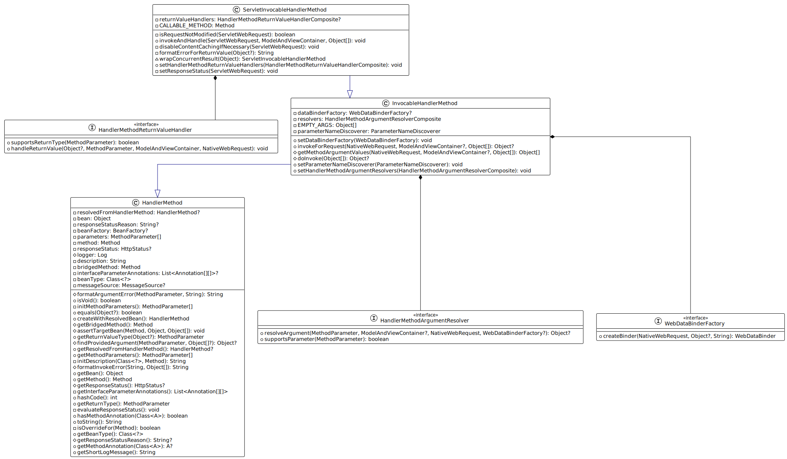

# 资料

[SpringMVC官方文档](https://docs.spring.io/spring-framework/docs/current/reference/html/web.html#mvc)

[示例代码](../source-note-springmvc)

视频(看了P63-P86)：https://www.bilibili.com/video/BV1uF411L73Q

> ### JavaWeb 的知识
>
>   一个Web应用对应一个 ServletContext ，一个 Servlet 对应 一个 ServletConfig ，ServletConfig  记录了 Servlet的配置参数等信息。
>
> ServletContext https://blog.csdn.net/gavin_john/article/details/51399425
> ServletConfig https://blog.csdn.net/m0_49828549/article/details/114236530

# SPI

[ServiceLoader Java Doc](https://docs.oracle.com/javase/8/docs/api/java/util/ServiceLoader.html)

[SPI 全称为 (Service Provider Interface)](https://juejin.cn/post/6844903605695152142) 

```java
package cn.haitaoss.spi;

// 声明接口
public interface IA {
}
```

```java
package cn.haitaoss.spi;

// 声明实现类
public class AImpl2 implements IA{
}
```

```java
package cn.haitaoss.spi;

// 声明实现类
public class AImpl1 implements IA{
}
```

使用接口的全类名 创建一个文件 `META-INF/services/cn.haitaoss.spi.IA`

注：只要在工程的中存在  `META-INF/services/cn.haitaoss.spi.IA` 就可以生效

```properties
# 文件的内容就是 扩展的实现类的全类名
cn.haitaoss.spi.AImpl1
cn.haitaoss.spi.AImpl2
```

使用提供的API拿到接口的实现类

```java
public class Test_SPI {
    public static void main(String[] args) {
        /**
         * https://docs.oracle.com/javase/8/docs/api/java/util/ServiceLoader.html
         * */
        // 通过 SPI 机制，拿到接口的实现类
        ServiceLoader<IA> load = ServiceLoader.load(IA.class);
        load.forEach(System.out::println);
    }
}
```

# 嵌入式Tomcat启动流程

> Web容器启动前会回调 `ServletContainerInitializer#onStartup` ，SpringMVC注解开发就是通过这个机制，注册`DispatcherServlet` 到 Web容器中，免去 `web.xml` 的编写。

```java
/**
 * 1. 启动Tomcat服务器
 * {@link org.apache.catalina.startup.Tomcat#start()}
 *      {@link LifecycleBase#start()}
 *      {@link StandardServer#startInternal()}
 *      {@link LifecycleBase#start()}
 *      {@link StandardService#startInternal()}
 *      {@link LifecycleBase#start()}
 *      {@link StandardEngine#startInternal()}
 *      {@link ContainerBase#startInternal()}
 *      {@link LifecycleBase#start()}
 *      {@link StandardHost#startInternal()}
 *      {@link ContainerBase#startInternal()}
 *      {@link LifecycleBase#start()}
 *      {@link StandardContext#startInternal()}
 *
 *      看着很牛逼，但是还没有悟。StandardServer -> StandardService -> StandardEngine -> StandardHost -> StandardContext
 * 2. {@link StandardContext#startInternal()} 里面做了什么
 *      2.1 容器初始化器回调 {@link ServletContainerInitializer#onStartup(Set, ServletContext)} ,可以通过入参 ServletContext Web容器注册三大组件。
 *          SpringMVC 就是通过 SPI 机制，扩展 ServletContainerInitializer 接口的实现类 SpringServletContainerInitializer 。
 *           Tomcat 在启动时会回调 SpringServletContainerInitializer ，从而实现 DispatcherServlet 的注册、Spring父容器的实例化和刷新、MVC子容器的实例化和刷新
 *
 *      2.2 启动监听器 {@link StandardContext#listenerStart() }
 *          - 有 findApplicationListeners，那就反射创建存到 result 集合中（这个就是通过 @WebListener 注册才会有）
 *          - 遍历 result 集合，按照类型 分开存到两个集合中: eventListeners、lifecycleListeners
 *          - 获取通过 {@link ServletContainerInitializer#onStartup(Set, ServletContext)} 注册的Listener 按照类型添加到两个集合中: eventListeners、lifecycleListeners
 *          - 设置一个属性值 `context.setNewServletContextListenerAllowed(false);` 。这个属性是为了防止在注册 lifecycleListener
 *          - 回调 lifecycleListeners 集合里面的 `contextInitialized` 方法
 *              注：不支持在contextInitialized 添加 lifecycleListener {@link ApplicationContext#addListener(EventListener)}
 *          注：可以看到通过 @WebListener 注册的监听器优先级比 {@link ServletContainerInitializer#onStartup(Set, ServletContext)} 注册的监听器先执行
 *
 *      2.3 启动过滤器 {@link StandardContext#filterStart()}
 *          - 回调初始化方法 {@link ApplicationFilterConfig#initFilter()}
 *
 *      2.4 加载并初始化所有 设置 `load on startup` 的servlet
 *          - {@link StandardContext#loadOnStartup(Container[])}
 *          - {@link StandardWrapper#loadServlet()} 如果servlet没有创建就创建
 *          - {@link Servlet#init(ServletConfig)} 回调servlet的初始化方法
 *
 *      2.5 启动tomcat后台线程 {@link ContainerBase#threadStart()}
 * */
```

# SpringServletContainerInitializer#onStartup

> 回调 `WebApplicationInitializer#onStartup` 方法，具体需要注册 Servlet、Filter、Listener 开发可以实现 `WebApplicationInitializer`接口，自己编写。
>
> 对于 `DispatcherServlet`  的注册，[SpringMVC文档提供了 AbstractAnnotationConfigDispatcherServletInitializer 抽象类](https://docs.spring.io/spring-framework/docs/current/reference/html/web.html#mvc-servlet-context-hierarchy)，我们实现其中的抽象方法，就可以，快速的实现将 `DispatcherServlet` 注册到 Web容器中

```java
/**
 * 基于Servlet3.0规范，spring-web.jar 通过SPI机制，制定了这个类，Web容器启动时会回调这个方法
 * {@link SpringServletContainerInitializer#onStartup(Set, ServletContext)}
 *      1. 会遍历 WebApplicationInitializer 类型的对象
 *      2. 过滤掉 接口 和 抽象类
 *      3. 排序。支持使用 Ordered接口、@Order、@Priority 来设置排序值
 *          `AnnotationAwareOrderComparator.sort(initializers);`
 *      4. 回调方法
 *          {@link WebApplicationInitializer#onStartup(ServletContext)}
 *          比如：回调 AbstractAnnotationConfigDispatcherServletInitializer.onStartup(servletContext)
 * */
```

```java
public class DispatcherServletInitializer extends AbstractAnnotationConfigDispatcherServletInitializer {

    @Override
    protected Class<?>[] getRootConfigClasses() {
        // 作为父容器的配置类
        return new Class[]{RootConfig.class};
    }

    @Override
    protected Class<?>[] getServletConfigClasses() {
        // 作为子容器的配置类
        return new Class[]{WebServletConfig.class};
    }

    @Override
    protected String[] getServletMappings() {
        // DispatcherServlet 的拦截路径
        return new String[]{"/"};
    }

    @Override
    protected Filter[] getServletFilters() {
       	// 是否需要给 DispatcherServlet 注册过滤器
        return new Filter[]{new Filter1()};
    }
	
    @Override
    protected ApplicationContextInitializer<?>[] getRootApplicationContextInitializers() {
        return new ApplicationContextInitializer[]{ioc -> System.out.println(
                "可以在这里配置IOC容器--->" + ioc)};
    }
}
```

# AbstractAnnotationConfigDispatcherServletInitializer

> AbstractAnnotationConfigDispatcherServletInitializer 核心功能：创建父容器、创建子容器、关联父子容器、注册 ContextLoaderListener、注册 DispatcherServlet
>
> - ContextLoaderListener 持有父容器。这个Listener不是必须的，只有存在父容器时，才会new出来，然后注册到web容器中
> - DispatcherServlet 持有子容器，这个是必须的。
> - 使用的IOC容器是这个 [AnnotationConfigWebApplicationContext](#AnnotationConfigWebApplicationContext) 类型
>
> 注：只是完成了 容器的创建，并没有执行refresh。refresh是在web容器启动后，在对应的组件生命周期函数内执行的。(ContextLoaderListener 的初始化、DispatcherServlet 的初始化)
>
> AbstractAnnotationConfigDispatcherServletInitializer  目的就是将SpringMVC的功能集成到Web容器中，说白了就是注册DispatcherServlet到Web容器中

```java
/**
 *
 * Web容器会回调该方法
 * {@link AbstractDispatcherServletInitializer#onStartup(ServletContext)}
 *      super.onStartup(servletContext);
 *          {@link AbstractContextLoaderInitializer#onStartup(ServletContext)}
 *
 *              1. 这个方法返回值不是空的，才会创建出父容器，然后创建注册 ContextLoaderListener
 *                  {@link AbstractAnnotationConfigDispatcherServletInitializer#getRootConfigClasses()}
 *
 *              2. 创建一个IOC容器(作为父容器)
 *                  AnnotationConfigWebApplicationContext context = new AnnotationConfigWebApplicationContext();
 *                  context.register(configClasses); // 设置配置类
 *
 *              3. 注册一个 ServletContextListener
 *                  ContextLoaderListener listener = new ContextLoaderListener(rootAppContext);
 *                  // 设置容器初始化器。是用来在refresh之前，加工IOC容器的。可以通过重写这个方法添加 {@link AbstractDispatcherServletInitializer#getServletApplicationContextInitializers()}
 *                  listener.setContextInitializers(getRootApplicationContextInitializers());
 *                  // 注册
 *                  servletContext.addListener(listener);
 *
 *
 * 		registerDispatcherServlet(servletContext);
 *            {@link AbstractDispatcherServletInitializer#registerDispatcherServlet(ServletContext)}
 *              1. 创建一个IOC容器(作为子容器)
 *                  AnnotationConfigWebApplicationContext context = new AnnotationConfigWebApplicationContext();
 *
 *              2. 如果存在配置类，就将配置类的信息设置的容器中
 *                  context.register(getServletConfigClasses());
 *                  可以通过实现这个方法添加 {@link AbstractAnnotationConfigDispatcherServletInitializer#getServletConfigClasses()}
 *
 *              3. 实例化 DispatcherServlet，并将IOC容器作为其构造器参数
 *                  FrameworkServlet dispatcherServlet =  new DispatcherServlet(servletAppContext);
 *
 *              4. 设置容器初始化器。是用来在refresh之前，加工IOC容器的
 *                  dispatcherServlet.setContextInitializers(getServletApplicationContextInitializers());
 *                  可以通过重写这个方法添加 {@link AbstractDispatcherServletInitializer#getServletApplicationContextInitializers()}
 *
 *              6. 注册 dispatcherServlet 到 servletContext 中
 *                  ServletRegistration.Dynamic registration = servletContext.addServlet(servletName, dispatcherServlet);
 *
 *              7. 给 dispatcherServlet 设置参数
 *                  // 设置参数。1表示项目启动的时候就初始化这个servlet
 *                  registration.setLoadOnStartup(1);
 *                  // 设置映射路径
 *                  registration.addMapping(getServletMappings());
 *                  // 是否支持异步
 *                  registration.setAsyncSupported(isAsyncSupported());
 *                  ...
 *
 *              8. 注册Filter，filter是基于servletName进行拦截的
 *                  可以通过重写这个方法指定Filter {@link AbstractDispatcherServletInitializer#getServletFilters()}
 *
 *              9. 自定义servlet，就是对 dispatcherServlet 参数的调整
 *                  可以通过重写这个方法编写具体的逻辑 {@link AbstractDispatcherServletInitializer#customizeRegistration(ServletRegistration.Dynamic)}
 *
 *
 * Tips：
 *  1. 父容器并不一定会有，子容器一定会用
 *  2. 如果存在父容器，会将父容器暴露给 ContextLoaderListener，并将 ContextLoaderListener 注册到 ServletContext 中
 *  3. 会将子容器暴露给 DispatcherServlet，并将 DispatcherServlet 注册到 ServletContext 中
 *  4. 注意，此时只是实例化了IOC容器，并没有执行refresh。是啥时候执行的refresh的，得看 ServletContextListener、Servlet 的生命周期接口，由Web容器回调。
 *
 * */
```

# AnnotationConfigWebApplicationContext


```java
/**
 * AnnotationConfigWebApplicationContext 相对于 AnnotationConfigApplicationContext 特别的地方
 *  2个成员变量
 *      {@link AbstractRefreshableWebApplicationContext#servletContext}
 *      {@link AbstractRefreshableWebApplicationContext#servletConfig}
 *
 *      Tips：
 *          ServletContext 对应一个Web容器，可以用来注册全局属性，可以用来注册 Listener、Filter、Servlet
 *          ServletConfig  对应一个Servlet，记录了当前Servlet的配置信息(初始化参数、servlet-mapping、servlet-name 等等)，还可以拿到 ServletContext 的引用
 *
 *  {@link AbstractRefreshableWebApplicationContext#postProcessBeanFactory(ConfigurableListableBeanFactory)}
 *      1. 注册 ServletContextAwareProcessor 用来 处理 ServletContext 和 ServletConfig 的 Aware 注入
 *      2. 注册 request、session、application 三个Scope。用来将bean对象设置到web作用域中(request域、session域、application域)
 *      3. 注册单例bean，用于 ServletContext 和 ServletConfig 的依赖注入
 *      4. 补充，注入 contextParameters 这个单例bean，用于访问 web容器+DispatcherServlet 的初始化属性（类型是Map）
 *      5. 补充，注入 contextAttributes 这个单例bean，用于访问 DispatcherServlet 的初始化属性（类型是Map）
 *
 *  {@link AbstractRefreshableWebApplicationContext#getResourceByPath(String)}
 *      用来读 webapp目录下的资源的，比如  getResourceByPath("/index.jsp")
 *
 *  {@link AbstractRefreshableWebApplicationContext#onRefresh()}
 *      this.themeSource = UiApplicationContextUtils.initThemeSource(this);
 *      注：目前不知道是做啥的
 *
 *  {@link AbstractRefreshableWebApplicationContext#initPropertySources()}
 *      ConfigurableEnvironment env = new StandardServletEnvironment();
 *      StandardServletEnvironment 的初始 PropertySource 顺序是：Servlet的初始化属性 -> web容器设置的初始化属性 -> 系统属性 -> 环境变量
 *
 * */
```

# ContextLoaderListener

## 类图

> ContextLoaderListener 持有 WebApplicationContext和ApplicationContextInitializer
>
> ContextLoaderListener  的初始化方法中，会使用 ApplicationContextInitializer 对  WebApplicationContext 进行初始化，然后再 refresh WebApplicationContext 


## ContextLoaderListener#contextInitialized

```java
/**
 * Web容器启动时，会回调该方法
 * {@link ContextLoaderListener#contextInitialized(ServletContextEvent)}
 *  
 * 1. 如果不存在IOC容器，就创建出默认的IOC容器(可以通过初始化参数，指定类全名)
 * 2. 给IOC容器设置 spring.xml (如果存在)
 * 3. 扩展 Environment 支持访问 web容器中的初始化参数( servletContext.getInitParameter() )
 * 4. 拿到初始化参数（globalInitializerClasses、contextInitializerClasses） 反射构造出实例，回调返回对 IOC容器进行定制化
 *      {@link ApplicationContextInitializer#initialize(ConfigurableApplicationContext)} 对IOC容器进行加工
 * 5. 刷新IOC容器
 * 6. 将IOC容器（这个是父容器）存到Application域中
 *      servletContext.setAttribute(WebApplicationContext.class.getName() + ".ROOT", context);
 * 7. 将IOC容器（这个是父容器）存到ThreadLocal中
 *      org.springframework.web.context.ContextLoader.currentContextPerThread.put(ccl,context);
 * */
```

## ContextLoaderListener#contextDestroyed

```java
/**
 * web容器销毁时，会回调该方法
 * {@link ContextLoaderListener#contextDestroyed(ServletContextEvent)}
 * 
 * 1. 关闭IOC容器(父容器)、移除ThreadLocal、移除Application域中对父容器的引用属性
 *    `closeWebApplicationContext(event.getServletContext());`
 *    
 * 2. 回调记录在application域中的特殊bean
 *      
 *      2.1 遍历 application 域中的所有属性
 *          Enumeration<String> attrNames = servletContext.getAttributeNames();
 *          while (attrNames.hasMoreElements()) {
 *               String attrName = attrNames.nextElement();
 *            }  
 *      
 *      2.2 属性名满足 attrName.startsWith("org.springframework.") 且 属性值是 instanceof DisposableBean
 *          ((DisposableBean) attrValue).destroy(); // 回调销毁方法
 * 
 * */
```

# DispatcherServlet

## 类图

> DispatcherServlet 持有 WebApplicationContext和ApplicationContextInitializer
>
> DispatcherServlet 的初始化方法中，会使用 ApplicationContextInitializer 对  WebApplicationContext 进行初始化，然后再 refresh WebApplicationContext


## DispatcherServlet中的九大对象

[官方文档地址](https://docs.spring.io/spring-framework/docs/current/reference/html/web.html#mvc-servlet-special-bean-types)

| Bean type                   | Explanation                                                  |
| :-------------------------- | :----------------------------------------------------------- |
| HandlerMapping              | 根据Request返回HandlerExecutionChain，HandlerExecutionChain是由匹配的Handler+HandlerInterceptor 组成的。Handler其实就是要执行的Method |
| HandlerAdapter              | 用来执行 Handler 的工具                                      |
| HandlerExceptionResolver    | 执行Handler中出现了异常，会将异常交给 HandlerExceptionResolver 进行处理。 |
| ViewResolver                | 根据viewName(其实就是url)生成View实例对象                    |
| LocaleResolver              | 解析Request得到Locale                                        |
| ThemeResolver               | 解析Theme的                                                  |
| MultipartResolver           | 解析多部分请求体的，就是上传文件的请求                       |
| RequestToViewNameTranslator | Request变成viewName的翻译器。比如返回了ModelAndView但是没有指定viewName，就是使用这个解析request拿到默认的viewName |
| FlashMapManager             | 处理RedirectAttributes中的flash参数的，负责设置、读取session中的值 |


## DispatcherServlet#init

```java
/** 
 * Web容器启动时，会回调该方法
 * {@link DispatcherServlet}
 * {@link GenericServlet#init(ServletConfig)}
 * {@link HttpServletBean#init()}
 * {@link FrameworkServlet#initServletBean()}
 *      this.webApplicationContext = initWebApplicationContext(); // 配置IOC容器然后刷新IOC容器
 * 	    initFrameworkServlet(); // 模板方法，啥都没干
 *
 *
 * {@link FrameworkServlet#initWebApplicationContext()}
 *   1. 从Application域中 拿到父容器(可能没有)
 *       WebApplicationContext rootContext = WebApplicationContextUtils.getWebApplicationContext(getServletContext());
 *
 *   2. 拿到子容器，拿不到就直接new一个
 *       WebApplicationContext wac = this.webApplicationContext;
 *		 注：默认创建 XmlWebApplicationContext (特点是会读取默认的配置文件 /WEB-INF/dispatcher-servlet.xml )
 *		 {@link XmlWebApplicationContext#getDefaultConfigLocations()}
 *
 *   3. 父子容器关联起来
 *       wac.setParent(rootContext)
 *
 *   4. 配置并刷新子容器
 *       configureAndRefreshWebApplicationContext(wac);
 *       {@link FrameworkServlet#configureAndRefreshWebApplicationContext(ConfigurableWebApplicationContext)}
 *
 *   5. 将 子容器 作为属性，添加到 Application域中
 *       servletContext.setAttribute(FrameworkServlet.class.getName() + ".CONTEXT.dispatcher", wac);
 *
 */
```

## FrameworkServlet#configureAndRefreshWebApplicationContext

```java
/**
 * {@link FrameworkServlet#configureAndRefreshWebApplicationContext(ConfigurableWebApplicationContext)}
 *  1. 暴露信息给 IOC容器(子容器)
 *      wac.setServletContext(getServletContext());
 *      wac.setServletConfig(getServletConfig());
 *
 *  2. 添加一个事件监听器
 *      wac.addApplicationListener(new SourceFilteringListener(wac, new ContextRefreshListener()));
 *      注：
 *          - ContextRefreshListener 是接收 ContextRefreshedEvent 事件，收到事件就回调 {@link FrameworkServlet#onApplicationEvent(ContextRefreshedEvent)}
 *          - SourceFilteringListener 是对 ContextRefreshListener 的装饰，是用来过滤接收的事件的，只有事件发布对象 == wac ，才会处理事件
 *          事件发布流程 {@link AbstractApplicationContext#publishEvent(Object, ResolvableType)} 
 *              - 发布事件给当前IOC容器注册的 ApplicationListener
 *              - 存在父容器，就是用父容器也发布事件，也就是说事件的发布是有传递性的
 *
 *  3. 扩展IOC容器的 Environment，使其可以读到 getServletContext() 和 getServletConfig() 的属性信息
 *      ((ConfigurableWebEnvironment) env).initPropertySources(getServletContext(), getServletConfig());
 *
 *  4. 从 servletContext 中拿到初始化参数 globalInitializerClasses 配置的类信息， 反射构造出 ApplicationContextInitializer 实例，
 *     回调方法对IOC容器进行加工
 *          {@link ApplicationContextInitializer#initialize(ConfigurableApplicationContext)}
 *
 *  5. 刷新IOC容器
 *      wac.refresh();
 * */
```

## ContextRefreshListener#onApplicationEvent

```java
/**
 * 是因为 子容器 注册了事件监听器(ContextRefreshListener)，接收ContextRefreshedEvent事件，这个事件是在容器refresh完成之后会发布的事件
 *      {@link AbstractApplicationContext#finishRefresh()}
 *
 *
 * 收到事件的处理逻辑
 * {@link FrameworkServlet#onApplicationEvent(ContextRefreshedEvent)}
 * {@link DispatcherServlet#onRefresh(ApplicationContext)}
 * {@link DispatcherServlet#initStrategies(ApplicationContext)}
 *      设置9大属性，涉及到的对象要么是从容器中获取的，要么是读取 DispatcherServlet.properties 属性文件，
 *      拿到默认的类全名然后使用 beanFactory.createBean() 创建出来
 *
 * */
```

## DispatcherServlet#initStrategies

```java
protected void initStrategies(ApplicationContext context) {
    /**
     * 从容器中拿到 MultipartResolver bean，暴露给当前实例，拿不到就算了。
     * */
    initMultipartResolver(context);
    /**
     * 从容器中拿到 LocaleResolver bean，拿不到就读取 DispatcherServlet.properties 属性文件，
     * 然后使用 {@link AbstractAutowireCapableBeanFactory#createBean(Class)}
     * 创建出bean，然后暴露给当前实例（只允许有一个）
     * */
    initLocaleResolver(context);
    /**
     * 逻辑同上。从容器中拿到 ThemeResolver bean （只允许有一个）
     * */
    initThemeResolver(context);
    /**
     * 逻辑同上。从容器中拿到 HandlerMapping bean（多个）
     * */
    initHandlerMappings(context);
    /**
     * 逻辑同上。从容器中拿到 HandlerAdapter bean（多个）
     * */
    initHandlerAdapters(context);
    /**
     * 逻辑同上。从容器中拿到 HandlerExceptionResolver bean（多个）
     * */
    initHandlerExceptionResolvers(context);
    /**
     * 逻辑同上。从容器中拿到 RequestToViewNameTranslator bean（只允许有一个）
     * */
    initRequestToViewNameTranslator(context);
    /**
     * 逻辑同上。从容器中拿到 ViewResolver bean（多个）
     * */
    initViewResolvers(context);
    /**
     * 逻辑同上。从容器中拿到 FlashMapManager bean（只允许有一个）
     * */
    initFlashMapManager(context);
}
```

### DispatcherServlet#initHandlerMappings

```java
/**
 * 是在web容器初始化Servlet时回调 {@link DispatcherServlet#initHandlerMappings(ApplicationContext)}
 * 完成属性的初始化。
 * 
 * 默认是读取 DispatcherServlet.properties 注册这三个：
 *      - BeanNameUrlHandlerMapping：根据请求url匹配beanName或者别名，将bean对象装饰成HandlerExecutionChain返回
 *      - RequestMappingHandlerMapping：根据请求url匹配@RequestMapping("/xx")中的路径，返回解析好的 HandlerMethod（是由 Method+beanName+BeanFactory...），然后装饰成 HandlerExecutionChain
 *      - RouterFunctionMapping：匹配 {@link RouterFunction#route(ServerRequest)} 返回的是 HandlerFunction，然后装饰成 HandlerExecutionChain
 *
 * 这三个Bean的特点:
 *  1. 都继承 AbstractHandlerMapping
 *  2. 实现 HandlerMapping 接口
 *
 * AbstractHandlerMapping
 *  1. 实现 WebApplicationObjectSupport 接口，可以重写模板方法，实现在bean的创建过程中，执行自定义的代码逻辑(比如：收集 Handler、HandlerInterceptor)。
 *      默认的逻辑就是设置 adaptedInterceptors 属性
 *  2. {@link AbstractHandlerMapping#adaptedInterceptors} 属性，用来记录这个Handler支持的HandlerInterceptor集合，构造 HandlerExecutionChain 时会读取这个属性
 *  3. 实现 HandlerMapping 接口，定义获取 HandlerExecutionChain 的生命周期 
 *      {@link HandlerMapping#getHandler(HttpServletRequest)} 
 **/
```

#### WebApplicationObjectSupport

```java
/**
 * 讲讲这两个抽象类的作用：ApplicationObjectSupport、WebApplicationObjectSupport
 *
 * BeanFactory实例化这两种类型的bean会回调方法，我们只需要重写其中的模板方法，就可以让我们编写的代码被执行
 *
 * 1. 抽象类 ApplicationObjectSupport 实现了 ApplicationContextAware 接口
 *      所以 {@link ApplicationObjectSupport#setApplicationContext(ApplicationContext)} 会被回调，
 *      回调逻辑就是执行模板方法
 *              {@link ApplicationObjectSupport#initApplicationContext(ApplicationContext)}
 *              {@link ApplicationObjectSupport#initApplicationContext()}
 *      Tips：一般来说重写第二个无参的方法就足够了
 *
 * 2. 抽象类 WebApplicationObjectSupport 继承 ApplicationObjectSupport 实现 ServletContextAware
 *      所以 {@link WebApplicationObjectSupport#setServletContext(ServletContext)} 会被回调，
 *      回调逻辑就是执行模板方法
 *          {@link WebApplicationObjectSupport#initServletContext(ServletContext)}
 *
 *      注：也就是在 ApplicationObjectSupport 的基础上又增加了一个模板方法
 *
 * */
```


#### AbstractHandlerMapping#initApplicationContext

```java
/**
 * {@link AbstractHandlerMapping#initApplicationContext()}
 * 1. 模板方法，空实现。看子类是否想对 interceptors 做啥改动(添加、删除、修改)
 *      extendInterceptors(this.interceptors);
 *
 * 2. 模板方法，默认实现是从BeanFactory中找到 MappedInterceptor 类型的bean，追加到 adaptedInterceptors 中
 *      detectMappedInterceptors(this.adaptedInterceptors);
 *
 * 3. 就是将 interceptors 的变成 HandlerInterceptor 追加到 adaptedInterceptors 中
 *      initInterceptors();
 *
 * Tips：adaptedInterceptors 属性是在 {@link AbstractHandlerMapping#getHandlerExecutionChain(Object, HttpServletRequest)} 的时候会用到
 * */
```


#### BeanNameUrlHandlerMapping

```java
/**
 * BeanNameUrlHandlerMapping
 *  - 继承了 AbstractHandlerMapping，所以bean在创建时会回调预留的模板方法(完成HandlerInterceptor的记录)。
 *  - 重写了父类的模板方法 {@link AbstractHandlerMapping#initApplicationContext()}
 *
 * {@link AbstractDetectingUrlHandlerMapping#initApplicationContext()}
 *
 * 1. 执行父类的方法。就是初始化 adaptedInterceptors 属性
 *      super.initApplicationContext();
 *
 * 2. 发现 handler。就是找到 beanName 是 '/' 开头的 或者 其别名有 '/' 开头的，记录到属性中 {@link AbstractUrlHandlerMapping#handlerMap} 属性中
 *      `detectHandlers();`
 */
```


#### RequestMappingHandlerMapping

```java
/**
 * RequestMappingHandlerMapping
 *  - 继承了 AbstractHandlerMapping，所以bean在创建时会回调预留的模板方法(完成HandlerInterceptor的记录)。
 *  - 实现了 InitializingBean 接口，实现的方法逻辑
 *
 * {@link RequestMappingHandlerMapping#afterPropertiesSet()}
 *  1. 初始化属性
 *      this.config = new RequestMappingInfo.BuilderConfiguration();
 *      注：解析 @RequestMapping 成 RequestMappingInfo 对象时，会将config设置给 RequestMappingInfo 对象，
 *          RequestMappingInfo 会根据 config 来设置一些属性。暴露 config 用处是在进行匹配 请求路径 和 @RequestMapping 时会根据配置信息，决定是否需要补上前缀、后缀进行再匹配
 *
 *  2. 执行父类方法
 *      super.afterPropertiesSet();
 *
 * super.afterPropertiesSet(); 的逻辑
 * {@link AbstractHandlerMethodMapping#afterPropertiesSet()}
 * {@link AbstractHandlerMethodMapping#initHandlerMethods()}
 *  1. 遍历容器中所有的bean
 *
 *  2. 类上有 @Controller 或者 @RequestMapping 才做处理
 *
 *  3. 解析@RequestMapping注解,将 注解信息和对象的Method记录起来
 *      3.1 将方法上 @RequestMapping 注解映射成 RequestMappingInfo 实体，若类也有 @RequestMapping 就整合两个注解的信息。 {@link RequestMappingHandlerMapping#createRequestMappingInfo(RequestMapping, RequestCondition)}
 *
 *          RequestMappingInfo.Builder builder = RequestMappingInfo.paths(
 *                         // 支持占位符 @RequestMapping("${name:/index}")
 *                         resolveEmbeddedValuesInPatterns(requestMapping.path()))
 *                 .methods(requestMapping.method())
 *                 .params(requestMapping.params())
 *                 .headers(requestMapping.headers())
 *                 .consumes(requestMapping.consumes())
 *                 .produces(requestMapping.produces())
 *                 .mappingName(requestMapping.name());
 *         if (customCondition != null) {
 *             builder.customCondition(customCondition);
 *         }
 *         RequestMappingInfo info =  builder.options(this.config) // 设置config
 *                 .build();
 *
 *      3.2 记录起来 {@link AbstractHandlerMethodMapping#mappingRegistry}
 *          主要是存到这两个属性中：
 *          {@link AbstractHandlerMethodMapping.MappingRegistry#registry}
 *              private final Map<RequestMappingInfo, MappingRegistration<RequestMappingInfo>> registry = new HashMap<>();
 *
 *          {@link AbstractHandlerMethodMapping.MappingRegistry#corsLookup}
 *              private final Map<HandlerMethod, CorsConfiguration> corsLookup = new ConcurrentHashMap<>();
 *
 *          注：
 *              HandlerMethod 是由 Method+beanName+BeanFactory ... 组成的
 *              MappingRegistration 是由 RequestMappingInfo + HandlerMethod ... 组成的
 *              @RequestMapping 映射成 RequestMappingInfo
 *              @CrossOrigin 映射成 CorsConfiguration（拿到 类或者方法上 @CrossOrigin 注解的信息 构造出 CorsConfiguration）
 */
```


#### RouterFunctionMapping

```java
/**
 * RouterFunctionMapping
 *  - 继承了 AbstractHandlerMapping，所以bean在创建时会回调预留的模板方法(完成HandlerInterceptor的记录)。
 *  - 实现了 InitializingBean 接口，实现的方法逻辑
 *
 * {@link RouterFunctionMapping#afterPropertiesSet()}
 *  1. 从 BeanFactory中拿到RouterFunction类型的bean，记录到 {@link RouterFunctionMapping#routerFunction} 属性中
 *  2. 初始化 HttpMessageConverter 属性
 *      是用来处理 输入流和输出流 与 bean对象的转换接口
 */
```


### DispatcherServlet#initHandlerAdapters

```java
/**
 * 是在web容器初始化Servlet时回调 {@link DispatcherServlet#initHandlerAdapters(ApplicationContext)}
 * 完成属性的初始化。
 *
 * 默认是有这四个：
 *      - HttpRequestHandlerAdapter {@link HttpRequestHandlerAdapter#supports(Object)}
 *          handler instanceof HttpRequestHandler 才是true
 *
 *      - SimpleControllerHandlerAdapter {@link SimpleControllerHandlerAdapter#supports(Object)}
 *          handler instanceof Controller 才是true
 *
 *      - RequestMappingHandlerAdapter {@link AbstractHandlerMethodAdapter#supports(Object)}
 *          handler instanceof HandlerMethod 才是true
 *
 *      - HandlerFunctionAdapter {@link HandlerFunctionAdapter#supports(Object)}
 *          handler instanceof HandlerFunction
 *
 **/
```
#### RequestMappingHandlerAdapter
```java
/**
 * RequestMappingHandlerAdapter 比较特殊，存在初始化方法。
 * {@link RequestMappingHandlerAdapter#afterPropertiesSet()}
 *  1. 根据 @ControllerAdvice 注解标注的bean，初始化一些属性
 *      1.1 遍历容器中所有的bean，收集存在 @ControllerAdvice 的并构造成 ControllerAdviceBean 返回
 *          List<ControllerAdviceBean> adviceBeans = ControllerAdviceBean.findAnnotatedBeans(getApplicationContext());
 *
 *      1.2 遍历 adviceBeans
 *          收集 存在@ModelAttribute && 不存在@RequestMapping 的方法，记录起来
 *          this.modelAttributeAdviceCache.put(adviceBean, attrMethods);
 *
 *          收集存在 @InitBinder 注解的方法，记录起来
 *          this.initBinderAdviceCache.put(adviceBean, binderMethods);
 *
 *          是这两个类型的，就记录起来
 *          RequestBodyAdvice.class.isAssignableFrom(beanType) || ResponseBodyAdvice.class.isAssignableFrom(beanType)
 *          requestResponseBodyAdviceBeans.add(adviceBean);
 *
 *          Tips：记录这三个属性的目的是，执行@RequestMapping标注的方法执行的生命周期中，会根据需要回调这些方法
 *
 *  2. 初始化执行方法相关的解析器
 *      2.1 参数解析器
 *      List<HandlerMethodArgumentResolver> resolvers = getDefaultArgumentResolvers();
 *      this.argumentResolvers = new HandlerMethodArgumentResolverComposite().addResolvers(resolvers);
 *      Tips：在调 @ModelAttribute 标注的方法时 或者是 @RequestMapping 的方法，会使用这个解析器来解析方法的参数
 *
 *      2.2 InitBinder的参数解析器
 *      List<HandlerMethodArgumentResolver> resolvers = getDefaultInitBinderArgumentResolvers();
 *      this.initBinderArgumentResolvers = new HandlerMethodArgumentResolverComposite().addResolvers(resolvers);
 *      Tips：在回调 @InitBinder 标注的方法时，会使用这个解析器来解析方法的参数
 *
 *      2.3 返回值处理器
 *      List<HandlerMethodReturnValueHandler> handlers = getDefaultReturnValueHandlers();
 *      this.returnValueHandlers = new HandlerMethodReturnValueHandlerComposite().addHandlers(handlers);
 *      Tips：执行完 @RequestMapping 的方法，会使用这个来解析返回值
 * */
```


### DispatcherServlet#initHandlerExceptionResolvers

```java
/**
 * 是在web容器初始化Servlet时回调 {@link DispatcherServlet#initHandlerExceptionResolvers(ApplicationContext)}
 * 完成属性的初始化
 *
 * 默认是有这三个:
 *  - ExceptionHandlerExceptionResolver：处理 @ExceptionHandler 注解值的异常，或者其标注的方法参数的异常类型
 *  - ResponseStatusExceptionResolver：用来处理 异常类上有@ResponseStatus 或者 异常类型是ResponseStatusException，然后将异常原因设置到响应体中
 *  - DefaultHandlerExceptionResolver：兜底的，定义了很多异常类型的if-else匹配，匹配了就将异常原因设置到响应体中，否则返回null，表示处理不了。
 **/
```


#### ExceptionHandlerExceptionResolver

```java
/**
 * {@link ExceptionHandlerExceptionResolver}
 *  继承：AbstractHandlerExceptionResolver
 *  实现接口：ApplicationContextAware {@link ExceptionHandlerExceptionResolver#setApplicationContext(ApplicationContext)}
 *      `this.applicationContext = applicationContext;` // 将 IOC容器的引用 保存到成员属性中
 *
 *  实现接口：InitializingBean {@link ExceptionHandlerExceptionResolver#afterPropertiesSet()}
 *      1. 解析标注了@ControllerAdvice的bean，解析其中的@ExceptionHandler注解
 *          // 将标注了 @ControllerAdvice的bean，装饰一下
 *          ExceptionHandlerMethodResolver resolver = new ExceptionHandlerMethodResolver(beanType);
 *          // 记录在成员属性中
 *          this.exceptionHandlerAdviceCache.put(adviceBean, resolver); // 异常处理通知
 *          if ( ResponseBodyAdvice.class.isAssignableFrom(beanType) )
 *              this.responseBodyAdvice.add(adviceBean); // 响应体通知
 *
 *      2. argumentResolvers(参数解析器) 为空，就初始化默认值
 *          List<HandlerMethodArgumentResolver> resolvers = getDefaultArgumentResolvers();
 *          this.argumentResolvers = new HandlerMethodArgumentResolverComposite().addResolvers(resolvers);
 *
 *      3. returnValueHandlers(返回值处理器) 为空，就初始化默认值
 *          this.returnValueHandlers = new HandlerMethodReturnValueHandlerComposite().addHandlers(handlers);
 *
 **/
```

#### ResponseStatusExceptionResolver

```java
/**
 * {@link ResponseStatusExceptionResolver}
 *  继承：AbstractHandlerExceptionResolver
 *  实现接口：MessageSourceAware {@link ResponseStatusExceptionResolver#setMessageSource(MessageSource)}
 *      this.messageSource = messageSource; // 将 IOC容器中的messageSource 保存到成员属性中
 *      
 * 
 * 解析异常的逻辑
 * {@link ResponseStatusExceptionResolver#doResolveException(HttpServletRequest, HttpServletResponse, Object, Exception)}
 * 
 * 1. ex instanceof ResponseStatusException
 *      resolveResponseStatusException((ResponseStatusException) ex, request, response, handler);
 *      
 *      将ResponseStatusException中的状态码和异常信息，写到response中。异常信息会使用messageSource来解析，
 *      回对象。表示异常被当前被处理了
 *      
 * 2. 异常类上有@ResponseStatus注解
 *      ResponseStatus status = AnnotatedElementUtils.findMergedAnnotation(ex.getClass(), ResponseStatus.class);
 *      
 *      2.1 根据注解值，设置响应体的错误消息，错误消息支持使用占位符，会使用 messageSource#getMessage 进行解析
 *          比如：@ResponseStatus(code = HttpStatus.BAD_REQUEST,reason = "i18n_501_code")
 *      2.2 返回对象。表示异常被当前 HandlerExceptionResolver 处理了，不需要迭代后面的HandlerExceptionResolver判断是否要处理异常了
 *           return new ModelAndView();
 * 
 * 3. 递归找到可以处理的异常
 *      if (ex.getCause() instanceof Exception)
 *      return doResolveException(request, response, handler, (Exception) ex.getCause());
 *      
 * 
 * 4. 兜底，返回null，表示 ResponseStatusExceptionResolver 无法处理这个异常，应当由其他异常处理器解析
 *      return null;
 **/
```

#### DefaultHandlerExceptionResolver

```java
/**
 *
 * DefaultHandlerExceptionResolver 继承：AbstractHandlerExceptionResolver
 *
 * 解析异常的逻辑
 * {@link DefaultHandlerExceptionResolver#doResolveException(HttpServletRequest, HttpServletResponse, Object, Exception)}
 *
 * 1. 匹配异常类型，匹配成功就执行下面的逻辑，否则直接 return null 表示无法处理这个异常
 *      if ex instanceof HttpRequestMethodNotSupportedException
 *      if ex instanceof HttpMediaTypeNotSupportedException
 *      if ex instanceof HttpMediaTypeNotAcceptableException
 *      ...
 * 2. 设置异常状态码
 *      response.sendError(HttpServletResponse.SC_SERVICE_UNAVAILABLE);
 *
 * 3. 返回对象，表示异常被处理了
 *      return new ModelAndView();
 **/
```

### DispatcherServlet#initViewResolvers

```java
/**
 * 是在web容器初始化Servlet时回调 {@link DispatcherServlet#initViewResolvers(ApplicationContext)}
 * 完成属性的初始化
 *
 * 默认是有这一个:
 *  - InternalResourceViewResolver：创建映射JSP文件的View实例
 **/
```


### DispatcherServlet#initFlashMapManager

```java
/**
 * 是在web容器初始化Servlet时回调 {@link DispatcherServlet#initFlashMapManager(ApplicationContext)}
 * 完成属性的初始化
 *
 * 默认是有这一个:
 *  - SessionFlashMapManager：从Session中读取和设置信息
 **/
```


## DispatcherServlet#destroy

```java
/**
 * web容器销毁时，会回调该方法
 * {@link org.springframework.web.servlet.FrameworkServlet#destroy}
 *  1. 很简单直接销毁IOC容器(子容器)
 *      ((ConfigurableApplicationContext) this.webApplicationContext).close();
 * */
```

## DispatcherServlet#service

```java
/**
 * DispatcherServlet 收到请求
 * {@link Servlet#service(ServletRequest, ServletResponse)}
 * {@link GenericServlet#service(ServletRequest, ServletResponse)}
 * {@link HttpServlet#service(ServletRequest, ServletResponse)}
 * {@link FrameworkServlet#service(HttpServletRequest, HttpServletResponse)}
 * {@link FrameworkServlet#processRequest(HttpServletRequest, HttpServletResponse)}
 *
 *  1. 根据 request 生成 localeContext
 *      LocaleContext localeContext = buildLocaleContext(request);
 *
 *  2. 将 request和response 包装成 ServletRequestAttributes
 *      ServletRequestAttributes requestAttributes = buildRequestAttributes(request, response, previousAttributes);
 *
 *  3. 将 localeContext 和 requestAttributes 设置到 ThreadLocal 中，也就是设置到 LocaleContextHolder、RequestContextHolder
 *      initContextHolders(request, localeContext, requestAttributes);
 *
 *      记录 requestAttributes 到 RequestContextHolder 的目的：
 *          1. 支持 ServletRequest、ServletResponse、HttpSession、WebRequest 的依赖注入
 *          2. 支持 request、session作用域的 bean 的管理
 *     看这里就知道了{@link AbstractRefreshableWebApplicationContext#postProcessBeanFactory(ConfigurableListableBeanFactory)}
 *
 *  4. 执行业务
 *      doService(request, response);
 *      {@link DispatcherServlet#doService(HttpServletRequest, HttpServletResponse)}
 *
 *  5. 恢复现场，并发布请求处理完事件
 *      // 将之前的值 回填回去，也就是移除当前值
 *      resetContextHolders(request, previousLocaleContext, previousAttributes);
 *      // 发布 ServletRequestHandledEvent 事件,事件的发布是有传递性的，会同时将事件广播到父容器中
 *      publishRequestHandledEvent(request, response, startTime, failureCause);
 * */
```

## DispatcherServlet#doService

```java
/**
 * 主要是设置一些属性到 request 域中
 * {@link DispatcherServlet#doService(HttpServletRequest, HttpServletResponse)}
 *
 *      1. 设置一些对象到 request 域中
 *          
 *          // 设置一些对象
 *          request.setAttribute(WEB_APPLICATION_CONTEXT_ATTRIBUTE, getWebApplicationContext());
 *          request.setAttribute(LOCALE_RESOLVER_ATTRIBUTE, this.localeResolver);
 *          request.setAttribute(THEME_RESOLVER_ATTRIBUTE, this.themeResolver);
 *          request.setAttribute(THEME_SOURCE_ATTRIBUTE, getThemeSource());
 *          
 *          // 这是用来记录需要重定向还保留的数据，将这些数据记录都 session 域中，默认是使用 SessionFlashMapManager 进行读取和设置
 *          request.setAttribute(OUTPUT_FLASH_MAP_ATTRIBUTE, new FlashMap());
 *          request.setAttribute(FLASH_MAP_MANAGER_ATTRIBUTE, this.flashMapManager);
 *          
 *          // requestPath 不清楚是啥东西，可以拿到web的路径
 *          request.setAttribute(PATH_ATTRIBUTE, requestPath);
 *
 *      2.进行转发
 *          doDispatch(request, response);
 *          {@link DispatcherServlet#doDispatch(HttpServletRequest, HttpServletResponse)}
 *
 *      3. 恢复一些属性
 *
 * */
```

## DispatcherServlet#doDispatch

```java
/**
 * 处理转发，SpringMVC的核心生命周期就是在这个方法定义的
 * {@link DispatcherServlet#doDispatch(HttpServletRequest, HttpServletResponse)}
 *
 * 1. 得到 HandlerExecutionChain
 *     `HandlerExecutionChain mappedHandler = getHandler(processedRequest);`
 *
 *     遍历属性 {@link DispatcherServlet#handlerMappings} 执行 {@link HandlerMapping#getHandler(HttpServletRequest)}
 *     返回值不为null就返回。默认的HandlerMapping是执行的这个重写的方法 {@link AbstractHandlerMapping#getHandler(HttpServletRequest)}
 *     默认是有这三个HandlerMapping：
 *          - BeanNameUrlHandlerMapping
 *          - RequestMappingHandlerMapping
 *          - RouterFunctionMapping
 *
 *  2. 根据 handler 获取适配器
 *      `HandlerAdapter ha = getHandlerAdapter(mappedHandler.getHandler());`
 *
 *      遍历属性 {@link DispatcherServlet#handlerAdapters} 判断是否 {@link HandlerAdapter#supports(Object)}适配，true就返回该适配器
 *      默认是有这四个：
 *          - HttpRequestHandlerAdapter：处理 handler instanceof HttpRequestHandler
 *          - SimpleControllerHandlerAdapter：处理 handler instanceof Controller
 *          - RequestMappingHandlerAdapter：处理 handler instanceof HandlerMethod
 *          - HandlerFunctionAdapter：处理 handler instanceof HandlerFunction
 *
 *
 *  3. 回调handler的preHandle方法，如果返回值是false，说明不能执行，直接return。
 *      `mappedHandler.applyPreHandle(processedRequest, response)`
 *
 *      就是遍历 HandlerExecutionChain 中的 HandlerInterceptor 回调 {@link HandlerInterceptor#preHandle(HttpServletRequest, HttpServletResponse, Object)}
 *      只要有一个返回false，那么就不需要执行后面的 HandlerInterceptor，依次回调已经执行的 HandlerInterceptor 的 afterCompletion 方法
 *      然后快速返回false
 *
 *  4. 使用适配器执行 handler 对应的方法
 *      `mv = ha.handle(processedRequest, response, mappedHandler.getHandler());`
 *
 *      默认是有这四个：
 *           - HttpRequestHandlerAdapter：处理 handler instanceof HttpRequestHandler
 *               {@link HttpRequestHandlerAdapter#handle(HttpServletRequest, HttpServletResponse, Object)}
 *               很简单，反射调用方法
 *
 *           - SimpleControllerHandlerAdapter：处理 handler instanceof Controller
 *               {@link SimpleControllerHandlerAdapter#handle(HttpServletRequest, HttpServletResponse, Object)}
 *               很简单，反射调用方法
 *
 *           - HandlerFunctionAdapter：处理 handler instanceof HandlerFunction
 *               {@link HandlerFunctionAdapter#handle(HttpServletRequest, HttpServletResponse, Object)}
 *               很简单，反射调用方法，然后拷贝内容到输出流
 *
 *           - RequestMappingHandlerAdapter：处理 handler instanceof HandlerMethod
 *               这个就是用来处理 @RequestMapping 的，过程比较复杂，涉及到 @SessionAttributes 的属性获取，@ModelAttribute、@InitBinder 的方法回调,
 *               方法参数列表的解析(HandlerMethodArgumentResolver), HandleMethod返回值的处理(HandlerMethodReturnValueHandler)，ModelAndView的构造
 *               {@link AbstractHandlerMethodAdapter#handle(HttpServletRequest, HttpServletResponse, Object)}
 *
 *  5. 应用默认视图名称。如果没有指定viewName 默认就会使用范围路径作为视图名称
 *      `applyDefaultViewName(processedRequest, mv);`
 *      
 *      如果返回的 mv 不为null，且没有设置view才需要设置默认视图名称。会使用 RequestToViewNameTranslator 根据request信息获取viewName。
 *      默认是使用的 {@link DefaultRequestToViewNameTranslator#getViewName(HttpServletRequest)},逻辑很简单，使用请求资源的路径作为viewNam
 *  
 *  6. 回调handler的postHandle方法
 *      `mappedHandler.applyPostHandle(processedRequest, response, mv);`
 *      
 *      就是遍历 HandlerExecutionChain 中的 HandlerInterceptor 回调 {@link HandlerInterceptor#postHandle(HttpServletRequest, HttpServletResponse, Object, ModelAndView)}
 *  
 *  7. 处理转发结果。这个地方其实是catch的逻辑，也就是上面的报错了，并不会抛出，会在这里处理
 *      `processDispatchResult(processedRequest, response, mappedHandler, mv, dispatchException);`
 *      
 *      7.1 存在异常，就遍历 HandlerExceptionResolver 处理异常。处理的结果会覆盖mv的值
 *          `mv = processHandlerException(request, response, handler, exception);`
 *          {@link DispatcherServlet#processHandlerException(HttpServletRequest, HttpServletResponse, Object, Exception)}
 *
 *      7.2 mv 不为null，就进行渲染
 *          `render(mv, request, response);`
 *          {@link DispatcherServlet#render(ModelAndView, HttpServletRequest, HttpServletResponse)}
 *          渲染视图，说白了拿到 View 示例，然后就将View实例对应的资源文件内容输出到response中 或者是转发 或者是重定向
 *      
 *  8. 回调handler的afterCompletion方法
 *      `triggerAfterCompletion(processedRequest, response, mappedHandler, ex);`
 *      
 *      就是遍历 HandlerExecutionChain 中的 HandlerInterceptor 回调 {@link HandlerInterceptor#afterCompletion(HttpServletRequest, HttpServletResponse, Object, Exception)}
 * */
```

## AbstractHandlerMapping#getHandler

[因为默认使用的HandlerMapping都继承了这个抽象类，这个方法就是获取 HandlerExecutionChain 的生命周期](#DispatcherServlet#initHandlerMappings)

```java
/**
 * 遍历 HandlerMapping 根据 HttpServletRequest 拿到 HandlerExecutionChain。是由优先级的，能拿到就处理
 * {@link DispatcherServlet#getHandler(HttpServletRequest)}
 * {@link AbstractHandlerMapping#getHandler(HttpServletRequest)}
 *  1. 根据request获取handler
 *      Object handler = getHandlerInternal(request);
 *
 *      Tips：主要是有这三种情况（HandlerExecutionChain、HandlerMethod、HandlerFunction）
 *          - {@link AbstractUrlHandlerMapping#getHandlerInternal(HttpServletRequest)}
 *                根据请求url匹配beanName或者别名，将bean对象装饰成 HandlerExecutionChain 返回
 *          -  {@link RequestMappingInfoHandlerMapping#getHandlerInternal(HttpServletRequest)}
 *                根据请求url匹配@RequestMapping("/xx")中的路径，返回解析好的 HandlerMethod（是由 Method+beanName+BeanFactory...）。
 *          - {@link RouterFunctionMapping#getHandlerInternal(HttpServletRequest)}
 *                匹配 {@link RouterFunction#route(ServerRequest)} 返回的是 HandlerFunction
 *
 *  2. 如果没有使用默认的
 *      if handler == null
 *          handler  = getDefaultHandler()
 *
 *  3. 为空校验
 *      if handler == null
 *          return null
 *
 *  4. 解析request拿到请求的资源路径，设置到request域中
 *      request.setAttribute(PATH_ATTRIBUTE, lookupPath);
 *
 *  5. 构造出 HandlerExecutionChain
 *      HandlerExecutionChain executionChain = getHandlerExecutionChain(handler, request);
 *
 *      5.1 实例化 HandlerExecutionChain
 *          HandlerExecutionChain chain = (handler instanceof HandlerExecutionChain ? (HandlerExecutionChain) handler : new HandlerExecutionChain(
 *                 handler));
 *
 *      5.2 遍历所有的记录的拦截器，给 HandlerExecutionChain 添加 HandlerInterceptor
 *          for (HandlerInterceptor interceptor : this.adaptedInterceptors) {
 *              是 MappedInterceptor 类型的，需要判断匹配了才使用
 *                  if (mappedInterceptor.matches(request)) {
 *                     chain.addInterceptor(mappedInterceptor.getInterceptor());
 *                 }
 *              否则直接添加 chain.addInterceptor(interceptor);
 *
 *  6. handler有跨域配置(比如在Controller使用了@CrossOrigin) 或者 是预检请求
 *      若是预检请求：替换掉handler，也就是不映射到具体的处理逻辑，先过一遍预检请求的校验 `return new HandlerExecutionChain(new PreFlightHandler(config), interceptors);`
 *      若存在跨域配置：设置一个Interceptor `chain.addInterceptor(0, new CorsInterceptor(config));`
 *
 * */
```

## RequestMappingInfoHandlerMapping#getHandlerInternal

[看 RequestMappingHandlerMapping 的实例化就知道如何解析@RequestMapping了](#RequestMappingHandlerMapping)

```java
/**
 * 根据request获取HandlerMethod
 * {@link RequestMappingInfoHandlerMapping#getHandlerInternal(HttpServletRequest)}
 * {@link AbstractHandlerMethodMapping#getHandlerInternal(HttpServletRequest)}
 * 1. 根据请求url匹配@RequestMapping("/xx")中的路径，返回解析好的 HandlerMethod（是由 Method+beanName+BeanFactory...）。
 *      HandlerMethod handlerMethod = lookupHandlerMethod(lookupPath, request);
 *      {@link AbstractHandlerMethodMapping#lookupHandlerMethod(String, HttpServletRequest)}
 *
 * 2. 创建新的，其实就是根据beanName从容器中获取bean实例，然后根据bean实例 new HandlerMethod()
 *      return (handlerMethod != null ? handlerMethod.createWithResolvedBean() : null);
 *
 *
 * 细说 {@link AbstractHandlerMethodMapping#lookupHandlerMethod(String, HttpServletRequest)}
 *
 *  1. 初始化变量
 *      List<Match> matches = new ArrayList<>(); // 记录匹配了request路径的 HandleMethod
 *
 *  2. 从注册信息中拿到@RequestMapping的直接路径 与 lookupPath 匹配的(就是请求路径与@RequestMapping(path)进行equals比较)
 *      List<T> directPathMatches = this.mappingRegistry.getMappingsByDirectPath(lookupPath);
 *
 *      注：/index 属于直接路径。/* 不属于直接路径
 *
 *  3. directPathMatches != null 。说明存在匹配的 List<RequestMappingInfo> ，过滤条件找到最符合的 RequestMappingInfo
 *      addMatchingMappings(directPathMatches, matches, request);
 *
 *      会根据 @RequestMapping(path = "路径匹配，支持Ant风格的",
 *                          method = "校验请求方式",
 *                          params="校验请求参数",
 *                          headers = "校验请求头",
 *                          consumes = "校验请求头中的 Content-Type",
 *                          produces = "校验请求头中的 Accept") 的信息 与 request 进行匹配，
 *      匹配就记录到 matches 中
 *
 *      Tips：路径匹配的特点：等值匹配、使用后缀匹配(添加文件扩展名后缀再匹配，添加 '.*' 再匹配)、Ant风格路径匹配、尾部拼接上 '/' 再进行匹配
 *            具体代码 {@link PatternsRequestCondition#getMatchingPattern(String, String)}
 *            具体是否要不要拼接字符再匹配是根据 RequestMappingInfo 中的属性值判断的，而这些判断的属性值是根据 BuilderConfiguration 设置的，
 *            而 BuilderConfiguration 是在创建 RequestMappingHandlerMapping 时初始化的。RequestMappingHandlerMapping的初始化会解析@RequestMapping映射成
 *            RequestMappingInfo 对象，同时将 BuilderConfiguration 的信息设置给 RequestMappingInfo
 *
 *
 *  4. matches.isEmpty()。说明一个都不匹配。使用所有的 RequestMappingInfo 再次进行校验，校验逻辑同上
 *      addMatchingMappings(this.mappingRegistry.getRegistrations()
 *                     .keySet(), matches, request);
 *
 *
 *  5. !matches.isEmpty() 。说明匹配了
 *      5.1 如果 matches.size() > 1 匹配结果大于1
 *          - 对匹配结果进行排序，取出第一个，作为最优的匹配结果
 *              matches.sort(comparator);
 *              Match bestMatch = matches.get(0);
 *
 *          - request 是浏览器发出的预检请求，则 遍历匹配的结果，若有一个RequestMappingInfo设置了@CrossOrigin，
 *              那就快速返回一个空的HandlerMethod。
 *              注：返回空的HandlerMethod是因为后面的逻辑会对这个值进行了匹配，做特殊处理。
 *                  看 {@link AbstractHandlerMapping#getHandler(HttpServletRequest)}
 *
 *          - 不是预检请求，那就直接报错，因为无法确定使用哪一个。
 *
 *      5.2 处理最优的匹配，然后返回HandlerMethod。
 *          handleMatch(bestMatch.mapping, lookupPath, request); // 这个时候会对 /users/{id} 占位符的处理 然后将占位符的值存到request域中
 *          return bestMatch.getHandlerMethod();
 *
 *  6. 处理未匹配的情况，看看否需要抛出异常，还是直接返回null
 *      handleNoMatch(this.mappingRegistry.getRegistrations()
 *                     .keySet(), lookupPath, request);
 *
 *      访问路径匹配了，但是其他的信息不匹配(method、content-type、accept、params) 就抛出对应的异常。
 *      若访问路径不匹配，就返回null
 *      注：返回null表示该HandlerMapping无法处理该Request，会由其他的 HandlerMapping 处理
 * */
```

## AbstractHandlerMethodAdapter#handle

[看 RequestMappingHandlerAdapter 的实例化](#DispatcherServlet#initHandlerAdapters)

```java
/**
 * 标注了 @RequestMapping 的方法的执行生命周期
 * {@link AbstractHandlerMethodAdapter#handle(HttpServletRequest, HttpServletResponse, Object)}
 * {@link RequestMappingHandlerAdapter#handleInternal(HttpServletRequest, HttpServletResponse, HandlerMethod)}
 * {@link RequestMappingHandlerAdapter#invokeHandlerMethod(HttpServletRequest, HttpServletResponse, HandlerMethod)}
 *
 *  1. 装饰成 ServletWebRequest
 *      ServletWebRequest webRequest = new ServletWebRequest(request, response);
 *
 *  2. 根据 InvocableHandlerMethod + WebBindingInitializer 构造出 ServletRequestDataBinderFactory
 *      WebDataBinderFactory binderFactory = getDataBinderFactory(handlerMethod);
 *
 *      2.1 先添加全局的 @InitBinder
 *          就是通过 @ControllerAdvice(basePackages = "",assignableTypes = "",annotations = "") 注册的，判断当前@RequestMapping所在的类
 *          符合注解值的校验才添加
 *          initBinderMethods.add(createInitBinderMethod(bean, method));
 *
 *      2.2 再添加当前类（也就是当前@RequestMapping所在的类）中的 @InitBinder
 *          将 @InitBinder 映射成 InvocableHandlerMethod 对象
 *          initBinderMethods.add(createInitBinderMethod(bean, method));
 *
 *      2.3 实例化出 ServletRequestDataBinderFactory
 *          return new ServletRequestDataBinderFactory(binderMethods, getWebBindingInitializer());
 *
 *      注：看 RequestMappingHandlerAdapter 的实例化能知道 getWebBindingInitializer() 和 @@InitBinder 解析注册到Map中的过程
 *
 *      Tips：
 *          - WebDataBinder 继承了 DataBinder。DataBinder 是用来装饰对象，然后支持设置 ConversionService、Validator 从而对装饰的对象进行类型转换和JSR303校验
 *          - WebDataBinderFactory 是用来生成 WebDataBinder 的。
 *          - ServletRequestDataBinderFactory 实现了 WebDataBinderFactory 接口，其生成 WebDataBinder 的生命周期会使用 WebBindingInitializer 对 WebDataBinder 进行初始化，
 *              并且执行模板方法 initBinder(dataBinder, webRequest) 对 dataBinder 进行加工，逻辑就是回调 @InitBinder 标注的方法
 *          - InvocableHandlerMethod 是用来装饰Method的，还依赖了WebDataBinderFactory，用于在解析Method的参数时，使用 WebDataBinderFactory 创建出 WebDataBinder 来对参数进行
 *              类型转换和JSR303校验
 *
 *  3. 根据 InvocableHandlerMethod + SessionAttributesHandler +  binderFactory 装饰成 ModelFactory
 *      ModelFactory modelFactory = getModelFactory(handlerMethod, binderFactory);
 *
 *      3.1 拿到当前类中 (标注了@ModelAttribute 且 没标注@RequestMapping) 的方法列表，记录起来
 *          methods = MethodIntrospector.selectMethods(handlerType, MODEL_ATTRIBUTE_METHODS);
 *          this.modelAttributeCache.put(handlerType, methods); // 记录到属性中，作为缓存使用
 *
 *      3.2 先添加全局的 @ModelAttribute
 *          就是通过 @ControllerAdvice(basePackages = "",assignableTypes = "",annotations = "") 注册的，判断当前@RequestMapping所在的类
 *          符合注解值的校验才添加
 *          attrMethods.add(createModelAttributeMethod(binderFactory, bean, method)); // 关联上了 binderFactory
 *
 *      3.3 再添加当前类（也就是当前@RequestMapping所在的类）中的 @ModelAttribute
 *          将 @ModelAttribute 映射成 InvocableHandlerMethod 对象
 *          attrMethods.add(createModelAttributeMethod(binderFactory, bean, method)); // 关联上了 binderFactory
 *
 *      3.4 生成 ModelFactory
 *          return new ModelFactory(attrMethods, binderFactory, sessionAttrHandler);
 *
 * 4. 将 handlerMethod 装饰成 ServletInvocableHandlerMethod
 *      ServletInvocableHandlerMethod invocableMethod = createInvocableHandlerMethod(handlerMethod);
 *      invocableMethod.setHandlerMethodArgumentResolvers(this.argumentResolvers); // 参数解析器
 *      invocableMethod.setHandlerMethodReturnValueHandlers(this.returnValueHandlers); // 返回值解析器
 *      invocableMethod.setDataBinderFactory(binderFactory); // 用于在解析Method的参数时，使用 WebDataBinderFactory 创建出 WebDataBinder 来对参数进行类型转换和JSR303校验
 *
 * 5. 定义一个上下文对象
 *      ModelAndViewContainer mavContainer = new ModelAndViewContainer();
 *
 * 6. 读取request域中的属性，设置给mavContainer。这个属性记录的是重定向还需要保留的数据
 *      mavContainer.addAllAttributes(RequestContextUtils.getInputFlashMap(request));
 *
 *      是在一开始处理请求时，使用 FlashMapManager ，默认是使用 SessionFlashMapManager 从session中获取信息，然后存到request中的
 *      {@link DispatcherServlet#doService(HttpServletRequest, HttpServletResponse)}
 *
 *      Tips: 就是在@RequestMapping方法中使用 RedirectAttributes 存储信息，最终这些信息会设置到 session 中
 *
 * 7. 将modelFactory中的数据初始化到mavContainer中
 *      modelFactory.initModel(webRequest, mavContainer, invocableMethod);
 *
 *      1. 从session域中获取 @SessionAttributes(name={"name1","name2"})  注解值的属性值，将属性值存到 mavContainer 中
 *      2. 处理标注了@ModelAttribute("xx")的方法(全局+本类的)，若需要的 xx 在 mavContainer 中没有，那就回调方法，方法的返回值会存到 mavContainer 中
 *           当 @ModelAttribute("xx") 的方法被执行时，参数列表 的解析会涉及到 @InitBinder 方法的回调
 *      3. 当前要执行的方法的参数上的 @ModelAttribute("xx") ，需要的 xx 在 mavContainer 中没有，尝试从session域中获取 xx 的值，然后存到 mavContainer 中
 *
 *      Tips: 所以可以通过 @SessionAttributes 和 @ModelAttribute 将我们需要的属性 从 request、session 中取出来，放到 mavContainer 中
 *
 * 8. 执行方法并处理返回值
 *      invocableMethod.invokeAndHandle(webRequest, mavContainer);
 *
 *      8.1 回调方法
 *          Object returnValue = invokeForRequest(webRequest, mavContainer, providedArgs);
 *          {@link InvocableHandlerMethod#invokeForRequest(NativeWebRequest, ModelAndViewContainer, Object...)}
 *
 *      8.2 处理返回值。比如将返回值的内容 拷贝到 mavContainer 中
 *          this.returnValueHandlers.handleReturnValue(
 *                     returnValue, getReturnValueType(returnValue), mavContainer, webRequest);
 *
 *          {@link HandlerMethodReturnValueHandlerComposite#handleReturnValue(Object, MethodParameter, ModelAndViewContainer, NativeWebRequest)}
 *
 * 9. 构造出 ModelAndView
 *      return getModelAndView(mavContainer, modelFactory, webRequest);
 *
 *      9.1 更新model
 *          modelFactory.updateModel(webRequest, mavContainer);
 *
 *          1. @SessionAttributes 属性的清除(request域)或者保存(session域)
 *          2. mavContainer 中 特殊属性值( 是@SessionAttributes中的  或者 不是常见的数据类型 )的装饰，然后将装饰的结果存入 mavContainer 中
 *               装饰逻辑 `WebDataBinder dataBinder = this.dataBinderFactory.createBinder(request, value, name);`
 *
 *      9.2 if (mavContainer.isRequestHandled())
 *          return null;
 *
 *          说明不需要转发或者重定向，输出的内容已经写到 response 里面了,
 *          比如@ResponseBody的解析(RequestResponseBodyMethodProcessor)，会将这个值设置为true
 *
 *      9.3 根据mavContainer的属性信息 构造 ModelAndView
 *          ModelMap model = mavContainer.getModel();
 *          ModelAndView mav = new ModelAndView(mavContainer.getViewName(), model, mavContainer.getStatus());
 *
 *      9.4 if model instanceof RedirectAttributes，则需要将东西存到session中，从而保证重定向之后能拿到数据
 *          Map<String, ?> flashAttributes = ((RedirectAttributes) model).getFlashAttributes(); // 获取需要保留的属性
 *          RequestContextUtils.getOutputFlashMap(request).putAll(flashAttributes); // 设置到request域中
 *
 *          Tips：在视图的渲染阶段中，假如是处理重定向视图的时候会将内容写到session中 {@link RedirectView#renderMergedOutputModel(Map, HttpServletRequest, HttpServletResponse)}
 **/
```

### ServletRequestDataBinderFactory类图

> - WebDataBinder 继承了 DataBinder。DataBinder 是用来装饰对象，然后支持设置 ConversionService、Validator 从而对装饰的对象进行类型转换和JSR303校验
> - WebDataBinderFactory 是用来生成 WebDataBinder 的。
> - ServletRequestDataBinderFactory 实现了 WebDataBinderFactory 接口，其生成 WebDataBinder 的生命周期会使用 WebBindingInitializer 对 WebDataBinder 进行初始化，
>     并且执行模板方法 `initBinder(dataBinder, webRequest)` 对 dataBinder 进行加工，逻辑就是回调 @InitBinder 标注的方法


### InvocableHandlerMethod类图

> - InvocableHandlerMethod 是用来装饰Method的，还依赖了WebDataBinderFactory。方法参数列表的每个参数的解析都是使用的 HandlerMethodArgumentResolver 进行解析的，解析的过程中会使用 WebDataBinderFactory 将各个参数的值构造成 WebDataBinder，然后调用WebDataBinder的方法，进行类型转换和JSR303校验
> - 方法执行的返回值是使用 HandlerMethodReturnValueHandler 来处理



## InvocableHandlerMethod#invokeForRequest

[看InvocableHandlerMethod类图](#InvocableHandlerMethod类图)

```java
/**
 * 执行方法(比如@ModelAttribute、@InitBinder、@RequestMapping标注的方法)
 * {@link InvocableHandlerMethod#invokeForRequest(NativeWebRequest, ModelAndViewContainer, Object...)}
 * 1. 获取方法的参数列表信息
 *      Object[] args = getMethodArgumentValues(request, mavContainer, providedArgs);
 *      {@link InvocableHandlerMethod#getMethodArgumentValues(NativeWebRequest, ModelAndViewContainer, Object...)}
 *
 * 2. 反射执行方法
 *      return method.invoke(getBean(), args);
 *
 *
 * 细说 {@link InvocableHandlerMethod#getMethodArgumentValues(NativeWebRequest, ModelAndViewContainer, Object...)}
 *
 * 1. 拿到方法的参数列表
 *      MethodParameter[] parameters = getMethodParameters();
 *
 * 2. 遍历参数列表
 *      for (int i = 0; i < parameters.length; i++)
 *          MethodParameter parameter = parameters[i];
 *
 * 3. 尝试从 providedArgs(方法的第三个参数) 中获取参数值(类型一致就是匹配)
 *     args[i] = findProvidedArgument(parameter, providedArgs);
 *     if args[i] != null
 *          continue; // 匹配了就跳过本轮循环
 *
 * 4. 遍历参数解析器，查看是否支持该参数的解析
 *      this.resolvers.supportsParameter(parameter) 注册的参数解析器都返回false，就直接报错。
 *      {@link HandlerMethodArgumentResolver#supportsParameter(MethodParameter)}
 *
 * 5. 遍历参数解析器集合，使用支持的参数解析器，然后解析参数的值
 *      args[i] = this.resolvers.resolveArgument(parameter, mavContainer, request, this.dataBinderFactory);
 *      比如：解析 @RequestParam + 解析常见数据类型的参数解析器是 RequestParamMethodArgumentResolver
 *      {@link HandlerMethodArgumentResolver#resolveArgument(MethodParameter, ModelAndViewContainer, NativeWebRequest, WebDataBinderFactory)}
 *
 * 6. 返回参数列表
 *      return args;
 *
 * Tips：具体有哪些参数解析器看？
 *          是在这个方法初始化的参数解析器集合 {@link RequestMappingHandlerAdapter#afterPropertiesSet()}
 *          在这个方法将参数解析器集合设置给 InvocableHandlerMethod 的 {@link RequestMappingHandlerAdapter#invokeHandlerMethod(HttpServletRequest, HttpServletResponse, HandlerMethod)}
 * */
```

## HandlerMethodArgumentResolver#resolveArgument

```java
/**
 * 参数解析器，先判断支持解析该参数，在使用其来解析参数的值
 * {@link HandlerMethodArgumentResolver#supportsParameter(MethodParameter)}
 * {@link HandlerMethodArgumentResolver#resolveArgument(MethodParameter, ModelAndViewContainer, NativeWebRequest, WebDataBinderFactory)}
 *
 * 比较有代表意义的就这两个抽象类：
 * - AbstractMessageConverterMethodArgumentResolver：定义了读取请求体，并将请求体转换成具体参数类型的逻辑
 * - AbstractNamedValueMethodArgumentResolver ：定义了根据参数名 从 request中获取参数值的逻辑，比如从 Request域、Session域、Header、Cookie等 
 **/
```


### AbstractMessageConverterMethodArgumentResolver

[RequestMappingHandlerAdapter的实例化](#DispatcherServlet#initHandlerAdapters)

[ExceptionHandlerExceptionResolver的实例化](#ExceptionHandlerExceptionResolver)

```java
/**
 * AbstractMessageConverterMethodArgumentResolver
 *      举例：RequestResponseBodyMethodProcessor 解析@RequestBody 的流程
 *      {@link RequestResponseBodyMethodProcessor#resolveArgument(MethodParameter, ModelAndViewContainer, NativeWebRequest, WebDataBinderFactory)}
 *      1. 拿到参数类型
 *          parameter = parameter.nestedIfOptional();
 *      2. 回调定义好的模板方法，解析请求体拿到参数值。下
 *          Object arg = readWithMessageConverters(webRequest, parameter, parameter.getNestedGenericParameterType());
 *
 *      3. 使用 WebDataBinderFactory 将参数值装饰成 WebDataBinder
 *          WebDataBinder binder = binderFactory.createBinder(webRequest, arg, name);
 *
 *      4. 有注解（@Valid或者@Validated），就进行JSR303校验
 *          binder.validate(validationHints); // validationHints 是分组值，只有@Validated支持设置分组
 *
 *      5. 存在校验错误信息，就直接抛出异常
 *          if( binder.getBindingResult().hasErrors() )
 *              throw new MethodArgumentNotValidException
 *      6. 返回参数值
 *          return arg
 *
 *      细说
 *      {@link AbstractMessageConverterMethodArgumentResolver#readWithMessageConverters(HttpInputMessage, MethodParameter, Type)}
 *      1. 遍历 HttpMessageConverter 找到可以读取 这个请求体的 HttpMessageConverter
 *          for (HttpMessageConverter<?> converter : this.messageConverters)
 *              if( converter.canRead(targetClass, contentType) ) // 就是根据 参数的类型+ContentType 来判断
 *
 *          Tips：HttpMessageConverter 的作用
 *              - 比如request的 Content-Type=application/json
 *                  read ：使用JSON反序列化输入流的内容 `JSON.toObject(inputMessage.getBody(),A.class)`
 *                  write：将内容写到输出流中
 *
 *              - 比如request的 Content-Type=text/plain
 *                  read：直接 `new String(inputMessage.getBody())` 即可
 *                  write：将内容写到输出流中
 *
 *      2. 回调前置通知。可在前置通知对请求体的内容做修改
 *           HttpInputMessage msgToUse = getAdvice().beforeBodyRead(
 *                                 message, parameter, targetType, converterType);
 *
 *           AbstractMessageConverterMethodArgumentResolver 有一个属性 `private RequestResponseBodyAdviceChain advice`
 *           RequestResponseBodyAdviceChain 中记录了 List<Object> requestBodyAdvice 和 List<Object> responseBodyAdvice
 *           RequestResponseBodyAdviceChain#beforeBodyRead 就是遍历 requestBodyAdvice 找到类型是 RequestBodyAdvice 的，回调
 *           RequestBodyAdvice#supports方法 结果为true，在回调其 RequestBodyAdvice#beforeBodyRead 方法 对请求体做操作
 *
 *      3. 解析请求体，将请求体变成对应的JavaBean
 *          body = converter.read(targetClass, msgToUse)
 *
 *      4. 回调后置通知。可在后置通知对解析完的结果做修改，这个结果就是方法的参数值
 *          body = getAdvice().afterBodyRead(body, msgToUse, parameter, targetType, converterType);
 *
 *      5. 处理空请求体的通知方法。
 *          body = getAdvice().handleEmptyBody(null, message, parameter, targetType, converterType);
 *
 *      Tips：messageConverters 和 advice 属性都是在 AbstractMessageConverterMethodArgumentResolver 初始化的时候设置的，可以看
 *          {@link RequestMappingHandlerAdapter#afterPropertiesSet()}
 *          {@link ExceptionHandlerExceptionResolver#afterPropertiesSet()}
 *
 **/
```

### AbstractNamedValueMethodArgumentResolver

```java
/**
 * AbstractNamedValueMethodArgumentResolver
 * 举例：RequestParamMethodArgumentResolver 解析 @RequestParam 的流程
 * {@link AbstractNamedValueMethodArgumentResolver#resolveArgument(MethodParameter, ModelAndViewContainer, NativeWebRequest, WebDataBinderFactory)}
 *
 *  1. 生成 NamedValueInfo 这是用来装饰参数name的。 一般就是 获取注解的name 要么就是参数的名字
 *      NamedValueInfo namedValueInfo = getNamedValueInfo(parameter);
 *
 *      对于：RequestParamMethodArgumentResolver 就是读取 @RequestParam 注解值 作为其name
 *
 * 2. 解析占位符 + SPEL 表达式的解析，最后拿到名字
 *      Object resolvedName = resolveEmbeddedValuesAndExpressions(namedValueInfo.name);
 *
 *      Tips：也就是可以这么写 @RequestParam("#{'name'}")
 *
 * 3. 获取 resolvedName 对应的属性值
 *      Object arg = resolveName(resolvedName.toString(), nestedParameter, webRequest);
 *
 *      对于：RequestParamMethodArgumentResolver 就是读取查询参数拿到属性值
 *      {@link RequestParamMethodArgumentResolver#resolveName(String, MethodParameter, NativeWebRequest)}
 *
 * 4. arg == null
 *      4.1 存在默认值，就对默认值 进行 解析占位符 + SPEL 表达式的解析
 *          arg = resolveEmbeddedValuesAndExpressions(namedValueInfo.defaultValue);
 *
 *      4.2 注解值是必须的，那就直接抛出异常
 *
 *      4.3 处理空值，若是 boolean 就设置为false，若基本数据类型就直接报错
 *          arg = handleNullValue(namedValueInfo.name, arg, nestedParameter.getNestedParameterType());
 *
 * 5. "".equals(arg) && namedValueInfo.defaultValue != null
 *      arg = resolveEmbeddedValuesAndExpressions(namedValueInfo.defaultValue);
 *      对默认值 进行 解析占位符 + SPEL 表达式的解析
 *
 * 6. 构造出 WebDataBinder
 *      WebDataBinder binder = binderFactory.createBinder(webRequest, null, namedValueInfo.name);
 *      Tips：构造 WebDataBinder 时会回调 @InitBinder 的方法
 *
 * 7. 使用 WebDataBinder 对参数值进行类型转换
 *      arg = binder.convertIfNecessary(arg, parameter.getParameterType(), parameter);
 *
 * */
```

## HandlerMethodReturnValueHandler#handleReturnValue

```java
/**
 * 返回值处理器，先判断支持解析该返回值类型，在使用其来处理返回值
 * {@link HandlerMethodReturnValueHandler#supportsReturnType(MethodParameter)}
 * {@link HandlerMethodReturnValueHandler#handleReturnValue(Object, MethodParameter, ModelAndViewContainer, NativeWebRequest)}
 *
 * 举例两个实现类：
 *  - RequestResponseBodyMethodProcessor：解析@ResponseBody的
 *  - ModelAndViewMethodReturnValueHandler：解析返回值是 ModelAndView
 * */
```


### RequestResponseBodyMethodProcessor

```java
/**
 * RequestResponseBodyMethodProcessor 解析@ResponsetBody 的流程
 * {@link RequestResponseBodyMethodProcessor#handleReturnValue(Object, MethodParameter, ModelAndViewContainer, NativeWebRequest)}
 *
 * 1. 设置标记，标记为 ture，表示不需要做视图的解析了
 *      mavContainer.setRequestHandled(true);
 *
 *      看就知道啥意思了 {@link RequestMappingHandlerAdapter#getModelAndView(ModelAndViewContainer, ModelFactory, NativeWebRequest)}
 *
 * 2. 装饰
 *      ServletServerHttpRequest inputMessage = createInputMessage(webRequest);
 *      ServletServerHttpResponse outputMessage = createOutputMessage(webRequest);
 *
 * 3. 执行父类定义的 输出内容到响应体 的方法，
 *      writeWithMessageConverters(returnValue, returnType, inputMessage, outputMessage);
 *
 * 细说
 * {@link AbstractMessageConverterMethodProcessor#writeWithMessageConverters(Object, MethodParameter, ServletServerHttpRequest, ServletServerHttpResponse)}
 *  1. 遍历 HttpMessageConverter 找到可以读取 这个请求体的 HttpMessageConverter
 *      for (HttpMessageConverter<?> converter : this.messageConverters)
 *          if( converter.canWrite(valueType, selectedMediaType) ) // 就是根据参数的类型+(响应体的ContentType 或者 是请求头Accept) 来判断
 *
 *          Tips：HttpMessageConverter 的作用
 *              - 比如request的 Content-Type=application/json
 *                  read ：使用JSON反序列化输入流的内容 `JSON.toObject(inputMessage.getBody(),A.class)`
 *                  write：将内容写到输出流中
 *              - 比如request的 Content-Type=text/plain
 *                  read：直接 `new String(inputMessage.getBody())` 即可
 *                  write：将内容写到输出流中
 *
 *  2. 回调前置通知，可对响应的内容做修改
 *      body = getAdvice().beforeBodyWrite(body, returnType, selectedMediaType,
 *                             (Class<? extends HttpMessageConverter<?>>) converter.getClass(), inputMessage, outputMessage);
 *
 *      AbstractMessageConverterMethodArgumentResolver 有一个属性 `private RequestResponseBodyAdviceChain advice`
 *      RequestResponseBodyAdviceChain 中记录了 List<Object> requestBodyAdvice 和 List<Object> responseBodyAdvice
 *      RequestResponseBodyAdviceChain#beforeBodyWrite 就是遍历 responseBodyAdvice 找到类型是 ResponseBodyAdvice 的，回调
 *      ResponseBodyAdvice#supports方法 结果为true，在回调其 ResponseBodyAdvice#beforeBodyWrite 方法 对响应内容做操作
 *
 * 3. 将返回值内容写到 outputMessage 中
 *      ((HttpMessageConverter) converter).write(body, selectedMediaType, outputMessage);
 *
 * Tips：messageConverters 和 advice 属性都是在 AbstractMessageConverterMethodArgumentResolver 初始化的时候设置的，可以看
 *     {@link RequestMappingHandlerAdapter#afterPropertiesSet()}
 *     {@link ExceptionHandlerExceptionResolver#afterPropertiesSet()}
 * */
```

### ModelAndViewMethodReturnValueHandler

```java
/**
 * ModelAndViewMethodReturnValueHandler 解析 ModelAndView 的流程
 * {@link ModelAndViewMethodReturnValueHandler#handleReturnValue(Object, MethodParameter, ModelAndViewContainer, NativeWebRequest)}
 *
 * 1. 返回值是null，标记，然后直接return
 *      mavContainer.setRequestHandled(true);
 *      return;
 *      标记为 ture，表示不需要做视图的解析了
 *      看就知道啥意思了 {@link RequestMappingHandlerAdapter#getModelAndView(ModelAndViewContainer, ModelFactory, NativeWebRequest)}
 *
 * 2. 将 returnValue 的内容拷贝到 ModelAndViewContainer (方法执行的上下文对象)       
 * */
```

## DispatcherServlet#processHandlerException

[ExceptionHandlerExceptionResolver的实例化](#ExceptionHandlerExceptionResolver)

[执行方法并处理返回值的流程](#InvocableHandlerMethod#invokeForRequest)

```java
/**
 * 异常处理的程
 * {@link DispatcherServlet#doDispatch(HttpServletRequest, HttpServletResponse)}
 * {@link DispatcherServlet#processDispatchResult(HttpServletRequest, HttpServletResponse, HandlerExecutionChain, ModelAndView, Exception)}
 * {@link DispatcherServlet#processHandlerException(HttpServletRequest, HttpServletResponse, Object, Exception)}
 * {@link AbstractHandlerExceptionResolver#resolveException(HttpServletRequest, HttpServletResponse, Object, Exception)}
 *      1. 判断是否可以处理这个异。这个方法默认是true
 *          if (shouldApplyTo(request, handler))
 *          {@link AbstractHandlerExceptionResolver#shouldApplyTo(HttpServletRequest, Object)}
 *
 *      2. 可以处理
 *          2.1 处理响应体（默认实现是设置一个响应头）
 *              prepareResponse(ex, response);
 *              {@link AbstractHandlerExceptionResolver#prepareResponse(Exception, HttpServletResponse)}
 *
 *          2.2 解析异常得到ModelAndView
 *              ModelAndView result = doResolveException(request, response, handler, ex);
 *              {@link AbstractHandlerExceptionResolver#doResolveException(HttpServletRequest, HttpServletResponse, Object, Exception)}
 *
 *          2.3 返回结果 ModelAndView
 *              return result
 *
 *      3. 不可处理
 *          return null
 *
 *      Tips：这几个方法都是 protected ，子类都可以重写，自定义逻辑
 *
 * 以 ExceptionHandlerExceptionResolver 解析异常的流程举例：
 * {@link AbstractHandlerMethodExceptionResolver#doResolveException(HttpServletRequest, HttpServletResponse, Object, Exception)}
 * {@link ExceptionHandlerExceptionResolver#doResolveHandlerMethodException(HttpServletRequest, HttpServletResponse, HandlerMethod, Exception)}
 *
 * 1. 找到能处理这个异常的 @ExceptionHandler方法，然后构造出 ServletInvocableHandlerMethod
 *    ServletInvocableHandlerMethod exceptionHandlerMethod = getExceptionHandlerMethod(handlerMethod, exception);
 *
 *      1.1 将当前类 装饰成ExceptionHandlerMethodResolver，实例化的过程会判断是否存在@ExceptionHandler标注的方法
 *          ExceptionHandlerMethodResolver resolver = new ExceptionHandlerMethodResolver(handlerType);
 *
 *      1.2 找到处理这个异常的方法，那就快速返回
 *          Method method = resolver.resolveMethod(exception);
 *          if method != null
 *               return new ServletInvocableHandlerMethod(handlerMethod.getBean(), method, this.applicationContext);
 *
 *      1.3 遍历全局异常处理通知，找到适配的 就立即返回
 *          for (Map.Entry<ControllerAdviceBean, ExceptionHandlerMethodResolver> entry : this.exceptionHandlerAdviceCache.entrySet())
 *              校验符合 @ControllerAdvice(basePackages,basePackageClasses,assignableTypes,annotations)
 *              if advice.isApplicableToBeanType(handlerType)
 *                  ExceptionHandlerMethodResolver resolver = entry.getValue();
 *                  // 找到解析这个异常的方法
 *                  Method method = resolver.resolveMethod(exception);
 *                  if (method != null)
 *                      // 找到就返回
 *                      return new ServletInvocableHandlerMethod(advice.resolveBean(), method, this.applicationContext);
 *
 *      1.4 遍历完还找不到，就return null
 *
 * 2. 设置参数解析器
 *      exceptionHandlerMethod.setHandlerMethodArgumentResolvers(this.argumentResolvers);
 *
 * 3. 设置返回值处理器
 *      exceptionHandlerMethod.setHandlerMethodReturnValueHandlers(this.returnValueHandlers);
 *
 * 4. 初始化上下文对象
 *      ModelAndViewContainer mavContainer = new ModelAndViewContainer();
 *
 * 5. 将 异常对象 和 handlerMethod 记录到局部变量
 *      Object[] arguments = new Object[exceptions.size() + 1];
 *      arguments[0] = exception;
 *      ...
 *      arguments[arguments.length - 1] = handlerMethod;
 *
 * 6. 执行方法并处理返回值
 *      exceptionHandlerMethod.invokeAndHandle(webRequest, mavContainer, arguments);
 *      
 * 7. 返回 ModelAndView 对象       
 *
 * Tips：是在实例化 ExceptionHandlerExceptionResolver 的时候 初始化的全局异常通知属性(exceptionHandlerAdviceCache)
 * */
```

## DispatcherServlet#render

```java
/**
 * 渲染视图
 * {@link DispatcherServlet#render(ModelAndView, HttpServletRequest, HttpServletResponse)}
 *
 * 1. 使用 localeResolver 解析 Request 拿到 Locale，然后设置给Response
 *      Locale locale = (this.localeResolver != null ? this.localeResolver.resolveLocale(
 *                 request) : request.getLocale());
 *      response.setLocale(locale);
 *
 * 2. 解析ViewName得到View实例
 *      view = resolveViewName(viewName, mv.getModelInternal(), locale, request);
 *
 *      就是遍历 ViewResolver 执行 {@link ViewResolver#resolveViewName(String, Locale)} 返回结果不是null，就返回
 *      View最关键的就是有ViewName，其实就是资源文件的路径，相当于将资源文件(/a.html) 映射成 View 对象
 *
 * 3. 渲染视图。就是将View对应的资源文件输出的response中
 *      view.render(mv.getModelInternal(), request, response);
 **/
```

## ViewResolver#resolveViewName

```java
/**
 * 以 InternalResourceViewResolver 举例
 * {@link ViewResolver#resolveViewName(String, Locale)}
 * {@link AbstractCachingViewResolver#resolveViewName(String, Locale)}
 *
 * 1. 读缓存
 *      View view = this.viewAccessCache.get(cacheKey);
 *
 * 2. view == null 就创建View实例
 *      view = createView(viewName, locale);
 *      {@link UrlBasedViewResolver#createView(String, Locale)}
 *
 * 3. view != null 就存入缓存
 *      this.viewAccessCache.put(cacheKey, view);
 *      this.viewCreationCache.put(cacheKey, view);
 *
 * 3. 返回
 *      return (view != UNRESOLVED_VIEW ? view : null);
 *
 * 细说
 * {@link UrlBasedViewResolver#createView(String, Locale)}
 *
 * 1. 判断是否可以处理这个 viewName，默认实现是true,所以不会return
 *      if (!canHandle(viewName, locale))
 *          return null
 *
 * 2. 有 redirect: 前缀
 *      if viewName.startsWith(REDIRECT_URL_PREFIX)
 *          // 拿到路径
 *          String redirectUrl = viewName.substring(REDIRECT_URL_PREFIX.length());
 *          // 根据 url 构造出 RedirectView
 *          RedirectView view = new RedirectView(redirectUrl, isRedirectContextRelative(),isRedirectHttp10Compatible()
 *          // 应用生命周期方法(就是BeanFactory#initializeBean),执行bean的初始化操作(XxxAware、初始化前后置处理器、初始化方法、初始化后后置处理器),然后return
 *          return applyLifecycleMethods(REDIRECT_URL_PREFIX, view);
 *
 * 3. 有 forward: 前缀
 *      if viewName.startsWith(FORWARD_URL_PREFIX)
 *          // 拿到路径
 *          String forwardUrl = viewName.substring(FORWARD_URL_PREFIX.length());
 *          // 根据 url 构造出 InternalResourceView
 *          InternalResourceView view = new InternalResourceView(forwardUrl);
 *          // 同上
 *          return applyLifecycleMethods(FORWARD_URL_PREFIX, view);
 *
 * 4. 兜底操作
 *      return super.createView(viewName, locale);
 *
 *      4.1 反射实例化出View对象，然后拼接 前缀 + viewName +后缀 作为资源的路径
 *          AbstractUrlBasedView view = BeanUtils.instantiateClass(viewClass);
 *          view.setUrl(getPrefix() + viewName + getSuffix());
 *
 *      4.2 回调生命周期函数，执行bean的初始化操作
 *          View result = applyLifecycleMethods(viewName, view);
 *
 *      4.3 返回
 *          return result;
 **/
```

# 常用功能原理分析

## @SessionAttributes、@ModelAttribute和@InitBinder的理解

- @ModelAttribute：表示属性需要用到，会从方法的执行上下文对象中查找属性，找不到就回调标注的方法
- @SessionAttributes：会从session域中读取属性值，存到方法的执行上下文对象中，供方法使用。再handler执行完之后会从方法执行上下文中拿到这些属性，存到session域中
- @InitBinder：回调@ModelAttribute的方法时和调用@RequestMapping标注的方法时的**参数解析**阶段会回调该方法

[方法回调的原理，得看RequestMappingHandlerMapping执行Handler的流程](#AbstractHandlerMethodAdapter#handle)

[全局的 @ModelAttribute 和 @InitBinder 是如何注册的，得看@ControllerAdvice的解析过程](#RequestMappingHandlerAdapter)

```java
@Controller
@RequestMapping("2")
@SessionAttributes(value = "desc")
@Validated
public class HelloController2 {

    @ModelAttribute("desc")
    public String init_desc(@Value("haitao") String name, @Value("23") String age) {
        System.out.println("init_name...");
        return name + age;
    }

    // @InitBinder 不指定 name，说明可以应用于当前类的 所有 @ModelAttribute 的方法被回调了
    @InitBinder("desc")
    public void init_binder(WebDataBinder webDataBinder) {
        System.out.println("init_binder...");
        /*webDataBinder.setConversionService(null); // 做类型转换的
        webDataBinder.setValidator(null); // 进行JSR303校验的*/
    }

    /**
     * http://127.0.0.1/2/test_model_attribute?name=haitao&age=23
     *
     * 比如 index() 方法，期望拿到 desc 的值，但是这个值是需要加工的，期望是拼接上name和age两个参数的值作为desc的值，
     * 但是不太方便在前端加工、也不方便在 index() 方法内加工，就想直接作为入参拿到。
     *
     * 这时候就可使用 @ModelAttribute("desc") 标注在方法上，在调用 index 之前，会先回调 init_desc() 方法，将方法的返回值，存到
     * ModelAndViewContainer(方法执行的上下文对象)，存的key就是 desc
     *
     * 所以 index( @ModelAttribute("desc") String desc ) 就可以拿到我们拼接的结果。
     *
     * 再来一个需求，一个session中 desc只需要加工一次，整个会话共享。这个时候就可以使用 @SessionAttributes(value = "desc") 标注在类上，
     * 作用一：多一步校验，若 @ModelAttribute("desc") 的值在session域中存在了，那就不需要 回调 init_desc() 方法了，直接返回session域中的值，
     * 作用二：在 index() 方法执行完后，会从 ModelAndViewContainer 拿到 desc 的值，存到session域中
     *
     * 注：
     * 1. @ModelAttribute、@InitBinder 写在标注了 @Controller 的类中，表示只可以作用于当前类的方法
     * 2. @ModelAttribute、@InitBinder 写在标注了 @ControllerAdvice 的类中，表示是全局的
     * 3. @ModelAttribute("desc") 准备回调方法时，会使用HandlerMethodArgumentResolver解析参数列表的每个参数，参数解析完后会 new WebDataBinder() 对参数值进行类型转换
     * 在 WebDataBinder 的实例化时，会回调 @InitBinder 标注的方法，做些初始化操作
     */
    @RequestMapping("/test_model_attribute")
    public String index(Model model, @ModelAttribute("desc") String desc) {
        model.addAttribute("data", desc);
        return "index";
    }
}
```

## @EnableWebMvc

[WebMvcConfigurationSupport的说明](#WebMvcConfigurationSupport)

```java
/**
 * @EnableWebMvc
 *
 * 会 @Import(DelegatingWebMvcConfiguration.class)，也就是会把 DelegatingWebMvcConfiguration 注册到BeanFactory中
 * 而 DelegatingWebMvcConfiguration 继承了 WebMvcConfigurationSupport，重写了很多方法，然后我们可以使用 WebMvcConfigurer 
 * 处理重写方法的回调。
 *
 * 所以要想知道 @EnableWebMvc 有啥用，其实就是得看 WebMvcConfigurationSupport 有啥用 
 * */
```
## WebMvcConfigurationSupport

[DispatcherServlet的初始化主要做了这些事情](#DispatcherServlet#initStrategies)

```java
/**
 * WebMvcConfigurationSupport 是啥？
 *
 * 使用 AbstractAnnotationConfigDispatcherServletInitializer 只是实现了将DispatcherServlet注册到Web容器中，不支持对DispatcherServlet的配置。
 * 所以 SpringMVC提供了 WebMvcConfigurationSupport ，WebMvcConfigurationSupport 其实就是将 DispatcherServlet.properties 文件中定义的默认值改成使用@Bean的方式
 * 将bean注册到IOC容器中，然后预留了很多 protected 方法，让子类重写，方便给这些bean进行配置。比如配置 HandlerInterceptor、ConversionService、Validator等等
 *
 *
 * WebMvcConfigurationSupport 会使用 @Bean注册这些东西
 *  HandlerMapping:
 *      - RequestMappingHandlerMapping
 *      - BeanNameUrlHandlerMapping
 *      - RouterFunctionMapping
 *
 *  HandlerAdapter:
 *      - RequestMappingHandlerAdapter
 *      - HandlerFunctionAdapter
 *      - HttpRequestHandlerAdapter
 *      - SimpleControllerHandlerAdapter
 *
 *  HandlerExceptionResolver:
 *      - ExceptionHandlerExceptionResolver
 *      - ResponseStatusExceptionResolver
 *      - DefaultHandlerExceptionResolver
 *
 *  ViewResolver:
 *      - InternalResourceViewResolver
 *
 *  LocaleResolver:
 *      - AcceptHeaderLocaleResolver
 *
 *  ThemeResolver:
 *      - FixedThemeResolver
 *
 *  FlashMapManager:
 *      - SessionFlashMapManager
 *
 *  RequestToViewNameTranslator:
 *      - DefaultRequestToViewNameTranslator
 *
 * 还额外配置了这些，这些是前面那几个bean依赖的东西
 *
 *  FormattingConversionService、Validator
 *      给 RequestMappingHandlerAdapter 用的，在解析方法参数列表时，对参数的值进行 类型转换和JSR303校验。
 *
 *  ContentNegotiationManager
 *      给 RequestMappingHandlerAdapter 和 ExceptionHandlerExceptionResolver 用的
 *      ContentNegotiationManager 是用于确定Request的MediaType类型 的管理器
 *
 *  PathMatchConfigurer
 *      给 RequestMappingHandlerMapping 用的，用来配置请求路径与@RequestMapping('path')的路径匹配时，
 *      用什么 PathMatcher 进行匹配，是否使用后缀匹配(拼接文件扩展名，拼接'.*')， 尾部拼接上 / 进行匹配
 *
 * 还有两个，目前不知道有啥应用场景，用到在看吧:
 *      - ResourceUrlProvider
 *      - CompositeUriComponentsContributor
 *
 * */
```

## @RequestMapping

[看 RequestMappingHandlerMapping 的实例化就知道如何解析@RequestMapping了](#RequestMappingHandlerMapping)

[看获取Hanlder的流程就知道@RequestMapping的注解值有啥用了](#RequestMappingInfoHandlerMapping#getHandlerInternal)

```java
@Controller
public class HelloController {
    /**
     * 已知, consumes 匹配的是 请求头中的 Content-Type 的值,produces 匹配的是 请求头中的 Accept 的值
     *
     * 问题：都是从请求头中获取的，为啥一个叫 consume(消费) 一个叫produce(生产)？
     *
     * 请求体映解析成JavaBean , JavaBean输出到响应体 这两种转换是使用 HttpMessageConverter 接口来处理的
     * {@link HttpMessageConverter#canRead(Class, MediaType)}   ---> 用来判断是否支持这个 MediaType
     * {@link HttpMessageConverter#canWrite(Class, MediaType)}  ---> 用来判断是否支持这个 MediaType
     *
     * 站在程序的角度，来看 read 就是读取请求体，write 就是将内容输出到响应体。
     *
     * canRead 方法的MediaType参数，是读取请求头的 Content-Type 得到的
     * canWrite 方法的MediaType参数，是读取响应体的 Content-Type 得到的，或者是请求头的 Accept 得到
     * 所以才命名为 consumes 和 produces！！！
     *
     * 比如发送的请求的请求头是：
     *      Content-Type: text/plain
     *      Accept: application/json
     *
     * 那么解析@RequestBody 用的 HttpMessageConverter 应当是直接将请求体内容转换成String即可
     * 解析@ResponseBody 用的 HttpMessageConverter 应当是直接将返回值转成JSON字符串，然后将字符串写入到响应体即可
     * */
    @RequestMapping(value = "index4", consumes = MediaType.TEXT_PLAIN_VALUE, produces = MediaType.APPLICATION_JSON_VALUE)
    @ResponseBody
    public String index4() {
        System.out.println("index4");
        return "ok";
    }
}
```

## @ControllerAdvice

[RequestMappingHandlerAdapter的实例化会解析@ControllerAdvice](#RequestMappingHandlerAdapter)

[ExceptionHandlerExceptionResolver的实例化会解析@ControllerAdvice](#ExceptionHandlerExceptionResolver)

## @ExceptionHandler

[ExceptionHandlerExceptionResolver的实例化会解析@ControllerAdvice，然后记录下标注了@ExceptionHanler的方法](#ExceptionHandlerExceptionResolver)

[异常处理流程](#DispatcherServlet#processHandlerException)

## @RequestBody、@CookieValue、@RequestHeader、RedirectAttributes、@ResponseBody、@Valid、@Validated

[@RequestBody、@CookieValue、@RequestHeader、RedirectAttributes看参数解析流程就知道了，都是类似的](#HandlerMethodArgumentResolver#resolveArgument)

[@ResponseBody看返回值处理的流程就知道了](#HandlerMethodReturnValueHandler#handleReturnValue)

@Valid 和 @Validated 并没有对应的参数解析器，而是在其他参数解析器解析参数时判断方法参数上有这两个注解，就会额外进行参数值的JSR303校验，但是我看了大部分参数解析器是不处理的，只有[解析@RequestBody的参数处理器](#RequestResponseBodyMethodProcessor)才额外校验了这两个注解 

# 好用的工具类

## AntPathMatcher

```java
public class AntPathMatcherTest {
    public static void main(String[] args) {
        AntPathMatcher antPathMatcher = new AntPathMatcher();

        System.out.println("校验路径匹配");
        System.out.println(antPathMatcher.isPattern("/index"));
        System.out.println(antPathMatcher.isPattern("/*"));
        
        System.out.println("提取占位符");
        System.out.println(antPathMatcher.extractUriTemplateVariables("/user/9{id}", "/user/9527"));
    }
}
```